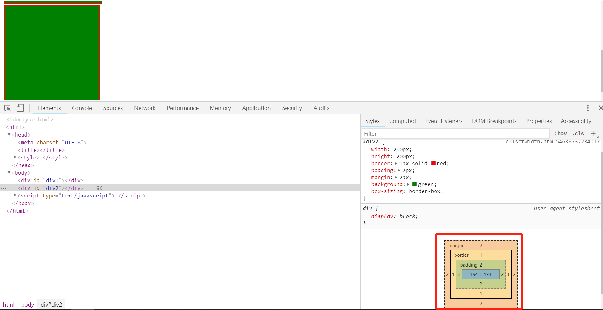

```html
```
&#8195;&#8195;共分为2种类型：W3C标准盒模型（默认） 和 IE标准盒模型（怪异盒模型）。`CSS`盒子模式包括如下属性：外边距（`margin`）、边框（`border`）、内边距（`padding`）、内容（`content`） 
**css3中有一个新属性对应着盒模型。box-sizing: content-box|border-box|inherit;**

> `css3`属性`box-sizing`的`content-box`属性对应着`W3C`标准盒模型；  
> `css3`属性`box-sizing`的`border-box`(宽、高包括`border`)属性对应着IE标准盒模型；

> **1、W3C标准盒模型-content-box:** （默认）
在W3C标准下,我们定义的元素的`width`值即为盒模型中的`content`的宽度值，`style`中定义的`height`即为盒模型中的`content`的高度值。

<!--  -->
        
```js
元素的宽 = width(content的宽) + padding-left + padding-right + border-left + border-right

元素的高 = height(content的高) + padding-top + padding-bottom + border-top + border-bottom
```

> **2、IE标准盒模型-border-box**


<!--  -->
        
```css
元素的宽(style中定义的width) = width(padding-left + padding-right + border-left + border-right+content的宽)
元素的高(style中定义的height) = height(padding-top + padding-bottom + border-top + border-bottom+content的高)
```

