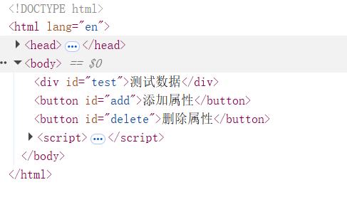
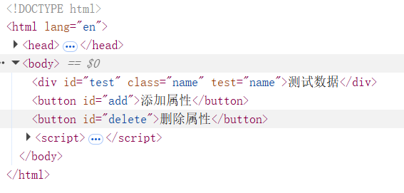
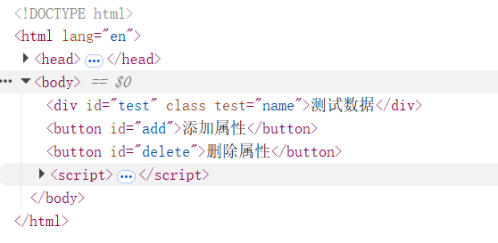

>**attribute：** 是dom元素**在文档中作为html标签**拥有的属性，如`id,class,src,title,alt`等标签属性，也可以自定义属性，通过 `dom.setAttribute('class', 'a')` 来设置属性，通过`dom.getAttribute('class', 'a')` 来获取属性；  

>**property: ** 就是dom元素**在js中作为对象**拥有的属性。 赋值 `dom.className = 'a'` ;取值 `dom.className`;

**区别：**

>**相同：** 对于**html的标准属性**来说，`attribute` 和 `property` 是同步的，是会自动更新的。
>**不同: ** 但是对于**自定义的属性**来说，他们是不同步的。

请看下面例子。

```js
<div id="test">测试数据</div>
<button id="add">添加属性</button>
<button id="delete">删除属性</button>
window.onload=function(){
    var dom=document.getElementById("test");
    var addBtn=document.getElementById("add");
    var delBtn=document.getElementById("delete")
    addBtn.onclick=function(){
        dom.setAttribute("class","name");
        dom.setAttribute("test","name");
    };
    delBtn.onclick=function(){
        dom.className="";
        dom.test="";
    }    
}
```

**操作标准属性**(没添加属性之前————>添加属性之后————>删除属性之后)**修改成功** 。
**className**已经成空了。

**操作自定义属性**(没添加属性之前————>添加属性之后————>删除属性之后) **没修改成功** 。
`test` 自定义属性还存在。

  




