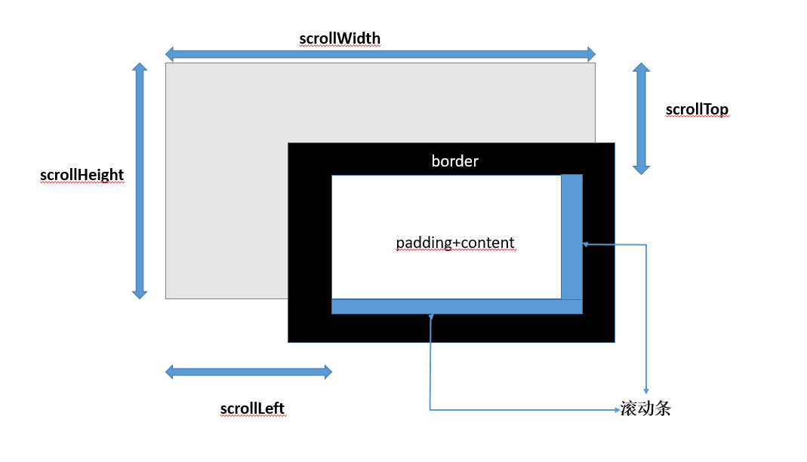

```html
<style>
    #test {
        width: 200px;
        height: 200px;
        margin: 0 auto;
        text-align: center;
        padding: 20px;
        border: 2px solid blue;
    }
</style>
<div id="test">测试</div>
```
## js盒子模型的13个常用属性
#### 1、可视区大小——client相关
指**元素内容及其内边距**所占空间的大小。
+ 内容溢出与否跟`client`属性无影响。
+ 获取的结果是没有单位的(其余的盒模型属性也是)
+ 获取的结果是整数,它会自己进行四色五入。
```js
client(width/height/top/left)
```
+ `clientWidth`：可视区域的宽(**内容宽度+ 左右`padding`**)。上面`div` 的 `clientWidth` 的大小时 `240`。等于元素 `content`和左右`padding`的宽度。
+ `clientHeight`：可视区域的高(**内容高度+ 上下`padding`**)。上面`div` 的 `clientHeight` 的大小时 `240`。等于元素 `content`和上下`padding`的宽度。
+ `clientTop`：上边框(`border`)的宽度。上面`div` 的 `clientTop` 的大小时 `2`。
+ `clientLeft`：左边框(`border`)的宽度。上面`div` 的 `clientLeft` 的大小时 `2`。
```js
//获取当前页面一屏幕(可视化区域)的宽高
const winW=document.documentElement.clientWidth||document.body.clientWidth;
const winH=document.document.documentElement.clientHeight||document.body.clientHeight;
```


#### 2、偏移量——offset相关
```js
offset(width/height/top/left/Parent)
```
+ `offsetWidth`：等于 `clientWidth+border`，等于盒子本身的宽。。上面元素的宽度为 `244`。
+ `offsetHeight`: 等于 `clientHeight+border`，等于盒子本身的高。上面元素的高度为 `244`。
+ `offsetTop`：当前元素的外边框距离父级参照物内边框的上偏移。相当于父元素的 `上padding`+`上margin`+其自身上边 `margin` 的大小。
+ `offsetLeft`：当前元素的外边框距离父级参照物内边框的左偏移。相当于父元素 的 `左padding`+`左margin`+其自身左边 `margin` 的大小。
+ `offsetParent`：父级参照物。默认元素的父级参照物是 `body`。设置定位后，会改变默认的父级参照物。
```js
//获取当前元素距离`body`的左偏移、上偏移(不论参照物是谁)。
function offset(dom){
    let parent=dom.offsetParent;
    let top=dom.offsetTop,left=dom.offsetLeft;
    while(parent&&parent.tagName!==='BODY'){
        if(!/MSIE 8.\0/.test(navigator.userAgent)){
            //IE8中偏移值自己就算了边框了
            //父参照物的边框
            left+=parent.clientLeft;
            top+parent.clientTop;
        }
        //父参照物的偏移
        left+=parent.offsetLeft;
        top+=parent.offsetTop;
        parent=parent.offsetParent;
    }
    return {
        top,left
    }
}
```


#### 3、滚动大小——scroll相关
```js
scroll(width/height/left/top);
//获取整个页面的真实高度
document.documentElement.scrollHeight||document.body.scrollHeight
```
+ `scrollWidth`：当前元素真实内容的宽度，在没有内容溢出的情况下，和`clientWidth` 的值一样。在有内容溢出的情况下，获取的结果约等于真实内容的宽高(左`padding`+真实内容的宽度)。
+ `scrollHeight`：当前元素真实内容的高度,在没有内容溢出的情况下，和`clientHeight` 的值一样。但是在有内容溢出的情况下，`scrollHeight`获取的值是上`padding`+真实内容的高度。
    + 不同浏览器获取的结果不尽相同。
    + 设置`overflow`属性值对最后的结果也会产生一定的影响。

+ `scrollTop`: 当前区域如果有内容溢出，并且我们也让其出现了滚动条，那么该属性是隐藏在内容区域上方的像素数。竖向滚动条卷去的高度。
+ `scrollLeft`：当前区域如果有内容溢出，并且我们也让其出现了滚动条，那么该属性是隐藏在内容区域左侧的像素数。横向滚动条卷曲的宽度。
    + `scrollTop`最小值是`0`，最大值是整个的高度`scrollHeight-一屏幕的高度。`。
    + `scrollLeft`最小值是`0`，最大值是整个的高度`scrollWeight-一屏幕的宽度。`。


**注意** `scrollTop`和 `scrollLeft`是13个属性中唯一可以进行读写的，其余的都是只读的。
