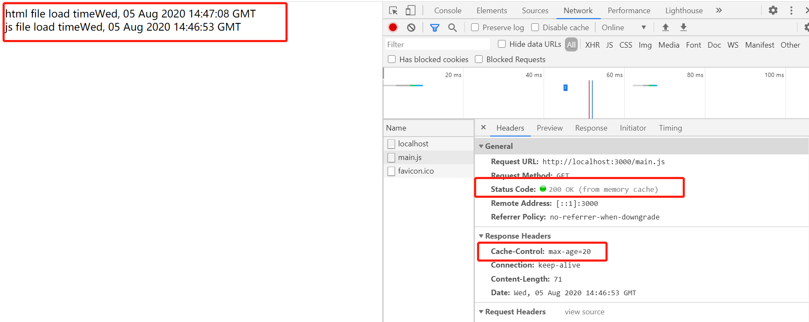

## HTTP的缓存机制

&#8195;&#8195;缓存机制无处不在，有客户端缓存（cookie、localstorage等），服务端缓存（session），代理服务器缓存等。在HTTP中具有缓存功能的是浏览器缓存。 HTTP缓存作为web性能优化的重要手段，对于从事web开发的朋友有重要的意义。思维导图如下：


### 1、缓存的分类

&#8195;&#8195;缓存分为**强制缓存和协商缓存**。
#### 1、 强制缓存
&#8195;&#8195;当本地缓存中含有请求的数据且（**及缓存时间还未过期**）时，客户端直接从本地缓存中获取数据。当本地缓存没有所请求的数据时，客户端的才会从服务端获取数据。  
&#8195;&#8195;对于强制缓存，服务器响应的 `header` 中会用两个字段来表明——**Expires和Cache-Control**。  

##### 1）Expires   
&#8195;&#8195;`Exprires` 的值为服务端返回的数据到期时间。当再次请求时的请求时间小于返回的此时间，则直接使用缓存数据。但由于服务端时间和客户端时间可能有误差，这也将导致缓存命中的误差，另一方面，`Expires` 是`HTTP1.0` 的产物，故现在大多数使用 `Cache-Control` 替代。
```js
//在服务器端设置过期时间，表示10秒后到期
res.setHeader('Expires', new Date(Date.now() + 10 * 1000).toUTCString())
```
&#8195;&#8195;通过`res.setHeader(Expires,time)` 会在响应头中添加一个 `Expires`字段，表示过期时间。在过期时间内，获取文件时响应头里的 `Status Code`都是 `200 OK (from memory cache)`。添加 `Expires`响应头的结果如下所示。


##### 2）Cache-Control 
`Cache-Control` 有很多属性，不同的属性代表的意义也不同。 
| 字段 | 含义 |
|--|--|
| private| 客户端可以缓存 
public|客户端和代理服务器都可以缓存  
max-age=t|缓存内容将在t秒后失效  
no-cache|需要使用协商缓存来验证缓存数据  
no-store|所有内容都不会缓存。  
must-revalidate|缓存在考虑使用一个陈旧的资源时，必须先验证它的状态，已过期的缓存将不被使用

```js
//在服务器端设置过期时间，表示20秒后过期
res.setHeader('Cache-Control', 'max-age=20')
```
&#8195;&#8195;通过在响应头中添加`Cache-Control`,在过期时间内，获取文件时响应头里的 `Status Code`都是 `200 OK (from memory cache)`。添加`Cache-Control`后的结果如下图所示。



####  2、协商缓存
&#8195;&#8195;又称对比缓存，客户端会先从本地缓存中获取到一个缓存数据的标识(`ETag`)， 然胡服务器检查该`ETag` 证是否失效，如果没有失效服务端会返回 `304`(只有响应头，没有响应体)，此时客户端直接从缓存中获取所请求的数据，如果标识失效，服务端会返回更新后的数据。  
协商缓存又分两种情况。 

##### 情况1：根据Last-Modified来进行协商缓存（hTTP 1.0）

&#8195;&#8195;**Last-Modified：** 服务器在响应请求时，会告诉浏览器资源的**最后修改时间**。 

&#8195;&#8195;**if-Modified-Since:** 浏览器再次请求服务器的时候，请求头会包含此字段，后面跟着在缓存中获得的最后修改时间。服务端收到此请求头发现有 `If-Modified-Since`，则与被请求资源的最后修改时间进行对比，如果一致则返回304和响应报文头，浏览器只需要从缓存中获取信息即可。                
&#8195;&#8195;从字面上看，就是说：从某个时间节点算起，是否文件被修改了。    
&#8195;&#8195;1、如果真的被修改：那么开始传输响应一个整体，服务器返回：`200 OK`。  
&#8195;&#8195;2、如果没有被修改：那么只需传输响应`header`，服务器返回：`304 Not Modified`（没有响应体）。
**测试demo如下**
```js
const updateTime = () => {
    return new Date().toUTCString();
}
const http = require('http');
let lastModified
http.createServer((req, res) => {
    const { url } = req;
    if ("/" === url) {
        res.setHeader('Content-Type', 'text/html')
        res.end(`
            <html>
                html file load time${updateTime()}
                <script src="main.js"></script>
            </html>

        `)
    } else if (url === "/main.js") {
        const content = `document.writeln('<br> js file load time${updateTime()}')`;
        //判断文件是否被修改，即
        if (req.headers['if-modified-since'] && (new Date(req.headers['if-modified-since']).getTime() === new Date(lastModified).getTime())) {
            console.log('缓存命中');
            res.statusCode = 304;
            res.end();
            return
        } else {
            res.setHeader('Cache-Control', 'no-cache')
            lastModified = new Date().toUTCString()
            res.setHeader('Last-modified', lastModified)
            res.statusCode = 200
            res.end(content)
        }

    } else if (url === "favicon.icon") {
        res.end("")
    }
}).listen(3000, () => {
    console.log("服务器启动在3000端口")
});
```

&#8195;&#8195;**if-Unmodified-Since:**
从字面上看, 就是说: 从某个时间点算起, 是否文件没有被修改。  
&#8195;&#8195;1、如果没有被修改:则开始`继续'传送文件: 服务器返回: 200 OK。    
&#8195;&#8195;2、如果文件被修改:则不传输,服务器返回: 412 Precondition failed (预处理错误) 。

首次请求时，会在响应头里添加 `last-modified`,表示最后修改时间。第二次请求时，会在请求头中添加 `If-Modified-Since`,用于跟服务端的 `last-modified`的值进行对比。


##### 情况2：根据ETag来进行协商缓存（HTTP 1.1）

&#8195;&#8195;**Etag：** `Etag` 是`URL`的 `Entity Tag`，用于标示 `URL` 对象是否改变，区分不同语言和Session等等。具体内部含义是使服务器控制的，就像Cookie那样。Etag由服务器端生成，然后服务器通过客户端发送过来的 **（If-Match/If-None-Match）** 这个条件判断请求来验证资源是否修改。    
&#8195;&#8195;**第一次请求**    
&#8195;&#8195;1.客户端发起 HTTP GET 请求一个文件；     
&#8195;&#8195;2.服务器处理请求，返回文件内容和一堆Header，当然包括Etag(例如"2e681a-6-5d0448402")(假设服务器支持`Etag`生成和已经开启了`Etag`)，状态码200。  
&#8195;&#8195;**第二次请求**  
&#8195;&#8195;客户端发起 `HTTP GET` 请求一个文件，注意这个时候客户端同时发送一个`If-None-Match` 头，这个头的内容就是第一次请求时服务器返回的 `Etag：2e681a-6-5d0448402`。  
&#8195;&#8195;服务器检查该`ETag`，并判断出该页面自上次客户端请求之后是否被修改，如果`If-None-Match` 为跟后台生成的`Etag`相同，则证明请求的文件没有修改，则响应`header`和空的`body`，浏览器直接从缓存中获取数据信息。返回状态码304。如果`ETag`被修改了，说明资源被改动过，则响应整个资源内容，返回状态码200。     
&#8195;&#8195;但是实际应用中由于`Etag`的计算是使用算法来得出的，而算法会占用服务端计算的资源，所有服务端的资源都是宝贵的，所以就很少使用Etag了。

&#8195;&#8195;第一次请求时会在响应头里添加 `Etag(4b1f0259b32390df6baf991c917efe716945af29)`,如下所示。在第二次请求时，请求头里会添加 `If-None-Match: 4b1f0259b32390df6baf991c917efe716945af29`,用于跟服务器端的`Etag`比较，看是否一样。


**测试demo如下。**
```js
const updateTime = () => {
    return new Date().toUTCString();
}
const http = require('http');
let hash//定义全局的hash值
http.createServer((req, res) => {
    const { url } = req;
    if ("/" === url) {
        res.setHeader('Content-Type', 'text/html')
        res.end(`
            <html>
                html file load time${updateTime()}
                <script src="main.js"></script>
            </html>

        `)
    } else if (url === "/main.js") {
        const content = `document.writeln('<br> js file load time${updateTime()}')`;
        const crypto = require('crypto');
        //判断是否设置了Etag，如果设置了，且文件没有修改时
        if (req.headers['if-none-match'] && req.headers['if-none-match'] === hash) {
            res.statusCode = 304;
            res.end();
            return;
        } else {
            //这是没有设置Etag或者 文件修改了的情况
            hash = crypto.createHash('sha1').update(content).digest('hex');
            res.setHeader("Etag", hash);
            res.statusCode = 200
            res.end(content)
        }
    } else if (url === "favicon.icon") {
        res.end("")
    }
}).listen(3000, () => {
    console.log("服务器启动在3000端口")
});

```
**判断缓存是否过期可以用以下一张图来概括**


#### 2、如果服务器同时设置了Cache-Control:max-age和Expires以及ETag(If-None-Match)、If-Modified-Since（Last Modified）时，怎么办？  
&#8195;&#8195;具体判断过程如下所示。

+ 当发送一个服务器请求时，**浏览器首先会进行缓存过期判断。浏览器根据缓存过期时间判断缓存文件是否过期。**   
**情景一(Cache-Control等浏览器本地判断)：**   
&#8195;&#8195;若没有过期，则不向服务器发送请求，直接使用缓存中的结果，此时我们在浏览器控制台中可以看到 **200 OK(from cache)** ，此时的情况就是完全使用缓存，**浏览器和服务器没有任何交互的**。    
**情景二(服务器端判断)：**      
&#8195;&#8195;若已过期，**则向服务器发送请求**，此时请求中会带上设置的**文件修改时间和Etag**，然后进行资源更新判断。这要分两种情形进行判断。  
&#8195;&#8195;**情形一：** 若两种判断的结论都是文件没有被修改过，则服务器就不给浏览器发index.html的内容了，直接告诉它，文件没有被修改过，你用你那边的缓存吧—— **304 Not Modified，** 此时浏览器就会从本地缓存中获取 `index.html` 的内容。     
&#8195;&#8195;**情形二：** 若文件修改时间和ETag判断有任意一个没有通过，则服务器会受理此次请求。并从服务器加载数据。    

**总结：** 两类缓存机制可以同时存在，强制缓存的优先级高于协商缓存，当执行强制缓存时，如果`expire` 字段对应的时间还未过期，则直接使用本地缓存数据，过期了再进行缓存协商
。
**总而言之:** 先在浏览器端判断缓存是否过期，没有过期则使用本地缓存（状态码为`200 OK (from memory cache)`）。过期了再进行协商缓存，如果通过判断`ETag` 和文件最后修改时间，发现请求文件都没被修改过，则直接从本地缓存中获取数据（状态码为`304 Not Modified` ）。如果有一个修改了都会从服务器重新加载数据（状态码为 `200 Ok`）
