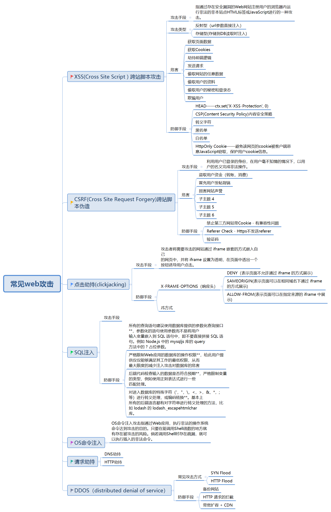

## 常见web安全问题及防护原理
<h4>&#8195;1、XSS(Cross Site Scripting)</h4>
&#8195;&#8195;跨站脚本攻击。恶意攻击者往Web页面里插入恶意的Script代码，当用户浏览该页之时，嵌入其中Web里面的Script代码会被执行，从而达到恶意攻击用户的目的。分为存储型和反射型两类。

&#8195;&#8195;**存储型XSS：** 存储型XSS，持久化，**代码是存储在服务器中的**，如在**个人信息或发表文章等地方，加入代码**，如果没有过滤或过滤不严，那么这些代码将储存到服务器中，用户访问该页面的时候触发代码执行。这种XSS比较危险，容易造成蠕虫，盗窃cookie。 

&#8195;&#8195;**反射型XSS：**    非持久化，需要欺骗用户自己去点击链接才能触发XSS代码（服务器中没有这样的页面和内容），一般容易出现在搜索页面。   

&#8195;&#8195;**常见攻击手段：**    
&#8195;&#8195;1、攻击者在论坛中放一个看似安全的链接，骗取用户点击后，窃取cookie中的用户私密信息；    
&#8195;&#8195;2、或者攻击者在论坛中加一个恶意表单，当用户提交表单的时候，却把信息传送到攻击者的服务器中，而不是用户原本以为的信任站点。 

&#8195;&#8195;**常见防御手段：**   
&#8195;&#8195;1、代码里对用户输入的地方和变量都需要仔细检查长度和对"<",">",";","’"等特殊字符做过滤(**长度限制及特殊字符判断**)；     
&#8195;&#8195;2、任何内容写到页面之前都必须加以encode，避免不小心把html tag弄出来（**encode加密**）。   
&#8195;&#8195;3、首先，避免直接在cookie中泄露用户隐私，例如email、密码等等。其次，通过将**cookie和系统ip绑定来降低cookie泄露后的危险**。这样攻击者得到的cookie没有实际价值，不可能拿来重放。最后，如果网站不需要在浏览器端对cookie进行操作，可以在**Set-Cookie末尾加上HttpOnly**来防止javascript代码直接获取cookie(**cookie**)。   
&#8195;&#8195;4、尽量采用POST而非GET提交表单。

<h4>&#8195;2、CSRF(Cross-site request forgery)</h4>

&#8195;&#8195;跨站请求伪造。也被称为“One Click Attack”或者Session Riding。攻击通过在授权用户访问的页面中包含链接或者脚本的方式工作。**与XSS的区别在于**：XSS是获取信息，不需要提前知道其他用户页面的代码和数据包。CSRF是代替用户完成指定的动作，需要知道其他用户页面的代码和数据包。与XSS攻击相比，CSRF攻击往往不大流行和难以防范，所以被认为比XSS更具危险性。     

&#8195;&#8195;要完成一次CSRF攻击，受害者必须依次完成两个步骤：  
&#8195;&#8195;1、登录受信任网站A，并在本地生成Cookie。  
&#8195;&#8195;2、在不登出A的情况下，访问危险网站B。

&#8195;&#8195;**常见攻击手段**
 &#8195;&#8195;一个网站用户Bob可能正在浏览聊天论坛，而同时另一个用户Alice也在此论坛中，并且后者刚刚发布了一个具有Bob银行链接的图片消息。设想一下，Alice编写了一个在Bob的银行站点上进行取款的form提交的链接，并将此链接作为图片src。如果Bob的银行在cookie中保存他的授权信息，并且此cookie没有过期，那么当Bob的浏览器尝试装载图片时将提交这个取款form和他的cookie，这样在没经Bob同意的情况下便授权了这次事务。

&#8195;&#8195;**CSRF的防御手段**    
&#8195;&#8195;1、服务端的CSRF方式方法很多样，但总的思想都是一致的，就是在客户端页面增加伪随机数。    
&#8195;&#8195;2、通过验证码的方法。     
&#8195;&#8195;3、对于web站点，将持久化的授权方法（例如cookie或者HTTP授权）切换为瞬时的授权方法（在每个form中提供隐藏field）。一种类似的方式是在form中包含秘密信息、用户指定的代号作为cookie之外的验证。

<h4>&#8195;3、sql注入</h4>
&#8195;&#8195;就是通过把SQL命令插入到Web表单递交或输入域名或页面请求的查询字符串，最终达到欺骗服务器执行恶意的SQL命令。具体来说，它是利用现有应用程序，将（恶意的）SQL命令注入到后台数据库引擎执行。   

&#8195;&#8195;**防御方法：**    
&#8195;&#8195;1.永远不要信任用户的输入。对用户的输入进行校验，可以通过正则表达式，或限制长度；对单引号和
双"-"进行转换等     
&#8195;&#8195;2.永远不要使用动态拼装sql，可以使用参数化的sql或者直接使用存储过程进行数据查询存取。  
&#8195;&#8195;3.永远不要使用管理员权限的数据库连接，为每个应用使用单独的权限有限的数据库连接。  
&#8195;&#8195;4.不要把机密信息直接存放，加密或者hash掉密码和敏感的信息。    
&#8195;&#8195;5.应用的异常信息应该给出尽可能少的提示，最好使用自定义的错误信息对原始错误信息进行包装    
&#8195;&#8195;6.sql注入的检测方法一般采取辅助软件或网站平台来检测，软件一般采用sql注入检测工具jsky，网站平台就有亿思网站安全平台检测工具。MDCSOFT SCAN等。采用MDCSOFT-IPS可以有效的防御SQL注入，XSS攻击等。