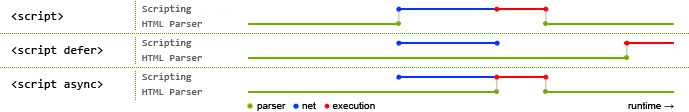

## 1、CSS资源的加载(异步加载的)
+ 遇到 `style` 内联样式，"同步"交给`GUI` 渲染线程解析。
+ 遇到 `link` 标签。
    + "异步" 开辟一个新的 `HTTP`网络请求线程。
    + 不等待资源信息请求回来，`GUI` 渲染线程继续向下渲染。
    + `GUI` 渲染线程同步操作都处理完后，再把基于`HTTP` 网络线程请求回来的资源文件进行解析渲染。
+ 遇到 `@import` 导入样式。同步开辟一个新的 `HTTP`网络请求线程 去请求资源文件。在资源文件没有请求回来之前，`GUI` 渲染线程会被"阻塞",不允许其继续向下渲染。
## 2、script 资源的加载(默认是同步加载的)
+ 默认是"同步"的：必须基于`HTTP` 网络线程，把资源请求回来之后，并且交给`js` 渲染线程解析完成后，`GUI` 渲染线程才能继续向下渲染。`script`默认是阻碍`GUI`渲染的。
+ `async`属性：遇到 `<script async>`时，首先也是开辟一个`HTTP`网络线程去请求加载资源文件，与此同时`GUI`渲染线程继续向下渲染（吧默认的同步改为"异步"）,但是一旦资源请求回来后，会中断`GUI`的渲染，先把请求回来的`js`进行渲染解析。才会渲染解析请求回来的`js` 代码。


## 3、图片或者音频、视频资源
&#8195;&#8195;会发起新的`HTTP`网络请求，请求加载的资源文件，不会阻碍`GUI`的渲染("异步")。当`GUI` 渲染完成后，才会把请求回来的资源信息进行渲染解析。
## 4、页面渲染的步骤
+ 生成`DOM TREE`(`DOM`树)：自上而下渲染页面，整理好整个页面的`DOM`结构关系。
+ 生成`CSSOM TREE`(样式树)：当把所有的样式资源请求加载回来后，按照引入`CSS`的顺序，依次渲染样式代码，生成样式树。
+ `RENDER TREE`(渲染树)：将`DOM TREE`和 `CSSOM TREE` 合成渲染树（`display`为`none`的不会去渲染）。
+ `Layout` 布局/回流/重绘：计算它们在设备视口(`viewport`)内的确切位置和大小。
+ 分层处理：按照层级定位分层处理，每一个层级都会详细规划处具体的绘制步骤。
+ `Painting`:按照每一个层级计算绘制的绘制步骤，开始绘制页面。

## 5、前端性能优化（CRP:
+ 生成 `DOM TREE`阶段
    + 减少`dom`层级嵌套
    + 不要使用非标准标签。
+ 生成 `CSSOM` 树
    + 尽可能不要使用`@import`（阻塞`GUI`渲染）
    + 如果`CSS`代码较少，尽可能使用`style`内联样式
    + 如果使用 `link`，尽可能把所有的样式资源合并成一个 `CSS`，且压缩(减少`HTTP` 请求数量，同时在渲染 `CSS`的时候，也不需要在计算依赖关系)
    + `CSS`选择器链短一些(`CSS`选择器渲染时从右到左的)
    + 将`link`等导入`CSS`的操作放在`HEAD`中。
+ `script`资源的优化
    + `script`标签。尽量放在页面的底部。
    + 使用`async`时，哪一个资源先获取到，就把这个资源代码渲染执行。
    + 使用`defer`时，和`link`一样，等所有`<script defer>`都请求回来后，按照导入顺序/依赖关系依次先后渲染。
+ `img`资源的优化
    + 懒加载：第一次加载页面的时候不要加载请求图片，哪怕是异步的，也会占据`HTTP`并发的数量,导致其他资源后加载。
    + 图片的`BASE64`：不用去请求图片，`BASE64`码基本上代表的就是图片,而且页面渲染图片的时候速度很快(但是要慎用（编码后的代码量太大）,在`webpack`工程化中可以使用,因为它基于`file-loader`，可以自动`base64`)
+ `Layout/Painting`:减少`DOM`的"回流/重排"和重绘。 触发回流，必然会触发重绘；单纯的重绘，并不会引发回流。
    + 引发回流的操作：
        + 元素在视口中的大小或者位置发生变化
        + 元素的删减或者新增(或者基于`display`控制显示隐藏)。
        + 浏览器视口发生变化。
        + 内容发生变化(比如文本变化或者图片被另一个不同尺寸的图片所替代)
    + 避免`DOM`的回流的操作：
        + 样式集中改变
        + 分离读写操作
        + 缓存布局信息
        ```js
        //触发两次回流 两次样式读
        box.style.width=box.offsetWidth+10+"px";
        box.style.height=box.offsetHeight+10+"px";
        //修改为
        const w=box.offsetWidth,h=box.offsetHeight;
        box.style.width=w+10+'px';
        box.style.height=h+10+'px';
        ```
        + 元素批量修改(`createDocumentFragment`,模板字符串拼接)
        + 动画效果等频繁样式修改的操作，应用到`position`属性为`absolute`或者`fixed`的元素上(脱离文档流,单独一层)。利用分层机制，如果只改变一个层面上的位置大小等消息，浏览器回流和重绘的速度会加快很多。
        + `CSS3`硬件加速(`GPU`加速)。`transform、opacity、filters...`等属性会触发硬件加速，不会引发回流。但是过量使用会占用大量内存、性能消耗严重，有时候会导致字体模糊等。
        + 避免`table`布局和使用`css`的`javascript`表达式。

    + 重绘：元素的颜色、透明度等不影响元素的大小及在视口中的位置的操作。(`outline、visibility、background-color`)
## 6、当代浏览器的渲染队列机制
&#8195;&#8195;在当前上下文操作当中，遇到一行修改样式的代码，并没有立即通知浏览器渲染，而是把其放置在渲染队列中，接下来看是否还有修改样式的代码，如果有继续放在渲染队列中...一直到再也没有修改样式的代码或者"遇到一行获取样式的操作"，这样都会刷新浏览器的渲染队列机制(也就是把现在队列中修改样式的操作，统一告诉浏览器渲染，这样只会引发一次回流。)。优化方式就是**分离读写。**或者样式集中修改`box.cssText="...."`。
+ 分离读写的方式1
```js
//分离样式读和写
//这种写法这会引发两次回流
box.style.width="100px";//样式写
box.style.height='200px';//样式写
box.offsetHeight;//样式读
box.style.top="100px"; //样式写
//改为
box.style.width="100px";//样式写
box.style.height='200px';//样式写
box.style.top="100px";//样式写
box.offsetHeight;//样式读
```

+ 分离读写的方式2
`box.style.cssText="width:100px;height:200px"`
**注意**:有些操作可以利用样式的回流来实现一些想要的操作。
```js
setTimeout(() => {
    // 立即回到left:0的位置
    box.style.transitionDuration = '0s';
    box.style.left = 0;
    // 刷新渲染队列（会增加一次回流）
    box.offsetLeft;
    // 回到开始位置后，再次运动到left:200位置(有动画)
    box.style.transitionDuration = '0.5s';
    box.style.left = '200px';
}, 1000);
```