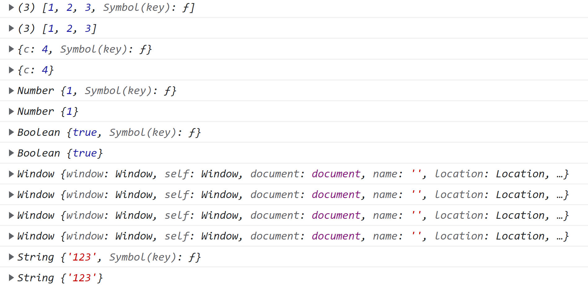
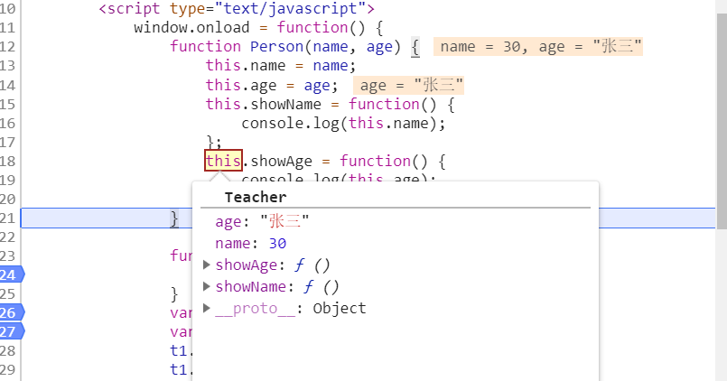

​		
&#8195;&#8195;在工作中经常看到有使用 `call` 和 `apply`,`ibnd` 这3个方法，每次看到后都会去网上搜一下用法，然而过一段时间就又不会了，归根到底是自己没有理解他的原理，这次准备彻底弄懂，并把自己的理解总结下来。

作用主要有两点：
+ 1、允许为不同的对象分配和调用属于另一个对象的函数/方法，也就是改变（或者说是扩大）函数运行的作用域，优点：对象不需要跟方法有任何耦合关系；  
+ 2、提供新的 `this` 值给当前调用的函数/方法。 

## 1、fun.call(thisArg, arg1, arg2, ...)

| 参数      | 描述                                 |
| --------- | ------------------------------------ |
| thisArg   | 在fun函数运行时指定的this值。        |
| arg1,arg2 | 指定的参数列表，必须一个一个的列出来 |

下面来看几个例子：

```javascript             
function Person(name, age) {
    this.name = name;
    this.age = age;
}
Person.prototype.sayHi = function(a,b) {
    console.log("this的值:" + this)
    console.log("sayhi：" + this.name + "：" + this.age + ",参数的个数:" + arguments.length);
}
var p1 = new Person("小白", 2);
p1.sayHi.call();
p1.sayHi.call(null);
p1.sayHi.call(undefined);
p1.sayHi.call("1");
p1.sayHi.call(true);
var obj = {
    name: "张三",
    age: 21
}
p1.sayHi.call(obj);
function Teacher(name, age) {
    this.name = name;
    this.age = age;
}
var t1 = new Teacher("张三", 18);
p1.sayHi.call(t1, 1, 2, 3); 
```
输出结果如下：

<!--  -->

**结果分析：当给 `fun.call()` 中的 `thisObj` 赋值为空、`null` 、`undefined`  时，函数 `fun` 中的 `this` 值指向 `window`。** 
下面call()函数的源码的大概实现：

```javascript            
Function.prototype.Call = function(context) {
    var context = context || window;
    var args = Array.from(arguments).slice(1);
    var type = typeof context;
    switch(type) {
        case "boolean":
            context = new Boolean(context);
            break;
        case "number":
            context = new Number(context);
            break;
        case "string":
            context = new String(context);
            break;
        default:
            break;
    }
    context.fn = this;
    const result = context.fn(...args);
    delete context.fn;
    return result;
}
var obj={c:4};
var arr=[1,2,3];
//Array
foo.Call(arr,1,2,3);
foo.call(arr,1,2,3);
//object
foo.Call(obj,1,2,3);
foo.call(obj,1,2,3);
//Number
foo.Call(1,1,2,3)
foo.call(1,1,2,3);
//Boolean
foo.Call(true,1,2,3)
foo.call(true,1,2,3);
//null
foo.es6Call(null,1,2,3)
foo.call(null,1,2,3);
//undefined
foo.Call(undefined,1,2,3)
foo.call(undefined,1,2,3);
//String
foo.Call("123",1,2,3)
foo.call("123",1,2,3);
```
调用结果如下所示：

<!--  -->
上面代码的不足之处在于：只考虑到 `Boolean`、`String` 、`Number` 、`null`、`undefined` 和 `Object` 以及 `Array` 这几种数据类型的功能实现；  

## 2、fun.apply(thisArg, [arguments]) 

| 参数      | 描述                          |
| --------- | ----------------------------- |
| thisArg   | 在fun函数运行时指定的this值。 |
| arguments | 指定的参数数组                |


​&#8195;&#8195;`apply()` 和 `call()` 这两个方法的用途是一样的，都是在特定的作用域中调用函数，实际上就是设置函数 `fun` 内的 `this` 对象的值。`call()` 和 `apply()` 的区别在于 `call()` 里传递的参数必须一个一个的列出来，`apply` 里传递的参数可以是数组也可以是 `arguments` 对象。

区别可见如下代码：

```javascript            
function Person(name, age) {
    this.name = name;
    this.age = age;
}
Person.prototype.sayHi = function(a,b) {
    console.log("a的值:"+a);
    console.log("b的值:"+b);
    console.log("this的值:" + this)
    console.log("sayhi：" + this.name + "：" + this.age + ",参数的个数:" + arguments.length);
}	
var obj={
    name:"李四",
    age:25
}
var p1=new Person("张三",30);
p1.sayHi.call(obj, 1, 2, 3);
p1.sayHi.call(obj, [1,2,3]);
p1.sayHi.apply(obj, [1,2,3]); 
```
输出结果如下：

<!--  -->
下面 `apply()` 函数的源码的大概实现（缺点跟 `call()` 的实现是一样的。）：

```javascript            
Function.prototype.es6Apply = function(context, arr) {
    var context = context || window;
    var type = typeof context;
    switch(type) {
        case "boolean":
            context = new Boolean(context);
            break;
        case "number":
            context = new Number(context);
            break;
        case "string":
            context = new String(context);
            break;
        default:

            break;
    }
    context.fn = this;
    let result;
    if(!arr) {
        result = context.fn();
    } else {
        if(!(Object.prototype.toString.call(arr) == "[object Array]")) {
            throw new Error('CreateListFromArrayLike called on non-object');
        }
        result = context.fn(...arr);
    }
    delete context.fn;
    return result
}
```
##  3、`call()`和 `apply` 的常见用法

`apply` 常常被用于数组操作。
>1、如合并两个数组，且改变原数组。  

```javascript          
var array = ['a', 'b'];     
var elements = [0, 1, 2];   
array.push.apply(array, elements);  
console.log(array); // ["a", "b", 0, 1, 2]  
```
>2、如求取数组中的最大最小值。

```javascript           
var numbers = [5, 6, 2, 3, 7];  
var max = Math.max.apply(null, numbers);    
/* 基本等同于 Math.max(5, 6, 2, 3, 7)  */   
var min = Math.min.apply(null, numbers);  
/* 基本等同于 Math.min(5, 6, 2, 3, 7)  */ 
     
```
>3、实现继承
```javascript           
function Person(name, age) {
    this.name = name;
    this.age = age;
    this.showName = function() {
        console.log(this.name);
    };
    this.showAge = function() {
        console.log(this.age);
    }
}
function Teacher(name, age) {
    Person.apply(this, [age,name]);
}
var p1=new Person("李四",25);
var t1 = new Teacher("张三", 30);
t1.showName();//"张三"
t1.showAge();//30
```
​&#8195;&#8195;调用 `var p1=new Person("李四",25)` 时返回的是如下对象。`Person` 构造函数中的 `this` 指的是 `Person`。

<!--  -->

​		调用 `var 11=new Teacher("张三",30)` 时，因为调用了 `Person.apply(this, [age,name])`。`Person` 构造函数中的 `this` 指的是 `Teacher`。所有返回的是如下对象。

<!--  -->

&#8195;&#8195;`Person.apply(this, [age,name])`中的`this`在 `new Teacher()` 时指的是 `Teacher` ,所以 `Person.apply(this, [age,name])` 这句代码的返回的是一个`Teacher` 实例对象。

## 4、bind()

&#8195;&#8195;该方法会创建一个函数的实例，其 `this` 值会绑定到传给 `bind()` 函数的值。 例子如下：
```javascript           
window.color="red";
var o={color:"blue"};
function sayColor(){
    console.log(this.color);
}
var objSayColor=sayClor.bind(o);
objSayColor();//"blue"
sayColor();//"red"
```
​&#8195;&#8195;上面的例子相当于改变了 `sayColor()`函数中 `this` 的引用。**bind()函数的源码的实现如下：**

```javascript  
//基础版
Function.prototype.bind=function(oThis){
    const fToBind=this;
    const args=[...arguments].slice(1);
    return function(){
        return fToBind.apply(oThis,[...args,...arguments])
    }
}
//完整版    
Function.prototype.bind = function(oThis) {
    if(typeof this !== 'function') {
        // closest thing possible to the ECMAScript 5
        // internal IsCallable function
        throw new TypeError('Function.prototype.bind - what is trying to be bound is not callable');
    }
    var aArgs = Array.prototype.slice.call(arguments, 1),
        fToBind = this,
        // fNOP = function() {},
        fBound = function() {
            // this instanceof fBound === true时,说明返回的fBound被当做new的构造函数调用
            return fToBind.apply(this instanceof fBound ?
                                 this :
                                 oThis,
                                 // 获取调用时(fBound)的传参.bind 返回的函数入参往往是这么传递的
                                 aArgs.concat(Array.prototype.slice.call(arguments)));
        };

    // 维护原型关系
    // if(this.prototype) {
    //     // Function.prototype doesn't have a prototype property
    //     fNOP.prototype = this.prototype;

    // }
    //继承原型
    this.prototype&&(fBound.prototype=Object.create(this.prototype)
    // 下行的代码使fBound.prototype是fNOP的实例,因此
    // 返回的fBound若作为new的构造函数,new生成的新对象作为this传入fBound,新对象的__proto__就是fNOP的实例
    // fBound.prototype = new fNOP();   
    return fBound;
};
```

<Valine></Valine>
