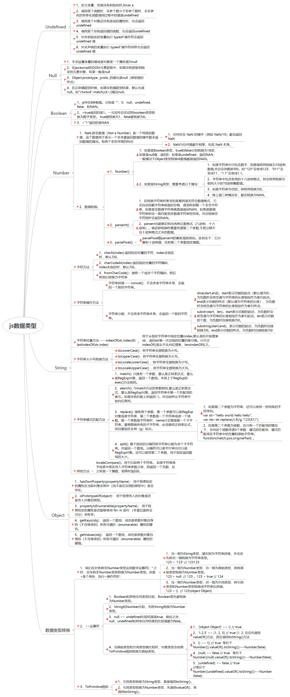

&#8195;&#8195;`javascript`中一种有9种数据类型，有7种简单数据类型（也称为基本数据类型）：`undefined、null、boolean、number 和string、symbol、bigint`，还有2种复杂数据类型——`Object`和 `function`。


## 1、undefined
&#8195;&#8195;`undefined` 类型只有一个值，即特殊的`undefined`。根据工作中总结，只要有这几种情况下会出现`undefined`。
>1.定义变量，但是没有初始化时,如var a；

>2.调用某个函数时，实参个数小于形参个数时，未实参化的形参在函数调用过程中的值是`undefined`；

>3.调用某个对象还没有添加的属性时，也会返回`undefined`； 

```js       
var obj={}   
console.log(obj.name);//undefined
```
>4.调用某个没有返回值的函数，也会返回`undefined`;
```javascript
function Person(name,age){
    this.name=name;
    this.age=age;
}
var p=Person("李四",23);//此时的p=undefined；       
```

>5.对<strong>未初始化的变量</strong>执行 typeof 操作符会返回 undefined 值;   

>6.对<strong>未声明的变量</strong>执行 typeof 操作符同样也会返回 undefined 值。 

```js        
var message; // 这个变量声明之后默认取得了 undefined 值   
//未初始化的变量
alert(typeof message);     // "undefined"  
//未申明的变量
alert(typeof age);         // "undefined"   
``` 
## 2、Null 类型

&#8195;&#8195;是第二个只有一个值的数据类型，这个特殊的值是 `null`。从逻辑角度来看，` null`值表示一个空对象指针，保存对象的变量还没有真正保存对象。而这也正是使用 `typeof` 操作符检测 `null`值时会返回`object`的原因。这几种情况下会出现`null`的情况。


>1、手动设置变量的值或者对象某一个属性值为null（在初始化对象时，手动设置对象为null。在作用域中不再需要使用某个对象时，把null赋值给那个变量解除引用，以释放内存）  

>2、在javascript的DOM元素获取中，如果没有获取到指定的元素对象，结果一般是null。    
```js       
var d=document.getElementById("d");
console.log(d);//当没有id为"d"的标签时返回null
```
>3、Object.prototype._proto_的值也是null。（每一个对象都有__proto__属性，指向对应的构造函数的prototype属性,但是因为Object是所有类的基类,其没有对应的构造函数，所有Object.prototype._proto_值为空）；

```js           
console.log("a".__proto__);
//指向的是String的prototype属性
//String {"", length: 0, constructor: ƒ, anchor: ƒ, big: ƒ, blink: ƒ, …}
```

>4、在正则捕获的时候，如果没有捕获到结果，默认也是null。

**注意：实际上，undefined 值是派生自 null值的。undefined转为数值为NAN,而null转为数值却为0**
```js        
alert(typeof null);//object
alert(null == undefined);弹出的是true 
alert(Number(undefined));//NAN
alert(Number(null))//0
```
## 3、Boolean类型

&#8195;&#8195;这个类型需要注意的值它的两个字面量true和false是区分大小写的。还要注意其他类型转换为此类型的情况。

| 数据类型        | 转换为true的值           | 转换为false的值  |
| :-------------: |:-------------:| :-------------:|
| String        | 任何非空字符串 | 空字符串("") |
| Number        | 任何非零数值(包括无穷大)      |   0和NAN |
| Object        | 任何对象      |    null |
| undefined     | 没有为true的情况      |    undefined |

**注意：**  
+ js存在6种假值。分别是
""、0、null、undefined、false、和NAN。  
+ +true返回的是1。一元加号会尝试将 `boolean` 类型转换为数字类型。 true被转换为1，false被转换为0。 
+ `+"1"`返回的是NAN。

## 4、Number

**注意点1：** Number的浮点数值在进行算术计算时精确度远远不如正数，所以不要去计算两个浮点数相加的结果是否等于另一个浮点数。
```js        
if(0.1+0.2==0.3){
    alert("相等")
}
```
&#8195;&#8195;这种情况永远都不会弹出"相等"的。因为浮点数的精度太高，0.1+0.2的值不一定精确的等于0.3。

**注意点2：** NaN,即非数值（Not a Number）是一个特殊的数值，这个数值用于表示一个本来要返回数值的操作数未返回数值的情况（这样就不会抛出错误了）。

**NaN 本身有两个非同寻常的特点。**
+ 1、任何涉及 NaN 的操作（例如 NaN/10）都会返回 NaN，这个特点在多步计算中有可能导致问题。

+ 2、`NaN` 与任何值都不相等，包括 `NaN` 本身。

&#8195;&#8195;针对 `NaN` 的这两个特点，`ECMAScript`定义了 `isNaN()`函数。这个函数接受一个参数，该参数可以 是任何类型，而函数会帮我们确定这个参数是否“不是数值”。任何不能被转换为数值的值都会导致这个函数返回 `true`。用`ES6` 的 `Object.is(NAN,NAN)`比较时返回`true`。
```js
isNAN(null) //false 先Number(null)在判断
isNAN("12px") //true 先Number(null)在判断
```

**注意点3：** 数值转换
&#8195;&#8195;有三个函数可以将非数值转换为数值：`Number()`、`parseInt()`、`parseFloat()`。`Number`()可以用于转换任何数据类型，而另外两个只能将字符串转换为数值。

#### 4.1 Number()函数的转换规则如下所示

* 如果是 `Boolean` 类型，`true` 和 `false` 分别转换为1和0.
    ```js        
    Number(true);//1
    Number(false);//0
    ```
* 如果是`null` 值，返回`0`。
* 如果是 `undefined`，返回 `NAN`
    ```js        
    Number(null);//0
    Number(undefined);//NAN
    ```
* 如果是 `String` 类型，需要考虑以下情况。  
    + 1、如果字符串中只包含数字，则直接将其转换为10进制数值,并且会忽略前导0。如"123"会变成123，"011"会变成11，"1.1"会变成1.1。  
    ```js
    Number("0123") //123
    Number("11.2")// 11
    ```
    + 2、字符串中包含有效的十六进制格式，则会将其转换为相同大小的10进制整数值。
    ```js
    Number("0xA") //10
    ```
    + 3、如果字符串为空的，则将其转换为0。 
    ```js
    Number("") //0
    ```   
    + 4、除上面三种情况外，都会转换为NAN。
    ```js
    Number('10px')//NAN
    ```
* 如果是`Object`类型，则调用对象那个的 `valueOf()`,依照前面的规则转换返回的值。不过一般不会将对象去转换成对应的数值。一般情况下对象转换成数值都是返回 `NAN`。
    ```js            
    Number({a:123});//NAN
    ```
#### 4.2  parseInt(value,radix)的转换规则
+ `radix`是一个进制，不写或者写0都是按10处理。(特殊情况:如果 `value`是以`0x` 开头，则进制为16)。
+ 进制有一个取值的范围:2~36 之间，不在这个区间的结果是`NAN`。
    ```js
    parseInt(18,18)// 18+8=>26
    ```
&#8195;&#8195;会先把`value`转换成字符串。在转换字符串时更多的是看其是否符合数值格式，它会自动忽略字符串前面的空格，直到找到第一个非空字符串，如果是非数值字符串就直接返回 `NAN`，如果是数值字符串则会一直匹配到非数值字符串处结束。**并且转换空字符转时会返回NAN。**  

&#8195;&#8195;`parseInt`也能够识别出各种正数格式（八进制、十六进制）。做这种转换时需要传递第二个参数,不然分辨不出八进制格式的数据。
```js 
parseInt("");//NAN      
parseInt(null) //NAN
parseInt(undefined);//NAN
parseInt("  s");//NAN
parseInt("s");//NAN
parseInt("   2s");//2
parseInt("0xA",16);//10(十六进制)
parseInt("070");//70
parseInt("070",8);//56
```
    
下面是一道关于`parseInt()`的经典面试题目。
```js
let arr=[10.18,0,"0013",10,25,23,77];
arr.arr.map(parseInt);
console.log(arr); //[10,NAN,2,2,11]

parseInt("10.18",0) // 10
parseInt("0",1) // NaN
parseInt("0013",2)//=>将"001"看做2进制最后转换为10进制=>1
parseInt("10",3) // 3
parseInt("25",4) //=> 将"25"看做4进制最后转换为10进制=>2
parseInt("23",5) // 13
parseInt(77,6) //NaN
```
**`Number`和`parseInt`转换对比。**
| 特殊情况 | Number | parseInt |
| :-----:| :----: | :----: |
| 空字符串 | `Number("")=>0` | `parseInt("")=>NaN` |
| 不包含数字的字符串 | `Number("dddd")=>NaN` | `parseInt("gsdg")=>NaN` |
| 只包含数字的字符串 | `Number("012")=>12`、`Number("012.2")=>12` | `parseInt("012")=>12`,`parseInt("012.2")=>12` |
| 包含数字的字符串 | `Number("012x")=>NAN` | `parseInt("012x")=>12` |
| 字符串中包含有效的十六进制格式 | `Number("0xA")=>10` | `parseInt("0xA")=>10` |
| `null` | `Number(null)=>0` | `parseInt(null)=>NaN` |
| `undefined` | `Number(undefined)=>NaN` | `parseInt(undefined)=>NaN` |

#### 4.3  parseFloat转换规则

&#8195;&#8195;`parseFloat`跟 `parseInt` 的解析规则类似。`parseFloat()`比`parseInt()`多识别一个0。 区别在于：**它只解析十进制值，没有第二个参数指定基数。**

#### 4.4 为什么`12.toString()`会报错呢？
这是因为十进制的`Number`是可以带小数的，小数点前后部分都可以省略，但是不能同时省略。
```js
.01
12.
12.01
```
`12.toString`表达式会被看成`12.`,当做省略了小数点后面部分的数字，而单独看成一个整体。所以如果我们想要单独让"."成为一个整体，就要加入空格：
```js
12 .toString()=>"12"
```

## 5、String类型
这里在价格其他类型的值转换为字符串时，主要遵循如下规则。   

+ 1、如果值有 `toString()`方法，则调用该方法（没有参数）并返回相应的结果；    

+ 2、如果值是 `null`,则返回 "null"；

+ 3、如果值是 `undefined`，则返回 `"undefined"`。   
```js       
var value1 = 10;
var value2 = true; 
var value3 = null; 
var value4; 
alert(String(value1));     // "10"  
alert(String(value2));     // "true
alert(String(value3));     // "null"
alert(String(value4));     // "undefined" 
```
主要有以下方法：
+ 1、字符方法   
    + `charAt(index)`:返回给定位置的字符，index未指定时，默认为0。  
    + `charCodeAt(index)`:返回指定位置的字符编码，index未指定时，默认为0。     
    + `fromCharCode()`：接收一个或多个字符编码，然后将他们转换为字符串。从本质上看是charCodeAt()的相反操作。
    ```js       
    console.log(String.fromCharCode(104,102,103,106));//"hfgi"
    var str="hijhj"
    console.log(str.charAt());//"s",index未指定时，默认为0
    console.log(str.charAt(1));//"i"
    console.log(str.charCodeAt());//104
    console.log(str.charCodeAt(1));//105
    ```
+ 2、字符串操作方法    
    + 字符串拼接:`concat()`，不会改变字符串本身，会返回一个新的字符串。        
    + 字符串分割:`slice()`、`substr()`、`substring()`。不会改变字符串本身，会返回一个新的字符串。他们之间的区别如下。 

| 方法 | 第一个参数 | 第二个参数 |
| :--: | :--: | :--:|
| slice | 表示切割的起点（默认值为0），为负数时会将负值与字符串的长度相加作为索引起点 | 表示切割的终点（默认值为字符串的长度），为负数时会将负值与字符串的长度相加作为索引终点 |
| substr | 表示切割的起点，为负数时会将负值与字符串的长度相加作为索引起点 | **表示切割的个数，为负数时自接转换为0**|
| substring | 表示切割的起点，为负数时自接转换为0 | 表示切割的终点，为负数时自接转换为0 |
```js       
var str="hello world";
console.log(str.slice());//hello world
console.log(str.slice(1,3))//el
console.log(str.slice(-1,-3))//""
console.log(str.substring());//hello world
console.log(str.substring(1,3));//el
console.log(str.substring(-1,-3))//""
console.log(str.substr())//hello world
console.log(str.substr(1,3));//ell
console.log(str.substr(-1,-3))//""
```
+ 3、字符串位置方法   

&#8195;&#8195;`indexOf(str,index)`和`lastIndexOf(str,index)`：用于从指定字符串中指定位置`(index`,默认是0)开始搜索str，返回str第一次出现的位置的索引值。只不过`indexOf()`是从开头向后搜索，`lastIndexOf`反之。    

+ 4、trim()方法  

&#8195;&#8195;用于删除字符串前置和后缀的所有空格。 

+ 5、字符串大小写转换方法  
    + **toLowerCase()** 将字符串全部转换为小写;
    + **toUpperCase()** 将字符串全部转换为大写。还有针对特定地区的方法如
    + **toLocaleLowerCase()** 将字符串全部转换为小写;
    + **toLocaleUpperCase()**  将字符串全部转换为大写。建议一般情况下使用针对地区的方法。  

+ 6、字符串的模式匹配方法  

&#8195;&#8195; **match():** 只接受一个参数，要么是正则表达式，要么是RegExp对象，**返回一个数组。本质上于RegExp的exec()方法相同。**

```js        
var str="hello world";
var pattern=/llo/;
var matches=str.match(pattern);
console.log(matches)
```

        
&#8195;&#8195;**search():** 与match方法的参数相同,要么是正则表达式，要么是RegExp对象。返回字符串中第一个匹配项的索引。如果没有匹配上则返回-1。并且始终从字符串开始向后查找。
```js           
var str="hello world";
var pattern1=/llo/;
var pattern2="lloe"
var index1=str.match(pattern1);//2
var index2=str.match(pattern2);//-1
```
&#8195;&#8195;**replace():** 接收两个参数，第一个参数可以是RegExp对象或者字符串，第二个参数是一个字符串或者一个函数。第一个参数是字符串时，name只会替换第一个子字符串。**要想替换所有的子字符串，必须提供正则表达式，而且要指定全局（g）标志。**
```js       
var str = "hello world";
var res1 = str.replace("l", "ww");
console.log(res1); //  hewwlo world     
var res2 = str.replace(/l/g, "ww");
console.log(res2);//hewwwwo worwwd
```
&#8195;&#8195;如果第二个参数为字符串，还可以使用一些特殊的字符序列。

实例如下：
```js           
var str="hello world hello hello";
var res=str.replace(/(.ll)/g,"123($1)");
console.log(res);//h123(ell)o world h123(ell)o h123(ell)o
```
&#8195;&#8195;如果第二个参数为函数，在只有一个匹配项的情况下，会向这个函数传递3个参数：**模式的匹配项，模式匹配项在字符串中的位置和原始字符串。 function(match,pos,originalText)** 。如果是有多个捕获组的情况下，传递给函数的参数依次是模式的匹配项，第一个捕获组的匹配项，第二个捕获组的匹配项。。。，最后两个参数仍然是模式匹配项在字符串中的位置和原始字符串。

&#8195;&#8195;**split():** 基于指定的分隔符将字符串分割为多个子字符串。并返回一个数组。分隔符可以是字付串也可以是RegExp对象。还可以接受第二个参数，用于指定返回数组的大小。        
```js       
var str="tre,rwr,rewr,rwrew";
var res1=str.split(",");
var res2=str.split(",",2);
var res3=str.split(/[^\,]+/);//表示以多个非","进行分割
console.log(res1);//(4) ["tre", "rwr", "rewr", "rwrew"]
console.log(res2);//(2) ["tre", "rwr"]
console.log(res3);//(5) ["", ",", ",", ",", ""]
```
+ 7、localeCompare()方法        

&#8195;&#8195;用于比较两个字符串。     如果字符串再字母表中排在传入字符串参数之前，则返回一个负数，反之则是一个整数，相等时返回0。
```js       
var str="bbc";
alert(str.localeCompare("cca"));//-1
alert(str.localeCompare("aca"));//1
alert(str.localeCompare("bbc"));//0
```
+ 8、HTML方法    
但是尽量不去使用这些方法，因为他们创建的标记通常无法表达语义。


## 6、symbol
用于定义唯一值。这个类型在`es6`专题中详细总结了。
## 7、bigint
`Number.MAX_SAFE_INTEGER` 是最大的安全数，超出这个数的值在后面加上`n`,用`9007199254740992n`表示。
## 8、object
`object`主要有以下几种类型
+ 普通对象
+ 日期对象
+ 正则对象
+ 数组对象
```js
typeof {} //object
typeof new Date() //object
typeof [] //object
typeof /\w+/ //object
```
**注意：** 普通对象的`key` 值只能是字符串和 `Symbol`。就算不是这两种类型，也会转化为字符串类型。默认调用`toString()`将之转化为字符串。
```js
const a={
    name:'james'，
}
a[[1,2]]=123
a[true]=222
a[null]=122
a[undefined]=123
console.log(Object.keys(a)) //(5) ["name", "1,2", "true", "null", "undefined"]
```
**注意**
+ `a=b=10` 连等赋值执行顺序从右到左。
+ `a.x=b=12`,`.`的优先级(等级为19)高于`=`(等级为3)，所以会先计算`a.x=12`，所以实际执行过程是`a.x=12,b=12`。
```js
let a={n:10};
let b=a;
a.x=a={n:12};//执行顺序为a.x={n:12},a={n:12}。
console.log(a);//{a:12}
console.log(b);//{n:10,x:{n:12}}
```
主要是注意这几个方法:       
+ **hasOwnProperty(propertyName)：**
用于检查给定的属性在当前对象实例中（而不是在实例的原型中）是否存在。其中，作为参数的属性名（propertyName）必须以字符串形式指定（例如：o.hasOwnProperty("name")）。

+ **isPrototypeOf(object)：**
用于检查传入的对象是否是传入对象的原型。
 
+ **propertyIsEnumerable(propertyName)：**
 用于检查给定的属性是否能够使用 `for-in `语句 （本章后面将会讨论）来枚举。与 `hasOwnProperty()`方法一样，作为参数的属性名必须以字符串形式指定。
 
+ **getKeys(obj)：**
 返回一个数组，成员是参数对象自身的（不含继承的）所有可遍历（enumerable）属性的键名。
 
+ **getValues(obj)：**
 返回一个数组，成员是参数对象自身的（不含继承的）所有可遍历（enumerable）属性的键值。属性名为数值的属性，是按照数值大小，从小到大遍历的。
## 9、function
```js
typeof function(){} //function
```
## 10、类型转换
 
**类型的转换规则如下表所示**。转载自ConardLi大神的[JS 进阶】你真的掌握变量和类型了吗]
(https://juejin.im/post/5cec1bcff265da1b8f1aa08f)

#### 1 非`Nmbere`类型的数学运算
我们在对各种非 `Number` 类型运用数学运算符`(- * /)` 时，会先将非 `Number` 类型转换为 `Number` 类型。
```js        
1 - true // 0 
1 - null //  1 
1 * undefined //  NaN Number(undefined)=>NaN
2 * ['5'] //  10  Number(["5"])=>Number(["5"].toString())=>5
```
#### 2、+ 运算符
但是`+`是个例外，执行`+` 操作符时：

> 当一侧为**String/Object类型**，被识别为**字符串拼接**，并会优先将另一侧转换为字符串类型。
```js
![]+[] //->"false" 等价于false+[] ->"false"+[].toString()
{}+{} //[object Object][object Object]
123 + {}  // 123[object Object]    （规则3） 
[1,2,3]+[4,5,6]  //->1,2,34,5,6 等价于 [1,2,3].toString()+[4,5,6].toString()
```
> 当一侧为**Number类型**，另一侧为原始类型，则**将原始类型转换为Number类型**。
```js
123 + '123' // 123123   （规则1）
123 + null  // 123    （规则2）
123 + true // 124    （规则2）
```
> 当一侧为**Number类型，另一侧为引用类型，将引用类型和Number类型转换成字符串后拼接**。
```js        
{}+0 //0 {}会被看成一个代码块
({}+0) //[object Object]0
0+{} //0[object Object]
```
#### **3、== 运算符**

引用类型转换为原始数据类型时，会按照以下优先级来进行转换。
+ `Symbol.toPrimitive(input,preferedType?)`
+ `valueOf()`
+ `toString()`

**注意：**  
+ 1、`Boolean` 和其他任何类型比较，`Boolean` 首先被转换为`Number`类型。
```js        
true == 1  // true 
true == '2'  // false  //实际上是Number(true)!==Number("2")
true == ['1']  // true //实际上是Number(true)===Number(['1'].valueOf().toString())
true == ['2']  // false 
//实际上是Number(true)!==Number(['2'].valueOf().toString())
undefined == false // false  false会首先转换为0所以不相等
null == false // false
```
+ 2、`String` 和 `Number` 比较，先将 `String` 转换为`Number` 类型。
```js        
123 == '123' // true 
'' == 0 // true      
```
+ 3、`null == undefined` 比较结果是 `true`，除此之外，`null、undefined` 和其他任何结果的比较值都为 `false`。
```js       
undefined == false // false  false会首先转换为0所以不相等
null == false // false
```
+ 4、**当原始类型和引用类型做比较时**，对象类型会依照`ToPrimitive`规则转换为原始类型。        
```js       
'[object Object]' == {} // true 

//分析：{}会直接调用tostring()方法，所以左右两边相等。
```
```js
'1,2,3' == [1, 2, 3] // true

//分析:[1, 2, 3]会先调用valueOf()方法，然后调用toString()方法
```
```js
[] == ![] // true

//等价于 Number([].valueOf().toString())==Number(false)
```
 **分析:** 左边[]会先调用 `valueOf()`,然后调用 `toString()` 方法,最后调用`Number`方法。右边![]会先转换为`false`,然后转换为 `number`类型为0，所以左右两边相等。 

!的优先级高于==，![]首先会被转换为 `false`，然后根据上面第二点，`false` 转换成 `Number` 类型0，左侧[]转换为0，两侧比较相等。
```js       
[null] == false // true
//[null].valueOf().toString()=>""
//等价于 Number([null].valueOf().toString())==Number(false);
[undefined] == false // true
//[undefined].valueOf().toString()=>""
//等价于 Number([undefined].valueOf().toString())==Number(false);
```
**分析：** 根据数组的 `ToPrimitive` 规则，数组元素为`null` 或 `undefined` 时，该元素被当做空字符串处理，所以`[null]`、`[undefined]` 都会被转换为0。