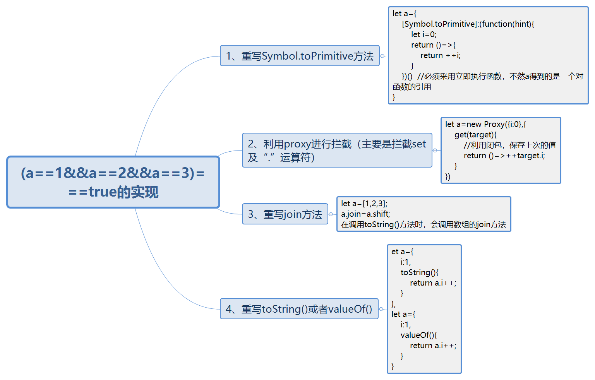

## 1、(a==1&&a==2&&a==3)===true的实现

&#8195;&#8195;由表达式可以看出a的数据类型只能是引用类型。所以在判断`a==1`时会进行强制类型转换。`==`运算符的作用是判断该运算符左右两边的对象的值是否相等。而根据强制类型转换规则。当原始类型和引用类型做比较时，对象类型会依照**ToPrimitive**规则转换为原始类型。

```javascript  
toPrimitive(input,preferedType?)
```
>1、引用类型转换为 `Number`类型，先调用 `valueOf()`，再调用 `toString()`<br>
>2、引用类型转换为 `String`类型，直接调用 `toString()`。

所以我们可以重写Symbol.ToPrimitive方法。

**方法1 重写Symbol.toPrimitive方法**

```javascript  
let a={
    [Symbol.toPrimitive]:(function(hint){
        let i=0;
        return ()=>{
            return ++i;
        }
    })()  //必须采用立即执行函数，不然a得到的是一个对函数的引用
}
```

**方法2 利用proxy进行拦截（主要是拦截set及“.”运算符）**

```javascript    
let a=new Proxy({i:0},{
    get(target){
        //利用闭包，保存上次的值
        return ()=>++target.i;
    }
})
```
**方法3 因为在调用toString()方法时，会调用数组的join方法。所以我们重写join方法**

```javascript  
let a=[1,2,3];
a.join=a.shift;
```
**方法4，重写toString()或者valueOf()**

```javascript  
let a={
    i:1,
    toString(){
        return a.i++;
    }
},
let a={
    i:1,
    valueOf(){
        return a.i++;
    }
}
```

以上解决方法皆参考(转载)自掘金@刘小夕的[这儿有20道大厂面试题等你查收](https://juejin.im/post/5d124a12f265da1b9163a28d)

## 2、改造一个for循环，使之输出0到9

改造下面的代码，使之输出0 - 9，写出你能想到的所有解法。
```javascript
for (var i = 0; i< 10; i++){
    setTimeout(() => {
        console.log(i);
    }, 1000)
}
```
**方法1 给setTimeout传第三个参数，作为函数的形参**
```javascript
for (var i = 0; i< 10; i++){
    setTimeout((i) => {
        console.log(i);
    }, 1000,i)
}
```

**方法2 利用立即执行函数，将i作为函数的形参**

```js
//方式1
for (var i = 0; i< 10; i++){
    ((i)=>{
        setTimeout(() => {
            console.log(i);
        }, 1000)
    })(i)
}
//方式2
for (var i = 0; i < 10; i++) {
    setTimeout(((i) => {
        console.log(i);
    })(i), 1000)
}
```
**方法3 利用let,构建块级作用域**
```javascript
for (let i = 0; i< 10; i++){
    setTimeout(() => {
        console.log(i);
    }, 1000,)
}
```
**方法4 直接输出**
```javascript
for (var i = 0; i < 10; i++) {
    setTimeout(console.log(i), 1000)
}
```
**方法5 利用 eval 或者 new Function 执行字符串**
```javascript
for (var i = 0; i < 10; i++) {
    setTimeout(eval('console.log(i)'), 1000)
}
for (var i = 0; i < 10; i++) {
    setTimeout(new Function('console.log(i)')(), 1000)
}
```
**方法6 利用try/catch的块级作用域**
```javascript
for(var i = 0; i < 10; i++){ 
    try{
        throw i;
    }catch(i){
        setTimeout(() => { console.log(i); },1000)    
    }
}    
```

## 4、判断传过来的变量是否是一个数组
&#8195;&#8195;很多时候我们都会用下面这个方法来判断传递过来的对象是否是一个数组。

```js    
var isArray = value instanceof Array; 
```
​		这个方法在一般情况下（value不是从其他frame传过来的）是成立的。但是为了防止一般情况的发生，我们可以用该方法来验证。 

```js
 function isArray(value) {
	 return Object.prototype.toString.call(value) == "[object Array]";
 } 
```

## 5、typeof和instanceof的区别

###  5.1  typeof

&#8195;&#8195;**是一种操作符而不是一个函数**，用来检测给定变量的数据类型。一般是用来判	断"number"、"string"、"boolean"、 和 "undefined"这4种基本数据类型的。object类型用typeof来判断结果存在争议，所以一般是使用`instanceof`来进行判断。**引用类型用typeof来进行判断时返回的都是object，**以至于我们还是不知道用于判断的变量到到底是什么数据类型。

```js	    
console.log(typeof(null));//object
console.log(typeof([1,2]));//object
//但实际上null是Null类型，而[1,2]是Array类型。
```
**typeof 最常见的用法**

>1、判断某个变量是否未定义  
>2、判断某个变量是否初始化
```js
if(typeof(b)=="undefined"){}
```
&#8195;&#8195;不能直接用`if(b)`去判断，这样代码会直接报错，后面的代码也会运行不了。因为`typeof`判断数据类型的不足（只能用于判断基本数据类型），引用数据类型需要使用`instanceof`的方式来进行判断。

### 5.2  instanceof

&#8195;&#8195;`object instanceof constructor` 此运算符可以判断一个变量是否是某个对象（类）的实例。换句话说用来检测 `constructor.prototype` 是否存在于参数 object 的原型链上。  
&#8195;&#8195;下面通过代码阐述instanceof的内部机制，假设现在有 x instanceof y 一条语句，则其内部实际做了如下判断：

```js
while(x.__proto__!==null) {
    if(x.__proto__===y.prototype) {
        return true;
    }
    x.__proto__ = x.__proto__.proto__;
    
}
if(x.__proto__==null) {return false;}
//函数代码实现
function instanceOf(instance,constructor){
    let proto=Object.getPrototypeOf(instance);
    while(proto){
        if(proto===constructor.prototype){
            return true;
        }
        proto=Object.getPrototypeOf(proto);
    }
    return false;
}
```

​		[参考链接](https://juejin.im/post/5c19c1b6e51d451d1e06c163)  
​		`x`会一直沿着隐式原型链`__proto__`向上查找直到`x.__proto__.__proto__......===y.prototype`为止，如果找到则返回`true`，也就是`x`为`y`的一个实例。否则返回`false`，`x`不是`y`的实例。

## 6、Window.onload和DOMContentLoaded的区别
> **Window.onload：** 当页面完全加载后（包括所有图像、javascript文件、css文件等外部资源）触发的事件。

> **DOMContentLoaded:** 在形成完整的dom树之后就会触发，不理会图像、javascript文件、css文件或其他资源是否已经下载完毕。跟$(function(){})的作用是一样的。

## 7、javascript延迟加载的方式
+ 1、defer：并行加载js文件，表示脚本可以延迟到整个页面完全被解析和显示之后再执行，**标记为defer的脚本按照页面上script标签的顺序执行**，但只适用于外部脚本文件。。**（异步下载，延迟执行）**    
+ 2、async:并行加载js文件，下载完成立即执行，不保证按照页面上 `script`标签的顺序执行。只适合外部脚本文件。并且一定会在页面的`load`事件前执行，但可能会在`DOMContentLoaded` 事件触发之前或之后执行。  
+ 3、动态创建 `script`元素。此文件当元素添加到页面之后立刻开始下载，可以使用`load`事件来监听`script`是否加载（下载）完毕，IE使用`onreadystatechange`函数），下载许多时可以使用promise

```js
function loadScript(url, callback){
    var script = document.createElement ("script")
    script.type = "text/javascript";
    if (script.readyState){ //IE
        script.onreadystatechange = function(){
            if (script.readyState == "loaded" || script.readyState == "complete"){
                script.onreadystatechange = null;
                callback();
            }
        };
    } else { //Others
        script.onload = function(){
            callback();
        };
    }
    script.src = url;
    document.getElementsByTagName_r("head")[0].appendChild(script);
}
```

+ 4、使用XHR对象将脚本注入到页面中。

```js
var xhr = new XMLHttpRequest();
xhr.open("get", "file1.js", true);
xhr.onreadystatechange = function(){
    if (xhr.readyState == 4){
        if (xhr.status >= 200 && xhr.status < 300 || xhr.status == 304){
            var script = document.createElement ("script");
            script.type = "text/javascript";
            script.text = xhr.responseText;
            document.body.appendChild(script);
        }
    }
};
xhr.send(null)       
```
## 8、js获取元素的宽高的几种方式总结

&#8195;&#8195;转载自:[https://www.cnblogs.com/chengzp/p/cssbox.htm](https://www.cnblogs.com/chengzp/p/cssbox.htm)  
&#8195;&#8195;通过JS获取盒模型对应的宽和高，有以下几种方法。为了方便书写，以下用dom来表示获取的HTML的节点。

+ 1、dom.style.width/height <br>

&#8195;&#8195;这种方式**只能取到dom元素内联样式**所设置的宽高，也就是说如果该节点的样式是在style标签中或外联的CSS文件中设置的话，通过这种方法是获取不到dom的宽高的。

+ 2、dom.currentStyle.width/height  <br>

&#8195;&#8195;这种方式获取的是在**页面渲染完成后**的结果，就是说不管是哪种方式设置的样式，都能获取到。**但这种方式只有IE浏览器支持。**

+ 3、window.getComputedStyle(dom).width/height<br>

&#8195;&#8195;这种方式的原理和2是一样的，这个可以兼容更多的浏览器，通用性好一些。

+ 4、dom.getBoundingClientRect().width/height<br>

&#8195;&#8195;这种方式是根据元素在`视窗中的绝对位置`来获取宽高的

+ 5.dom.offsetWidth/offsetHeight

&#8195;&#8195;这个就没什么好说的了，最常用的，也是兼容最好的

## 9、IE 与其他浏览器区别

|   特性   |              IE               |               其他浏览器               |
| :------: | :---------------------------: | :------------------------------------: |
| 获取样式 | dom.currentStyle.width/height | window.getComputStyle(dom).width/width |
| 滤镜方面 |  filter:alpha(opacity= num)   |    -moz-opacity:num、opacity:num等     |
| 添加事件 |          attachEvent          |            addEventListener            |
| 鼠标位置 |         event.clientX         |              event.pageX               |
| 事件目标 |       event.srcElement        |              event.target              |
| CSS圆角  |       ie7以下不支持圆角       |                  支持                  |

## 10、ajax
### 1、创建ajax的步骤

> 1、创建`XMLHttpRequest`对象，也就是创建一个异步调用对象。 

> 2、创建一个新的`HTTP`请求，并指定该`HTTP`请求的方法、`URL`及是否异步。  

> 3、设置响应`HTTP`请求状态变化的函数。通过检测readState属性的值，判断当前请求或相应过程的当前活动阶段，readState有以下几个值：

```javascript
0：`UNSENT`未初始化。尚未调用open()方法。
1：`OPENED`启动。已经调用open()方法,但尚未调用send()方法。
2：`HEADERS_RECEIVED`发送。已经调用send()方法，收到响应头信息。
3：`LOADING`接收响应主体正在加载返回中。
4：`DONE`完成。已经接收到全部响应数据。(收到响应主体)
```
>4、发送`HTTP`请求。

>5、获取异步调用返回的数据。响应数据会自动填充xhr对象的属性。主要有以下属性。  

```js
responseText：作为响应主体被返回的文本。
responseXML：如果响应的内容类型是"text/xml"或者"application/xml"，这个属性将保存着响应数据的XML DOM文档。
status：响应的HTTP状态码。
statusText：HTTP状态的说明。
```
>6、使用JavaScript和DOM实现局部刷新。

```js
function loadXMLDoc(){
    var xhr;
    if (window.XMLHttpRequest)
    {
        //IE7+, Firefox, Chrome, Opera, Safari 浏览器执行代码
        xhr=new XMLHttpRequest();
    }else{
        // IE6, IE5 浏览器执行代码
        xhr=new ActiveXObject("Microsoft.XMLHTTP");
    }
    xhr.open("GET","file.txt",true);//确保浏览器兼容性。
    xhr.onreadystatechange=function(){
        if (xhr.readyState==4) {   
            if(xhr.status>=200&&xhr.status<300||xhr.status==304){
                document.getElementById("myDiv").innerHTML=xhr.responseText;
            } 
        }
    }
    xhr.send();
}
```

### 2、HTTP头部信息

+ **xhr.setRequestHeader()** 用于设置请求头部信息。接收两个参数，头部字段的名称和头部字段的值。该方法必须放在open()和send()方法之间。
+ **xhr.getResponseHeader()** 传入相应的头部字段名称，获取相应的头部信息。
+ **xhr.getAllResponseHeader()** 获取所有头部信息。

### 3、ajax的优缺点
**优点**

+ 不需要插件支持。(原生代码)

+ 优秀的用户体验。(局部刷新)
+ 提高web程序的性能。(异步加载，无序等待)
+ 减轻服务器和宽带的负担。（对于大量数据可以分很多批次请求进行）

**缺点**
+ 破坏了浏览器"前进"、"后退"按钮的正常功能。
+ 安全问题：AJAX暴露了与服务器交互的细节。
+ 对搜索引擎的支持比较弱。
+ 破坏了程序的异常机制。
+ 浏览器对xhr对象的支持不足（兼容性）。

## 11、函数形参值传递

​		函数形参值传递主要是考虑实参是引用类型的情况。

```javascript
function foo(obj){
    obj.a="ssssss";
    console.log(obj);//{b: "eeeeeee", a: "ssssss"}
    //指向了一个新的内存地址
    obj={};
    obj.a="kkkkkk";
    console.log(obj);//{a: "kkkkkk"}
}
const o={b:"eeeeeee"};
foo(o);
console.log(o);//{b: "eeeeeee", a: "ssssss"}
```

**分析：** 当函数实参传递的是引用类型时，传递到函数中的**实参在函数内部作为活动变量时，其就相当于对实参的浅拷贝。活动对象和该实参指向的是同一个内存地址。** 而在函数内部对该活动对象再一次初始化时，相当于切断了对实参内存地址的引用，指向了一个新的内存地址。

## 12、对象`.`和`=`的优先级问题

```javascript
let a={s:1};
let b=a;
a.x=a={k:2};
console.log(a);
console.log(b);
//最后 的输出结果为
a：{k:2};
b：{s:1,x:{k:2}} 
```

**分析：** `.`的优先级比`=`高。所以`a.x=a={k:2}`的执行顺序为从左到右。首先给`a`对象添加一个`x`的属性，并将a本身的内存地址指向`a.x`。然后同时切断`a`与原来内存地址的联系，将`{k:2}`的内存地址指向了`a`。

```javascript
function Foo() {
    Foo.a = function() {
        console.log(1)
    }
    this.a = function() {
        console.log(2)
    }
}
Foo.prototype.a = function() {
    console.log(3)
}
Foo.a = function() {
    console.log(4)
}
Foo.a();//4
let obj = new Foo();
obj.a();//2
Foo.a();//1
```

**分析：** javascript中一切皆对象，函数也是一个对象。最开始调用`Foo.a()`时，调用的是Foo.a所以输出的是4，此时a是Foo对象一个静态属性。而调用obj.a()时，调用的是Foo作为构造函数时的实例方法。最后一次调用的Foo.a()调用的是Foo对象本身的a属性，因为在调用构造函数Foo时将Foo函数外部的a属性覆盖了。所以输出的是1。
## 13、什么是事件代理？
&#8195;&#8195;事件代理又称为事件委托。一般来说，就是把一个元素或一组元素的事件（click、keydown...）委托到它的父级或更外层元素上，真正绑定事件的是外层元素，当事件响应到需要绑定的元素上时，会通过事件冒泡机制从而触发它外层元素的绑定事件，然后在外层元素上去执行回调函数。

**优点：**
+ 采用委托利用事件冒泡的性能减少元素连接事件，减少内存消耗，从而提高性能。
+ 动态绑定事件。动态的添加dom元素，不需要因为元素的改动而修改事件绑定。

事件模型分为三个阶段：
+ **捕获阶段：** 由document对象首先接收到`click`等事件，然后事件沿`dom`树依次向下传播，一直传播到事件的实际目标。
+ **目标阶段：** 事件响应到触发事件的目标元素上。
+ **冒泡阶段：** 事件的触发响应会从目标元素一层层的向外传播到最外层的document对象上。

## 14、判断数组的方法，以及他们之间的区别和优劣
### 1、Object.prototype.toString.call()
这种方法对于所有基本的数据类型都能进行判断，即使是`null`和`undefined`。
### 2、instanceof
&#8195;&#8195;`instanceof`  的内部机制是通过判断对象的原型链中是不是能找到类型的 prototype。使用 `instanceof`判断一个对象是否为数组，`instanceof` 会判断这个对象的原型链上是否会找到对应的 Array 的原型。<br>
**不足：**`instanceof` 只能用来判断对象类型，原始类型不可以。并且所有对象类型 `instanceof Object` 都是 true。
### 3、Array.isArray()
+ `Array.isArray()` 优于 `instanceof` ，因为 `Array.isArray` 可以检测`iframes` 。
+ `Array.isArray()`是ES5新增的方法（兼容性问题），当不存在 `Array.isArray()` ，可以用 `Object.prototype.toString.call()` 实现。

