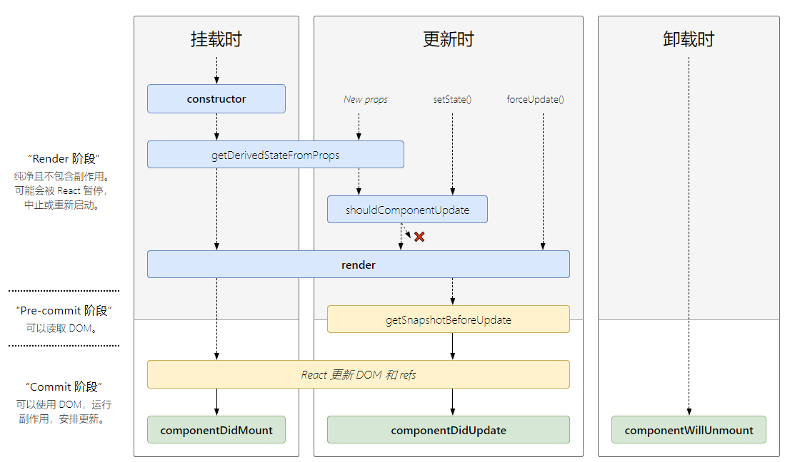
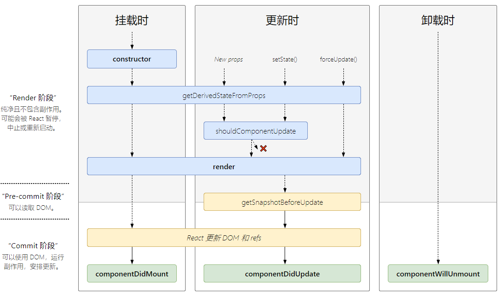

## 1、setState的正确使用。
```js
setState(partialState, callback)
```
1. `partialState` : `object|function` ⽤用于产⽣生与当前 `state` 合并的子集。
2. `callback` : `function state` 更新之后被调⽤用。
 
**注意事项** 
##### 1、不要直接修改 `State`。直接修改 `state`，不会触发组件的重新渲染。
##### 2、 `State` 的更新可能是异步的。出于性能考虑，`React` 可能会把多个 `setState()` 调用合并成一个调用。
```jsx
import React, { Component } from "react";
export default class SetStatePage extends Component {  
constructor(props) {
    super(props);
    this.state = {
        counter: 0;  
    };  
}
changeValue = v => {
    //setState是异步的
    this.setState({      
        counter: this.state.counter + v;    
    });  
    //这个时候获取到的数据还是没有改变之前的数据
    console.log("counter", this.state.counter); 
};
setCounter = () => {    
    this.changeValue(1);   
    //this.changeValue(2);    
    //console.log("counter", this.state.counter);  
};  
render() {    
    const { counter } = this.state;    
    return (      
        <div>        
            <h3>SetStatePage</h3>
            <button onClick={this.setCounter}>{counter}</button>      
        </div>   
    );  
} 
```
想要获取到最新状态值，有3种解决方式。
> 1、在回调中获取状态值。
```js
changeValue = v => {  
    this.setState(
        {      
            counter: this.state.counter + v    
        },
        () => {      
            console.log("counter", this.state.counter);    
        }
    ）
};
```
> 2、使用定时器
```js
setTimeout(() => {  this.setCounter(); }, 0);
```
> 3、在原生时间中修改状态
```jsx
componentDidMount(){  
    document.body.addEventListener('click',     this.changeValue, false) 
}
```
**总结：** `setState`只有在合成事件和生命周期函数中是异步的，在原生事件和 `setTimeout` 中都是同步的，这里的异步其实是批量更新。

##### 3、`state` 的更新会被合并
```jsx
changeValue = v => {    
    this.setState({      
        counter: this.state.counter + v    
    }); 
}; 
setCounter = () => {    
    this.changeValue(1);   
    //只会执行下面的函数 
    this.changeValue(2); 
}; 
```
解决方法,在`setState`中使用函数，将 `state` 作为参数传入。
```jsx
changeValue = v => {    
    this.setState(state => ({ 
        counter: state.counter + v 
    })); 
}; 
setCounter = () => {    
    this.changeValue(1);    
    this.changeValue(2); 
};
```
<!-- ## 2、生命周期 -->
<!-- 下面是 `16.3` 版本的生命周期图谱。

下面是 `16.4` 版本的生命周期图谱
 -->

## 2、HOC-高阶组件
高阶组件是参数为组件，返回值为新组件的函数。
```js
function warpComp(cmp){
  return <cmp {...props}/>
}
```
**注意事项**
+ 不要在 `render` 方法中使用 `HOC`
+ 务必复制静态方法
+  `Refs` 不会被传递
但是可以使用 `refs` 转发。 将 `ref` 自动地通过组件传递到其一子组件。可以使用 `React.forwardRef` 来获取传递给它的 `ref`，然后转发到它渲染的子组件。
```js
const FancyButton = React.forwardRef((props, ref) => (
  <button ref={ref} className="FancyButton">
    {props.children}
  </button>
));
// 你可以直接获取 DOM button 的 ref：
const ref = React.createRef();
<FancyButton ref={ref}>Click me!</FancyButton>;
```
<!-- 
## 5、pureComponent

## 6、hook -->

