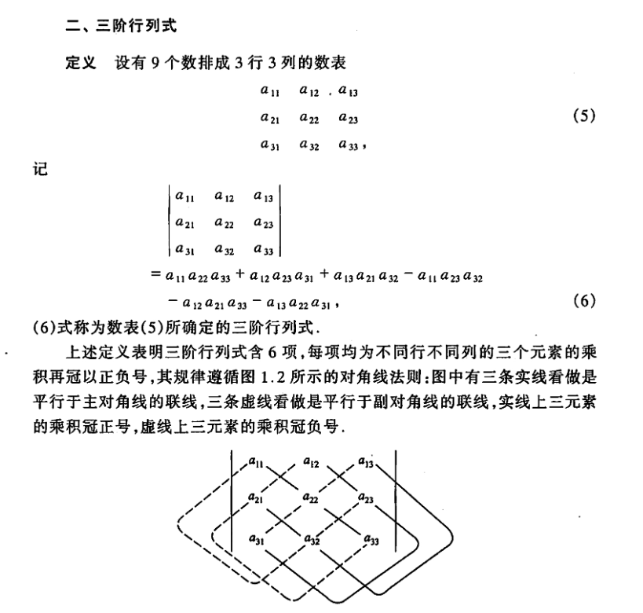

`Matrix`是`threejs`中一个比较重要的类，它主要用来处理三维空间中的变换。里面封装了很多工具函数，下面是一些重要函数的解析。[Matrix官方文档地址](https://threejs.org/docs/index.html?q=matrix#api/zh/math/Matrix4)

## 1、decompose
这个函数 `decompose` 用于将一个 4x4 矩阵分解为平移（`position`）、旋转（`quaternion`）和缩放（`scale`）三个部分。
```js
/**
 * 将矩阵分解为位置、四元数和缩放因子
 *
 * @param {Vector3} position - 接收位置数据的Vector3对象
 * @param {Quaternion} quaternion - 接收四元数数据的Quaternion对象
 * @param {Vector3} scale - 接收缩放因子数据的Vector3对象
 * @returns {Matrix4} 返回当前矩阵对象
 */
decompose( position, quaternion, scale ) {

    const te = this.elements;
    // 获取缩放因子
    let sx = _v1.set( te[ 0 ], te[ 1 ], te[ 2 ] ).length();
    const sy = _v1.set( te[ 4 ], te[ 5 ], te[ 6 ] ).length();
    const sz = _v1.set( te[ 8 ], te[ 9 ], te[ 10 ] ).length();

    // if determine is negative, we need to invert one scale
    const det = this.determinant();
    if ( det < 0 ) sx = - sx;

    position.x = te[ 12 ];
    position.y = te[ 13 ];
    position.z = te[ 14 ];

    // scale the rotation part
    _m1.copy( this );

    const invSX = 1 / sx;
    const invSY = 1 / sy;
    const invSZ = 1 / sz;

    _m1.elements[ 0 ] *= invSX;
    _m1.elements[ 1 ] *= invSX;
    _m1.elements[ 2 ] *= invSX;

    _m1.elements[ 4 ] *= invSY;
    _m1.elements[ 5 ] *= invSY;
    _m1.elements[ 6 ] *= invSY;

    _m1.elements[ 8 ] *= invSZ;
    _m1.elements[ 9 ] *= invSZ;
    _m1.elements[ 10 ] *= invSZ;

    quaternion.setFromRotationMatrix( _m1 );

    scale.x = sx;
    scale.y = sy;
    scale.z = sz;

    return this;

}
```
以下是函数的逐步解析：
#### 1.提取矩阵元素
```js
const te = this.elements;
```
#### 2.获取缩放因子
通过计算矩阵的各个列向量的长度，得到缩放因子
```js
let sx = _v1.set( te[ 0 ], te[ 1 ], te[ 2 ] ).length();
const sy = _v1.set( te[ 4 ], te[ 5 ], te[ 6 ] ).length();
const sz = _v1.set( te[ 8 ], te[ 9 ], te[ 10 ] ).length();
```
#### 3.检查行列式的符号
如果矩阵的行列式是负的，表示这个矩阵包含了一个反射操作。为了保持矩阵的几何意义，需要反转一个缩放因子。
```js
const det = this.determinant();
if ( det < 0 ) sx = - sx;
```

#### 4.提取平移部分
```js
position.x = te[ 12 ];
position.y = te[ 13 ];
position.z = te[ 14 ];
```
#### 5.提取旋转部分
复制矩阵，然后用缩放因子的倒数来缩放旋转部分，以分离出旋转矩阵
```js
_m1.copy( this );

const invSX = 1 / sx;
const invSY = 1 / sy;
const invSZ = 1 / sz;

_m1.elements[ 0 ] *= invSX;
_m1.elements[ 1 ] *= invSX;
_m1.elements[ 2 ] *= invSX;

_m1.elements[ 4 ] *= invSY;
_m1.elements[ 5 ] *= invSY;
_m1.elements[ 6 ] *= invSY;

_m1.elements[ 8 ] *= invSZ;
_m1.elements[ 9 ] *= invSZ;
_m1.elements[ 10 ] *= invSZ;

```
#### 6.提取旋转四元数
将缩放后的矩阵传递给四元数对象，从而提取旋转信息。`setFromRotationMatrix`方法会在`Quaternion`类中进行详解
```js
quaternion.setFromRotationMatrix( _m1 );
```
#### 7.将缩放因子设置到 `scale` 对象中
```js
scale.x = sx;
scale.y = sy;
scale.z = sz;
```
#### 8.返回当前矩阵
```js
return this;
```
## 2、determinant
这个 `determinant` 函数用于计算 `4x4` 矩阵的行列式。行列式是一个标量值，用于描述矩阵的某些属性，如是否可逆和变换的缩放因子。具体来说，行列式为 `0` 表示矩阵不可逆，行列式的符号表示变换的方向性（例如，是否包含反射操作）。
计算 `4x4` 矩阵的行列式的具体方法基于矩阵的分块展开法（`Laplacian expansion`）。这是一个递归的方法，通过计算子矩阵的行列式来求得原始矩阵的行列式。
```js
determinant() {

		const te = this.elements;

		const n11 = te[ 0 ], n12 = te[ 4 ], n13 = te[ 8 ], n14 = te[ 12 ];
		const n21 = te[ 1 ], n22 = te[ 5 ], n23 = te[ 9 ], n24 = te[ 13 ];
		const n31 = te[ 2 ], n32 = te[ 6 ], n33 = te[ 10 ], n34 = te[ 14 ];
		const n41 = te[ 3 ], n42 = te[ 7 ], n43 = te[ 11 ], n44 = te[ 15 ];

		//TODO: make this more efficient
		//( based on http://www.euclideanspace.com/maths/algebra/matrix/functions/inverse/fourD/index.htm )

		return (
			n41 * (
				+ n14 * n23 * n32
				 - n13 * n24 * n32
				 - n14 * n22 * n33
				 + n12 * n24 * n33
				 + n13 * n22 * n34
				 - n12 * n23 * n34
			) +
			n42 * (
				+ n11 * n23 * n34
				 - n11 * n24 * n33
				 + n14 * n21 * n33
				 - n13 * n21 * n34
				 + n13 * n24 * n31
				 - n14 * n23 * n31
			) +
			n43 * (
				+ n11 * n24 * n32
				 - n11 * n22 * n34
				 - n14 * n21 * n32
				 + n12 * n21 * n34
				 + n14 * n22 * n31
				 - n12 * n24 * n31
			) +
			n44 * (
				- n13 * n22 * n31
				 - n11 * n23 * n32
				 + n11 * n22 * n33
				 + n13 * n21 * n32
				 - n12 * n21 * n33
				 + n12 * n23 * n31
			)

		);

	}
```
下面是这个函数的详细解析：
下面是三阶行列式的计算公式<br>
<br>

#### 1.提取矩阵元素
```js
const te = this.elements;

const n11 = te[ 0 ], n12 = te[ 4 ], n13 = te[ 8 ], n14 = te[ 12 ];
const n21 = te[ 1 ], n22 = te[ 5 ], n23 = te[ 9 ], n24 = te[ 13 ];
const n31 = te[ 2 ], n32 = te[ 6 ], n33 = te[ 10 ], n34 = te[ 14 ];
const n41 = te[ 3 ], n42 = te[ 7 ], n43 = te[ 11 ], n44 = te[ 15 ];

```
#### 2.行列式的计算公式
```js
return (
    n41 * (
        + n14 * n23 * n32
        - n13 * n24 * n32
        - n14 * n22 * n33
        + n12 * n24 * n33
        + n13 * n22 * n34
        - n12 * n23 * n34
    ) +
    n42 * (
        + n11 * n23 * n34
        - n11 * n24 * n33
        + n14 * n21 * n33
        - n13 * n21 * n34
        + n13 * n24 * n31
        - n14 * n23 * n31
    ) +
    n43 * (
        + n11 * n24 * n32
        - n11 * n22 * n34
        - n14 * n21 * n32
        + n12 * n21 * n34
        + n14 * n22 * n31
        - n12 * n24 * n31
    ) +
    n44 * (
        - n13 * n22 * n31
        - n11 * n23 * n32
        + n11 * n22 * n33
        + n13 * n21 * n32
        - n12 * n21 * n33
        + n12 * n23 * n31
    )
);

```
#### 3.分块展开法
也称为拉普拉斯展开，公式通过对矩阵的第`4`行进行展开（`Laplacian expansion`）,并计算每个子矩阵的`3x3`行列式。每个子矩阵由删除当前元素所在的行和列后形成。例如，对于 `n41` 元素，其余子矩阵（余子式）的行列式计算如下：
```js
n41 * (
    + n14 * n23 * n32
    - n13 * n24 * n32
    - n14 * n22 * n33
    + n12 * n24 * n33
    + n13 * n22 * n34
    - n12 * n23 * n34
)

```
#### 4.符号交替
`Laplacian expansion`的每项前面都有一个符号，符号交替来自公式本身
```js
n41 * (...) +
n42 * (...) +
n43 * (...) +
n44 * (...)

```
## 3、compose
将位置、四元数和缩放值组合成一个变换矩阵
```js
/**
 * 将位置、四元数和缩放值组合成一个变换矩阵
 *
 * @param position 位置向量
 * @param quaternion 四元数
 * @param scale 缩放向量
 * @returns 返回当前对象
 */
compose( position, quaternion, scale ) {
    const te = this.elements;

    const x = quaternion._x, y = quaternion._y, z = quaternion._z, w = quaternion._w;
    const x2 = x + x,	y2 = y + y, z2 = z + z;
    const xx = x * x2, xy = x * y2, xz = x * z2;
    const yy = y * y2, yz = y * z2, zz = z * z2;
    const wx = w * x2, wy = w * y2, wz = w * z2;

    const sx = scale.x, sy = scale.y, sz = scale.z;

    te[ 0 ] = ( 1 - ( yy + zz ) ) * sx;
    te[ 1 ] = ( xy + wz ) * sx;
    te[ 2 ] = ( xz - wy ) * sx;
    te[ 3 ] = 0;

    te[ 4 ] = ( xy - wz ) * sy;
    te[ 5 ] = ( 1 - ( xx + zz ) ) * sy;
    te[ 6 ] = ( yz + wx ) * sy;
    te[ 7 ] = 0;

    te[ 8 ] = ( xz + wy ) * sz;
    te[ 9 ] = ( yz - wx ) * sz;
    te[ 10 ] = ( 1 - ( xx + yy ) ) * sz;
    te[ 11 ] = 0;

    te[ 12 ] = position.x;
    te[ 13 ] = position.y;
    te[ 14 ] = position.z;
    te[ 15 ] = 1;

    return this;

}
```
## 4、makeRotationFromQuaternion
```js
makeRotationFromQuaternion( q ) {
    return this.compose( _zero, q, _one );
}
```
## 5、makeRotationFromEuler
```js
/**
 * 从欧拉角生成旋转矩阵
 *
 * @param euler 包含欧拉角的对象，包含x、y、z三个属性，表示绕X、Y、Z轴的旋转角度（以弧度为单位）
 * @param euler.x 绕X轴的旋转角度（以弧度为单位）
 * @param euler.y 绕Y轴的旋转角度（以弧度为单位）
 * @param euler.z 绕Z轴的旋转角度（以弧度为单位）
 * @param euler.order 欧拉角的旋转顺序，可选值有'XYZ'、'YXZ'、'ZXY'、'ZYX'、'YZX'、'XZY'
 * @returns 当前的对象（包含旋转后的元素）
 */
makeRotationFromEuler( euler ) {

    const te = this.elements;

    const x = euler.x, y = euler.y, z = euler.z;
    const a = Math.cos( x ), b = Math.sin( x );
    const c = Math.cos( y ), d = Math.sin( y );
    const e = Math.cos( z ), f = Math.sin( z );

    if ( euler.order === 'XYZ' ) {

        const ae = a * e, af = a * f, be = b * e, bf = b * f;

        te[ 0 ] = c * e;
        te[ 4 ] = - c * f;
        te[ 8 ] = d;

        te[ 1 ] = af + be * d;
        te[ 5 ] = ae - bf * d;
        te[ 9 ] = - b * c;

        te[ 2 ] = bf - ae * d;
        te[ 6 ] = be + af * d;
        te[ 10 ] = a * c;

    } else if ( euler.order === 'YXZ' ) {

        const ce = c * e, cf = c * f, de = d * e, df = d * f;

        te[ 0 ] = ce + df * b;
        te[ 4 ] = de * b - cf;
        te[ 8 ] = a * d;

        te[ 1 ] = a * f;
        te[ 5 ] = a * e;
        te[ 9 ] = - b;

        te[ 2 ] = cf * b - de;
        te[ 6 ] = df + ce * b;
        te[ 10 ] = a * c;

    } else if ( euler.order === 'ZXY' ) {

        const ce = c * e, cf = c * f, de = d * e, df = d * f;

        te[ 0 ] = ce - df * b;
        te[ 4 ] = - a * f;
        te[ 8 ] = de + cf * b;

        te[ 1 ] = cf + de * b;
        te[ 5 ] = a * e;
        te[ 9 ] = df - ce * b;

        te[ 2 ] = - a * d;
        te[ 6 ] = b;
        te[ 10 ] = a * c;

    } else if ( euler.order === 'ZYX' ) {

        const ae = a * e, af = a * f, be = b * e, bf = b * f;

        te[ 0 ] = c * e;
        te[ 4 ] = be * d - af;
        te[ 8 ] = ae * d + bf;

        te[ 1 ] = c * f;
        te[ 5 ] = bf * d + ae;
        te[ 9 ] = af * d - be;

        te[ 2 ] = - d;
        te[ 6 ] = b * c;
        te[ 10 ] = a * c;

    } else if ( euler.order === 'YZX' ) {

        const ac = a * c, ad = a * d, bc = b * c, bd = b * d;

        te[ 0 ] = c * e;
        te[ 4 ] = bd - ac * f;
        te[ 8 ] = bc * f + ad;

        te[ 1 ] = f;
        te[ 5 ] = a * e;
        te[ 9 ] = - b * e;

        te[ 2 ] = - d * e;
        te[ 6 ] = ad * f + bc;
        te[ 10 ] = ac - bd * f;

    } else if ( euler.order === 'XZY' ) {

        const ac = a * c, ad = a * d, bc = b * c, bd = b * d;

        te[ 0 ] = c * e;
        te[ 4 ] = - f;
        te[ 8 ] = d * e;

        te[ 1 ] = ac * f + bd;
        te[ 5 ] = a * e;
        te[ 9 ] = ad * f - bc;

        te[ 2 ] = bc * f - ad;
        te[ 6 ] = b * e;
        te[ 10 ] = bd * f + ac;

    }

    // bottom row
    te[ 3 ] = 0;
    te[ 7 ] = 0;
    te[ 11 ] = 0;

    // last column
    te[ 12 ] = 0;
    te[ 13 ] = 0;
    te[ 14 ] = 0;
    te[ 15 ] = 1;

    return this;

}
```

<Valine></Valine>