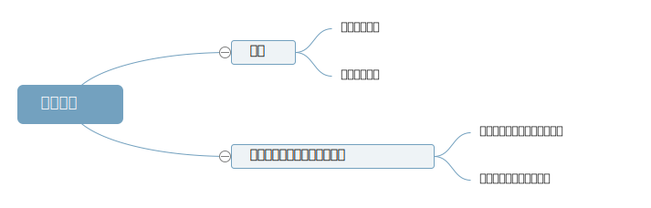
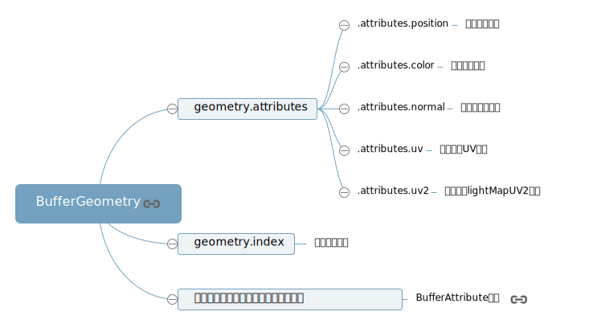
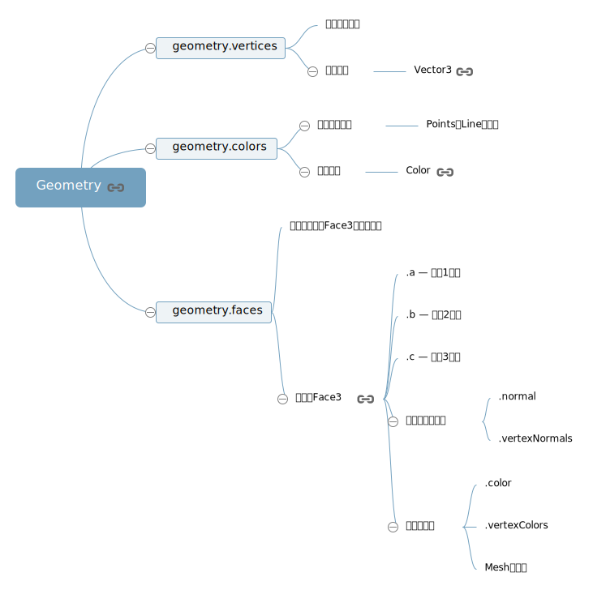
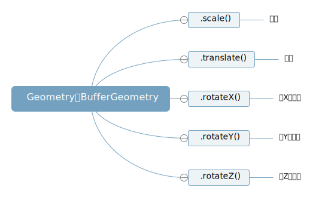

## 1、顶点



## 2、API使用总结
```js
// 访问几何体顶点位置数据
BufferGeometry.attributes.position
// 访问几何体顶点颜色数据
BufferGeometry.attributes.color
// 访问几何体顶点法向量数据
BufferGeometry.attributes.normal
```

## 3、BufferGeometry 总结



### 1、BufferGeometry设置顶点数据
```js
 var geometry = new THREE.BufferGeometry(); //创建一个Buffer类型几何体对象
//类型数组创建顶点数据
var vertices = new Float32Array([
    0, 0, 0, //顶点1坐标
    50, 0, 0, //顶点2坐标
    0, 100, 0, //顶点3坐标
    0, 0, 10, //顶点4坐标
    0, 0, 100, //顶点5坐标
    50, 0, 10, //顶点6坐标
]);
// 创建属性缓冲区对象
var attribue = new THREE.BufferAttribute(vertices, 3); //3个为一组，表示一个顶点的xyz坐标
// 设置几何体attributes属性的位置属性
geometry.attributes.position = attribue;
```

## 4、Geometry和BufferGeometry的区别


几何体`Geometry`和缓冲类型几何体 `BufferGeometry` 表达的含义相同，只是对象的结构不同，`Threejs` 渲染的时候会先把 `Geometry` 转化为`BufferGeometry` 再解析几何体顶点数据进行渲染。

### 1、Geometry设置顶点数据
几何体`Geometry` 的顶点位置属性 `geometry.vertices` 和缓冲类型几何体 `BufferGeometry` 顶点位置属性 `BufferGeometry.attributes.position`是对应的。
```js
var geometry = new THREE.Geometry(); //声明一个几何体对象Geometry
var p1 = new THREE.Vector3(50, 0, 0); //顶点1坐标
var p2 = new THREE.Vector3(0, 70, 0); //顶点2坐标
var p3 = new THREE.Vector3(80, 70, 0); //顶点3坐标
//顶点坐标添加到geometry对象
geometry.vertices.push(p1, p2, p3);
```

### 2、Geometry设置顶点颜色数据

几何体 `Geometry`的顶点颜色属性 `geometry.colors`和缓冲类型几何体`BufferGeometry`顶点颜色属性`BufferGeometry.attributes.color`是对应的。
```js
var geometry = new THREE.Geometry(); //声明一个几何体对象Geometry
// Color对象表示顶点颜色数据
var color1 = new THREE.Color(0x00ff00); //顶点1颜色——绿色
var color2 = new THREE.Color(0xff0000); //顶点2颜色——红色
var color3 = new THREE.Color(0x0000ff); //顶点3颜色——蓝色
//顶点颜色数据添加到geometry对象
geometry.colors.push(color1, color2, color3);
```
**注意:** 设置几何体`Geometry`顶点颜色属性`geometry.colors`，对网格模型`Mesh`是无效的，对于点模型`Points`、线模型`Line`是有效果。
```js
 // 点渲染模式  点模型对象Points
var points = new THREE.Points(geometry, material); //点模型对象
scene.add(points); //点对象添加到场景
```
### 3、材质属性 vertexColors
**注意:** 使用顶点颜色数据定义模型颜色的时候，要把材质的属性 `vertexColors`设置为 `THREE.VertexColors`,这样顶点的颜色数据才能取代材质颜色属性`.color`起作用。
```js
//材质对象
var material = new THREE.MeshLambertMaterial({
  // color: 0xffff00,
  vertexColors: THREE.VertexColors, //以顶点颜色为准
  side: THREE.DoubleSide, //两面可见
});
```
## 5、几何体旋转、缩放、平移



`BufferGeometry`和几何体 `Geometry` 一样具有 `.scale()、.rotateZ()、.rotateX()` 等几何体变换的方法。
使用`geometry`的一些封装方法进行几何体进行变换，注意本质上都是改变结合体顶点位置坐标数据。网格模型 `Mesh`进行这些变换不会影响几何体的顶点位置坐标，网格模型缩放旋转平移变换改变的是模型的本地矩阵、世界矩阵。


<Valine></Valine>