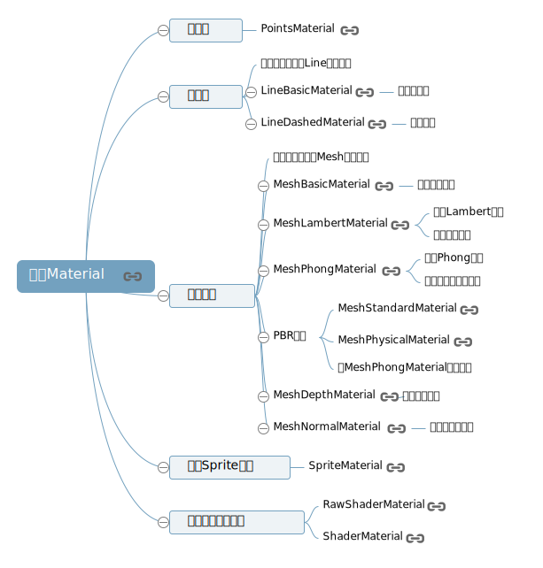

## 1、常用材质介绍



### 1、点材质
```js
var geometry = new THREE.SphereGeometry(100, 25, 25); //创建一个球体几何对象
// 创建一个点材质对象
var material = new THREE.PointsMaterial({
  color: 0x0000ff, //颜色
  size: 3, //点渲染尺寸
});
//点模型对象  参数：几何体  点材质
var point = new THREE.Points(geometry, material);
scene.add(point); //网格模型添加到场景中
```
### 2、线材质
+ 基础线材质LineBasicMaterial。
```js
var geometry = new THREE.SphereGeometry(100, 25, 25);//球体
// 直线基础材质对象
var material = new THREE.LineBasicMaterial({
  color: 0x0000ff
});
var line = new THREE.Line(geometry, material); //线模型对象
scene.add(line); //点模型添加到场景中
```
+ 虚线材质LineDashedMaterial。
```js
// 虚线材质对象：产生虚线效果
var material = new THREE.LineDashedMaterial({
  color: 0x0000ff,
  dashSize: 10,//显示线段的大小。默认为3。
  gapSize: 5,//间隙的大小。默认为1
});
var line = new THREE.Line(geometry, material); //线模型对象
//  computeLineDistances方法  计算LineDashedMaterial所需的距离数组
line.computeLineDistances();
```
### 3、网格模型
+ 基础网格材质对象
```js
var material = new THREE.MeshBasicMaterial({
  color: 0x0000ff,
})
```
+ `MeshLambertMaterial` 材质可以实现网格Mesh表面与光源的漫反射光照计算
```js
var material = new THREE.MeshLambertMaterial({
  color: 0x00ff00,
});
```
+ 高光网格材质
```js
var material = new THREE.MeshPhongMaterial({
  color: 0xff0000,
  specular:0x444444,//高光部分的颜色
  shininess:20,//高光部分的亮度，默认30
});
```
## 2、材质和模型对象对应关系
<embed src="../../images/threejs/threejs25材质和模型对应关系.svg">

## 3、材质基本属性介绍
```js
    var material = new THREE.MeshBasicMaterial({
      // 使用顶点颜色数据渲染模型，不需要再定义color属性
      // color: 0xff0000,
      side:THREE.DoubleSide, //双面可见
      vertexColors: THREE.VertexColors, //以顶点颜色为准
    });
```
`color`和`vertexColors` 只能2选其一
