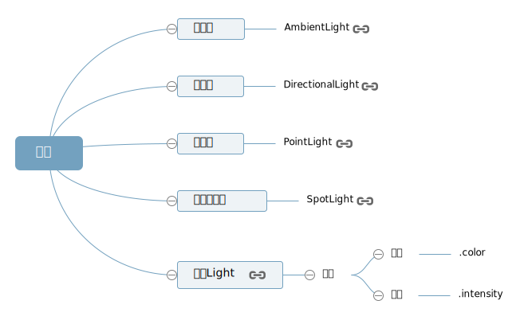

## 1、常见光源类型



### 1、环境光
环境光是没有特定方向的光源，主要是均匀整体改变Threejs物体表面的明暗效果
```js
//环境光:环境光颜色RGB成分分别和物体材质颜色RGB成分分别相乘
var ambient = new THREE.AmbientLight(0x444444);
scene.add(ambient);//环境光对象添加到scene场景中
```
### 2、点光源
点光源就像生活中的白炽灯，光线沿着发光核心向外发散，同一平面的不同位置与点光源光线入射角是不同的，点光源照射下，同一个平面不同区域是呈现出不同的明暗效果。
```js
//点光源
var point = new THREE.PointLight(0xffffff);
//设置点光源位置，改变光源的位置
point.position.set(400, 200, 300);
scene.add(point);
```

### 3、平行光
平行光如果不设置`.position`和 `.target`属性，光线默认从上往下照射，也就是可以认为`(0,1,0)`和`(0,0,0)`两个坐标确定的光线方向。平行光你可以理解为太阳光，从无限远处照射过来。
```js
// 平行光
var directionalLight = new THREE.DirectionalLight(0xffffff, 1);
// 设置光源的方向：通过光源position属性和目标指向对象的position属性计算
directionalLight.position.set(80, 100, 50);
// 方向光指向对象网格模型mesh2，可以不设置，默认的位置是0,0,0
directionalLight.target = mesh2;
scene.add(directionalLight);
```

### 4、聚光源
是一个沿着特定方会逐渐发散的光源，照射范围在三维空间中构成一个圆锥体。
```js
// 聚光光源
var spotLight = new THREE.SpotLight(0xffffff);
// 设置聚光光源位置
spotLight.position.set(200, 200, 200);
// 聚光灯光源指向网格模型mesh2
spotLight.target = mesh2;
// 设置聚光光源发散角度
spotLight.angle = Math.PI / 6
scene.add(spotLight);//光对象添加到scene场景中
```
## 2、光照阴影实时计算
### 1、平行光投影计算代码
物体投影模拟计算主要设置三部分，一个是设置产生投影的模型对象，一个是设置接收投影效果的模型，最后一个是光源对象本身的设置，光源如何产生投影。
### 2、模型.castShadow属性
`.castShadow` 属性值是布尔值，默认 `false`，用来设置一个模型对象是否在光照下产生投影效果。

### 3、.receiveShadow属性
`.receiveShadow` 属性值是布尔值，默认 `false`，用来设置一个模型对象是否在光照下接受其它模型的投影效果。
### 4、光源.castShadow属性
如果属性设置为 `true`， 光源将投射动态阴影。设置用于计算阴影的光源对象。
### 5、光源.shadow属性
```js
// 聚光源设置
spotLight.shadow.camera.near = 1;
spotLight.shadow.camera.far = 300;
spotLight.shadow.camera.fov = 20;
```

<Valine></Valine>