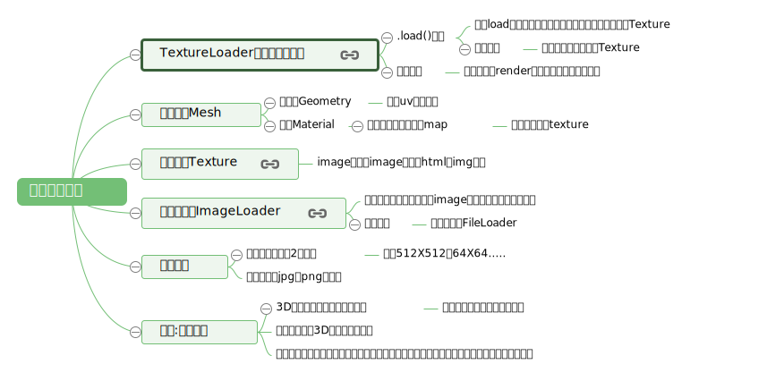
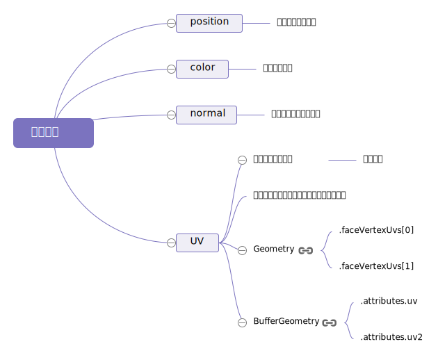

## 1、纹理贴图



## 2、几何体顶点纹理坐标




## 3.纹理的内存管理
纹理往往是three.js应用中使用内存最多的部分。重要的是要明白，一般来说，纹理会占用 宽度 * 高度 * 4 * 1.33 字节的内存。

假如图片的尺寸大小为 200*100像素，那么它占用的内存是：200 * 100 * 4 * 1.33。跟它实际的文件大小无关，文件大小小，下载速度快，尺寸小，占用的内存就小。
+ JPG vs PNG
JPG有损压缩，PNG有无损压缩，所以PNG的下载速度一般比较慢。但是，PNG支持透明度。PNG可能也适合作为非图像数据（non-image data）的格式，比如法线图，以及其他种类的非图像图。在WebGL中JPG使用的内存并不比PNG少。

## 4.光照
+ 环境光 AmbientLight
环境光对模型的影响：环境光 （AmbientLight）只是简单地将材质的颜色与光照颜色进行叠加（PhotoShop 里的正片叠底模式），再乘以光照强度。没有方向，无法产生阴影，场景内任何一点受到的光照强度都是相同的，除了改变场景内所有物体的颜色以外，不会使物体产生明暗的变化。
```js
color = materialColor * light.color * light.intensity;
```
+ 半球光 HemisphereLight
半球光（HemisphereLight）的颜色是从天空到地面两个颜色之间的渐变，与物体材质的颜色作叠加后得到最终的颜色效果。一个点受到的光照颜色是由所在平面的朝向（法向量）决定的 —— 面向正上方就受到天空的光照颜色，面向正下方就受到地面的光照颜色，其他角度则是两个颜色渐变区间的颜色。

+ 方向光 DirectionalLight
方向光（DirectionalLight）的方向是从它的位置照向目标点的位置。
```js
const color = 0xFFFFFF;
const intensity = 1;
const light = new THREE.DirectionalLight(color, intensity);
light.position.set(0, 10, 0);
light.target.position.set(-5, 0, 0);
scene.add(light);
scene.add(light.target);
```

**需要注意**，每添加一个光源到场景中，都会降低 three.js 渲染场景的速度，所以应该尽量使用最少的资源来实现想要的效果。


<Valine></Valine>