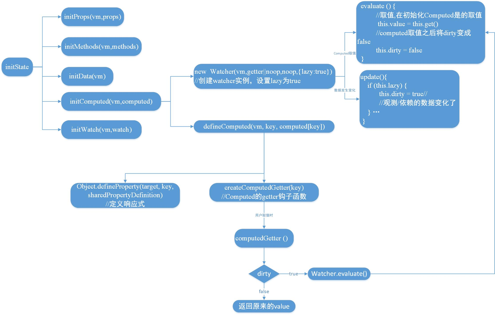
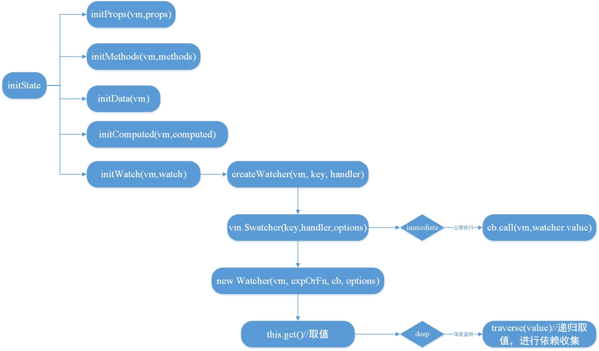

## 1、computed
+ 1、`computed` 是计算属性,也就是计算值,它更多用于**计算值的场景**。
+ 2、`computed` **具有缓存性**,`computed` 的值在 `getter` 执行后是会缓存的，只有在它依赖的属性值改变之后，下一次获取 `computed` 的值时才会重新调用对应的 `getter` 来计算。每当触发重新渲染时，`调用方法`将总会再次执行函数。如果计算属性依赖的值没有变化，计算属性会立即返回之前的计算结果，而不必再次执行函数。
+ 3、`computed` 适用于计算**比较消耗性能**的计算场景。

#### `Computed` 初始化时的流程图如下：

**`computed` 的源码解析如下：**
+ 1、在 `computed` 初始化的过程中会创建一个 `watcher` 并设置`lazy=true`,所以在初始化时会求值，在页面中调用 `computed` 时，开始求值，调用 `watcher.evaluate()`方法,并将 `dirty=false`。
+ 2、当 `computed`依赖的属性发生改变时，会调用  `watcher.update()` 方法，将`dirty=true`。
+ 3、当在页面中再次获取该属性时，如果`dirty`为 `true`,调用 `watcher.evaluate()` 方法，否则返回原来计算的值。这就是`computed` 为什么具有缓存效果的原因。

## 2、watch

+ 1、更多的是**观察**的作用,类似于某些数据的监听回调,用于观察 `props $emit` 或者本组件的值,当数据变化时来执行回调进行后续操作。
+ 2、**无缓存性**，页面重新渲染时值不变化也会执行
+ 3、当需要在数据变化时执行异步或开销较大的操作时，这个方式是最有用的。
+ 4、当我们需要深度监听对象中的属性时，可以打开 `deep：true` 选项，这样便会对对象中的每一项进行监听。这样会带来性能问题，优化的话可以使用字符串形式监听，如果没有写到组件中，不要忘记使用 `unWatch` 手动注销哦。    
+ 5、语境上的差异  
`watch` 适合一个值影响多个值的情形。`computed` 适合多个值影响一个值的情形。

**`watch` 初始化时的流程图如下**：

 

#### `watch` 的源码解析如下：
+ 在 `watch` 初始化测过程中，会创建一个 `watcher`,并添加 `user` 属性，证明这是一个用户添加的 `watcher`。
+ 当用户为 `watch`添加`immediate`属性且值为`true`时，会立刻执行 `watch`里面定义的`handler`，在这里要**注意**，如果监听的对象或属性是来自`props`，那么它的值是 `props`的默认值。
+ 当用户为 `watch` 添加 `deep` 属性时，会调用 `traverse(value)` 方法，这个方法本质上是递归监听的对象，在递归的过程中会取值触发 `getter`钩子，给对象中的属性添加依赖。属性依赖的 `watcher`，跟对象的 `watcher`是同一个，因此在对象的属性发生变化时，也会触发更新，调用`Watch`类的`run`方法,在`run中`执行 ` this.cb.call(this.vm, value, oldValue)`，来调用`watch`中的`handler`。

**小结:** 
当我们要进行数值计算,而且依赖于其他数据，那么把这个数据设计为 `computed`。 
如果你需要在某个数据变化时做一些事情，使用 `watch`来观察这个数据变化。