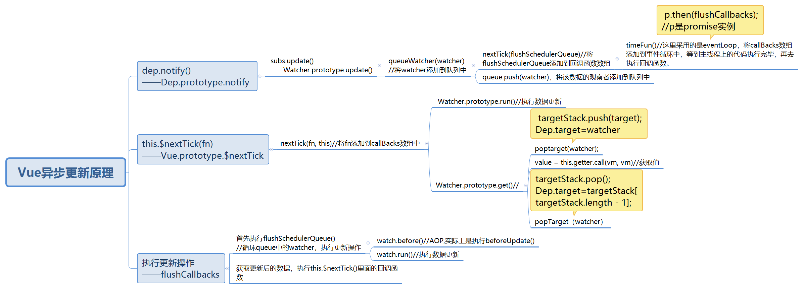

源码如下所示,源码里主要是这 `nextTick、timeFun、flushCallbacks` 三个函数。 
```javascript
let pending=false;
let callBacks=[];//存放的是回调函数，存放的第一个回调函数是数据更新的回调函数
//调用this.$nextTick时执行的函数
function nextTick (cb, ctx) {
    var _resolve;
    callbacks.push(function () {
      if (cb) {
        try {
          cb.call(ctx);
        } catch (e) {
          handleError(e, ctx, 'nextTick');
        }
      } else if (_resolve) {
        _resolve(ctx);
      }
    });
    //在数据首次修改时，pending为false，修改后，pending变成true
    if (!pending) {
      pending = true;
      //在这里用到了事件循环
      timerFunc();
    }
    // $flow-disable-line
    if (!cb && typeof Promise !== 'undefined') {
      return new Promise(function (resolve) {
        _resolve = resolve;
      })
    }
}
//定义eventLoop函数
let timeFunc=null;
if (typeof Promise !== 'undefined' && isNative(Promise)) {
    var p = Promise.resolve();
    timerFunc = function () {
      p.then(flushCallbacks);
    
      if (isIOS) { setTimeout(noop); }
    };
    isUsingMicroTask = true;
  } else if (!isIE && typeof MutationObserver !== 'undefined' && (
    isNative(MutationObserver) ||
    // PhantomJS and iOS 7.x
    MutationObserver.toString() === '[object MutationObserverConstructor]'
  )) {
    var counter = 1;
    var observer = new MutationObserver(flushCallbacks);
    var textNode = document.createTextNode(String(counter));
    observer.observe(textNode, {
      characterData: true
    });
    timerFunc = function () {
      counter = (counter + 1) % 2;
      textNode.data = String(counter);
    };
    isUsingMicroTask = true;
  } else if (typeof setImmediate !== 'undefined' && isNative(setImmediate)) {
    timerFunc = function () {
      setImmediate(flushCallbacks);
    };
  } else {
    // Fallback to setTimeout.
    timerFunc = function () {
      setTimeout(flushCallbacks, 0);
    };
}
//清空事件队列中的回调函数，第一个回调函数是flushSchedulerQueue ()
function flushCallbacks () {
    pending = false;
    var copies = callbacks.slice(0);
    callbacks.length = 0;
    for (var i = 0; i < copies.length; i++) {
        copies[i]();
    }
}
//flushSchedulerQueue的核心代码，执行数据更新操作
function flushSchedulerQueue () {
    currentFlushTimestamp = getNow();
    flushing = true;
    var watcher, id;
    queue.sort(function (a, b) { return a.id - b.id; });
    for (index = 0; index < queue.length; index++) {
      watcher = queue[index];
      if (watcher.before) {
        //调用beforeUpdate()钩子函数
        watcher.before();
      }
      id = watcher.id;
      has[id] = null;
      //执行更新
      watcher.run();
    }
  }
```
在下次`DOM`更新循环结束之后执行的延迟回调。`nextTick` 主要使用了宏任务和微任务。根据执行环境分别尝试采用
+ `Promise`
+ `MutationObserver`
+ `setImmediate`
+ 如果以上都不行则采用 `setTimeout`

`Vue`的 `nextTick` 的实现原理总结如下
+ `nextTick` 是 `Vue` 提供的一个全局的`API` ，由于`Vue`的异步更新策略导致我们对数据的修改不会立马体现到都没变化上，此时如果想要立即获取更新后的`dom`的状态，就需要使用这个方法。
+ `Vue`在更新`dom`时是异步执行的。只要监听到数据变化，`Vue`将开启一个队列，并缓冲在同一事件循环中发生的所有数据变更。如果同一个`watcher`被多次触发，只会被推入到队列中一次。这种在缓存时去重对于避免不必要的计算和dom操作是非常重要的。`nextTick`方法会在队列中加入一个回调函数，确保该函数在前面的dom操作完成后才调用。
用一张图可以很好的描述下这个过程。

