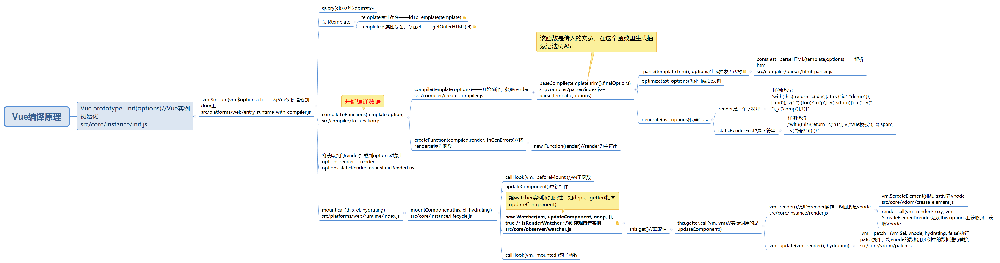

`Vue` 的编译过程内部是比较复杂的，牵涉到虚拟 `dom` , 还牵涉到 `patch`算法。`Vue`的编译过程可以用下面的一张图来表达。

编译的整个流程如下所示：
+ 获取 `template`
    + template属性存在——`idToTemplate(template)`
    ```js
    const idToTemplate = cached(id => {
        const el = query(id)
        return el && el.innerHTML
    })
    ```
    + template不属性存在，存在el—— getOuterHTML(el)
    ```js
    function getOuterHTML (el: Element): string {
        if (el.outerHTML) {
            return el.outerHTML
        } else {
            const container = document.createElement('div')
            container.appendChild(el.cloneNode(true))
            return container.innerHTML
        }
    }
    ```
+ 根据 `template` 开始编译数据。`compileToFunctions(template,option)`
+ 根据 `template` 生成 抽象语法树 `ast`。
+ 对 `ast` 做静态标记。
+ 将 `ast` 生成代码。包括（render和staticRenderFns属性，两者都是字符串）。
```js
//render
"with(this){
    return _c('div',{attrs:{"id":"demo"}},[_m(0),_v(" "),(foo)?_c('p',[_v(_s(foo))]):_e(),_v(" "),_c('comp')],1)
}"
```
+ 将 `render`和 `staticRenderFns` 转换为函数。`new Function(render)`;
+ 将 `render`和 `staticRenderFns` 添加到 `vm.options` 上。
+ `mount.call(this, el, hydrating)` 开始编译
+ `mountComponent(this, el, hydrating）` 编译组件
+ `new Watcher(vm, updateComponent, noop, {}, true /* isRenderWatcher */)`创建观察者实例
+ `updateComponent()` 更新组件。
+  进行 `render` 操作，返回的是 `vnode`。`vm._render()<——vm.$createElement()(根据`ast` 创建 `vnode`)` 。
+  执行更新操作。`vm._update(vm._render(), hydrating)`。
+ 将 `vnode`替换成真实数据。执行 `patch` 操作  `vm.__patch__(vm.$el, vnode, hydrating, false)`。
建议可以自己跑一遍源码。能更好的理解编译过程。
整体大概的流程可以用如下代码展示：
```js
new Vue() => $mount() => vm._render()
=> createElement() => createComponent()
=> vm._update() => patch() => createElm()
=> createComponent()
```