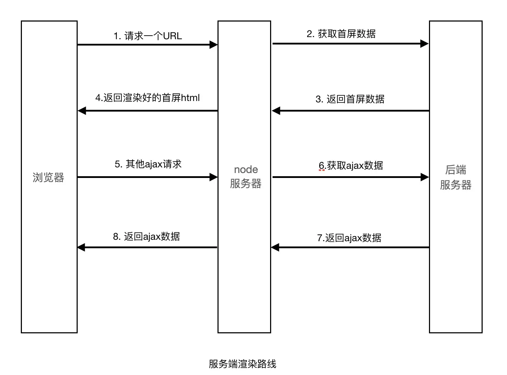
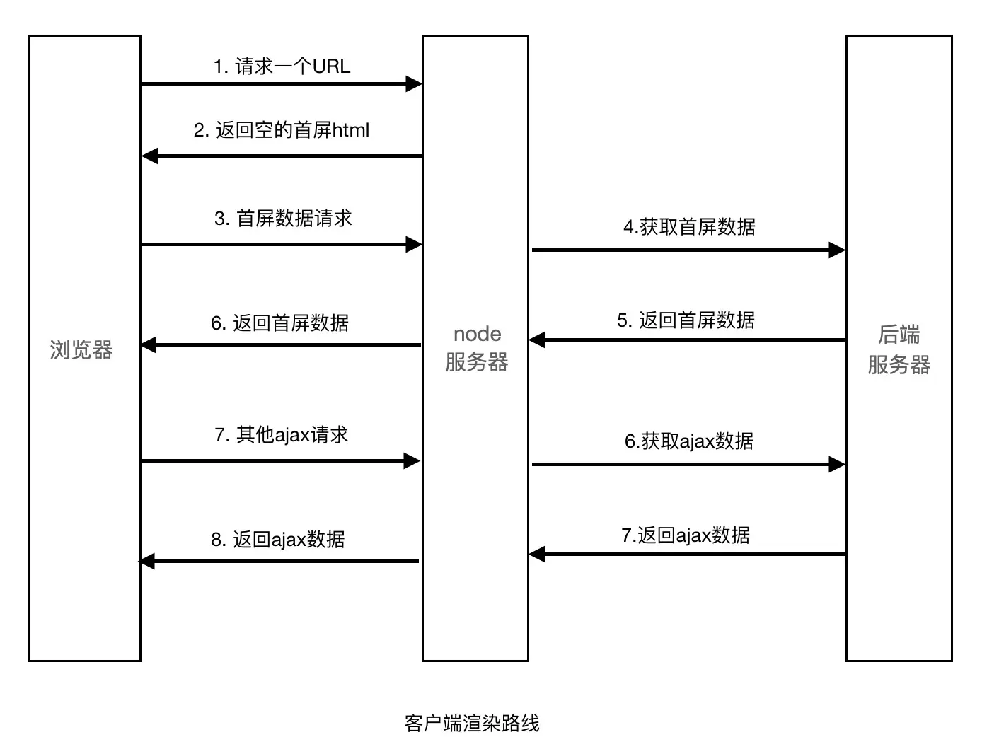
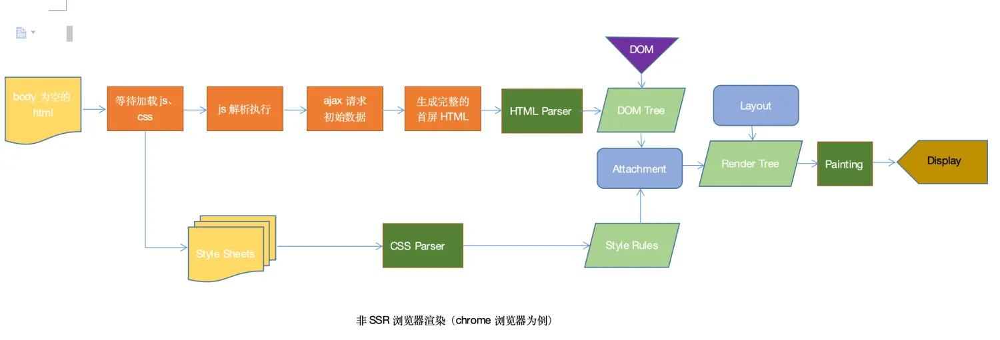
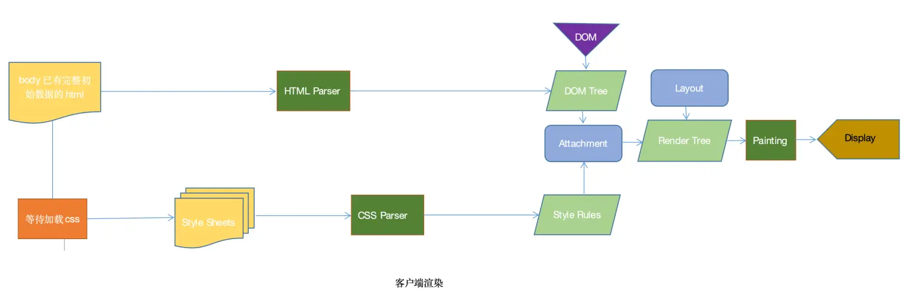

## 1、什么是服务端渲染
将组件或页面通过服务器生成 `html` 字符串，再发送到浏览器，最后将静态标记"混合"为客户端上完全交互的应用程序。

### ssr的优势
+ 更利于 `SEO`。
不同爬虫工作原理类似，只会爬取源码，不会执行网站的任何脚本（ `Google` 除外，据说 `Googlebot` 可以运行 `javaScript` ）。使用了 `React` 或者其它 `MVVM` 框架之后，页面大多数 `DOM` 元素都是在客户端根据js动态生成，可供爬虫抓取分析的内容大大减少(如图一)。另外，浏览器爬虫不会等待我们的数据完成之后再去抓取我们的页面数据。服务端渲染返回给客户端的是已经获取了异步数据并执行 `JavaScript` 脚本的最终 `HTML`，网络爬中就可以抓取到完整页面的信息。
+ 共用前端代码，节省开发时间

+ 更利于首屏渲染
首屏的渲染是 `node` 发送过来的 `html` 字符串，并不依赖于 `js` 文件了，这就会使用户更快的看到页面的内容。尤其是针对大型单页应用，打包后文件体积比较大，普通客户端渲染加载所有所需文件时间较长，首页就会有一个很长的白屏等待时间。

### ssr的局限

+ 服务端压力较大
本来是通过客户端完成渲染，现在统一到服务端 `node` 服务去做。尤其是高并发访问的情况，会大量占用服务端 `CPU` 资源；

+ 开发条件受限
在服务端渲染中，`created` 和 `beforeCreate` 之外的生命周期钩子不可用，因此项目引用的第三方的库也不可用其它生命周期钩子，这对引用库的选择产生了很大的限制；

+ 学习成本相对较高
除了对 `webpack、Vue` 要熟悉，还需要掌握 `node、Koa2` 等相关技术。相对于客户端渲染，项目构建、部署过程更加复杂。

## 2、耗时比较
+ 数据请求
由服务端请求首屏数据，而不是客户端请求首屏数据，这是“快”的一个主要原因。服务端在内网进行请求，数据响应速度快。客户端在不同网络环境进行数据请求，且外网http请求开销大，导致时间差。 下图为服务端渲染的数据请求路线和客户端渲染的数据请求路线图。

服务端渲染路线

客户端渲染路线

+ `html` 渲染
服务端渲染是先向后端服务器请求数据，然后生成完整首屏 `html` 返回给浏览器；而客户端渲染是等 `js` 代码下载、加载、解析完成后再请求数据渲染，等待的过程页面是什么都没有的，就是用户看到的白屏。就是服务端渲染不需要等待 `js` 代码下载完成并请求数据，就可以返回一个已有完整数据的首屏页面。

客户端渲染

服务端渲染

## 3、服务端渲染的使用场景
内容丰富，复杂交互的动态网页，对首屏加载有要求的项目，对 `seo` 有要求的项目（因为服务端第一次渲染的时候，已经把关键字和标题渲染到响应的 `html` 中了，爬虫能够抓取到此静态内容，因此更利于 `seo`）。此方式一些适合的项目：活动模板，新闻通知类，博客系统，混合开发等等。
