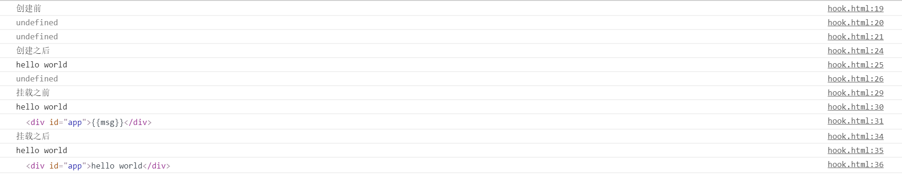
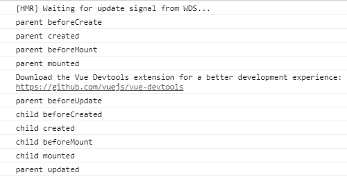
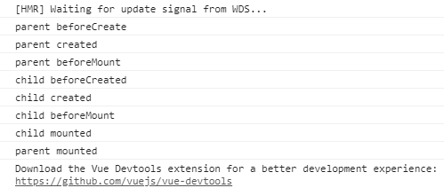

**&#8195;&#8195;钩子函数的运行情况，及各钩子函数的意义如下**
```HTML
<!DOCTYPE html>
<html lang="en">
<head>
    <meta charset="UTF-8">
    <meta name="viewport" content="width=device-width, initial-scale=1.0">
    <meta http-equiv="X-UA-Compatible" content="ie=edge">
    <title>Document</title>
</head>
<script type="text/javascript" src="https://cdn.jsdelivr.net/vue/2.1.3/vue.js"></script>
<body>
    <div id="app">{{msg}}</div>
    <script>
        var vm = new Vue({
            el: '#app',
            data: {
                msg: 'hello world',
            },
            beforeCreate: function() {
                console.log('创建前');
                console.log(this.msg);
                console.log(this.$el);
            },
            created: function() {
                console.log('创建之后');
                console.log(this.msg);
                console.log(this.$el);
            },
            beforeMount: function() {
                console.log('挂载之前');
                console.log(this.msg);
                console.log(this.$el);
            },
            mounted: function() {
                console.log('挂载之后');
                console.log(this.msg);
                console.log(this.$el);
            },
            beforeUpdate: function() {
                console.log('更新之前');
                console.log(this.msg);
                console.log(this.$el);
            },
            updated: function() {
                console.log('更新完成');
                console.log(this.msg);
                console.log(this.$el);
            },
            beforeDestroy: function() {
                console.log('组件销毁之前');
                console.log(this.a);
                console.log(this.$el);
            },
            destroyed: function() {
                console.log('组件销毁之后');
                console.log(this.msg);
                console.log(this.$el);
            },
        })
    </script>
</body>
</html>
```
此时组件的钩子函数的输出结果如下所示：

<!--  -->

**总结：** 通过对比 `mounted` 和 `beforeMount` 钩子函数的运行前后，我们可以发现他们的区别在于组件是否被编译。即`view` 中的数据是否被编译完成。

​**通过实践发现，组件的不同引用方式，父组件的钩子函数的运行情况也是不一样的。**

#### **1、第一种情况(动态引入)**：直接在components中通过import动态引入。

```javascript     
    //hookParent.vue
<template>
    <div>
        <hook-child/>
    </div>
</template>

<script>
import hookChild from "./hookChild"
export default {
    name:"hookParent",
        data(){
        return{
            show:false
        }
    },
    components:{
        hookChild,//静态引入
        // hookChild:()=>import("./hookChild") //动态引入
    },
    beforeCreate(){
            console.log("parent beforeCreate");
    },
    created(){
        console.log("parent created");
    },
    beforeMount(){
        console.log("parent beforeMount");
    },
    mounted(){
        console.log("parent mounted");
    },
    beforeUpdate(){
            console.log("parent beforeUpdate");
    },
    updated(){
        console.log("parent updated")
    },
        beforeDestroy(){
            console.log("parent beforeDestroy");
    },
    destroyed(){
        console.log("parent destroyed");
    },
        activated(){
            console.log("parent activated");
    },
    deactivated(){
        console.log("parent deactivated")
    },
}
</script>

//hookChild.vue
<template>
    <div>
        <div @click="update">修改msg的值————{{msg}}</div>
        
        <div @click="destroy">销毁子组件</div>
    </div>
</template>

<script>
export default {
    name:"hookChild",
    data(){
        return{
            msg:"ceshi"
        }
    },
    beforeCreate(){
        console.log("child beforeCreated");
    },
    created(){
        console.log("child created");
    },
    beforeMount(){
        console.log("child beforeMount");
    },
    mounted(){
        console.log("child mounted");
    },
    beforeUpdate(){
        console.log("child beforeUpdate");
    },
    updated(){
        console.log("child updated")
    },
    beforeDestroy(){
        console.log("child beforeDestroy");
    },
    destroyed(){
        console.log("child destroyed");
    },
    activated(){
        console.log("child activated");
    },
    deactivated(){
        console.log("child deactivated")
    },
    methods:{
        change(){
            this.msg="修改了";
        },
        destroy(){
            this.$destroy();
        }
    }
}
</script>
```
此时父子组件的钩子函数的输出结果如下所示：


&#8195;&#8195;通过监听钩子函数运行发现，当 `mounted` 钩子函数运行后，才会在界面上显示所挂载的元素。并且**子组件的mounted钩子函数要晚于父组件的mounted钩子函数**，子组件是在父组件的`beforeUpdate`和 `updated` 钩子函数之间加载的。同时也说明组件**动态引入方式子组件是在父组件挂载之后才挂载的**。

#### **2、第二种情况(静态引入)**：import hookChild from "./hookChild。钩子函数的运行情况如下：

<!--  -->

&#8195;&#8195;相对于组件的动态引入方式，组件的静态引入方式的父组件少调用了 `beforeUpdete` 和 `updated` 两个钩子函数。
#### **3、占位符（slot）的功能其实和动态组件的运行情况是一样的**


**总结：**  
1、在销毁父组件时（不管是在子组件中销毁父组件还是直接在父组件中销毁父组件），都会先销毁子组件，然后才会销毁父子键。<br>
2、父子组件中单独更新各自的数据相互不会受影响。就算有影响也是父组件先调用 `beforeUpdate()` 函数，然后子组件调用 `beforeUpdate()` 和 `updated()` 函数，其次才是父组件的 `updated()` 函数。
