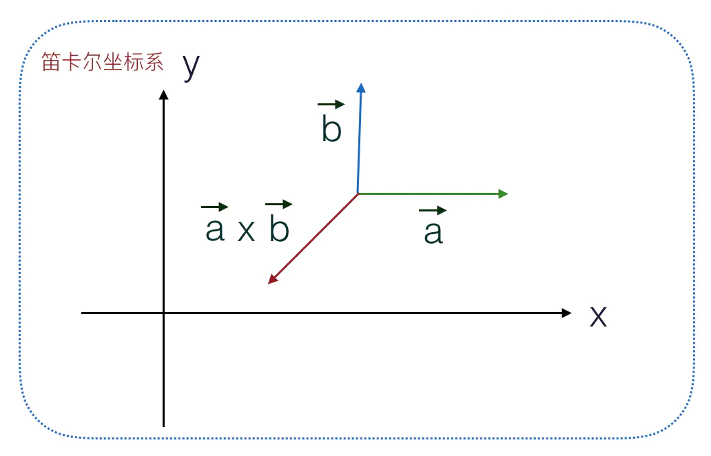

## 1、向量的点乘
向量点乘就是将两个向量的各个分量的乘积相加，返回一个`标量`。


点乘的几何意义是两个向量的模相乘然后再乘以夹角的余弦。


## 2、向量的叉乘

向量叉乘是另一个重要的运算，两个向量叉乘结果是一个新向量，新向量的方向垂直于原来两个向量所在的平面，方向可以通过右手定则来判定，大小等于两个向量模的乘积再乘以向量夹角的正弦值，即向量组成的平行四边形的面积。




向量叉乘的计算可以利用三阶行列式来实现，将两个向量分别作为三阶行列式的行向量，计算出叉乘结果。
```js
[
  1, 1, 1,
  a0,a1,a2,
  b0,b1,b2
]
//利用三阶行列式求叉乘
function cross(a, b) {
  return [
    a[1] * b[2] - a[2] * b[1],
    a[2] * b[0] - a[0] * b[2],
    a[0] * b[1] - a[1] * b[0]
  ];
}
```