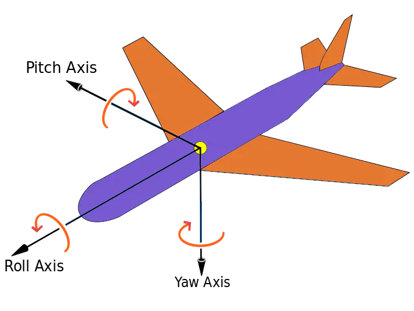
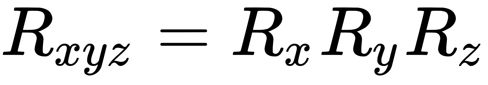
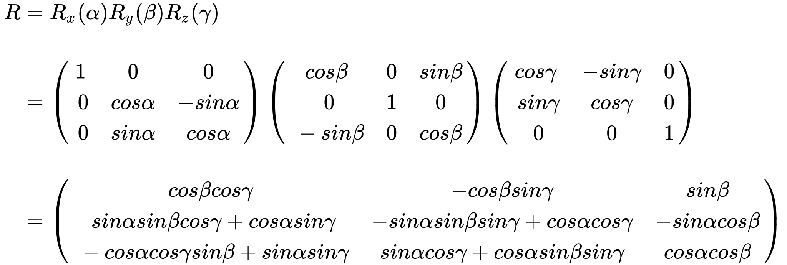

## 1、欧拉角
欧拉角是飞控系统中用于描述飞行器姿态的方式，使用三个角度来表示，分别是`yaw`偏航角、`pitch`俯仰角、`roll` 滚转角。
+ yaw：偏航角，是指飞行器偏离原来航线的角度。
+ pitch：俯仰角，是指飞行器机头抬起的角度。
+ roll：滚转角，是指飞行器绕着自身头尾轴线翻滚的角度。



（图片来源于网络）

对比到笛卡尔坐标系，偏航角是绕着 `Y` 轴旋转的角度 `α`，俯仰角是绕着 `X` 轴旋转的角度 `β`，滚转角是绕着 `Z` 轴旋转的角度 `γ`。

**注意：** 欧拉角旋转时绕的轴系，既可以参照世界坐标系，也可以参照自身坐标系。本文所讲的都是参考自身坐标系。

欧拉角很容易就能表示出一个旋转运动，而且用角度来描述旋转。如 `R=(α,β,γ)`。

欧拉角旋转顺序有很多种。如`XYX,XZX,YZY,YXY,ZXZ,ZYZ`。

#### 1、欧拉角的矩阵表示

以 `XYZ` 顺序为例，`XYZ` 顺序的欧拉旋转可以表示如下：



上面的公式有两种理解方式：
+ 参照自身坐标系，先绕 `X` 轴旋转，再绕 `Y` 轴旋转，最后绕 `Z` 轴旋转。
+ 参照世界坐标系，先绕 `Z` 轴旋转，再绕 `Y` 轴旋转，最后绕 `X` 轴旋转。

根据`R=(90,90,90)`欧拉角，分别根据自身坐标系旋转和根据世界坐标系来旋转发现，旋转之后的结果是一样的。


从而我们可以得到一个结论：**一个复合变换矩阵，既可以理解为世界坐标系下的依次变换，也可以理解为模型坐标系下的依次变换，变换顺序相反。**

#### 2、根据欧拉角推导旋转矩阵
按照 `XYZ` 的顺序推导旋转矩阵，如下所示：



根据上面的推导公式，自然不难用`javascript`来实现一遍了。
```js
function makeRotationFromEuler(euler, target){
    target = target || new Float32Array(16);
    
    var x = euler.x, y = euler.y, z = euler.z;
    var cx = Math.cos(x), sx = Math.sin(x),
        cy = Math.cos(y), sy = Math.sin(y),
        cz = Math.cos(z), sz = Math.sin(z);
    var sxsz = sx * sz;
    var cxcz = cx * cz;
    var cxsz = cx * sz;
    var sxcz = sx * cz;
    target[0] = cy * cz;
    target[1] = sxcz * sy + cxsz;
    target[2] = sxsz - cxcz * sy;
    target[3] = 0;
    
    target[4] = -cy * sz;
    target[5] = cxcz - sxsz * sy;
    target[6] = sxcz + cxsz * sy
    target[7] = 0;
    
    target[8] = sy;
    target[9] = -sx * cy;
    target[10] = cx * cy;
    target[11] = 0;
    
    target[12] = 0;
    target[13] = 0;
    target[14] = 0;
    target[15] = 1;
    
    return target;
}
```

#### 3、欧拉角的缺点

+ 计算过程涉及到大量三角函数计算，运算量大，这点在推导公式的过程中显而易见。
+ 给定方位的欧拉角不唯一，有多个，这会对旋转动画的插值造成困难。同样一个姿态可以由好多个欧拉角来表示，即多对一的关系，那么在插值过程中就可能会引起姿态突变，产生抖动效果。

+ **万向死锁**，这个现象会在第二个旋转轴旋转了90 度时产生，当第二个旋转轴旋转 90 度时，会导致第三个旋转轴和第一个旋转轴重合，此时如果继续绕第三个旋转轴，相当于在第一个旋转轴上旋转。所谓死锁并不是旋转不了了，而是少了一个自由度。

由于万向死锁的问题：

1、欧拉角`（x: 80, y: 90, z: 0）和(x: 30, y: 90, z: 50)` 表示的旋转一模一样。多个欧拉角会对应一个旋转。这在做旋转动画时会导致旋转动画不准确的问题。

2、欧拉角`（x: 47, y: 90, z:55）和(x: 8, y: 0, z: 0)`和`（x: 55, y: 90, z:55）`,这两个欧拉角最终的旋转效果也是不一样的。

结论：实际上欧拉角足以应对大部分场景，虽然它有一些缺点。我们可以做出一些限制来避免它们，比如我们可以将第二个旋转轴的旋转角度限制在  `-90` 到 `+90` 之间。但尽管如此，我们仍然无法规避死锁的产生。

## 2、四元数

#### 1、四元数的定义

四元数，是一种超复数，由4个实数加上3个虚数单位`(i,j,k)`组成，可以表示为：`q = (w, x, y, z)`或者`q = w + xi + yj + zk`。并且有以下特点。
$$
{i^2}= j^2 = k^2  = ijk = -1
且ij=k、jk=i、ki=j
$$
四元数还可以以向量的形式表示
$$
    q = (w, u), 其中u = (x, y, z)
$$
#### 2、四元素的基本性质
+ 共轭：将虚部的系数取反。给定四元数 `q=(w,v)`, 其共轭 $q^*$ 为 $q^*$ =(w,−v)。
+ 模：四元数`q`的模`|q|`为：
$$
    |q|=\sqrt{w^2+x^2+y^2+z^2}
$$
+ 单位四元数：模为1的四元数,即`|q| = 1`,表示没有缩放的纯旋转。
+ 归一化：将四元素 `q`除以它的模`|q|`,就可以得到单位四元数：
$$
    q_{norm} = \frac{q}{|q|}
$$
#### 3、四元素的运算
+ 加法：四元数的加法是逐元素相加：
$$
q1+q2 = (w1+w2, x1+x2, y1+y2, z1+z2)
$$
+ 乘法:四元数的乘法并不是逐元素相乘，而是遵循特定的规则：
其中 `⋅` 表示点积，`×` 表示叉积。
$$
q1q2 = (w1w2-v1 \cdot v2, w1v2+w2v1+v1 × v2)
$$
+ 旋转：给定一个单位四元数,`q=(cos(θ/2),usin(θ/2)`，其中`θ`是旋转角度。`u`是旋转轴的单位向量，旋转一个向量`v`，可以表示为：
$$
    v' = qvq^*
$$
+ 插值：给定两个四元数`q1, q2`,以及一个参数`t`，那么在`0≤t≤1`之间，可以计算出`t`对应的四元数：
$$
slerp(q1, q2, t) = \frac{sin((1-t)θ)}{sinθ}q1 + \frac{sin(tθ)}{sinθ}
$$


#### 4、四元数的应用
+ **旋转向量**：使用四元数来旋转三维向量，避免万向锁问题。

+ **组合旋转**：通过四元数乘法组合多个旋转，保持稳定和高效。

+ **插值动画**：在关键帧动画中使用Slerp来平滑地插值旋转，避免突然的旋转变化。

+ **物理模拟**：在物理引擎中用四元数表示刚体的旋转，保持精度和稳定性。
#### 3、四元数实践
下面是使用 `JavaScript` 和 [glMatrix](https://github.com/toji/gl-matrix/blob/master/src/quat.js) 库进行四元数操作的示例：

```js
// 引入glMatrix库
import { quat, vec3 } from 'gl-matrix';

// 创建一个单位四元数
let q = quat.create();  // 默认是单位四元数 [0, 0, 0, 1]

// 定义一个旋转：45度绕Z轴旋转
let angle = Math.PI / 4;  // 45度
let axis = vec3.fromValues(0, 0, 1);
quat.setAxisAngle(q, axis, angle);  // 设置旋转

// 使用四元数旋转一个向量
let v = vec3.fromValues(1, 0, 0);
let v_rotated = vec3.create();
vec3.transformQuat(v_rotated, v, q);

console.log('Rotated vector:', v_rotated);  // 输出旋转后的向量

// 组合旋转
let q1 = quat.create();
let q2 = quat.create();
quat.setAxisAngle(q1, [0, 1, 0], Math.PI / 2);  // 90度绕Y轴旋转
quat.setAxisAngle(q2, [1, 0, 0], Math.PI / 2);  // 90度绕X轴旋转
let q_combined = quat.create();
quat.multiply(q_combined, q1, q2);  // 组合旋转

// 插值两个四元数
let t = 0.5;  // 插值因子
let q_slerp = quat.create();
quat.slerp(q_slerp, q1, q2, t);
console.log('Slerp result:', q_slerp);

```