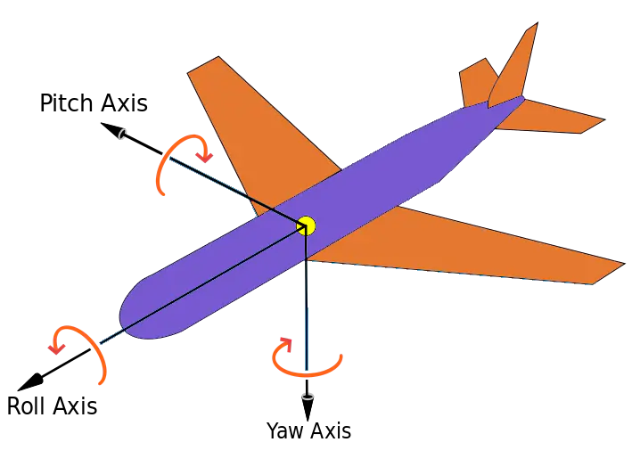
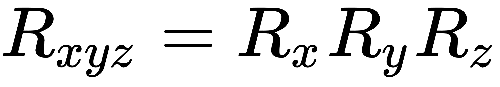
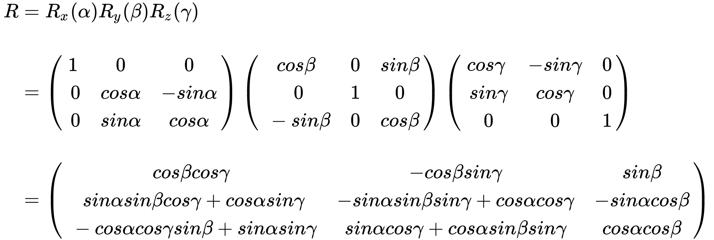

## 1、欧拉角
欧拉角是飞控系统中用于描述飞行器姿态的方式，使用三个角度来表示，分别是`yaw`偏航角、`pitch`俯仰角、`roll` 滚转角。
+ yaw：偏航角，是指飞行器偏离原来航线的角度。
+ pitch：俯仰角，是指飞行器机头抬起的角度。
+ roll：滚转角，是指飞行器绕着自身头尾轴线翻滚的角度。



（图片来源于网络）

对比到笛卡尔坐标系，偏航角是绕着 `Y` 轴旋转的角度 `α`，俯仰角是绕着 `X` 轴旋转的角度 `β`，滚转角是绕着 `Z` 轴旋转的角度 `γ`。

**注意：** 欧拉角旋转时绕的轴系，既可以参照世界坐标系，也可以参照自身坐标系。本文所讲的都是参考自身坐标系。

欧拉角很容易就能表示出一个旋转运动，而且用角度来描述旋转。如 `R=(α,β,γ)`。

欧拉角旋转顺序有很多种。如`XYX,XZX,YZY,YXY,ZXZ,ZYZ`。

#### 1、欧拉角的矩阵表示

以 `XYZ` 顺序为例，`XYZ` 顺序的欧拉旋转可以表示如下：



上面的公式有两种理解方式：
+ 参照自身坐标系，先绕X轴旋转，再绕 Y 轴旋转，最后绕 Z 轴旋转。
+ 参照世界坐标系，先绕 Z 轴旋转，再绕 Y 轴旋转，最后绕 X 轴旋转。

根据`R=(90,90,90)`欧拉角，分别根据自身坐标系旋转和根据世界坐标系来旋转发现，旋转之后的结果是一样的。


从而我们可以得到一个结论：**一个复合变换矩阵，既可以理解为世界坐标系下的依次变换，也可以理解为模型坐标系下的依次变换，变换顺序相反。**

#### 2、根据欧拉角推导旋转矩阵
按照 `XYZ` 的顺序推导旋转矩阵，如下所示：



根据上面的推导公式，自然不难用`javascript`来实现一遍了。
```js
function makeRotationFromEuler(euler, target){
    target = target || new Float32Array(16);
    
    var x = euler.x, y = euler.y, z = euler.z;
    var cx = Math.cos(x), sx = Math.sin(x),
        cy = Math.cos(y), sy = Math.sin(y),
        cz = Math.cos(z), sz = Math.sin(z);
    var sxsz = sx * sz;
    var cxcz = cx * cz;
    var cxsz = cx * sz;
    var sxcz = sx * cz;
    target[0] = cy * cz;
    target[1] = sxcz * sy + cxsz;
    target[2] = sxsz - cxcz * sy;
    target[3] = 0;
    
    target[4] = -cy * sz;
    target[5] = cxcz - sxsz * sy;
    target[6] = sxcz + cxsz * sy
    target[7] = 0;
    
    target[8] = sy;
    target[9] = -sx * cy;
    target[10] = cx * cy;
    target[11] = 0;
    
    target[12] = 0;
    target[13] = 0;
    target[14] = 0;
    target[15] = 1;
    
    return target;
}
```

#### 3、欧拉角的缺点

+ 计算过程涉及到大量三角函数计算，运算量大，这点在推导公式的过程中显而易见。
+ 给定方位的欧拉角不唯一，有多个，这会对旋转动画的插值造成困难。同样一个姿态可以由好多个欧拉角来表示，即多对一的关系，那么在插值过程中就可能会引起姿态突变，产生抖动效果。

+ **万向节死锁**，这个现象会在第二个旋转轴旋转了90 度时产生，当第二个旋转轴旋转 90 度时，会导致第三个旋转轴和第一个旋转轴重合，此时如果继续绕第三个旋转轴，相当于在第一个旋转轴上旋转。所谓死锁并不是旋转不了了，而是少了一个自由度。

由于万向节死锁的问题：

1、欧拉角`（x: 80, y: 90, z: 0）和(x: 30, y: 90, z: 50)` 表示的旋转一模一样。多个欧拉角会对应一个旋转。这在做旋转动画时会导致旋转动画不准确的问题。

2、欧拉角`（x: 47, y: 90, z:55）和(x: 8, y: 0, z: 0)`和`（x: 55, y: 90, z:55）`,这两个欧拉角最终的旋转效果也是不一样的。

结论：实际上欧拉角足以应对大部分场景，虽然它有一些缺点。我们可以做出一些限制来避免它们，比如我们可以将第二个旋转轴的旋转角度限制在  `-90` 到 `+90` 之间。但尽管如此，我们仍然无法规避死锁的产生。

## 2、四元数

#### 1、四元数基础

四元数，顾名思义，是由四个数字组成，包含一个实数和三个复数，可以表示为：`q = (w, x, y, z)`或者`q = w + xi + yj + zk`。并且有以下特点`i^2= j^2 = k^2 = -1`。

四元数还可以理解为一个实数 `w` 和一个向量  `u(x,y,z)`,`q = (w, u)`。

#### 2、如何用四元数表示旋转

先将原向量表示为四元数`q0=(0,vec{v})` ，将**旋转角度和旋转轴**的信息用单位四元数 `q` 表示，下面是一个代表旋转的四元数：`q = cosθ+ vec{u}sinθ`,其中旋转轴 `vec{u}` 必须是单位向量。实数部分是`cosθ`，虚数部分是`sin(θ)v`,

#### 3、利用四元数实现旋转

我们至少需要以下三个方法才能对物体进行旋转：
+ 通过如下三种方式构造出四元数。
    + `setFromEuler`，将一组欧拉角转化成四元数。
    +  `setFromAxis`，将轴角转化成四元数。
    + `setFromRotationMatrix`，将旋转矩阵转化成四元数。
+ 已知初始状态四元数和结束状态四元数，构造某一阶段的四元数。
    + `slerp`。
+ 根据四元数计算出该四元数所代表的旋转矩阵。
    + `makeRotationFromQuaternion`。