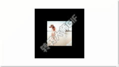

在前端我们可以使通过改变`dom`的样式来实现`dom`的动画效果。在`WebGL`中我们同样可以实现动画效果。通过改变`纹理坐标`我们也可以实现纹理贴图的动画效果。
实现代码如下。
我们只需要在`纹理贴图demo`的基础上修改两个地方就可以实现纹理动画效果了。
+ 修改`assignValue`函数
这里不再调用`gl.bufferData`向缓冲区传递数据了。
```js
function assignValue(gl, program) {
    let positions = new Float32Array([
    -0.5, -0.5, 0, 0,
    -0.5, 0.5, 0, 1,
    0.5, 0.5, 1, 1,
    -0.5, -0.5, 0, 0,
    0.5, 0.5, 1, 1,
    0.5, -0.5, 1, 0,
    
    ]);
    // 找到着色器中的全局变量 u_Color;
    var u_Texture = gl.getUniformLocation(program, "u_Texture");
    var a_Position = gl.getAttribLocation(program, "a_Position");
    var a_Uv = gl.getAttribLocation(program, "a_Uv");

    gl.enableVertexAttribArray(a_Position);
    gl.enableVertexAttribArray(a_Uv);
    // 创建缓冲区
    var buffer = gl.createBuffer();
    // 绑定缓冲区为当前缓冲
    gl.bindBuffer(gl.ARRAY_BUFFER, buffer);
    // 设置 a_Position 属性从缓冲区读取数据方式
    gl.vertexAttribPointer(a_Position, 2, gl.FLOAT, false, 16, 0);
    // 设置 a_Uv 属性从缓冲区读取数据方式
    gl.vertexAttribPointer(a_Uv, 2, gl.FLOAT, false, 16, 8);
    // 向缓冲区传递数据
    // gl.bufferData(
    //     gl.ARRAY_BUFFER,
    //     positions,
    //     gl.STATIC_DRAW
    // );
    loadTexture(gl, '../images/webgl/1.jpg', u_Texture, function () {
        render(gl, positions);
    })
}
```
+ `WebGL`渲染函数
在这里调用`gl.bufferData`向缓冲区传递数据，因为数据的纹理坐标一直在发生改变，所以写入缓冲区的数据也要不断重新写入。调用`requestAnimationFrame`动画函数，每一次重新渲染时`纹理坐标`的`x`轴值不断增加`0.005`,使得图片呈现一直向左运动的效果。当然也可以通过修改`y`轴的值实现向下或向上的运行.
```js
let anim = 0.005;
function render(gl, positions) {
    // 向缓冲区传递数据
    gl.bufferData(
        gl.ARRAY_BUFFER,
        new Float32Array(positions),
        l.STATIC_DRAW
    );
    //设置清屏颜色为黑色。
    gl.clearColor(0, 0, 0, 1);
    gl.clear(gl.COLOR_BUFFER_BIT);
    gl.drawArrays(gl.TRIANGLES, 0, positions.length / 4);
    if (positions.length <= 0) return;
    for (let i = 2; i < positions.length; i += 4) {
        positions[i] += anim;
    }
    requestAnimationFrame(()=>{
        render(gl,positions);
    }); 
}
```
效果如下所示：



**参考**<br>
[WebGL零基础入门教程(郭隆邦)](http://www.yanhuangxueyuan.com/WebGL/)<br>
[WebGL 入门与实践](https://juejin.cn/book/6844733755580481543/section/6844733755916025869)<br>
[WebGL官方文档](https://developer.mozilla.org/zh-CN/docs/Web/API/WebGLRenderingContext/vertexAttribPointer)<br>
