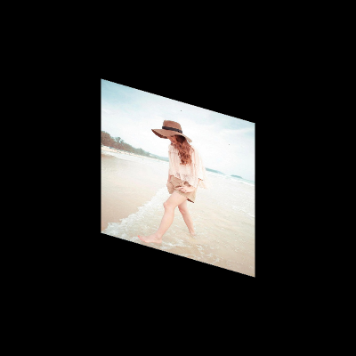

图片拉伸的原理本质上是旋转顶点坐标。彩色图转灰度图本质上是改变纹理的颜色。
## 1、图片拉伸
#### 1、顶点着色器代码
将顶点坐标绕`x,y`轴分别旋转，就可以实现图片拉伸的效果。
```js
<script type="shader-source" id="vertexShader">
   /浮点数设置为中等精度
    precision mediump float;
    attribute vec2 a_Position;
    varying vec2 v_Uv;
    attribute vec2 a_Uv;
    uniform mat4 mx;
    uniform mat4 my;
    void main(){
        gl_Position = mx*my*vec4(a_Position, 0, 1);
        //纹理坐标差值计算
        v_Uv = a_Uv;
    }
</script>
```

#### 2、JavaScript代码

+ 渲染`WebGL`
在`render`函数中添加旋转顶点坐标的代码。
```js
function render(gl, count) {
    //设置清屏颜色为黑色。
    gl.clearColor(0, 0, 0, 1);
    gl.clear(gl.COLOR_BUFFER_BIT);
    gl.drawArrays(gl.TRIANGLES, 0, count);
}
function tranlate() {
    const angle = 30.0;
    const rad = angle * Math.PI / 180;
    const cos = Math.cos(rad);
    const sin = Math.sin(rad);

    const mx = gl.getUniformLocation(program, 'mx');
    const mxArr = new Float32Array([
        1, 0, 0, 0, 0, cos, -sin, 0, 0, sin, cos, 0, 0, 0, 0, 1
    ])
    gl.uniformMatrix4fv(mx, false, mxArr);

    const my = gl.getUniformLocation(program, 'my');
    const myArr = new Float32Array([
        cos, 0, -sin, 0, 0, 1, 0, 0, sin, 0, cos, 0, 0, 0, 0, 1
    ])

    gl.uniformMatrix4fv(my, false, myArr);
}
```
图片拉伸效果如下图所示：



## 2、彩色图转灰度图
灰度图颜色只有黑白两色。本质上是修改光的亮度。黑色相当于没有光照，白色相当于最大光照强度。通过计算`RGB`分量的值，来最终赋予`gl_FragColor`,从而实现灰度效果。光亮度的计算公式如下：
```js
//RGB的系数之和为1，这样可以保证计算的结果不会超出WebGL颜色分量默认的最大值1。
//
亮度 = 0.199 x R + 0.187 x G + 0.714 x B
```
彩色图转灰度图只需要修改片元着色器的代码就行。
+ 片元着色器的代码
```js
<script type="shader-source" id="fragmentShader">
    //浮点数设置为中等精度
    precision mediump float;
    uniform sampler2D u_Texture;
    varying vec2 v_Uv;
    void main(){
    //gl_FragColor=texture2D(u_Texture, v_Uv);
    vec4 texture=texture2D(u_Texture, v_Uv);
    // 彩色图转灰度图的公式
    //计算RGB三个分量光能量之和，也就是亮度
    float luminance = 0.199*texture.r+0.187*texture.g+0.714*texture.b;
    //逐片元赋值，RGB相同均为亮度值，用黑白两色表达图片的明暗变化
    gl_FragColor = vec4(luminance,luminance,luminance,1.0); 
    }
</script>
<script>
```
最终效果如下图所示：


**参考**<br>
[WebGL零基础入门教程(郭隆邦)](http://www.yanhuangxueyuan.com/WebGL/)<br>
[WebGL 入门与实践](https://juejin.cn/book/6844733755580481543/section/6844733755916025869)<br>
[WebGL官方文档](https://developer.mozilla.org/zh-CN/docs/Web/API/WebGLRenderingContext/vertexAttribPointer)<br>
