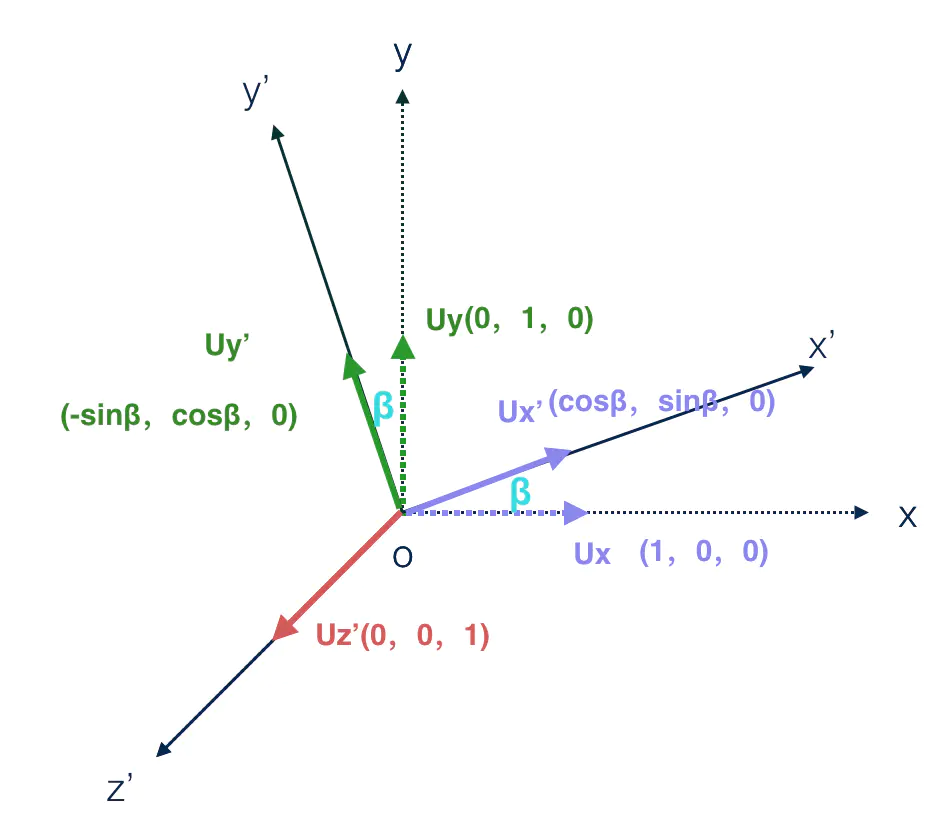
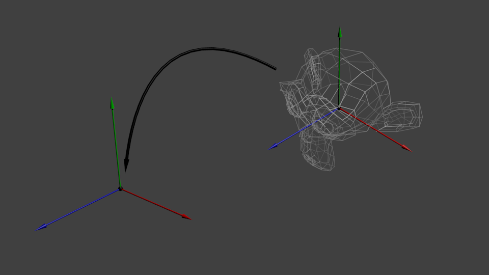
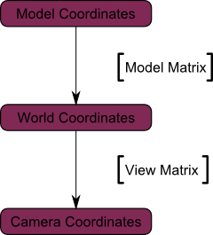
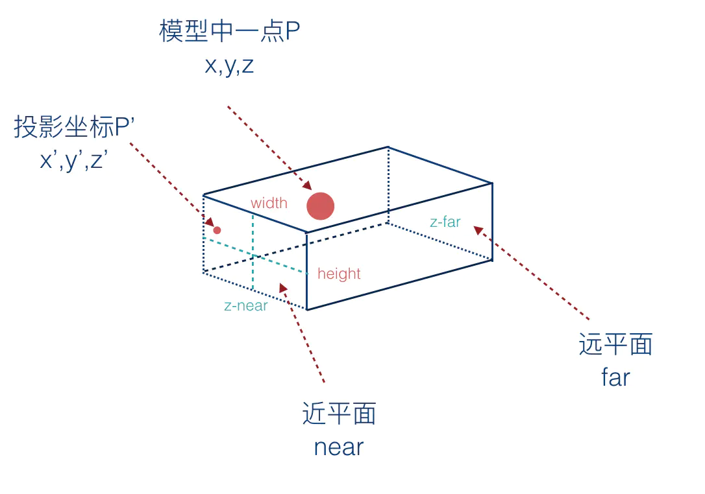

# 1、齐次坐标（Homogeneous coordinates）
目前为止，我们仍然把三维顶点视为三元组 `(x,y,z)`。现在引入一个新的分量w，得到向量`(x,y,z,w)`。

+ 若 `w = 1`，则向量 `(x, y, z, 1)` 为空间中的点。
+ 若 `w = 0`，则向量 `(x, y, z, 0)` 为方向。

二者有什么区别呢？对于旋转，这点区别倒无所谓。当您旋转点和方向时，结果是一样的。但对于平移（将点沿着某个方向移动）情况就不同了。**平移一个方向** 是毫无意义的。
# 2、变换矩阵（Transformation matrices）

## 1、矩阵简介
**矩阵x顶点（记住顺序！！矩阵左乘顶点，顶点用列向量表示）= 变换后的顶点**


## 2、平移矩阵（Translation matrices）
平移矩阵是最简单的变换矩阵。


其中，`X、Y、Z`是点的位移增量。
例如：若想把向量`(10, 10, 10, 1)` 沿X轴方向平移10个单位，可得：


这样就得到了齐次向量 `(20,10,10,1)`！记住，末尾的`1`表示这是一个点，而不是方向。经过变换计算后，点仍然是点。

例如：对一个代表 `Z` 轴负方向的向量作上述平移变换会得到什么结果：


还是原来的 `(0,0,-1,0)` 方向，这也很合理，恰好印证了前面的结论："平移一个方向是毫无意义的"。

## 3、单位矩阵（Identity matrix）


## 4、缩放矩阵（Scaling matrices）


例如把一个向量（点或方向皆可）沿各方向放大2倍：


## 5、累积变换

**注意：** 这行代码首先执行缩放，接着旋转，最后才是平移
```js
TransformedVector = TranslationMatrix * RotationMatrix * ScaleMatrix * OriginalVector;
```

## 6、变换矩阵的推导

**用矩阵来表示平移变换**

`n` 维矩阵和 `n` 维向量相乘，不能实现 n 维向量和一个常量进行加减的操作。


我们期待的是得到这样一个向量：`(ax+ by + cz+p)`，其中`p`是常数，表示平移的大小。


在原来的三维矩阵的基础上添加一行和一列，其中第四行前三个分量为 0，第四个分量为 1，这样矩阵和向量的乘积得到的新的向量的第四个分量也是 1，所以也是代表点。

第四列tx、ty、tz分别代表沿 x 轴、y 轴、 z 轴方向上的平移量。


转换后的向量的每一个分量都实现了ax + by + cz + 常数的格式，也就是说，向量可以通过乘以一个矩阵实现平移操作。

**变换矩阵的求解思路**

对物体（顶点）做平移、旋转、缩放的变换操作相当于对原来的坐标系做平移、旋转、缩放变换，得到一个**新坐标系**。

+ 首先求出新坐标系的基向量 `U` 在原坐标系下的表示 `U'`，其中 `U =(Ux, Uy, Uz)， U' = (Ux', Uy', Uz')`。
> 基向量是指坐标系中各个坐标轴正方向的单位向量，假设 `Ux` 代表 `X` 轴的单位向量，那么  `Ux = (1, 0, 0)`，同理， `Uy = (0, 1, 0)，Uz = (0, 0, 1)`。
  + Ux：X轴基向量，由三个分量构成，
    + Uxx, X轴分量。
    + Uxy, Y轴分量。
    + Uxz，Z轴分量。
  + Uy：Y轴基向量，由三个坐标轴分量组成
    + Uyx：X轴分量。
    + Uyy：Y轴分量。
    + Uyz：Z轴分量。
  + Uz：Z轴基向量，由三个坐标轴分量组成
    + Uzx：X轴分量。
    + Uzy：Y轴分量。
    + Uzz：Z轴分量。
+ 其次求出新坐标系的坐标原点`O(Ox, Oy, Oz)`在原坐标系下的坐标`O1（Ox1, Oy1, Oz1）`。
> 基向量是坐标系变换的基础，我们求解坐标变换矩阵关键就是要找到原坐标系的基向量在新坐标系中的表示。

+ 最后，将上面求出的各个值代入下面的矩阵框架，得到的就是变换矩阵。


下面讲解一个矩阵变换的例子：坐标系 `oxyz` 绕 `Z` 轴旋转 `β` 角度后形成了新坐标系 `ox'y'z'`。



新坐标系的基向量在原坐标系下的表示我们利用三角函数运算即可求出。所以按照求解思路的第一步，新坐标系的基向量在原坐标系表示为：

<br>
<br>
<br>


原坐标系的坐标原点和新坐标系重合，所以新坐标系原点在原坐标系下的表示：


代入通用矩阵框架后得出变换矩阵为：


```js
//在js矩阵表示为
const arr=math4(
  cosβ,-sinβ,0,0,
  sinβ, cosβ,0,0,
  0,    0,   1,0,
  0,    0,   0,1
)
```
同理也可以计算出绕 `x`轴和绕 `y`轴旋转的变换矩阵。

#### 1、平移变换
由于没有进行旋转和缩放操作，所以新坐标系的基向量和原坐标系一样：`Ux=(1,0,0),Uy=(0,1,0),Uz=(0,0,1)`;
新坐标系坐标原点的坐标为`Ox1=Ox+tx=tx;Oy1=Oy+ty=ty;Oz1=Oz+tz=tz`。

所以变换矩阵为：


```js
//js代码实现
function translation(tx, ty, tz, target){
    target = target || new Float32Array(16);
    // 第一列
    target[0] = 1;
    target[1] = 0;
    target[2] = 0;
    target[3] = 0;
    // 第二列
    target[4] = 0;
    target[5] = 1;
    target[6] = 0;
    target[7] = 0;
    // 第三列
    target[8] = 0;
    target[9] = 0;
    target[10] = 1;
    target[11] = 0;
    // 第四列
    target[12] = tx;
    target[13] = ty;
    target[14] = tz;
    target[15] = 0;
    
    return target;
}
```
#### 2、缩放

缩放是对原来基向量的缩放。变换矩阵相对来说比较简单。

```js
//js代码实现如下
function scale(sx, sy, sz, target){
    target = target || new Float32Array(16);
    
    // 第一列
    target[0] = sx;
    target[1] = 0;
    target[2] = 0;
    target[3] = 0;
    
    // 第二列
    target[4] = 0;
    target[5] = sy;
    target[6] = 0;
    target[7] = 0;
    
    // 第三列
    target[8] = 0;
    target[9] = 0;
    target[10] = sz;
    target[11] = 0;
    
    // 第四列
    target[12] = 0;
    target[13] = 0;
    target[14] = 0;
    target[15] = 1;
    
    return target;
}
```

#### 3、旋转

旋转矩阵的推导已经在上面变换矩阵的求解中描述的很详细了。
# 3、模型（Model）、观察（View）和投影（Projection）矩阵

利用模型、观察和投影矩阵，可以将变换过程清晰地分解为三个阶段：模型变换、观察变换、投影变换。
## 1、模型矩阵（Model Matrix）
 模型空间  `（Model Space）`是会改变的，唯一不动的是世界空间`（World Space）`的中心。

从模型空间  `（Model Space）`（顶点都相对于模型的中心定义）变换到世界空间（顶点都相对于世界空间中心定义）。



**模型矩阵是将模型空间的坐标变换成世界空间的坐标。**


## 2、观察矩阵（View Matrix）
观察矩阵主要将的是摄像机（`camera`）。
下图展示了：从世界空间（顶点都相对于世界空间中心定义）到摄像机空间（`Camera Space`，顶点都相对于摄像机定义）的变换。


**观察矩阵是将模型在世界坐标系下的坐标转换成以摄像机为原点的世界坐标。**

到此时，我们是处于摄像机空间中的。




## 3、投影矩阵

仅有`x、y`坐标还不足以确定物体是否应该画在屏幕上：它到摄像机的距离（z）也很重要！两个`x、y`坐标相同的顶点，`z`值较大的一个将会最终显示在屏幕上(**针对右手坐标系而言**)。
这就是所谓的透视投影`（perspective projection）`：

**投影矩阵是将摄像机空间的坐标（顶点都相对于摄像机定义）转变成齐次空间坐标（Homogeneous Space）（顶点都在一个小立方体中定义。立方体内的物体都会在屏幕上显示）的坐标。**


投影矩阵有两种，一种是正交投影，一种是透视投影。

#### 1、正交投影
正交投影的投影线是平行线，可视范围是一个立方体盒子。




#### 2、透视投影
透视投影的投影线是相交线，可视范围是一个棱锥体盒子，这样经过投影后才能达到近大远小的效果。


上面两种投影坐标系原点均位于投影盒正中心位置，因为是左手坐标系，所以，Z轴朝向屏幕内侧。

#### 3、投影算法推导

假如模型中有一点`P`,坐标是`(x,y,z)`，投影到平面上的坐标为`P' = （x',y',z'）`。那么他们之间是怎么转换的呢？
在转换之前我们需要知道下面的几个条件：
+ 近平面的 z 值 zNear
+ 近平面的宽度 width 和高度 height。
+ 远平面的 z 值 zFar。

`zFar` 和 `zNear` 是相机坐标系中的`Z`轴坐标，由于相机坐标系是右手坐标系，`Z`轴朝向屏幕外侧，所以 `zNear` 是大于 `zFar` 的。

**正交投影**

通过上面的示意图，我们可以看到：

+ x坐标在【-width/2, width / 2】之间，通常我们不指定width，而是指定相机坐标系下的投影盒的左右两侧坐标，left和right。
+ y坐标在【-height/2， height/2】之间，通常我们不指定height，而是指定相机坐标系下的投影盒的左右两侧坐标，top和bottom。
+ z坐标在【zNear，zFar】之间。

投影后的点 P'（x',y',z'）的`x',y',z'`的值都在 【-1,1】之间。

本质上是将`世界坐标系`中的坐标转换成`齐次坐标系`中的坐标。因为`齐次坐标系`的坐标原点`（0,0）`是在几何中心。所以计算公式如下所示。
>**x' 和 x 的关系**

`(left+right)/2`表示的是正方形的`x`轴的原点坐标。
`(right-left)/2`表示的是正方形的的边长的一半。


> **y'和y的关系**

`(top+bottom)/2`表示的是正方形的`y`轴的原点坐标。
`(top-bottom)/2`表示的是正方形的的边长的一半。


> **z' 和 z 的关系**

`(zNear+zFar)/2`表示的是正方形的`y`轴的原点坐标。
`(zNear-zFar)/2`表示的是正方形的的边长的一半。


现在我们得到了`P'`和`P`之前的关系。我们可以将这个关系用矩阵`M`表示出来,`P'=M*P`。我们将其次坐标的`w`分量设置为`1`,则`p`为`（x,y,z,1）`, 通过矩阵变换算法从而可以得到`M`矩阵为：


正交投影算法的实现代码如下所示：
```js
function ortho(left, right, bottom, top, near, far, target){
  target = target || new Float32Array(16);

  target[0] = 2 / (right - left);
  target[1] = 0;
  target[2] = 0;
  target[3] = 0;
  target[4] = 0;
  target[5] = 2 / (top - bottom);
  target[6] = 0;
  target[7] = 0;
  target[8] = 0;
  target[9] = 0;
  target[10] = 2 / (near - far);
  target[11] = 0;
  target[12] = (left + right) / (left - right);
  target[13] = (bottom + top) / (bottom - top);
  target[14] = (near + far) / (near - far);
  target[15] = 1;
  return target;
}
```

**透视投影**

通过上面透视投影示例图，根据相似三角形原理，我们可以知道如下关系：


所以有


此时 `x1` 和 `y1` 还是相机坐标系下坐标，并没有变换到    齐次坐标系，我们还要将`x1`和`y1`变换到【-1，1】之间


又由于投影坐标系和相机坐标系 Z 轴相反，所以需要对Z轴坐标取反。


x' 和 y' 不仅和投影面的宽度和高度有关系，还和 z 轴坐标有关系，z 轴坐标越大，x'和 y' 越小，也就产生了近大远小的效果，我们将齐次坐标 w 分量设置为 z，此时 x' 和 y' 的值为


z' 和 z 之间的关系，因为是线性关系，所以有


又因为齐次坐标w分量为 z，所以有


我们还知道当 z 为 zNear 时，裁剪空间 z 轴坐标为 -1，当 z 为 zFar 时，z轴坐标为 1，所以有如下两个等式：

<br>


解这两个方程，可以求出 `a` 和 `b` 的值：

<br>


参考文档

[中级进阶 --- 投影变换：观察空间变换到裁剪空间](https://juejin.cn/book/6844733755580481543/section/6844733755941191687)