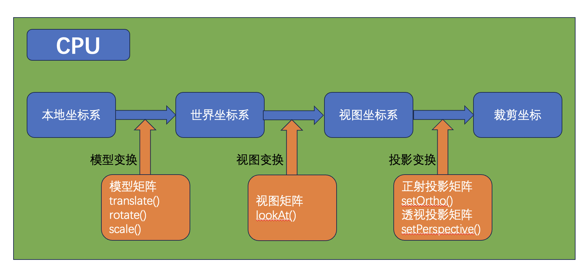
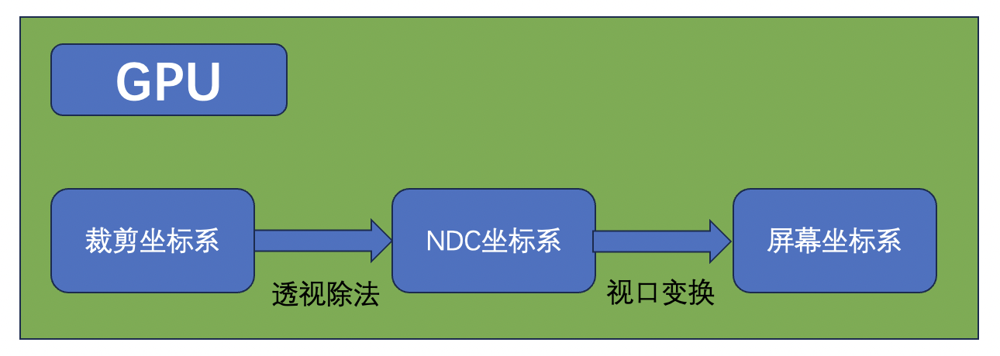

`WebGL`的坐标系主要可以分为以下几类。
+ 本地坐标系
+ 世界坐标系
+ 观察坐标系(又称相机坐标系、视图坐标系)
+ 裁剪坐标系(`gl_Position`接收的值)
+ NDC坐标系
+ 屏幕坐标系

它们之间的关系如下图所示。 
 
 
>裁剪坐标系之前的这几个坐标系，我们都可以使用 `JavaScript` 控制。从裁剪坐标系到 `NDC` 坐标系，这一个步骤是**顶点着色器**最后自动完成的，我们无法干预。

## 1.本地坐标系
又称之为**模型坐标系**，一个物体通常由很多点构成，每个点在模型的什么位置？我们需要用一个坐标系来参照，这个坐标系就叫本地/模型坐标系，**模型坐标系原点通常在模型的中心**，各个坐标轴遵循右手坐标系，即 X 轴向右，Y 轴向上，Z 轴朝向屏幕外。
## 2.世界坐标系
默认情况模型坐标系和世界坐标系重合。如果模型不在世界坐标系中心，那么就需要对模型进行坐标转换，将模型的各个相对于模型中心的顶点坐标转换成世界坐标系下的坐标。
举个例子，假如模型中有一点 `P` ，相对于模型中心的坐标`（1，1）`。 该模型在世界坐标系的`（3，0）`位置，那么，顶点 `P` 在世界坐标系中的坐标就变成了`（4，1）`。
## 3.视图坐标系
又被称之为**观察坐标系或者相机坐标系**，用于将世界坐标转化为用户视野前方的坐标。**人眼或者摄像机**看到的世界中的物体相对于他自身的位置，所参照的坐标系就叫视图/观察坐标系。**是以人眼/摄像机为原点而建立的坐标系**。
## 4.裁剪坐标系
将相机坐标进行**投影变换**后得到的坐标，也就是 `gl_Position` 接收的坐标。

相机坐标系观察的空间是整个 `3D` 世界，而裁剪坐标系是希望所有的坐标都落在一个特定的范围内，超出这个范围的顶点坐标都将被裁剪掉，被裁剪掉的坐标就不会显示，这就是裁剪坐标系的由来。

这个特定的空间就是通过`投影矩阵`来创建的，投影矩阵会创建一个观察箱 `Viewing Box`，称为平截头体`Frustum`，出现在平截头体范围内的坐标最终都会显示在屏幕上。裁剪坐标系中的坐标转化到标准化设备坐标系的过程就很容易，这个过程被称之为投影`Projection`，

观察坐标变换为裁剪坐标的投影矩阵可以为两种不同的形式，每种形式都定义了不同的平截头体。
#### 4.1正射投影矩阵：
又名正交投影，正射投影矩阵创建的是一个立方体的观察箱，它定义了一个裁剪空间，在该裁剪空间之外的坐标都会被丢弃。 正射投影矩阵需要指定观察箱的长度、宽度和高度。经过正射投影矩阵映射后的坐标 `w` 分量不会改变，始终是 1，所以在经过透视除法后物体的轮廓比例不会发生改变，这种投影一般用在建筑施工图纸中，不符合人眼观察世界所产生的近大远小的规律。

#### 4.2透视投影矩阵
透视投影矩阵将给定的平截头体范围映射到裁剪空间，除此之外它还会修改每个顶点坐标的 `w` 值，使得离人眼越远的物体的坐标 `w` 值越大。被变换到裁剪空间的坐标都会在 `-w` 到 `w` 的范围之间（任何大于这个范围的坐标都会被裁剪掉）。`WebGL` 要求所有可见的坐标都落在`【-1.0 - 1.0】`范围内，因此，一旦坐标转换到裁剪空间，透视除法就会被应用到裁剪坐标上。透视投影需要设置**近平面、远平面、透视深度**。

## 5.NDC坐标系
一旦所有顶点被变换到裁剪空间，`GPU` 会对裁剪坐标执行**透视除法**，在这个过程中 `GPU` 会将顶点坐标的 `X，Y，Z` 分量分别除以齐次 `W` 分量。这一步会在每一个顶点着色器运行的最后被自动执行。最终所有坐标分量的范围都会在 `【-1，1】`之间，超出这个范围的坐标都将被 `GPU` 丢弃。

**NDC坐标系** 采用的是左手坐标系，`Z` 轴正向指向屏幕里面。

**注意：** 在 `NDC` 坐标系中，默认情况，在不使用深度测试时，同一个位置后绘制的顶点会覆盖掉原来的顶点的颜色。从下面的两个例子中就可以得到答案。

## 6.屏幕坐标系
有了 `NDC` 坐标之后，`GPU` 会执行最后一步变换操作，视口变换，这个过程会将所有在`【-1, 1】`之间的坐标映射到屏幕空间中，并被变换成片段，也可以称之为像素。

**总结：** 因为我们更多的是关注**模型变换、视图变换和投影变换**，所以更多的关注点放在前面四个坐标系上，后面的 `DNC`坐标系和`屏幕坐标系` 不太被关注和提及。

<Valine></Valine>