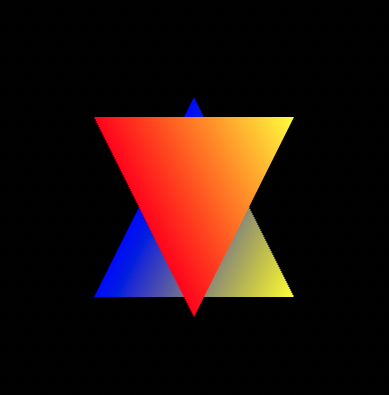
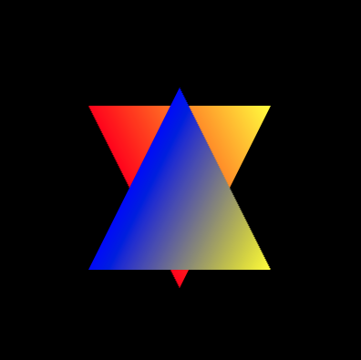
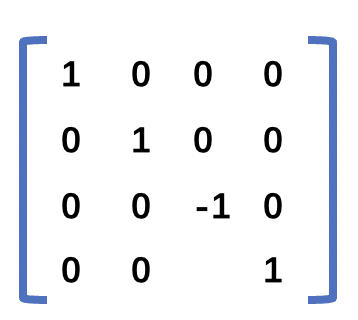

`WebGL`的坐标系主要可以分为以下几类。
+ 本地坐标系
+ 世界坐标系
+ 观察坐标系(又称相机坐标系、视图坐标系)
+ 裁剪坐标系(`gl_Position`接收的值)
+ NDC坐标系
+ 屏幕坐标系

它们之间的关系如下图所示。<br>
<br>
<br>
>裁剪坐标系之前的这几个坐标系，我们都可以使用 `JavaScript` 控制。从裁剪坐标系到 `NDC` 坐标系，这一个步骤是**顶点着色器**最后自动完成的，我们无法干预。

## 1.本地坐标系
又称之为**模型坐标系**，一个物体通常由很多点构成，每个点在模型的什么位置？我们需要用一个坐标系来参照，这个坐标系就叫本地/模型坐标系，**模型坐标系原点通常在模型的中心**，各个坐标轴遵循右手坐标系，即 X 轴向右，Y 轴向上，Z 轴朝向屏幕外。
## 2.世界坐标系
默认情况模型坐标系和世界坐标系重合。如果模型不在世界坐标系中心，那么就需要对模型进行坐标转换，将模型的各个相对于模型中心的顶点坐标转换成世界坐标系下的坐标。
举个例子，假如模型中有一点 `P` ，相对于模型中心的坐标`（1，1）`。 该模型在世界坐标系的`（3，0）`位置，那么，顶点 `P` 在世界坐标系中的坐标就变成了`（4，1）`。
## 3.视图坐标系
又被称之为**观察坐标系或者相机坐标系**，用于将世界坐标转化为用户视野前方的坐标。**人眼或者摄像机**看到的世界中的物体相对于他自身的位置，所参照的坐标系就叫视图/观察坐标系。**是以人眼/摄像机为原点而建立的坐标系**。
## 4.裁剪坐标系
将相机坐标进行**投影变换**后得到的坐标，也就是 `gl_Position` 接收的坐标。

相机坐标系观察的空间是整个 `3D` 世界，而裁剪坐标系是希望所有的坐标都落在一个特定的范围内，超出这个范围的顶点坐标都将被裁剪掉，被裁剪掉的坐标就不会显示，这就是裁剪坐标系的由来。

这个特定的空间就是通过`投影矩阵`来创建的，投影矩阵会创建一个观察箱 `Viewing Box`，称为平截头体`Frustum`，出现在平截头体范围内的坐标最终都会显示在屏幕上。裁剪坐标系中的坐标转化到标准化设备坐标系的过程就很容易，这个过程被称之为投影`Projection`，

观察坐标变换为裁剪坐标的投影矩阵可以为两种不同的形式，每种形式都定义了不同的平截头体。
#### 4.1正射投影矩阵：
又名正交投影，正射投影矩阵创建的是一个立方体的观察箱，它定义了一个裁剪空间，在该裁剪空间之外的坐标都会被丢弃。 正射投影矩阵需要指定观察箱的长度、宽度和高度。经过正射投影矩阵映射后的坐标 `w` 分量不会改变，始终是 1，所以在经过透视除法后物体的轮廓比例不会发生改变，这种投影一般用在建筑施工图纸中，不符合人眼观察世界所产生的近大远小的规律。

#### 4.2透视投影矩阵
透视投影矩阵将给定的平截头体范围映射到裁剪空间，除此之外它还会修改每个顶点坐标的 `w` 值，使得离人眼越远的物体的坐标 `w` 值越大。被变换到裁剪空间的坐标都会在 `-w` 到 `w` 的范围之间（任何大于这个范围的坐标都会被裁剪掉）。`WebGL` 要求所有可见的坐标都落在`【-1.0 - 1.0】`范围内，因此，一旦坐标转换到裁剪空间，透视除法就会被应用到裁剪坐标上。透视投影需要设置**近平面、远平面、透视深度**。

## 5.NDC坐标系
一旦所有顶点被变换到裁剪空间，`GPU` 会对裁剪坐标执行**透视除法**，在这个过程中 `GPU` 会将顶点坐标的 `X，Y，Z` 分量分别除以齐次 `W` 分量。这一步会在每一个顶点着色器运行的最后被自动执行。最终所有坐标分量的范围都会在 `【-1，1】`之间，超出这个范围的坐标都将被 `GPU` 丢弃。

**NDC坐标系** 采用的是左手坐标系，`Z` 轴正向指向屏幕里面。

**注意：** 在 `NDC` 坐标系中，不使用深度测试时，同一个位置后绘制的顶点会覆盖掉原来的顶点的颜色。从下面的两个例子中就可以得到答案。

[z值小的顶点后绘制](https://github.com/tangjie-93/WebGL/blob/main/%E8%B7%9F%E7%9D%80%E5%AE%98%E7%BD%91%E5%AD%A6WebGL%2BWebGL%E7%BC%96%E7%A8%8B%E6%8C%87%E5%8D%97/%E5%9D%90%E6%A0%87%E7%B3%BB/demo/z%E5%80%BC%E5%B0%8F%E7%9A%84%E9%A1%B6%E7%82%B9%E5%90%8E%E7%BB%98%E5%88%B6.html)
[z值小的顶点先绘制](https://github.com/tangjie-93/WebGL/blob/main/%E8%B7%9F%E7%9D%80%E5%AE%98%E7%BD%91%E5%AD%A6WebGL%2BWebGL%E7%BC%96%E7%A8%8B%E6%8C%87%E5%8D%97/%E5%9D%90%E6%A0%87%E7%B3%BB/demo/z%E5%80%BC%E5%B0%8F%E7%9A%84%E9%A1%B6%E7%82%B9%E5%85%88%E7%BB%98%E5%88%B6.html)

#### 5.1 不使用投影矩阵

+ 顶点着色器中的代码
```js
attribute vec4 a_Position;
attribute vec4 a_Color;
varying vec4 v_Color;
void main() {
    gl_Position = a_Position;
    v_Color = a_Color;
}
```
+ `js`中的顶点坐标代码
```js
const pc = new Float32Array([ // Vertex coordinates and color
    0.0,  0.5,  -0.1,  0.0,  0.0,  1.0,  // The front blue one 
    -0.5, -0.5,  -0.1,  0.0,  0.0,  1.0,
    0.5, -0.5,  -0.1,  1.0,  1.0,  0.0, 

    0.5,  0.4,  -0.5,  1.0,  1.0,  0.0,  // The red triangle is behind
    -0.5,  0.4,  -0.5,  1.0,  0.0,  0.0,
    0.0, -0.6,  -0.5,  1.0,  0.0,  0.0, 
]);
```
分析：从上面的顶点坐标以及颜色的代码，我们可以知道 `z`轴坐标为 `-0.1`的三角形的顶点颜色蓝色和黄色。`z`轴坐标为 `-0.5`的三角形的顶点颜色红色和黄色。

按照右手坐标系，理论上，  `z`轴坐标为 `-0.1`的三角形应该在 `z`轴坐标为 `-0.5`的上面。然后实际的结果如下图所示， `z`轴坐标为 `-0.5`的三角形在上面。

视觉效果如下图所示：

<br>

当我们改变顶点坐标的绘制顺序时。
```js
var pc = new Float32Array([ // Vertex coordinates and color
     0.5,  0.4,  -0.5,  1.0,  1.0,  0.0,  // The red triangle is behind
    -0.5,  0.4,  -0.5,  1.0,  0.0,  0.0,
     0.0, -0.6,  -0.5,  1.0,  0.0,  0.0, 
     0.0,  0.5,  0.1,  0.0,  0.0,  1.0,  // The front blue one 
    -0.5, -0.5,  0.1,  0.0,  0.0,  1.0,
     0.5, -0.5,  0.1,  1.0,  1.0,  0.0, 
  ]);
```
视觉效果如下所示

<br>

#### 5.2 使用投影矩阵
但我们使用投影矩阵后，通过设置正射投影矩阵中的远、近平面的位置，我们看到的结果又会不一样。

**注意：** 使用投影矩阵时，都会默认开启深度测试,开启深度测试后的顶点的颜色由顶点的深度(`z`值)所决定，根据右手坐标系，同一位置的顶点，其颜色由`z`值最大的顶点决定(这里的`z`值，说的时`NDC`坐标系中的坐标)。
```js
gl.enable(gl.DEPTH_TEST); 
```
+ 顶点着色器中的代码
```js
attribute vec4 a_Position;
attribute vec4 a_Color;
uniform mat4 u_MvpMatrix;
varying vec4 v_Color;
void main() {
    gl_Position = u_MvpMatrix * a_Position;
    v_Color = a_Color;
}
```
+ `js`中的顶点坐标代码
```js
const pc = new Float32Array([ // Vertex coordinates and color
    0.0,  0.5,  -0.1,  0.0,  0.0,  1.0,  // The front blue one 
    -0.5, -0.5,  -0.1,  0.0,  0.0,  1.0,
    0.5, -0.5,  -0.1,  1.0,  1.0,  0.0, 

    0.5,  0.4,  -0.5,  1.0,  1.0,  0.0,  // The red triangle is behind
    -0.5,  0.4,  -0.5,  1.0,  0.0,  0.0,
    0.0, -0.6,  -0.5,  1.0,  0.0,  0.0, 
]);
```
+ 设置投影矩阵。
```js
const u_MvpMatrix = gl.getUniformLocation(gl.program, 'u_MvpMatrix');
const mvpMatrix = new Matrix4();
// setOrtho(left,right,bottom,top,near,far)
mvpMatrix.setOrtho(-1, 1, -1, 1, 1, -1);   // Set the viewing volume
// Pass the view matrix to u_MvpMatrix
gl.uniformMatrix4fv(u_MvpMatrix, false, mvpMatrix.elements);

```
根据正射矩阵的公式，如下图所示。<br>

<br>

下面我们又看下通过设置远、近平面的大小关系来观察看到的实际效果。

> `near>far` 的正交投影

我们将 `left=-1,right=1,bottom=-1,top=1,near=1,far= -1` 代入上面的矩阵可以得到如下的单位矩阵。<br>

<br>

根据正射投影的示意图。再结合 `near = 1` 要比`far =-1`大，表示在视线方向上，**远裁剪面(或者叫远平面)实际在近裁剪面(或者叫近平面)** 的前面，表示我们将**远近截面** 做了旋转`180度`，将`z`轴正向朝向屏幕里面，这是刚好跟左手坐标系一样。<br>
<br>

通过上面的参数设置的正交投影矩阵， **可以得出结论**：当正射矩阵中的`near>far`时，`WebGL`就会使用左手坐标系统。此时看到的效果还是会跟之前一样。**就算我们改变顶点的绘制顺序，最终的视觉效果都是一样的**，都如下图所示<br>

<br>

`demo`地址为 [使用投影矩阵(near>far)](https://github.com/tangjie-93/WebGL/blob/main/%E8%B7%9F%E7%9D%80%E5%AE%98%E7%BD%91%E5%AD%A6WebGL%2BWebGL%E7%BC%96%E7%A8%8B%E6%8C%87%E5%8D%97/%E5%9D%90%E6%A0%87%E7%B3%BB/demo/%E4%BD%BF%E7%94%A8%E6%8A%95%E5%BD%B1%E7%9F%A9%E9%98%B5near%E5%A4%A7%E4%BA%8Efar(z%E5%80%BC%E5%B0%8F%E7%9A%84%E9%A1%B6%E7%82%B9%E5%90%8E%E7%BB%98%E5%88%B6).html)。

> `near<far` 的正交投影

但是如果我们将参数做以下调整。
```js
mvpMatrix.setOrtho(-1, 1, -1, 1, -1, 1); 
```
我们将 `left=-1,right=1,bottom=-1,top=1,near=-1,far= 1` 代入上面的矩阵可以得到如下的矩阵。<br>

<br>

而且**不管我们是否改变顶点的绘制顺序**，都可以得到如下效果图。<br>

 <br>

现在我们看到的才是 `z=-0.1`三角形在 `z=-0.5`的三角形的上面。根据上面的矩阵，我们可以看到我们实际上是将坐标沿`z`轴，做了`-1`的缩放。此时我们可以将坐标系看成是`z`轴正向朝屏幕外的坐标系，也就是我们常说的右手坐标系。

`demo`地址为[使用投影矩阵(near<far)](https://github.com/tangjie-93/WebGL/blob/main/%E8%B7%9F%E7%9D%80%E5%AE%98%E7%BD%91%E5%AD%A6WebGL%2BWebGL%E7%BC%96%E7%A8%8B%E6%8C%87%E5%8D%97/%E5%9D%90%E6%A0%87%E7%B3%BB/demo/%E4%BD%BF%E7%94%A8%E6%8A%95%E5%BD%B1%E7%9F%A9%E9%98%B5near%E5%B0%8F%E4%BA%8Efar(z%E5%80%BC%E5%B0%8F%E7%9A%84%E9%A1%B6%E7%82%B9%E5%85%88%E7%BB%98%E5%88%B6).html)

**结论：** 使用正交投影后的坐标，然后根据深度测试，以及左手坐标系，同一个位置的颜色由`z`值最小的顶点决定。

## 6.屏幕坐标系
有了 `NDC` 坐标之后，`GPU` 会执行最后一步变换操作，视口变换，这个过程会将所有在`【-1, 1】`之间的坐标映射到屏幕空间中，并被变换成片段，也可以称之为像素。


**总结：** 因为我们更多的是关注**模型变换、视图变换和投影变换**，所以更多的关注点放在前面四个坐标系上，后面的 `DNC`坐标系和`屏幕坐标系` 不太被关注和提及。

<Valine></Valine>