## 1.顶点的绘制顺序
在默认情况下，`WebGL`为了加速绘图操作，是按照顶点在缓冲区中的顺序来处理它们的。下面是顶点数据。
```js
const verticesColors = new Float32Array([
    // Vertex coordinates and color
     0.0,  1.0,  -4.0,  0.4,  1.0,  0.4, // The back green one
    -0.5, -1.0,  -4.0,  0.4,  1.0,  0.4,
     0.5, -1.0,  -4.0,  1.0,  0.4,  0.4, 

     0.0,  1.0,  -2.0,  1.0,  1.0,  0.4, // The middle yellow one
    -0.5, -1.0,  -2.0,  1.0,  1.0,  0.4,
     0.5, -1.0,  -2.0,  1.0,  0.4,  0.4, 

     0.0,  1.0,   0.0,  0.4,  0.4,  1.0,  // The front blue one 
    -0.5, -1.0,   0.0,  0.4,  0.4,  1.0,
     0.5, -1.0,   0.0,  1.0,  0.4,  0.4, 
  ]);
```
按照绘制顺序，绿色的三角形在最下面，紫色的三角形在最上面。如下图所示。
[实例 `demo` 地址](https://github.com/tangjie-93/WebGL/blob/main/%E8%B7%9F%E7%9D%80%E5%AE%98%E7%BD%91%E5%AD%A6WebGL%2BWebGL%E7%BC%96%E7%A8%8B%E6%8C%87%E5%8D%97/%E6%B7%B1%E5%BA%A6%E7%BC%93%E5%86%B2%E5%8C%BA/demo/index1.html)


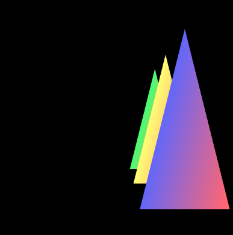

当我们将顶点数据做如下修改时，改变顶点的深度值(`z`轴坐标),使绿色三角形>黄色三角形>紫色三角形。
```js
const verticesColors = new Float32Array([
// Vertex coordinates and color
    0.0,  1.0,  2.0,  0.4,  1.0,  0.4, // The back green one
    -0.5, -1.0,  2.0,  0.4,  1.0,  0.4,
    0.5, -1.0,  2.0,  1.0,  0.4,  0.4, 

    0.0,  1.0,  1.0,  1.0,  1.0,  0.4, // The middle yellow one
    -0.5, -1.0,  1.0,  1.0,  1.0,  0.4,
    0.5, -1.0,  1.0,  1.0,  0.4,  0.4, 

    0.0,  1.0,   0.0,  0.4,  0.4,  1.0,  // The front blue one 
    -0.5, -1.0,   0.0,  0.4,  0.4,  1.0,
    0.5, -1.0,   0.0,  1.0,  0.4,  0.4, 
]);
```
绘制结果如下图所示。紫色的三角形还是在上面

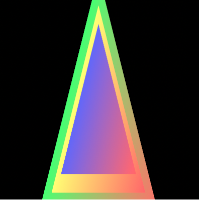

[实例 `demo` 地址](https://github.com/tangjie-93/WebGL/blob/main/%E8%B7%9F%E7%9D%80%E5%AE%98%E7%BD%91%E5%AD%A6WebGL%2BWebGL%E7%BC%96%E7%A8%8B%E6%8C%87%E5%8D%97/%E6%B7%B1%E5%BA%A6%E7%BC%93%E5%86%B2%E5%8C%BA/demo/index2.html)

这样看的可能还不太明显，我们可以将三角形进行一定角度的旋转。
```js
modelMatrix.setTranslate(0, 0, 0).setRotate(-10,0,1,0);
```
我们可以得到下面的渲染效果<br>
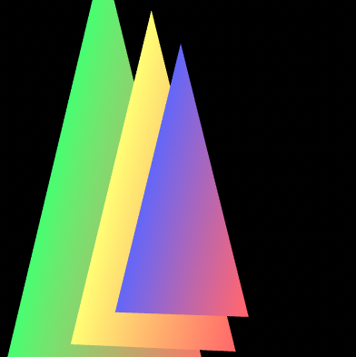<br>

可以看到三角形是按照右手坐标系，绕 `Y` 轴旋转了`10`度，那也就是按照左手坐标系,绕 `Y` 轴旋转了`-10`度，同时也可以看出，绿色的三角形是在最下面的。这也证明了没有开启深度测试之前,是按照顶点在缓冲区中的顺序绘制的。

为了进一步验证顶点的绘制顺序问题，我们再次修改一下顶点的顺序。
```js
const verticesColors = new Float32Array([
     0.0,  1.0,  1.0,  1.0,  1.0,  0.4, // yellow one
    -0.5, -1.0,  1.0,  1.0,  1.0,  0.4,
     0.5, -1.0,  1.0,  1.0,  0.4,  0.4, 
    // Vertex coordinates and color
     0.0,  1.0,  2.0,  0.4,  1.0,  0.4, // green one
    -0.5, -1.0,  2.0,  0.4,  1.0,  0.4,
     0.5, -1.0,  2.0,  1.0,  0.4,  0.4, 

     0.0,  1.0,   0.0,  0.4,  0.4,  1.0,  //  blue one 
    -0.5, -1.0,   0.0,  0.4,  0.4,  1.0,
     0.5, -1.0,   0.0,  1.0,  0.4,  0.4, 
  ]);
```
为了使效果看起来更明显，我们将三角形进行一定角度的旋转。
```js
// 绕y轴旋转
modelMatrix.setTranslate(0, 0, 0).setRotate(-10,0,1,0);
```
我们可以得到下面的渲染效果，紫色的三角形在最上面。<br>
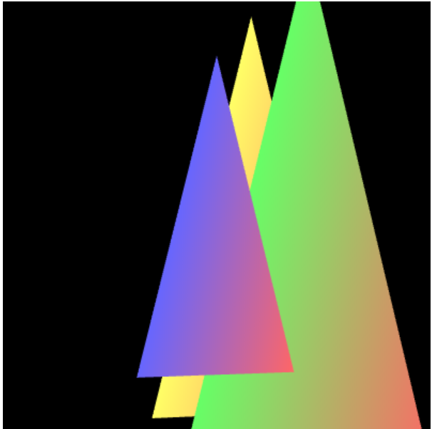<br>

## 2.开启深度测试

为了让`WebGL`按照`z` 轴坐标值的大小来绘制，`WebGL`提供了 **开启深度测试** 的功能。这个功能的作用就是将那些被遮挡的面清除掉。开启隐藏面清除功能，需要遵循以下3个步骤。
> 1.开启深度测试
```js
gl.enable(gl.DEPTH_TEST)。//开启深度测试
```
> 2.在绘制之前，清除深度缓冲区。
```js
gl.clear(gl.DEPTH_BUFFER_BIT);
```
`WebGL`在颜色缓冲区中绘制几何图形，绘制完成后将颜色缓冲区显示到`canvas`上。而深度缓冲区就是用来存储深度信息的。由于深度方向通常是`Z`轴方向，所以有时候我们也称之为`Z`轴缓冲区。

> 3.正确设置可视空间，也就是进行投影变换

进行投影变换实际上是为了将坐标系转变称我们熟悉的右手坐标系，也就是`z`轴正向朝向屏幕外。

经过上面的三部曲操作后，绘制结果如下图所示：<br>

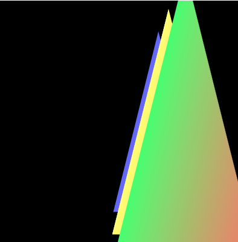

此时 `z` 值最大的绿色三角形在最上面，其次使黄色三角形，最底下的而是紫色三角形。

[实例 `demo` 地址](https://github.com/tangjie-93/WebGL/blob/main/%E8%B7%9F%E7%9D%80%E5%AE%98%E7%BD%91%E5%AD%A6WebGL%2BWebGL%E7%BC%96%E7%A8%8B%E6%8C%87%E5%8D%97/%E6%B7%B1%E5%BA%A6%E7%BC%93%E5%86%B2%E5%8C%BA/demo/index3.html)

`gl.enable()`函数是用来开启`WebGL`中的多种功能的。一般有以下几个参数。
```js
gl.DEPTH_TEST:隐藏面清除
gl.BLEND: 混合
gl.POLYGON_OFFSET_FILL: 多边形位移
```
## 3.深度冲突

当几何图形的两个表面极为接近时，会出现问题，表面上看起来斑斑驳驳的，这种现象称之为**深度冲突**。下面我们来绘制两个`Z`值完全一致的三角形来进行测试。
顶点数据如下所示:
```js
var verticesColors = new Float32Array([
    // Vertex coordinates and color
    0.0, 2.5, -5.0,  0.4,1.0,0.4, // The green triangle
    -2.5,-2.5,-5.0,  0.4,1.0,0.4,
    2.5, -2.5,-5.0,  1.0,0.4,0.4,

    0.0, 3.0, -5.0, 1.0,0.4,0.4, // The yellow triagle
    -3.0,-3.0,-5.0, 1.0,1.0,0.4,
    3.0, -3.0,-5.0, 1.0,1.0,0.4
  ])
```
[demo地址 ](https://github.com/tangjie-93/WebGL/blob/main/%E8%B7%9F%E7%9D%80%E5%AE%98%E7%BD%91%E5%AD%A6WebGL%2BWebGL%E7%BC%96%E7%A8%8B%E6%8C%87%E5%8D%97/%E6%B7%B1%E5%BA%A6%E7%BC%93%E5%86%B2%E5%8C%BA/demo/zFight.html)
绘制结果如下所示：<br>
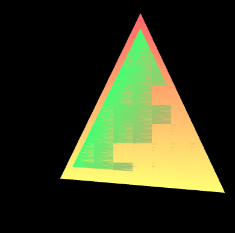

`WebGL`为了解决这个问题，提供了一种**多边形偏移**的机制来解决这个问题。该机制将自动在`z`值上添加一个偏移量，偏移量的值由物体表面相对于观察者视线的角度来确定。启动该机制只需要两行代码。
+ 启用多边形偏移。
```js
gl.enable(gl.POLYGON_OFFSET_FILL)
```
+ 在绘制之前指定用来计算偏移量的参数。
```js
 gl.polygonOffset(1.0, 1.0) 
```
`gl.polygonOffset(factor, units) `偏移量按照公式`m*factor+r*units`计算，其中`m`表示顶点所在表面相对于观察者的视角的角度，而`r`表示硬件能够区分两个`z`值之差的最小值。
开启多边形偏移后的绘制结果如下所示。<br>
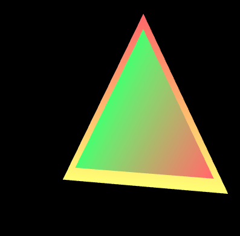

[`demo`地址 ](https://github.com/tangjie-93/WebGL/blob/main/%E8%B7%9F%E7%9D%80%E5%AE%98%E7%BD%91%E5%AD%A6WebGL%2BWebGL%E7%BC%96%E7%A8%8B%E6%8C%87%E5%8D%97/%E6%B7%B1%E5%BA%A6%E7%BC%93%E5%86%B2%E5%8C%BA/demo/zFight.html)


## 4.投影矩阵对顶点绘制的影响

#### 4.1 不使用投影矩阵
> 下面是不开启深度测试的情况

+ 顶点着色器中的代码
```js
attribute vec4 a_Position;
attribute vec4 a_Color;
varying vec4 v_Color;
void main() {
    gl_Position = a_Position;
    v_Color = a_Color;
}
```
+ `js`中的顶点坐标代码
```js
const pc = new Float32Array([ // Vertex coordinates and color
    0.0,  0.5,   0.1,  0.0,  0.0,  1.0,  // The front blue one 
    -0.5, -0.5,  0.1,  0.0,  0.0,  1.0,
    0.5, -0.5,   0.1,  1.0,  1.0,  0.0, 

    0.5,  0.4,   -0.5,  1.0,  1.0,  0.0,  // The red triangle is behind
    -0.5,  0.4,  -0.5,  1.0,  0.0,  0.0,
    0.0, -0.6,   -0.5,  1.0,  0.0,  0.0, 
]);
```
分析：从上面的顶点坐标以及颜色的代码，我们可以知道 `z`轴坐标为 `-0.1`的三角形的顶点颜色蓝色和黄色。`z`轴坐标为 `-0.5`的三角形的顶点颜色红色和黄色。

按照右手坐标系，理论上，  `z`轴坐标为 `-0.1`的三角形应该在 `z`轴坐标为 `-0.5`的上面。然后实际的结果如下图所示， `z`轴坐标为 `-0.5`的三角形在上面。

视觉效果如下图所示：

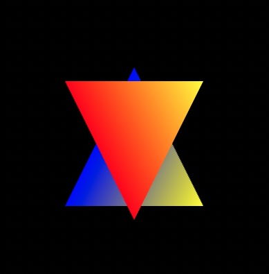<br>

当我们改变顶点坐标的绘制顺序时。
```js
const pc = new Float32Array([ // Vertex coordinates and color
     0.5,  0.4,  -0.5,  1.0,  1.0,  0.0,  // The red triangle is behind
    -0.5,  0.4,  -0.5,  1.0,  0.0,  0.0,
     0.0, -0.6,  -0.5,  1.0,  0.0,  0.0, 
     0.0,  0.5,  0.1,  0.0,  0.0,  1.0,  // The front blue one 
    -0.5, -0.5,  0.1,  0.0,  0.0,  1.0,
     0.5, -0.5,  0.1,  1.0,  1.0,  0.0, 
]); 
```
视觉效果如下所示

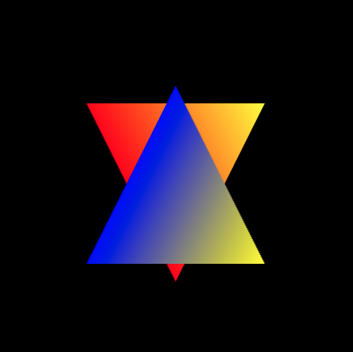<br>

下面是不使用投影矩阵绘制顶点的两个`demo`。
[z值小的顶点后绘制](https://github.com/tangjie-93/WebGL/blob/main/%E8%B7%9F%E7%9D%80%E5%AE%98%E7%BD%91%E5%AD%A6WebGL%2BWebGL%E7%BC%96%E7%A8%8B%E6%8C%87%E5%8D%97/%E5%9D%90%E6%A0%87%E7%B3%BB/demo/z%E5%80%BC%E5%B0%8F%E7%9A%84%E9%A1%B6%E7%82%B9%E5%90%8E%E7%BB%98%E5%88%B6.html)
[z值小的顶点先绘制](https://github.com/tangjie-93/WebGL/blob/main/%E8%B7%9F%E7%9D%80%E5%AE%98%E7%BD%91%E5%AD%A6WebGL%2BWebGL%E7%BC%96%E7%A8%8B%E6%8C%87%E5%8D%97/%E5%9D%90%E6%A0%87%E7%B3%BB/demo/z%E5%80%BC%E5%B0%8F%E7%9A%84%E9%A1%B6%E7%82%B9%E5%85%88%E7%BB%98%E5%88%B6.html)

> 开启深度测试的情况

开启深度测试后，不管顶点坐标的绘制顺序是怎样的，顶点的颜色由顶点的深度(`z`值)所决定，同一位置的顶点，其颜色由`z`值最靠近视点的顶点决定(这里的`z`值，说的时`NDC`坐标系中(左手坐标系，`z`轴指向屏幕里面)的坐标)。
```js
const pc = new Float32Array([ // Vertex coordinates and color
     0.5,  0.4,  -0.5,  1.0,  1.0,  0.0,  // The red triangle is behind
    -0.5,  0.4,  -0.5,  1.0,  0.0,  0.0,
     0.0, -0.6,  -0.5,  1.0,  0.0,  0.0, 
     0.0,  0.5,  0.1,  0.0,  0.0,  1.0,  // The front blue one 
    -0.5, -0.5,  0.1,  0.0,  0.0,  1.0,
     0.5, -0.5,  0.1,  1.0,  1.0,  0.0, 
]);
//或者
const pc2 = new Float32Array([ // Vertex coordinates and color
    0.0,  0.5,  0.1,  0.0,  0.0,  1.0,  // The front blue one 
    -0.5, -0.5, 0.1,  0.0,  0.0,  1.0,
    0.5, -0.5,  0.1,  1.0,  1.0,  0.0, 

    0.5,  0.4,  -0.5,  1.0,  1.0,  0.0,  // The red triangle is behind
    -0.5,  0.4,  -0.5,  1.0,  0.0,  0.0,
    0.0, -0.6,  -0.5,  1.0,  0.0,  0.0,     
]);
...
gl.enable(gl.DEPTH_TEST);
```
上面开启深度测试的顶点绘制的图形如下所示<br>
<br>

```js
const pc = new Float32Array([ // Vertex coordinates and color
     0.0,  0.5,  0.1,  0.0,  0.0,  1.0,  // The front blue one 
    -0.5, -0.5,  0.1,  0.0,  0.0,  1.0,
     0.5, -0.5,  0.1,  1.0,  1.0,  0.0, 

     0.5,  0.4,  0.5,  1.0,  1.0,  0.0,  // The red triangle is behind
    -0.5,  0.4,  0.5,  1.0,  0.0,  0.0,
     0.0, -0.6,  0.5,  1.0,  0.0,  0.0, 
]);
//或者
const pc2 = new Float32Array([ // Vertex coordinates and color
     0.5,  0.4,  0.5,  1.0,  1.0,  0.0,  // The red triangle is behind
    -0.5,  0.4,  0.5,  1.0,  0.0,  0.0,
     0.0, -0.6,  0.5,  1.0,  0.0,  0.0, 

     0.0,  0.5,  0.1,  0.0,  0.0,  1.0,  // The front blue one 
    -0.5, -0.5,  0.1,  0.0,  0.0,  1.0,
     0.5, -0.5,  0.1,  1.0,  1.0,  0.0, 
]);
...
gl.enable(gl.DEPTH_TEST);
```
上面开启深度测试的顶点绘制的图形如下所示<br>
<br>

#### 5.2 使用投影矩阵
但我们使用投影矩阵后，通过设置正射投影矩阵中的远、近平面的位置，我们看到的结果又会不一样。

**注意：** 使用投影矩阵时，都会默认开启深度测试,开启深度测试后的顶点的颜色由顶点的深度(`z`值)所决定，同一位置的顶点，其颜色由`z`值最大的顶点决定(这里的`z`值，说的时`NDC`坐标系中的坐标)。
```js
gl.enable(gl.DEPTH_TEST); 
```
+ 顶点着色器中的代码
```js
attribute vec4 a_Position;
attribute vec4 a_Color;
uniform mat4 u_MvpMatrix;
varying vec4 v_Color;
void main() {
    gl_Position = u_MvpMatrix * a_Position;
    v_Color = a_Color;
}
```
+ `js`中的顶点坐标代码
```js
const pc = new Float32Array([ // Vertex coordinates and color
    0.0,  0.5,  -0.1,  0.0,  0.0,  1.0,  // The front blue one 
    -0.5, -0.5,  -0.1,  0.0,  0.0,  1.0,
    0.5, -0.5,  -0.1,  1.0,  1.0,  0.0, 

    0.5,  0.4,  -0.5,  1.0,  1.0,  0.0,  // The red triangle is behind
    -0.5,  0.4,  -0.5,  1.0,  0.0,  0.0,
    0.0, -0.6,  -0.5,  1.0,  0.0,  0.0, 
]);
```
+ 设置投影矩阵。
```js
const u_MvpMatrix = gl.getUniformLocation(gl.program, 'u_MvpMatrix');
const mvpMatrix = new Matrix4();
// setOrtho(left,right,bottom,top,near,far)
mvpMatrix.setOrtho(-1, 1, -1, 1, 1, -1);   // Set the viewing volume
// Pass the view matrix to u_MvpMatrix
gl.uniformMatrix4fv(u_MvpMatrix, false, mvpMatrix.elements);

```
根据正射矩阵的公式，如下图所示。<br>

<br>

下面我们又看下通过设置远、近平面的大小关系来观察看到的实际效果。

> `near>far` 的正交投影

我们将 `left=-1,right=1,bottom=-1,top=1,near=1,far= -1` 代入上面的矩阵可以得到如下的单位矩阵。<br>

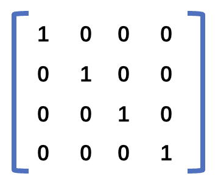<br>

根据正射投影的示意图。再结合 `near = 1` 要比`far =-1`大，表示在视线方向上，**远裁剪面(或者叫远平面)实际在近裁剪面(或者叫近平面)** 的前面，表示我们将**远近截面** 做了旋转`180度`，将`z`轴正向朝向屏幕里面，这是刚好跟左手坐标系一样。<br>
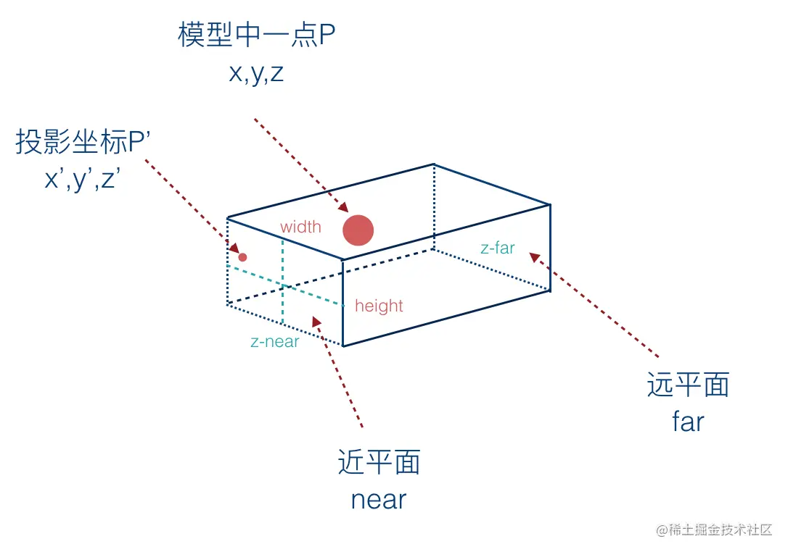<br>

通过上面的参数设置的正交投影矩阵， **可以得出结论**：当正射矩阵中的`near>far`时，`WebGL`就会使用左手坐标系统。此时看到的效果还是会跟之前一样。**就算我们改变顶点的绘制顺序，最终的视觉效果都是一样的**，都如下图所示<br>

<br>

`demo`地址为 [使用投影矩阵(near>far)](https://github.com/tangjie-93/WebGL/blob/main/%E8%B7%9F%E7%9D%80%E5%AE%98%E7%BD%91%E5%AD%A6WebGL%2BWebGL%E7%BC%96%E7%A8%8B%E6%8C%87%E5%8D%97/%E5%9D%90%E6%A0%87%E7%B3%BB/demo/%E4%BD%BF%E7%94%A8%E6%8A%95%E5%BD%B1%E7%9F%A9%E9%98%B5near%E5%A4%A7%E4%BA%8Efar(z%E5%80%BC%E5%B0%8F%E7%9A%84%E9%A1%B6%E7%82%B9%E5%90%8E%E7%BB%98%E5%88%B6).html)。

> `near<far` 的正交投影

但是如果我们将参数做以下调整。
```js
mvpMatrix.setOrtho(-1, 1, -1, 1, -1, 1); 
```
我们将 `left=-1,right=1,bottom=-1,top=1,near=-1,far= 1` 代入上面的矩阵可以得到如下的矩阵。<br>

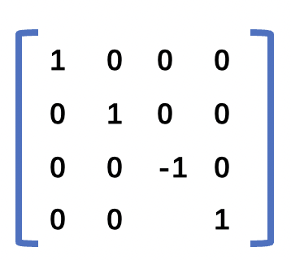<br>

而且**不管我们是否改变顶点的绘制顺序**，都可以得到如下效果图。<br>

 <br>

现在我们看到的才是 `z=-0.1`三角形在 `z=-0.5`的三角形的上面。根据上面的矩阵，我们可以看到我们实际上是将坐标沿`z`轴，做了`-1`的缩放。此时我们可以将坐标系看成是`z`轴正向朝屏幕外的坐标系，也就是我们常说的右手坐标系。

`demo`地址为[使用投影矩阵(near<far)](https://github.com/tangjie-93/WebGL/blob/main/%E8%B7%9F%E7%9D%80%E5%AE%98%E7%BD%91%E5%AD%A6WebGL%2BWebGL%E7%BC%96%E7%A8%8B%E6%8C%87%E5%8D%97/%E5%9D%90%E6%A0%87%E7%B3%BB/demo/%E4%BD%BF%E7%94%A8%E6%8A%95%E5%BD%B1%E7%9F%A9%E9%98%B5near%E5%B0%8F%E4%BA%8Efar(z%E5%80%BC%E5%B0%8F%E7%9A%84%E9%A1%B6%E7%82%B9%E5%85%88%E7%BB%98%E5%88%B6).html)

**结论：** 使用正交投影后的坐标，然后根据深度测试，以及左手坐标系，同一个位置的颜色由`z`值最小的顶点决定。


<Valine></Valine>