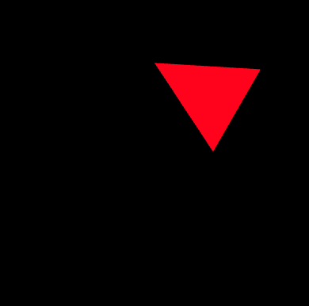

## 1.模型矩阵的定义

对模型进行平移、旋转和缩放等操作后，会得到一个变换后的模型，将模型进行平移、旋转和缩放后，将这些变换全部**复合**成一个等效的变换，就称为**模型变换**。
## 2.模型矩阵的使用
模型变换后最终的结果，跟对模型进行的变换操作的顺序是有关系的。平移和旋转的参数一样，顺序不一样，最终得到的结果也是不一样的。接下来我们来看一下下面的两个例子。
+ 先平移后旋转
```js
平移旋轴后的模型 = 旋转矩阵*平移矩阵*原始坐标
```
顶点着色器中的代码
```js
attribute vec4 a_Position;
uniform mat4 u_ModelMatrix;
void main() {
    gl_Position = u_ModelMatrix * a_Position;
}
```
js中的代码
```js
let modelMatrix = new Matrix4();

// Calculate a model matrix
const ANGLE = 60.0; // The rotation angle
const Tx = 0.5;     // Translation distance
modelMatrix.setTranslate(Tx, 0, 0);  // Set translation matrix
modelMatrix.rotate(ANGLE, 0, 0, 1); 

...
const u_ModelMatrix = gl.getUniformLocation(gl.program, 'u_ModelMatrix');
if (!u_ModelMatrix) {
    console.log('Failed to get the storage location of u_xformMatrix');
    return;
}
gl.uniformMatrix4fv(u_ModelMatrix, false, modelMatrix.elements);
```

经过模型变换后的最终结果如下所示：


[demo地址](https://github.com/tangjie-93/WebGL/blob/main/%E8%B7%9F%E7%9D%80%E5%AE%98%E7%BD%91%E5%AD%A6WebGL%2BWebGL%E7%BC%96%E7%A8%8B%E6%8C%87%E5%8D%97/%E6%97%8B%E8%BD%AC%E5%B9%B3%E7%A7%BB%E5%92%8C%E6%97%8B%E8%BD%AC/demo/%E5%B9%B3%E7%A7%BB%E5%90%8E%E5%86%8D%E6%97%8B%E8%BD%AC.html)

+ 先旋转后平移
```js
平移旋轴后的模型 = 平移矩阵*旋转矩阵*原始坐标
```
顶点坐标跟先平移后旋转的坐标是一样的。不同的地方在于平移矩阵在旋转矩阵的左边。跟之前的计算顺序刚好反了过来。
```js
let modelMatrix = new Matrix4();

// Calculate a model matrix
const ANGLE = 60.0; // The rotation angle
const Tx = 0.5;     // Translation distance
modelMatrix.setRotate(ANGLE, 0, 0, 1); 
modelMatrix.translate(Tx, 0, 0);  // Set translation matrix

```
经过模型变换后的最终结果如下所示：


**结论:** 从上面的图片可以看出，模型变换的顺序很重要，即便旋转的参数完全一样，顺序不一样，旋转后的结果也会不一样。

[demo地址](https://github.com/tangjie-93/WebGL/blob/main/%E8%B7%9F%E7%9D%80%E5%AE%98%E7%BD%91%E5%AD%A6WebGL%2BWebGL%E7%BC%96%E7%A8%8B%E6%8C%87%E5%8D%97/%E6%97%8B%E8%BD%AC%E5%B9%B3%E7%A7%BB%E5%92%8C%E6%97%8B%E8%BD%AC/demo/%E6%97%8B%E8%BD%AC%E5%90%8E%E5%86%8D%E5%B9%B3%E7%A7%BB.html)

<Valine></Valine>