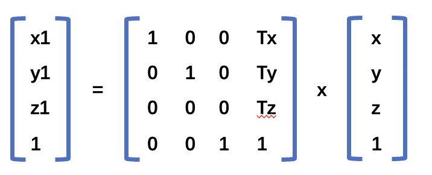

## 1.平移的概念
为了平移一个三角形，我们需要对它的每一个顶点在对应的坐标轴上移动一定的距离。假如我们将点 `P(x,y,z)` 平移到 `P1(x1,y1,z1)`,在三个坐标轴上平移的距离分别是,`Tx,Ty,Tz`,那么用**公式**就可以表示为：
```js
x1 = x + Tx
y1 = y + Ty
z1 = z + Tz
```
在顶点着色器中表示为：
```js
attribute vec4 a_Position;
uniform vec4 u_Translation;
void main(){
    gl_Position = a_Position + u_Translation;
}
```
在`js`代码中传递`u_Translation`的代码如下所示：
```js
const u_Translation = gl.getUniformLocation(gl.program,'u_Translation');
const Tx = 0.5;
const Ty = 0.5;
const Tz = 0.0;
gl.uniform4f(u_Translation,Tx,Ty,Tz,0.0);
```

具体的`demo` 可以参考 [平移](https://github.com/tangjie-93/WebGL/blob/main/%E8%B7%9F%E7%9D%80%E5%AE%98%E7%BD%91%E5%AD%A6WebGL%2BWebGL%E7%BC%96%E7%A8%8B%E6%8C%87%E5%8D%97/%E6%97%8B%E8%BD%AC%E5%B9%B3%E7%A7%BB%E5%92%8C%E6%97%8B%E8%BD%AC/demo/%E5%B9%B3%E7%A7%BB.html) 。

## 2.平移矩阵
可以使用以下的矩阵能来实现三角形的平移。

上面矩阵的乘法结果如下所示。

```js
x1 = ax + by + cz + d = x + Tx
y1 = ex + fy + gz + h = y + Ty
z1 = ix + jy + kz + l = z + Tz
1  = mx + ny + oz + p
```
根据上面的乘法结果可以得出平移矩阵的结果。
```js
a = 1, b = 0, c = 0, d = Tx; 
e = 0, f = 1, g = 0, h = Ty;
i = 0, j = 0, K = 1, l = Tz;
m = 0, n = 0, o = 0, p = 1;
```
所以可以得到平移矩阵如下所示


具体的`demo` 可以参考 [平移-矩阵](https://github.com/tangjie-93/WebGL/blob/main/%E8%B7%9F%E7%9D%80%E5%AE%98%E7%BD%91%E5%AD%A6WebGL%2BWebGL%E7%BC%96%E7%A8%8B%E6%8C%87%E5%8D%97/%E6%97%8B%E8%BD%AC%E5%B9%B3%E7%A7%BB%E5%92%8C%E6%97%8B%E8%BD%AC/demo/%E5%B9%B3%E7%A7%BB-%E7%9F%A9%E9%98%B5.html) 。

<Valine></Valine>