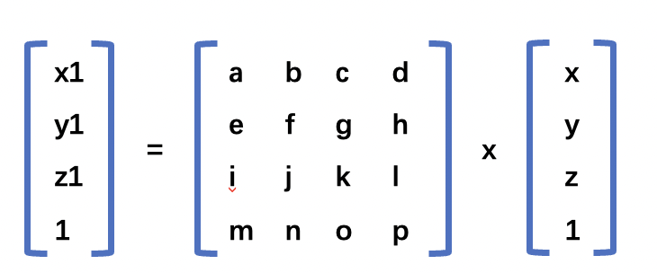
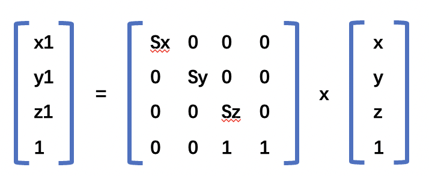

## 1.缩放
缩放相对来说比较简单。用公式可以表示为：
```js
x1 = Sx * x
y1 = Sy * y
z1 = Sz * z
```
具体的`demo` 可以参考 [缩放](https://github.com/tangjie-93/WebGL/blob/main/%E8%B7%9F%E7%9D%80%E5%AE%98%E7%BD%91%E5%AD%A6WebGL%2BWebGL%E7%BC%96%E7%A8%8B%E6%8C%87%E5%8D%97/%E6%97%8B%E8%BD%AC%E5%B9%B3%E7%A7%BB%E5%92%8C%E6%97%8B%E8%BD%AC/demo/%E7%BC%A9%E6%94%BE.html) 。
## 2.缩放矩阵
可以使用以下的矩阵能来实现三角形的缩放。

上面矩阵的乘法结果如下所示。

```js
x1 = ax + by + cz + d = Sx * x
y1 = ex + fy + gz + h = Sy * y
z1 = ix + jy + kz + l = Sz * z
1  = mx + ny + oz + p
```
根据上面的乘法结果可以得出平移矩阵的结果。
```js
a = Sx, b = 0,  c = 0, d =0; 
e = 0,  f = Sy, g = 0, h = 0;
i = 0,  j = 0,  K = Sz,l = 0;
m = 0,  n = 0,  o = 0, p = 1;
```
所以可以得到平移矩阵如下所示


具体的`demo` 可以参考 [缩放-矩阵](https://github.com/tangjie-93/WebGL/blob/main/%E8%B7%9F%E7%9D%80%E5%AE%98%E7%BD%91%E5%AD%A6WebGL%2BWebGL%E7%BC%96%E7%A8%8B%E6%8C%87%E5%8D%97/%E6%97%8B%E8%BD%AC%E5%B9%B3%E7%A7%BB%E5%92%8C%E6%97%8B%E8%BD%AC/demo/%E7%BC%A9%E6%94%BE-%E7%9F%A9%E9%98%B5.html)  。
<Valine></Valine>