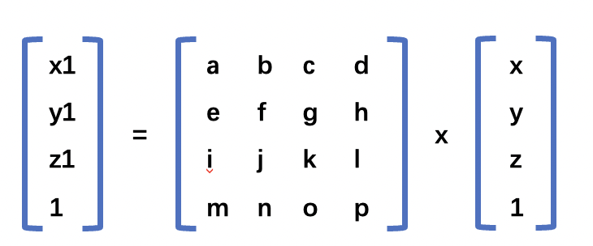

## 1、旋转
旋转笔平移要复杂一些。为了描述旋转，你必须要指明以下三个条件。
+ 旋转轴
+ 旋转方向，顺时针或者逆时针
+ 旋转角度

旋转中，右手握拳，大拇指伸直并指向其旋转轴的正方向，那么右手其余几个手指久指明了旋转的方向，因此沿着逆时针旋转的正旋转又可以称为**右手法则旋转**。它是`WebGL`程序的默认设定。
下面我们通过计算一个绕`Z`轴旋转的模型，来推导选轴公式和旋转矩阵。


上图中，`r` 是从原点到 `p`点的距离。而`𝛼`则是 `X`轴旋轴到`p`点的角度，用着两个变量可以得出  `p` 点的坐标。
```js
x = r*cos(𝛼)

y = r*san(𝛼)
``` 
同样我么，也可以用  `𝛼``𝛽` 和`r`来表示点 `p1`的坐标。
```js
x1 = r*cos(𝛼+𝛽)
y1 = r*sin(𝛼+𝛽)
``` 
利用我们学过的三角函数两角和公式。
```js
sin(𝛼±𝛽) = sin(𝛼)cos(𝛽) ± cos(𝛼)sin(𝛽)
cos(𝛼±𝛽) = cos(𝛼)cos(𝛽) ∓ sin(𝛼)sin(𝛽)
```
根据三角和公式
```js
x1 = r*cos(𝛼+𝛽) = r(cos(𝛼)cos(𝛽) - sin(𝛼)sin(𝛽))
y1 = r*sin(𝛼+𝛽) = r(sin(𝛼)cos(𝛽) + cos(𝛼)sin(𝛽))
``` 
最后将  `r= x/cos(𝛼)`和 `r = y/san(𝛼)` 带入上面的公式可以得到。
```js
x1 = x * cos(𝛽) - y * sin(𝛽)
y1 = x * sin(𝛽) + y * cos(𝛽)
z1 = z
```

然后我们可以根据旋转的角度`𝛽`将 `sin(𝛽)`和 `sin(𝛽)`的值传递给顶点着色器，然后得到旋转后的顶点坐标，就可以实现旋转的效果了。
顶点着色器中的代码如下所示：
```js
attribute vec4 a_Position;
uniform float u_cosB,u_sinB;
void main(){
    gl_Position.x = a_Position.x * u_cosB - a_Position.y * u_sinB;
    gl_Position.y = a_Position.x * u_sinB - a_Position.y * u_cosB;
    gl_Position.z = a_Position.z;
    gl_Position.w = 1.0;
}

```
在`js`中的代码如下所示
```js
const ANGLE = 90.0; 
const radian = Math.PI * ANGLE / 180.0; // Convert to radians
const cosB = Math.cos(radian);
const sinB = Math.sin(radian);

const u_CosB = gl.getUniformLocation(gl.program, 'u_CosB');
const u_SinB = gl.getUniformLocation(gl.program, 'u_SinB');
gl.uniform1f(u_CosB, cosB);
gl.uniform1f(u_SinB, sinB);
```
具体的`demo` 可以参考 [旋转](https://github.com/tangjie-93/WebGL/blob/main/%E8%B7%9F%E7%9D%80%E5%AE%98%E7%BD%91%E5%AD%A6WebGL%2BWebGL%E7%BC%96%E7%A8%8B%E6%8C%87%E5%8D%97/%E6%97%8B%E8%BD%AC%E5%B9%B3%E7%A7%BB%E5%92%8C%E6%97%8B%E8%BD%AC/demo/%E6%97%8B%E8%BD%AC.html) 。

## 2.旋转矩阵的推导
可以使用以下的矩阵能来实现三角形的旋转。

上面矩阵的乘法结果如下所示。

```js
x1 = ax + by + cz + d = x * cos(𝛽) - y * sin(𝛽)
y1 = ex + fy + gz + h = x * sin(𝛽) + y * cos(𝛽)
z1 = ix + jy + kz + l = z
1  = mx + ny + oz + p
```
根据上面的乘法结果可以得出平移矩阵的结果。
```js
a = cos(𝛽),b = -sin(𝛽),c = 0,d =0; 
e = sin(𝛽),f = cos(𝛽), g = 0,h = 0;
i = 0,j = 0,K = 1,l = 0;
m = 0,n = 0,o = 0,p = 1;
```
所以可以得到平移矩阵如下所示


具体的`demo` 可以参考 [旋转-矩阵](https://github.com/tangjie-93/WebGL/blob/main/%E8%B7%9F%E7%9D%80%E5%AE%98%E7%BD%91%E5%AD%A6WebGL%2BWebGL%E7%BC%96%E7%A8%8B%E6%8C%87%E5%8D%97/%E6%97%8B%E8%BD%AC%E5%B9%B3%E7%A7%BB%E5%92%8C%E6%97%8B%E8%BD%AC/demo/%E6%97%8B%E8%BD%AC-%E7%9F%A9%E9%98%B5.html) 。

<Valine></Valine>