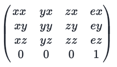

## 1.视点和视线
三维物体跟二维物体的显著区别就是，三维物体具有深度，也就是 `z` 轴。我们最终把三维场景绘制到屏幕上，并以一个观察者的身份去看待三维场景。为了定义一个观察者。我们需要考虑以下两点：
+ 观察方向，也就是观察者自己在什么位置，在看场景的那一部分。
+ 可视距离，也就是观察者能看多远。

三维世界中，我们将观察者的位置称之为**视点**，从视点出发沿着观察方向的射线我们称之为**视线**。在 `WebGL`系统中，默认情况下，视点位于原点`(0,0,0)`,视线为`z`轴负半轴，指向屏幕内部的方向(右手坐标系)。

## 2.视点、观察目标和上方向
+ **视点**：观察者所在的三维空间位置，视线的起点，一般用`Pe（ex,ey,ez）` 来表示。
+ **观察目标点**：被观察的目标所在的点，视线从视点出发，穿过目标点并继续延伸。只有同时知道观察目标点和视点，才能算出视线方向。观察目标点的坐标一般用`T(tx,ty,tz)`表示。
+ **上方向**：最终绘制在屏幕上的影像中的向上的方向,也称为相机上方方向。因为观察者还是可以以视线为旋转轴的，如果旋转旋转轴，观察者看到的场景也会偏移。上方向一般用`upDirection(ux,uy,uz)`表示。

在`WebGL`中，我们可以用上面三个矢量创建一个**视图矩阵**

视图矩阵的目的是改变观察者看到的三维场景。本质上其实还是将三维场景里面的模型进行的移动操作。

实际上，**根据自定义的观察者状态，绘制观察者看到的景象**与**使用默认的观察状态，对三维对象进行平移、旋转等变换，再绘制观察者看到的景象**这两种行为是等价的。
## 3.视图矩阵的推导
在 `WebGL` 中，视图矩阵`（View Matrix）`用于将世界坐标系转换到相机坐标系，从而模拟相机视角。

下面我们将推导一下**视图矩阵**的计算过程。

根据相机坐标系原点(视点)在世界坐标系中的位置为 `Pe(ex,ey,ez)`，目标位置`T(tx,ty.tz)`以及上方向`upDirection(ux,uy,uz)`,我们可以求解相机坐标系的**基向量**在世界坐标系中的表示

#### 1. 计算`Z`轴方向向量

从 **相机位置(Pe)** 看向 **目标位置(T)** 的方向称为**观察方向**，观察方向可以看做相机坐标系的 `Z` 轴方向，那么世界坐标系的 **Z轴方向向量**可以这样求出：

```js
zAxis = Pe - T = (ex-tx,ey-ty,ez-tz)  
```
将其归一化得到`Z`轴基向量`(zx, zy, zz)`。
```js
(zx, zy, zz) = 1/|Pe-T| * (ex - tx, ey - ty, ez - tz)
```
#### 2.计算`X`轴方向向量
有了 `Z` 轴方向向量 `zAxis`和临时 `Y` 轴 方向 `upDirection`，我们就可以利用向量**叉乘**来计算 `X` 轴方向了。
```js
xAxis = zAxis x upDirection
```
将其归一化得到`X`轴基向量`(xx, xy, xz)`。
```js
(xx, xy, xz) = (zAxis x upDirection) / |zAxis x upDirection|
```
计算出 `X` 轴方向之后，我们需要将 `xAxis` 和 `zAxis` 归一化，得到它们的基向量。

因为 `upDirection` 是我们一开始假想的，只是为了求解 `X` 轴方向，**`upDirection` 和 `zAxis` 不一定是垂直关系**。所以我们需要再求一遍 `Y` 轴的方向向量。仍然利用向量叉乘求解 `Y` 轴方向向量：
#### 3.计算 `Y`轴方向向量
```js
yAxis= zAxis × xAxis
```
将其归一化得到`X`轴基向量`(Yx, Yy, Yz)`。
```js
(xx, xy, xz) = (zAxis x upDirection) / |zAxis x upDirection|
```
#### 4. 构建旋转矩阵
将求得的`X,Y,Z`轴的方向都归一化后，根据归一化的`X,Y,Z`轴基向量`xAxis(xx, xy, xz)、yAxis(yx, yy, yz)、zAxis(zx, zy, zz)`



通过对相机矩阵，求逆矩阵就可以得到我们的**视图矩阵**。

## 4.视图矩阵的算法实现

下面是**视图矩阵**算法实现。

#### 1.求出`Z` 轴基向量，即观察方向：
```js
function lookAt(cameraPosition, target, upDirection){
    const zAxis  = (Vector3.subtractVectors(cameraPosition, target)).normalize();
}
```
#### 2.根据 `zAxis` 和 `upDireciton` 求出 `X` 轴基向量：
```js
const xAxis = (Vector3.cross(upDirection, zAxis)).normalize();
```
#### 3.根据 `zAxis` 和 `xAxis` ，重新计算`Y`轴基向量 `yAxis`：
```js
const yAxis = (Vector3.cross(zAxis, xAxis)).normalize();
```
#### 4.构建旋转矩阵
```js
function createRotateMatrx(cameraPosition, target, up) {
    const zAxis = normalize(
        subtractVectors(cameraPosition, target));
    const xAxis = normalize(cross(up, zAxis));
    const yAxis = normalize(cross(zAxis, xAxis));
 
    return new Float32Array([
       //第一列 x轴基向量  第二列  y轴基向量 /第三列 z轴基向量
       xAxis[0], yAxis[0], zAxis[0],
       xAxis[1], yAxis[1], zAxis[1],
       xAxis[2], yAxis[2], zAxis[2]
    ]);
```
#### 5.构建平移矩阵
为了将世界坐标系中的点平移到相机的视图坐标系，我们需要一个平移矩阵。
在世界坐标系中，相机位置的点为 `cameraPosition(x,y,z)`,那么在相机坐标系中，相机的位置为 `(0,0,0)`，世界坐标系中的原点位置则为`-cameraPosition(x,y,z)`。所以就有了的下面的平移矩阵。
```js
function createTranslateMatrix(cameraPosition) {
  return  new Float32Array([
        //第一列 x轴基向量  第二列  y轴基向量 /第三列 z轴基向量
        1,0,0, -cameraPosition[0],
        0,1,0, -cameraPosition[1],
        0,0,1, -cameraPosition[2],
        0,0,0,1
    ]);
}
```
#### 6.视图矩阵的实现
也就是**相机坐标系**的坐标通过右乘该矩阵可以到其在**世界坐标系**下的坐标。
```js
function createViewMatrix(cameraPosition, target, up) {
    // const rotateMatrx = createRotateMatrx(cameraPosition, target, up);
    // const translateMatrix = createTranslateMatrix(cameraPosition);
    // const viewMatrix = multiplyMatrices(rotateMatrx,translateMatrix);
    // return viewMatrix;
    // 上面通过矩阵运算得到的结果跟下面的结果是一样的
    const zAxis = normalize(
                subtractVectors(cameraPosition, target));
    const xAxis = normalize(cross(up, zAxis));
    const yAxis = normalize(cross(zAxis, xAxis));
    return [
        xAxis[0], yAxis[0], zAxis[0], 0,
        xAxis[1], yAxis[1], zAxis[1], 0,
        xAxis[2], yAxis[2], zAxis[2], 0,
        -dot(xAxis, cameraPosition), -dot(yAxis, cameraPosition), -dot(zAxis, cameraPosition), 1
    ];
}
```
## 5.推导过程中用到的基本方法
下面是推导过程中用到的一些基本方法
> 归一化
```js
function normalize(v) {
  const length = Math.sqrt(v[0] * v[0] + v[1] * v[1] + v[2] * v[2]);
  // 确定不会除以 0
  if (length > 0.00001) {
    return [v[0] / length, v[1] / length, v[2] / length];
  } else {
    return [0, 0, 0];
  }
}
```
> 向量相减
```js
function subtractVectors(a, b) {
  return [a[0] - b[0], a[1] - b[1], a[2] - b[2]];
}
```
> 向量的叉乘
```js
[
  1, 1, 1,
  a0,a1,a2,
  b0,b1,b2
]
//利用三阶行列式求叉乘
function cross(a, b) {
  return [
    a[1] * b[2] - a[2] * b[1],
    a[2] * b[0] - a[0] * b[2],
    a[0] * b[1] - a[1] * b[0]
  ];
}
```
> 向量点乘
```js
function dot(a, b) {
    return a[0] * b[0] + a[1] * b[1] + a[2] * b[2];
}
```
> 矩阵乘法
```js
function multiplyMatrices(a, b) {
    let result = new Array(16);
    for (let i = 0; i < 4; i++) {
        for (let j = 0; j < 4; j++) {
            result[i * 4 + j] = a[i * 4 + 0] * b[0 * 4 + j] +
                                a[i * 4 + 1] * b[1 * 4 + j] +
                                a[i * 4 + 2] * b[2 * 4 + j] +
                                a[i * 4 + 3] * b[3 * 4 + j];
        }
    }
    return result;
}
```

下面是使用视图矩阵的代码[demo地址](https://github.com/tangjie-93/WebGL/blob/main/%E8%B7%9F%E7%9D%80%E5%AE%98%E7%BD%91%E5%AD%A6WebGL%2BWebGL%E7%BC%96%E7%A8%8B%E6%8C%87%E5%8D%97/%E7%9B%B8%E6%9C%BA(%E8%A7%86%E5%9B%BE)/index-%E4%B8%8D%E4%BD%BF%E7%94%A8%E9%80%86%E7%9F%A9%E9%98%B5.html)

**参考文档**<br>
[相机矩阵的推导](https://juejin.cn/book/6844733755580481543/section/6844733755941191694)<br>
[WebGL三维相机](https://webglfundamentals.org/webgl/lessons/zh_cn/webgl-3d-camera.html)<br>

<Valine></Valine>