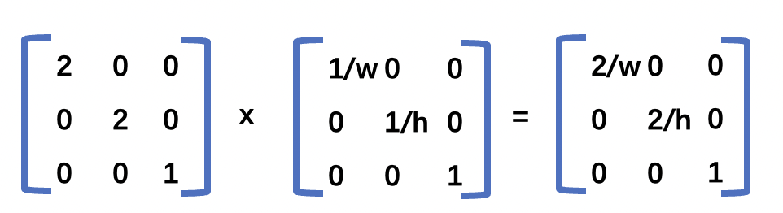
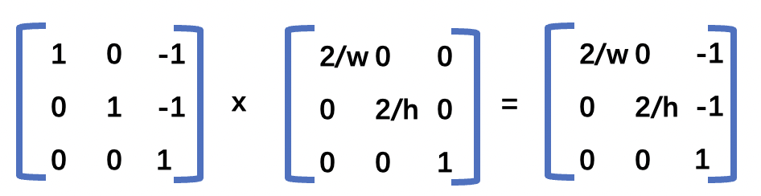
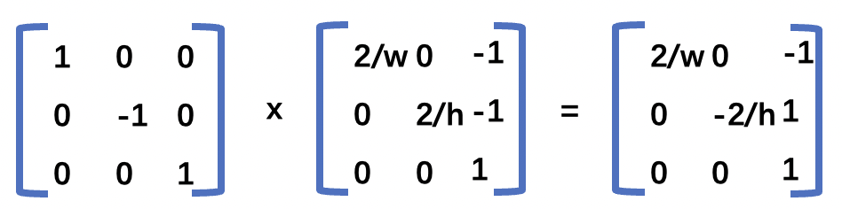
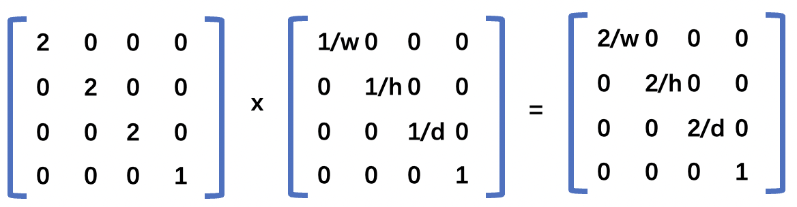
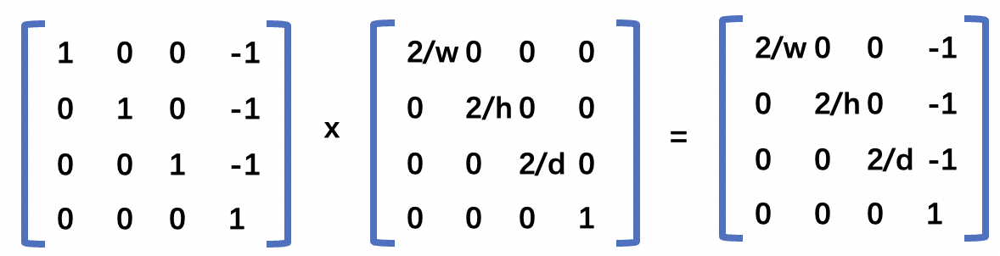
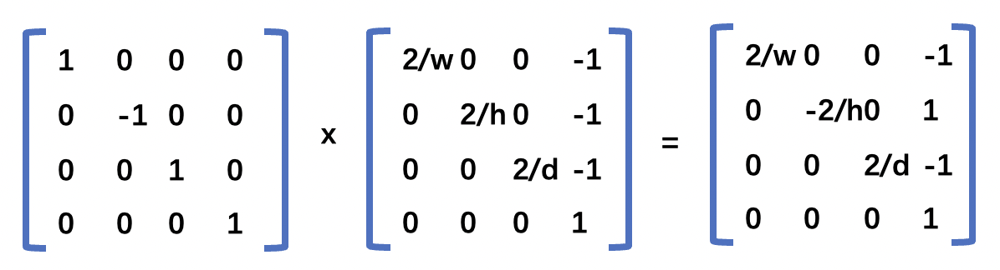

## 1.二维投影矩阵的推导
想要推导出投影矩阵，首先我们需要明白在投影的过程中发生了什么？
投影就是将模型的坐标转换成裁剪坐标系中的坐标，坐标范围从 `[-1,1]`。
在着色器中我们是根据下面的坐标  **将像素坐标转换到裁剪坐标** 的。
```js
 // 从像素坐标转换到 0.0 到 1.0
  vec2 zeroToOne = position / u_resolution;
  // 再把 0->1 转换 0->2
  vec2 zeroToTwo = zeroToOne * 2.0;
  // 把 0->2 转换到 -1->+1 (裁剪空间)
  vec2 clipSpace = zeroToTwo - 1.0;
 
  gl_Position = vec4(clipSpace * vec2(1, -1), 0, 1);
```
逐步观察，我们就会发现上面的代码其实就是一个模型变换的过程。
#### 1. 缩放变换，将像素坐标转换到`[0，1]`
首先进行的是缩放变换，将像素坐标转换到`[0，1]`，对应的缩放矩阵如下所示(`w`是`canvas`的宽(`clientWidth`)，`h`是`canvas`的高(`clientHeight`))。
```js
[
    1/w,0,  0
    0,  1/h,0,
    0,  0,  1
]
```
#### 2. 第2步也是缩放变换，将模型缩放`2倍`
缩放矩阵如下所示
```js
[
    2,0,0,
    0,2,0,
    0,0,1
]
```
#### 3.第3步是平移变换，缩放矩阵如下所示
```js
[
    1,  0, 0,
    0,  1, 0,
    -1,-1, 1
]
```
#### 4.第4步是缩放变换，将模型根据`Y`轴进行`-1`的缩放,缩放矩阵如下所示。
```js
[
    1, 0, 0,
    0, -1,0,
    0, 0, 1
]
```
将上面4步的变换矩阵相乘，可以得到最终的矩阵，这个矩阵就是投影矩阵。


**第2步矩阵运算过程(2倍缩放)** 如下所示(矩阵运算是从右往左计算的，所以第1步得到的矩阵放在右边)。



**第3步矩阵运算过程(平移-1个单位)** 如下所示



**第4步矩阵运算过程(沿y轴缩放-1倍)** 如下所示



所以用`js`代码表示出来就是下面这个样子,`WebGL`使用的是列主序。
```js
function createProjectionMatrix(width, height) {
    return [
        2 / width,  0,           0,
        0,          -2 / height, 0,
        -1,         1,           1
    ]
}
```

## 2.三维投影矩阵的推导

三维比二维多了一个深度坐标。所以上面的二维坐标可以进行修改一下变成下面的三维坐标。
+ 首先进行的是缩放变换，将像素坐标转换到`[0，1]`，对应的缩放矩阵如下所示(`w`是`canvas`的宽(`clientWidth`)，`h`是`canvas`的高(`clientHeight`)), `d` 是模型在 `z` 轴方向限制的范围。
```js
[
    1/w,0,  0,  0,
    0,  1/h,0,  0,
    0,  0,  1/d,0,
    0,  0,  0,  1
]
```
+ 第2步也是缩放变换，缩放矩阵如下所示
```js
[
    2, 0 ,0, 0
    0, 2, 0, 0
    0, 0, 2, 0,
    0, 0, 0, 1
]
```
+ 第3步是平移变换，缩放矩阵如下所示
```js
[
    1, 0, 0, 0,
    0, 1, 0, 0,
    0, 0, 1, 0,
    -1,-1,-1,1
]
```
+ 第4步是也是缩放变换，将模型根据`Y`轴进行`-1`的缩放,缩放矩阵如下所示。
```js
[
    1, 0, 0, 0
    0,-1, 0, 0
    0, 0, 1, 0,
    0, 0, 0, 1
]
```
将上面4步的变换矩阵相乘，可以得到最终的三维投影矩阵。

**第2步矩阵运算过程(2倍缩放)** 如下所示(矩阵运算是从右往左计算的，所以第1步得到的矩阵放在右边)。



**第3步矩阵运算过程(平移-1个单位)** 如下所示



**第4步矩阵运算过程(沿y轴缩放-1倍)** 如下所示



## 3.投影的分类
我们可以将三维模型限制在一定的空间范围内，只有当模型在可视范围内，`WebGL`才会去绘制它。可视范围我们称之为**可视空间**,包括水平视角、垂直视角和可视深度。`WebGL`中有两类常用的可视空间，分别是：
+ 长方体可视空间，也称之为盒状空间，由**透视投影**产生。
+ 四棱锥/金字塔可视空间，有**透视投影**产生。

**注意：** 如果裁剪面的宽高比和`canvas`不一样，
```js
 canvas.width!==canvas.clientWidth&&canvas.height!==canvas.clientHeight
```
那么画面就会按照`canvas`的宽高比进行压缩，物体就会扭曲。


<Valine></Valine>