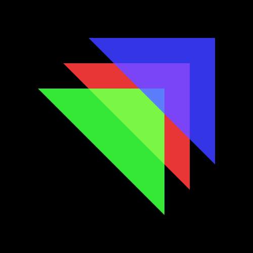
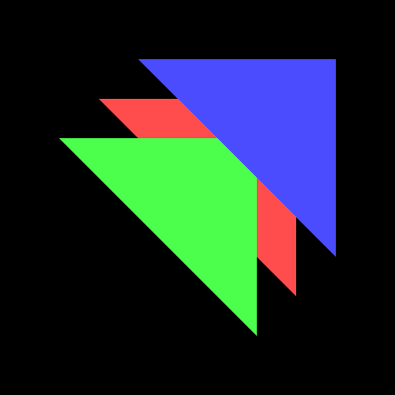
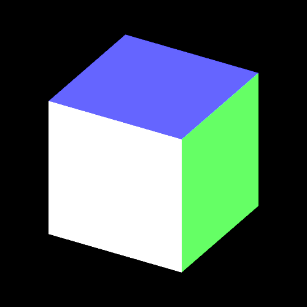
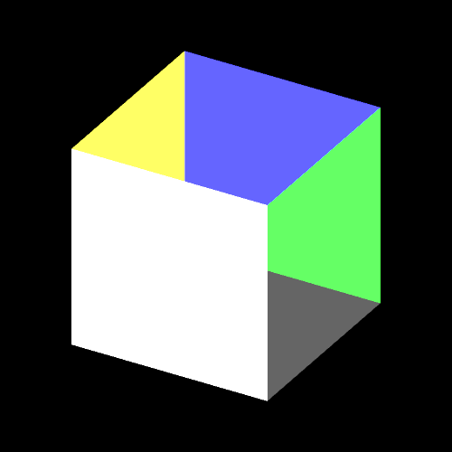
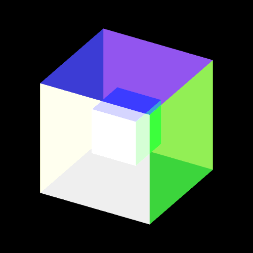

`GPU`的渲染管线有各种功能单元,通过执行`gl.enable`函数可以开启。`gl.enable`可以传入不同的值来开启相应的功能,`gl.enable()`的参数对应的功能模块。这些功能模块都处于渲染管线这条流水线上的不同位置,深度检测、`α`融合都是对RGBA像素相关的数据进行处理,在渲染管线上位于顶点着色器和片元着色器的后面。 常用的一些值如下所示：
[`gl.enable`官方文档地址](https://developer.mozilla.org/zh-CN/docs/Web/API/WebGLRenderingContext/enable)
```js
gl.DEPTH_TEST：启用深度测试,激活深度比较，并且更新深度缓冲区,根据坐标的远近自动隐藏被遮住的图形。
gl.CULL_FACE：激活多边形正反面剔除。
gl.BLEND：激活片元的颜色融合计算
gl.POLYGON_OFFSET_FILL：多边形偏移，解决深度冲突
...
```
可以通过调用`gl.isEnabled()`,来检测可用性。
```js
gl.isEnabled(gl.DITHER);
// true
```
## 1、α融合
`α`融合本质上就是颜色相互叠加融合。**先绘制的物体的颜色是目标颜色，后绘制的物体的颜色是源颜色。**
```js
//开启GPU渲染管线的α融合功能
gl.enable(gl.BLEND);
//源颜色和目标颜色融合的计算方法
gl.blendFunc(gl.SRC_ALPHA,gl.ONE_MINUS_SRC_ALPHA);
```
`gl.enable(gl.blend)`表示开启渲染管线的`α`融合,
`gl.blendFunc()`的第一个参数是源颜色的系数，第二个参数是目标颜色的系数，两组像素值乘以各自系数后然后相加得到融合后的像素值，覆盖原来的像素值。

`gl.blendFunc(gl.SRC_ALPHA,gl.ONE_MINUS_SRC_ALPHA)`,中的第一个参数`gl.SRC_ALPHA`表示的是源颜色像素值透明度分量`A1`的值，第二个参数`gl.ONE_MINUS_SRC_ALPHA`表示`1-A1`。

比如源颜色像素值是 `(R1,G1,B1,A1)`,目标颜色像素值是 `(R2,G2,B2,A2)`融合后的像素值计算方法如下：
```js
R3 = R1 x A1 + R2 x (1 - A1)
R3 = G1 x A1 + G2 x (1 - A1)
R3 = B1 x A1 + B2 x (1 - A1)
```
如果后绘制的面不透明，相当于 `A1`等于1，代入上面的公式 `1 - A1` 就表示0，也就是说先绘制面的像素值被完全覆盖；如果后绘制的面完全透明，`A1` 是0，那么 `R1 x A1` 结果就是0， 也就是说绘制的面无论它是什么颜色，融合后的像素值就是后面物体的像素，也就是说后绘制的三角面你看不到它的存在。

开始`α融合`和不开启的效果比较如下所示(左边开启`α融合`)：




## 2、深度测试

深度测试跟片元的深度值`z`有关。片元的深度值`Z`反应的是一个片元距离观察位置的远近。
+ **开启渲染管线的深度测试单元**(`gl.enable(gl.DEPTH_TEST)`)，所有的片元会经过该功能单元的逐片元测试，通过比较片元深度值`Z`，`WebGL`图形系统默认沿着Z轴正方向观察， 同一个屏幕坐标位置的所有片元离观察点远的会被舍弃，只保留一个离眼睛近的片元。前面的立方体中都开启了深度测试单元。

+ 如果**渲染管线没有开启深度测试单元**， 深度缓冲区中的片元深度数据(`z`值)不会起到什么作用。对于相同屏幕坐标的片元，`WebGL`会按照片元的绘制顺序覆盖替换，后绘制片元的像素值覆盖颜色缓冲区中已经绘制片元的像素值。立方体每个面的片元绘制顺序是由该面的顶点在类型数据中的顺序决定的。
+ 如果立方体开启深度测试的同时还开启了α融合的话，如果想要α融合起作用的话，需要关闭深度测试(调用`gl.blendFunc()`)， α融合会在深度测试之后进行。 **深度测试单元是比较先后绘制两个片元的深度值决定取舍，α融合单元是把先后绘制的两个片元RGB值分别乘以一个系数得到新的`RGB`值**，覆盖替换原来颜色缓冲区中同屏幕坐标的RGB值
(下图左1开启深度测试,图2是没有开启深度测试)



