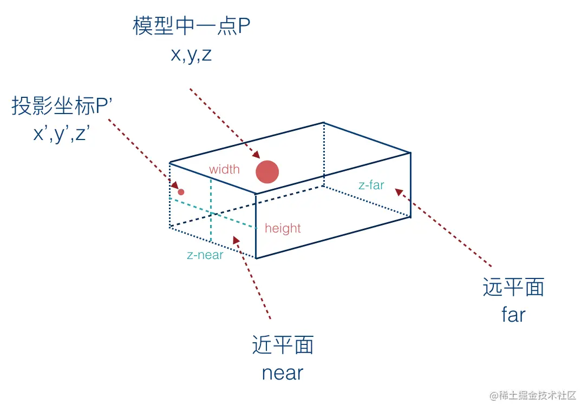

## 1.正交投影

正交投影的可视空间由前面两个矩形表面确定。分别是**近裁剪面**和**远裁剪面**。
`canvas`上显示的是**可视空间中的物体在近裁剪面上的投影**。

正交投影看到的物体都是一样大的，跟模型距离观察者的距离没有关系。


**正交投影，可视范围是一个长方体盒子。**



接下来我们将推导一下**正交投影**的矩阵是如何得到的。

假设模型中有一个点`p(x,y,z)`表示像素坐标,投影到近平面后的坐标为`p'(x',y',z')`，表示投影坐标。

那么 `p`和`p'`之间的关系是怎样的呢？首先我们的已知条件是.
+ `x` 坐标在 `[-width/2, width / 2]` 之间，通常我们不指定 `width`，而是指定相机坐标系下的投影盒的左右两侧坐标，`left`和`right`。
+ `y` 坐标在 `[-height/2, height/2]` 之间，通常我们不指定    `height`，而是指定相机坐标系下的投影盒的左右两侧坐标，`top`和`bottom`。
+ `z` 坐标在 `[zNear, zFar]`之间。

投影后的点 `p'（x',y',z'）`，其中：

+ `x'` 在 `[-1，1]` 之间
+ `y'` 在 `[-1，1]`之间
+ `z'` 在 `[-1，1]` 之间


##  2.正交投影矩阵的推导
首先我们需要找出 `p`和 `p'`之间的关系。`p`和`p'`之间的关系可以用如下矩阵来表示。


上面的矩阵运算后可以得到下面的计算结果。

```js
x' = ax + by + cz + d
y' = ex + fy + gz + h
z' = ix + jy + kz + l
1  = mx + ny + oz + p
```

### 1. **x' 和 x 的关系**
 
我们先将 `p` 点的 `x`上的坐标投影到近平面上。首先我们知道有这么一个对应关系。根据长方体来根据近平面来计算得出一个坐标系。在近平面上我们可以得到下面的信息。
```js
(left+right)/2 为 x轴的原点(x轴方向的中心点)
(right-left)/2 为 x的正向最大值，也就是width/2
(left-right)/2 为 x的负向最大值
```
那么`x' 和 x` 的关系可以用如下的计算公式来表示。将屏幕坐标转换成投影坐标
```js
x' = (x- (left+right)/2)/(right-left)/2 
   = 2(x- (left+right)/2)/(right-left)
   = 2x/(right-left) - (left+right)/(right-left)
```
上面的公式中 
```js
(x- (left+right)/2) 表示 x 相对于坐标原点的距离
(right-left)/2 为 x 的正向最大值，也就是 width/2
```

#### 2. **y' 和 y 的关系**

我们先将`p`点的 `y`上的坐标投影到近平面上。在近平面上我们也可以得到下面的信息
```js
(bottom+top)/2 为 y轴的原点(x轴方向的中心点)
(top-bottom)/2 为 y的正向最大值，也就是height/2
(bottom-top)/2 为 y的负向最大值
```
那么`y' 和 y` 的关系可以用如下的计算公式来表示。
```js
y' = (y- (top+bottom)/2)/(top-bottom)/2 
   = (2y- (top+bottom))/(top-bottom)
   = 2y/(top-bottom) - (top+bottom)/(top-bottom)
```

####  3. z' 和 z 的关系
```js
z' = (z- (zFar+zNear)/2)/(zFar-zNear)/2 
   = (2z- (zFar+zNear))/(zFar-zNear)
   = 2z/(zFar-zNear) - (zFar+zNear)/(zFar-zNear)
```
上面的公式中 
```js
(z- (zFar+zNear)/2) 表示 z 相对于坐标原点的距离
(zFar-zNear)/2  为 z 的正向最大值，也就是 depth/2
```
根据上面的计算公式，我们计算一下**矩阵相乘**的结果，可以得到下面的表达式。
```js
x' = ax + by + cz + d = 2x/(right-left) - (left+right)/(right-left)
y' = ex + fy + gz + h = 2y/(top-bottom) - (top+bottom)/(top-bottom)
z' = ix + jy + kz + l = 2z/(zFar-zNear) - (zFar+zNear)/(zFar-zNear)
1  = mx + ny + oz + p = 1
```
根据上面得到的计算结果，即可求出**正交投影矩阵**。


用 `JavaScript` 实现正交投影矩阵的代码则如下所示
```js
function orthographic(left, right, bottom, top, near, far) {
    return [
        2 / (right - left), 0, 0, 0,
        0, 2 / (top - bottom), 0, 0,
        0, 0, -2 / (far - near), 0,
        -(right + left) / (right - left), -(top + bottom) / (top - bottom), -(far + near) / (far - near), 1
    ];
}

// 示例
const left = -1, right = 1, bottom = -1, top = 1, near = -1, far = 1;
const orthoMatrix = orthographic(left, right, bottom, top, near, far);
console.log("Orthographic Projection Matrix:", orthoMatrix);
```

[正交投影demo地址](https://github.com/tangjie-93/WebGL/blob/main/%E8%B7%9F%E7%9D%80%E5%AE%98%E7%BD%91%E5%AD%A6WebGL%2BWebGL%E7%BC%96%E7%A8%8B%E6%8C%87%E5%8D%97/%E6%8A%95%E5%BD%B1/demo/%E6%AD%A3%E5%B0%84%E6%8A%95%E5%BD%B1.html)

**总结：** 计算正交投影的关键是要求出 `p` 和 `p'` 之间的关系，及屏幕坐标跟投影坐标的关系。

<Valine></Valine>