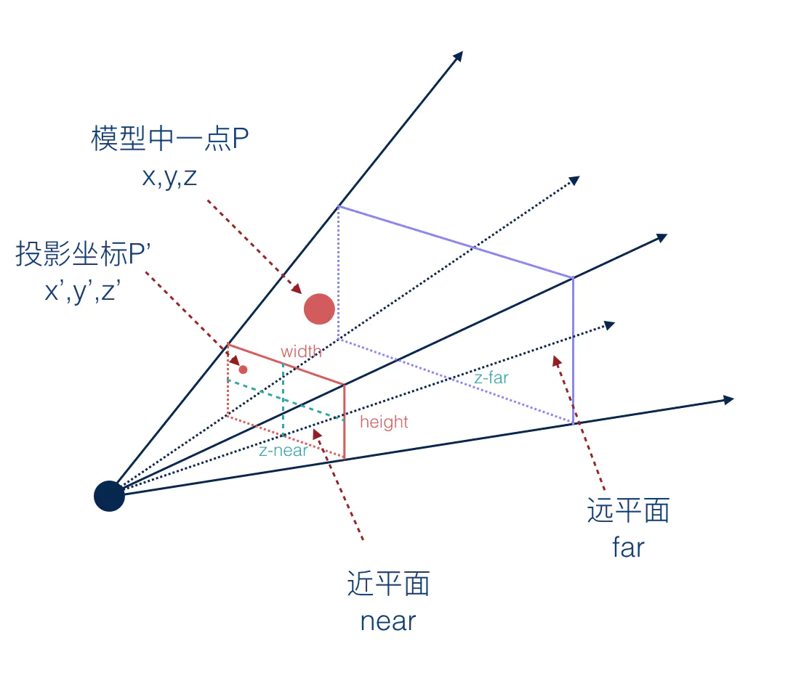

## 1.三维透视投影的定义

透视投影的最终目的是将三维点投影到二维平面上，并通过 **透视除法（透视校正）** 来模拟人眼的视觉效果。我们通过构建一个透视投影矩阵，将三维坐标系中的点变换到裁剪坐标系，然后通过透视除法得到标准化设备坐标（`NDC`）。

正射投影看到的物体都是按照近大远小的规则来呈现的。与模型跟观察者的距离有直接的关系。
这种近大远小的效果就赋予了模型深度感，或者称之为**透视感**。

**透视投影，可视范围是一个棱锥体盒子，下面是透视投影的可视范围的示意图。**


## 2.视锥体的定义
**透视投影，可视范围是一个视锥体**，定义视锥体时会用到以下参数：
+ 视角`（Field of View, FOV`）：垂直视角的角度。
+ 宽高比`（AspectRatio）`：视口的宽高比 `width/height`。
+ 近平面`（Near Plane, n`：距离相机最近的平面`z-near`。
+ 远平面`（Far Plane, f`：距离相机最远的平面 `z-far`。

## 3推导步骤
#### 3.1定义视角参数
视角参数包括视角 `（FOV）`、宽高比`（aspectRatio`）、近平面`n`和远平面`f`。
+ `θ` 为视角的一半，即 `θ = FOV/2`
+ `t = n * tan(θ)` 为近平面的高度的一半 `height/2`
+ `r = t*aspectRatio = n * tan(θ) * aspectRatio` 为近平面的宽度的一半 `wight/2`

#### 3.2 透视投影矩阵的推导

透视投影矩阵的推导包括将三维点映射到二维平面上，并进行**透视除法**以实现透视效果。

接下来我们将推导一下**透视投影**的矩阵是如何得到的。

假设模型中有一个点`p(x,y,z)`表示像素坐标,投影到近平面后的坐标为`p'(x',y',z')`，表示投影坐标。
首先我们需要找出 `p`和 `p'`之间的关系。`p`和`p'`之间的关系可以用如下矩阵来表示。


上面的矩阵运算后可以得到下面的计算结果。

```js
x' = ax + by + cz + d
y' = ex + fy + gz + h
z' = ix + jy + kz + l
w' = mx + ny + oz + p 
```

根据上面的透视投影的示意图，我们根据相似三角形原理，可以得到如下公式。

#### 1. **x轴**
假设一个点在相机坐标系中的位置为`(x,y,z)`，它在近平面上的投影点为 ($x_{proj}$ ,$x_{proj}$,n) 。
根据相似三角形可以得到下面的计算公式。

$$
\frac{x_{proj}}{x} = \frac{n}{z} \Rightarrow x_{proj} = \frac{n}{z} x
$$

然后将 $x_{proj}$ 映射到标准化设备坐标`（NDC）`中的 `[-1, 1]` 范围。为此，我们需要将 ` x `  坐标从 `[-r, r]` 映射到 `[-1, 1]`。

$$
x_{ndc} = \frac{x_{proj}}{r} = \frac{\frac{n}{z} x}{r} = \frac{n x}{r z}
$$

由于 `r = t*aspectRatio = n * tan(θ) * aspectRatio`，我们可以进一步简化：

$$
x_{ndc} = \frac{n x}{n \cdot \tan(\theta) \cdot \text{aspectRatio} \cdot z} = \frac{x}{\tan(\theta) \cdot \text{aspectRatio} \cdot z}
$$

**注意：** 在透视投影矩阵中, 上面得到的这个计算过程是通过**透视投影矩阵**的乘法和**透视除法**实现的。同时说明 $x_{ndc}$ 的大小 跟`z`轴坐标的大小成反比。

#### 2. **y轴映射**
我们需要将 `y` 坐标从 `[−t,t]` 映射到 `[−1,1]`。
类似地，我们考虑在近平面上的投影点 ($x_{proj}$ ,$x_{proj}$,n) 。根据相似三角形原理：
$$
\frac{y_{proj}}{y} = \frac{n}{z} \Rightarrow y_{proj} = \frac{n}{z} y
$$
然后将 $y_{proj}$ 映射到标准化设备坐标`（NDC）`中的 `[-1, 1]` 范围。为此，我们需要将 ` x `  坐标从 `[-t, t]` 映射到 `[-1, 1]`。
$$
y_{ndc} = \frac{y_{proj}}{t} = \frac{\frac{n}{z} y}{r} = \frac{n y}{t z}
$$

由于 `t=n*tan(θ)`，我们可以进一步简化：
$$
y_{ndc} = \frac{n y}{n \cdot tan(\theta) \cdot z} 
        = \frac{y}{tan(\theta) \cdot z} 
$$

**注意：** 在透视投影矩阵中, 上面得到的这个计算过程是通过**透视投影矩阵**的乘法和**透视除法**实现的。同时说明 $y_{ndc}$ 的大小 跟`z`轴坐标的大小成反比。


#### 3. **z轴映射**
我们需要将 `z` 坐标从 `[n,f]` 映射到 `[-1,1]`。对于 `z` 轴映射，我们希望在近平面和远平面之间进行线性变换。
线性变换的标准公式为：
$$
z_{proj} = A \cdot z + B
$$
我们通过透视除法将齐次坐标转换到标准化设备坐标,这里的`w`分量我们使用`-z`表示。：
$$
z_{ndc} = \frac{z_{proj}}{w} = \frac{z_{proj}}{-z}
        = \frac{A \cdot z + B}{-z}
        = -A - \frac{B}{z}
$$
我们希望满足以下条件：

$$
z = n \Rightarrow z_{ndc} = -1
$$
$$
z = f \Rightarrow z_{ndc} = 1
$$

通过代入以上条件，我们可以得到两个方程：

$$
-1 =  - A + \frac{B}{n}
$$

$$
1 = - A + \frac{B}{f}
$$

解这组方程：

$$
 -A + \frac{B}{n} = -1
$$ 

$$
-A + \frac{B}{f} = 1
$$

相减得到：

$$
\frac{B}{f} - \frac{B}{n} = 2 \Rightarrow B = \frac{2fn}{n - f}
$$

代入 
$$
-1 =  - A + \frac{B}{n}\Rightarrow A = \frac{B}{n} + 1 
                                     = \frac{\frac{2fn}{n - f}}{n} + 1
                                     = \frac{2f}{n-f} + 1 
                                     = \frac{f+n}{n-f}
$$


因此，`z` 轴的线性变换为：

$$
z_{ndc} = -\frac{f+n}{n-f} - \frac{2fn}{n - f} \cdot \frac{1}{z}
$$
那么经过透视除法之前的裁剪坐标系中的坐标应该是
$$
z_{ndc}  \cdot -z = \frac{f+n}{n-f} \cdot  + \frac{2fn}{n - f} 
$$

#### 4.透视投影矩阵的构建

将上述公式整合到一个矩阵中，我们得到透视投影矩阵：

$$
\mathbf{P}_{perspective} = \begin{bmatrix}
\frac{n}{r} & 0 & 0 & 0 \\
0 & \frac{n}{t} & 0 & 0 \\
0 & 0 & -\frac{f + n}{f - n} & -\frac{2fn}{f - n} \\
0 & 0 & -1 & 0
\end{bmatrix}
$$

[透视投影demo地址](https://github.com/tangjie-93/WebGL/blob/main/%E8%B7%9F%E7%9D%80%E5%AE%98%E7%BD%91%E5%AD%A6WebGL%2BWebGL%E7%BC%96%E7%A8%8B%E6%8C%87%E5%8D%97/%E6%8A%95%E5%BD%B1/demo/%E9%80%8F%E8%A7%86%E6%8A%95%E5%BD%B1.html)

**参考文档**<br>
[WebGL 三维透视投影](https://webglfundamentals.org/webgl/lessons/zh_cn/webgl-3d-perspective.html)<br>
[透视投影](https://juejin.cn/book/6844733755580481543/section/6844733755941191687)


<Valine></Valine>