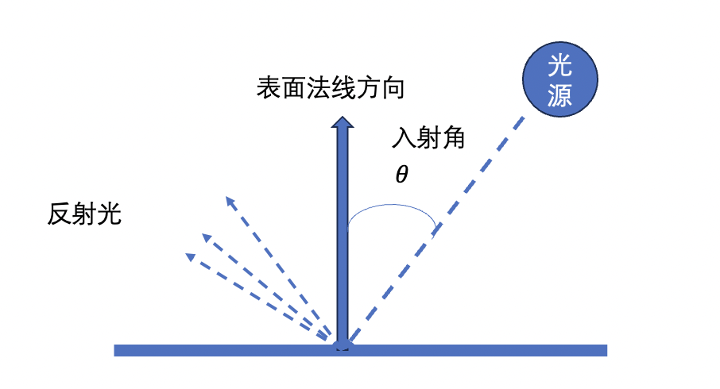
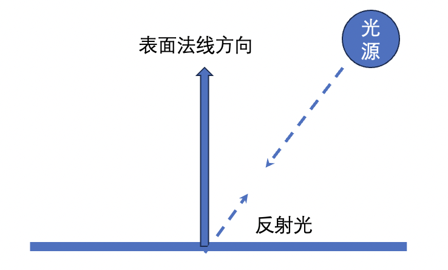
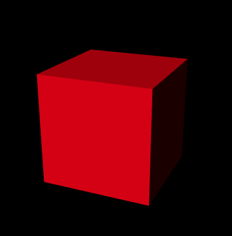
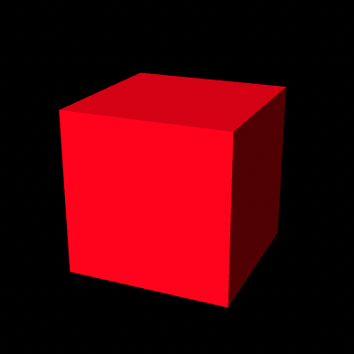
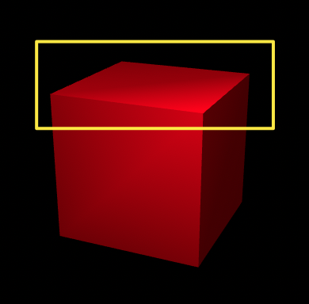

## 1.光源类型
真实世界中的光主要有2种类型，**平行光**和**点光源光**：类似于电灯泡发出的光。
同时我们还会用**环境光**来模拟真实世界中的非直射光（也就是由光源发出后经过墙壁或者其他物体反射后的光）。三维图形学中会使用一些其他类型的光，比如**聚光等光**。
### 1.平行光
光线平行，具有方向。可以用一个方向和颜色来定义。
### 2.点光源光
点光源光是从一个点向周围的所有方向发出的光。定义点光源时我们需要指定点光源的位置和颜色。
### 3.环境光
指那些经光源发出后，被墙壁等物体多次反射，然后照到物体表面上的光。环境光从各个角度照射物体，起强度都是一致的。环境光不用指定位置和方向，只需要指定颜色就行。
## 2.反射类型
根据物体表面反射光线的方式，可以分为**漫反射**和**环境反射**。
### 1.漫反射

**漫反射是针对平行光和点光源**而言的，漫反射的反射光在各个方向上都是均匀的。有些物体的表面是粗糙的，在这种情况下，反射光就会以不固定的角度反射出去。

反射光的颜色取决于**入射光的颜色**、**表面的基底色**、**入射光**与表面法线形成的**入射角**。入射角为入射光与表面的法线形成的夹角，用`𝜃` 表示 ，漫反射光的颜色可以根据下面的公式计算得到。
> **漫反射光的颜色计算**
```js
物体漫反射光颜色 = 入射光颜色 X 表面基底色 X cos𝜃
```


### 2.环境反射

**环境反射是针对环境光**而言的。 反射光的方向可以认为就是**入射光的反方向**。由于环境光照射物体的方式就是各方向均匀、强度相等的，所以反射光也是各向均匀的。

+ **环境反射光**的颜色计算。

```js
物体环境反射光颜色 = 入射光颜色 X 表面基颜色
```



+ **漫反射和环境反射** 同时物体的颜色计算

当漫反射和环境反射同时存在时，将两者加起来，就会得到物体最终被观察到的颜色。
```js
物体表面的颜色 = 漫反射光颜色 + 环境反射光颜色
```

### 3.平行光下的漫反射

上面的`cos𝜃`可以用两个矢量的点积来得到。下面的等式成立的条件是光线方向和法线方向向量必须都是单位向量。
```js
cos𝜃 = 光线方向 * 法线方向 = |光线方向|*|法线方向|*cos𝜃
```
所以上面上面的漫反射光的公式可以写成
```js
物体漫反射光颜色 = 入射光颜色 X 表面基底色 X (光线方向 * 法线方向)
```
**注意：**
+ 光线方向矢量和表面法线矢量的长度必须时 `1`，否则反射光的颜色就会过暗或者过亮。将一个矢量的长度调整为1，同时保持方向不变的过程称之为**归一化**。
+ **光线方向**，实际上是**入射方向的反方向**，是从入射点指向光源的方向。

**法线**: 垂直于物体表面的方向，称之为法线或者法向量。因为每个表面都有两个面，所以每个表面都具有两个法向量。

平行光下的漫反射的 **顶点着色器中**的代码如下所示：
```js
  attribute vec4 a_Position;
  attribute vec4 a_Color; 
  attribute vec4 a_Normal;        // Normal 法向量
  uniform mat4 u_MvpMatrix;
  uniform vec3 u_LightColor;     // Light color 光线颜色
  uniform vec3 u_LightDirection; // Light direction (in the world coordinate, normalized) 光线方向
  varying vec4 v_Color;
  void main() {
    gl_Position = u_MvpMatrix * a_Position ;
  // Make the length of the normal 1.0
  // 法向量归一化
    vec3 normal = normalize(a_Normal.xyz);
  // Dot product of the light direction and the orientation of a surface (the normal)
  // 计算点积
  // 当角度大于90时，将点积赋值为0，表示光线是找到了背面，所以我们看到的物体是暗的。
    float nDotL = max(dot(u_LightDirection, normal), 0.0);
  // Calculate the color due to diffuse reflection
  // 计算漫反射光的颜色
    vec3 diffuse = u_LightColor * a_Color.rgb * nDotL;
    v_Color = vec4(diffuse, a_Color.a);
  }
```
平行光下的漫反射的 主要`js`代码如下所示
```js
...
const u_MvpMatrix = gl.getUniformLocation(gl.program, 'u_MvpMatrix');
const u_LightColor = gl.getUniformLocation(gl.program, 'u_LightColor');
comst u_LightDirection = gl.getUniformLocation(gl.program, 'u_LightDirection');
if (!u_MvpMatrix || !u_LightColor || !u_LightDirection) { 
  console.log('Failed to get the storage location');
  return;
}

// Set the light color (white)
gl.uniform3f(u_LightColor, 1.0, 1.0, 1.0);
// Set the light direction (in the world coordinate)
var lightDirection = new Vector3([0.5, 3.0, 4.0]);
lightDirection.normalize();     // Normalize
gl.uniform3fv(u_LightDirection, lightDirection.elements);

// Calculate the view projection matrix
var mvpMatrix = new Matrix4();    // Model view projection matrix
mvpMatrix.setPerspective(30, canvas.width/canvas.height, 1, 100);
mvpMatrix.lookAt(3, 3, 7, 0, 0, 0, 0, 1, 0);
// Pass the model view projection matrix to the variable u_MvpMatrix
gl.uniformMatrix4fv(u_MvpMatrix, false, mvpMatrix.elements);
...
```
具体的 `demo`地址  [平行光的漫反射](https://github.com/tangjie-93/WebGL/blob/main/%E8%B7%9F%E7%9D%80%E5%AE%98%E7%BD%91%E5%AD%A6WebGL%2BWebGL%E7%BC%96%E7%A8%8B%E6%8C%87%E5%8D%97/%E5%85%89%E7%85%A7/demo/%E5%B9%B3%E8%A1%8C%E5%85%89%E7%9A%84%E6%BC%AB%E5%8F%8D%E5%B0%84.html) 。
最终的绘制效果如下所示：

从上面的图片中我们可以看到右侧表面是全黑的。这是因为我们没有考虑到环境光对物体的照射效果。所以我们还需要加上物体表面的环境反射光的颜色，才能得到物体表面最终的颜色。

所以我们需要对上面的代码做以下修改。
> **顶点着色器代码**
```js
  ...
  uniform vec3 u_AmbientLight;  // Color of an ambient light 环境光
  varying vec4 v_Color;
  ...
  void main() {
    ...
    // 计算环境光产生的反射光颜色
    vec3 ambient = u_AmbientLight * a_Color.rgb;
    v_Color = vec4(diffuse+ambient, a_Color.a);
  }
```
> `js`中也需要添加环境光的代码。
```js
...
const u_AmbientLight = gl.getUniformLocation(gl.program, 'u_AmbientLight');
// Set the ambient light
gl.uniform3f(u_AmbientLight, 0.2, 0.2, 0.2);
...
```
最终的绘制结果如下所示


`demo` 地址  [环境光下的漫反射](https://github.com/tangjie-93/WebGL/blob/main/%E8%B7%9F%E7%9D%80%E5%AE%98%E7%BD%91%E5%AD%A6WebGL%2BWebGL%E7%BC%96%E7%A8%8B%E6%8C%87%E5%8D%97/%E5%85%89%E7%85%A7/demo/%E7%8E%AF%E5%A2%83%E5%85%89%E4%B8%8B%E7%9A%84%E6%BC%AB%E5%8F%8D%E5%B0%84.html)

## 3.运动物体的光照效果
物体旋转时，每个表面的法向量都会随之改变。所以我们需要在运动的过程中，需要不断计算更新后的法向量。这里我们会用到**逆转置矩阵**，将变换之前的法向量乘以**模型矩阵**的**逆转置矩阵**就可以得到变换后的法向量。**转置逆矩阵就是逆矩阵的转置**。

**逆矩阵**：如果矩阵`M`的逆矩阵是 `R`,那么`M*R`或者`R*M`的结果都是单位矩阵。
**转置**：将矩阵的行列进行调换(看上去就像是沿着左上-右下对角线进行了翻转)。

所以求逆转置矩阵主要由以下两个步骤：
+ 求原矩阵的逆矩阵
+ 将上一步得到的逆矩阵进行转置。
所以我们需要将上一步使用环境光的顶点着色器中的代码再进行以下修改。
```js
  ...
  uniform mat4 u_NormalMatrix
  uniform vec3 u_AmbientLight;  // Color of an ambient light 环境光
  varying vec4 v_Color;
  ...
  void main() {
    ...
    // 计算旋转后的反射光
    vec3 normal = normalize(vec3(u_NormalMatrix * a_Normal))
    ...
     // 计算环境光产生的反射光颜色
    vec3 ambient = u_AmbientLight * a_Color.rgb;
    v_Color = vec4(diffuse+ambient, a_Color.a);
  }
```
`js`中的代码需要做如下修改
```js
 // Calculate the matrix to transform the normal based on the model matrix
normalMatrix.setInverseOf(modelMatrix);
normalMatrix.transpose();
// Pass the transformation matrix for normals to u_NormalMatrix
gl.uniformMatrix4fv(u_NormalMatrix, false, normalMatrix.elements);
```
具体`demo`地址 [运动物体的颜色](https://github.com/tangjie-93/WebGL/blob/main/%E8%B7%9F%E7%9D%80%E5%AE%98%E7%BD%91%E5%AD%A6WebGL%2BWebGL%E7%BC%96%E7%A8%8B%E6%8C%87%E5%8D%97/%E5%85%89%E7%85%A7/demo/%E8%BF%90%E5%8A%A8%E7%89%A9%E4%BD%93%E7%9A%84%E9%A2%9C%E8%89%B2.html) 

## 4.点光源光的着色效果
在对点光源下的物体进行着色时，需要在每个入射点计算点光源在该处的方向。点光源**光的方向**不是恒定不变的，需要**根据每个顶点的位置逐一计算**。

顶点着色器中的代码跟上面平行光的代码有点不一样，在这里需要不断在**世界坐标系中**计算顶点坐标**光的方向**。
```js
...
uniform mat4 u_ModelMatrix;
...
uniform vec3 u_LightPosition;// 在世界坐标系下光源的位置
...
// 计算顶点的世界坐标
vec4 vertexPosition = u_ModelMatrix * a_Position;
// 计算光线方向并归一化
vec3 lightDirection = normalize(u_LightPosition - vec3(vertexPosition));
```
最终的展示效果如下所示：



具体的`demo`地址 [点光源光](https://github.com/tangjie-93/WebGL/blob/main/%E8%B7%9F%E7%9D%80%E5%AE%98%E7%BD%91%E5%AD%A6WebGL%2BWebGL%E7%BC%96%E7%A8%8B%E6%8C%87%E5%8D%97/%E5%85%89%E7%85%A7/demo/%E7%82%B9%E5%85%89%E6%BA%90%E5%85%89.html) 

仔细观察会发现立方体表面会有**不自然的线条**。

这是因为在`WebGL`系统中会根据顶点的颜色，内插出表面上每个片元的颜色。
但是实际上，点光源照射到一个表面上，所产生的效果(每个片元获得的颜色)与简单使用4个顶点颜色（也是有点光源产生）内插出的效果并不完全相同，所以为了效果更逼真，我们需要**对表面的每一点计算光照效果**。
下面是逐片元计算模型颜色的例子。
**顶点着色器中的代码**
```js
attribute vec4 a_Position;
  attribute vec4 a_Color;
  attribute vec4 a_Normal;
  uniform mat4 u_MvpMatrix;
  uniform mat4 u_ModelMatrix;    // Model matrix
  uniform mat4 u_NormalMatrix;   // Transformation matrix of the normal
  varying vec4 v_Color;
  varying vec3 v_Normal;
  varying vec3 v_Position;
  void main() {
    gl_Position = u_MvpMatrix * a_Position;
     // Calculate the vertex position in the world coordinate
    v_Position = vec3(u_ModelMatrix * a_Position);
    v_Normal = normalize(vec3(u_NormalMatrix * a_Normal));
    v_Color = a_Color;
  }
```
**片元着色器中的代码**
```js
precision mediump float;
  uniform vec3 u_LightColor;     // Light color
  uniform vec3 u_LightPosition;  // Position of the light source
  uniform vec3 u_AmbientLight;   // Ambient light color
  varying vec3 v_Normal;
  varying vec3 v_Position;
  varying vec4 v_Color;
  void main() {
     // Normalize the normal because it is interpolated and not 1.0 in length any more
    vec3 normal = normalize(v_Normal);
     // Calculate the light direction and make its length 1.
    vec3 lightDirection = normalize(u_LightPosition - v_Position);
     // The dot product of the light direction and the orientation of a surface (the normal)
    float nDotL = max(dot(lightDirection, normal), 0.0);
     // Calculate the final color from diffuse reflection and ambient reflection
    vec3 diffuse = u_LightColor * v_Color.rgb * nDotL;
    vec3 ambient = u_AmbientLight * v_Color.rgb;
    gl_FragColor = vec4(diffuse + ambient, v_Color.a);
  }
```
具体`demo`地址[点光源逐片元光照效果](https://github.com/tangjie-93/WebGL/blob/main/%E8%B7%9F%E7%9D%80%E5%AE%98%E7%BD%91%E5%AD%A6WebGL%2BWebGL%E7%BC%96%E7%A8%8B%E6%8C%87%E5%8D%97/%E5%85%89%E7%85%A7/demo/%E7%82%B9%E5%85%89%E6%BA%90%E9%80%90%E7%89%87%E5%85%83%E5%85%89%E7%85%A7.html)

## 5.聚光灯的着色效果

**参考文档**<br>
[WebGL 三维点光源](https://webglfundamentals.org/webgl/lessons/zh_cn/webgl-3d-lighting-point.html)<br>
[WebGL 三维方向光源](https://webglfundamentals.org/webgl/lessons/zh_cn/webgl-3d-lighting-directional.html)<br>
[WebGL 三维聚光灯](https://webglfundamentals.org/webgl/lessons/zh_cn/webgl-3d-lighting-spot.html)<br>
<Valine></Valine>


