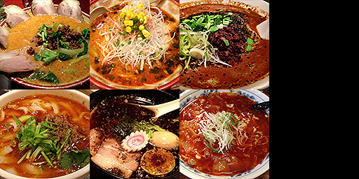

## 纹理
### 1.二维纹理
在 `WebGL` 中绘制图片需要使用纹理, 渲染纹理时需要纹理坐标。无论纹理是什么尺寸，纹理坐标范围始终是 `0.0` 到 `1.0` 。我们绘制图形时，需要告诉 `WebGL` 图形中每个顶点对应的纹理坐标。 
我们将使用一种特殊的叫做 `varying` 的变量将纹理坐标从顶点着色器传到片段着色器，它叫做 **可变量** 是因为它的值有很多个，`WebGL`**会用顶点着色器中值的进行插值，然后传给对应像素执行的片段着色器**。
> 在顶点着色器中定义变量来接收纹理。
```js
attribute vec2 a_texCoord;
attribute vec4 a_position; 
uniform mat4 u_matrix;
varying vec2 v_texCoord;
void main() {
    // 将位置和矩阵相乘
   gl_Position = u_matrix * a_position;
   // 将纹理坐标传给片段着色器
   // GPU会在点之间进行插值
   v_texCoord = a_texCoord;
}
```
> 在片段着色你器中寻找对应的颜色。

在片段着色器中声明一个 `sampler2D` 类型的全局变量，可以让我们引用一个纹理， 然后使用从顶点着色器传入的纹理坐标调用 `texture2D` 方法， 在纹理上找到对应的颜色。
```js
precision mediump float; 
// 纹理
uniform sampler2D u_image;
// 从顶点着色器传入的纹理坐标
varying vec2 v_texCoord;
 
void main() {
   // 在纹理上寻找对应颜色值
   gl_FragColor = texture2D(u_image, v_texCoord);
}

```
> 在执行渲染  `WebGL` 的代码中加载图片，并创建一个纹理然后将图像复制到纹理中。
```js
function main() {
  var image = new Image();
  image.src = "http://someimage/on/our/server";  // 必须在同一域名下
  image.onload = function() {
    render(image);
  }
}
 
function render(image) {
  ...
  // 之前的代码
  ...
  // 找到纹理的地址
  const texCoordLocation = gl.getAttribLocation(program, "a_texCoord");
 
  //为纹理坐标创建一个缓冲
  const texCoordBuffer = gl.createBuffer();
  gl.bindBuffer(gl.ARRAY_BUFFER, texCoordBuffer);
  // 给矩形提供纹理坐标
  gl.bufferData(gl.ARRAY_BUFFER, new Float32Array([
      0.0,  0.0,
      1.0,  0.0,
      0.0,  1.0,
      0.0,  1.0,
      1.0,  0.0,
      1.0,  1.0]), gl.STATIC_DRAW);
  gl.enableVertexAttribArray(texCoordLocation);
  // 以浮点型格式传递纹理坐标
  gl.vertexAttribPointer(texCoordLocation, 2, gl.FLOAT, false, 0, 0);
 
  // 创建纹理
  const texture = gl.createTexture();
  gl.bindTexture(gl.TEXTURE_2D, texture);
 
  // 设置参数，让我们可以绘制任何尺寸的图像
  gl.texParameteri(gl.TEXTURE_2D, gl.TEXTURE_WRAP_S, gl.CLAMP_TO_EDGE);
  gl.texParameteri(gl.TEXTURE_2D, gl.TEXTURE_WRAP_T, gl.CLAMP_TO_EDGE);
  gl.texParameteri(gl.TEXTURE_2D, gl.TEXTURE_MIN_FILTER, gl.NEAREST);
  gl.texParameteri(gl.TEXTURE_2D, gl.TEXTURE_MAG_FILTER, gl.NEAREST);
 
  // 将图像上传到纹理
  gl.texImage2D(gl.TEXTURE_2D, 0, gl.RGBA, gl.RGBA, gl.UNSIGNED_BYTE, image);
  ...
}
```
> 为什么u_image没有设置还能正常运行？

全局变量默认为 0 所以 `u_image` 默认使用纹理单元 0 。 纹理单元 0 默认为当前活跃纹理，所以调用 `bindTexture` 会将纹理绑定到单元 0 。
`WebGL` 有一个纹理单元队列，每个 `sampler` 全局变量的值对应着一个纹理单元， 它会从对应的单元寻找纹理数据，你可以将纹理设置到你想用的纹理单元。

我们也可以激活其他纹理单元。
```js
const textureUnitIndex = 6; // 用单元 6.
const u_imageLoc = gl.getUniformLocation(
    program, "u_image");
gl.uniform1i(u_imageLoc, textureUnitIndex);
```
还可以通过下面的方式将纹理设置到不同的单元。
```js
// 绑定纹理到单元 6
gl.activeTexture(gl.TEXTURE6);
gl.bindTexture(gl.TEXTURE_2D, someTexture);
//或者
const textureUnitIndex = 6; // 使用纹理单元 6
// 绑定纹理到单元 6
gl.activeTexture(gl.TEXTURE0 + textureUnitIndex);
gl.bindTexture(gl.TEXTURE_2D, someTexture);
```
完整的代码如下所示。
```js
// Create a texture.
  const texture = gl.createTexture();
  gl.activeTexture(gl.TEXTURE6);
  gl.bindTexture(gl.TEXTURE_2D, texture);
   gl.texParameteri(gl.TEXTURE_2D, gl.TEXTURE_WRAP_S, gl.CLAMP_TO_EDGE);
  gl.texParameteri(gl.TEXTURE_2D, gl.TEXTURE_WRAP_T, gl.CLAMP_TO_EDGE);
  gl.texParameteri(gl.TEXTURE_2D, gl.TEXTURE_MIN_FILTER, gl.NEAREST);
  gl.texParameteri(gl.TEXTURE_2D, gl.TEXTURE_MAG_FILTER, gl.NEAREST);

  // Upload the image into the texture.
  gl.texImage2D(gl.TEXTURE_2D, 0, gl.RGBA, gl.RGBA, gl.UNSIGNED_BYTE, image);
  ....
  gl.useProgram(program);
  ....
  const u_imageLoc = gl.getUniformLocation(
    program, "u_image");

  gl.uniform1i(u_imageLoc,6);
```
**注意：** `gl.uniform1i(u_imageLoc,6)` 等将数据传递给着色器之前一定要点链接着色器程序 `gl.useProgram(program);`;

**我们可以很简单的调换一个红蓝的位置.**
```js
...
gl_FragColor = texture2D(u_image, v_texCoord).bgra;
...
```
**或者将每个像素的值设置为与左右像素的均值。**
> 片元着色器
```js
precision mediump float;
// 纹理
uniform sampler2D u_image;
uniform vec2 u_textureSize;
// 从顶点着色器传入的像素坐标
varying vec2 v_texCoord;
 
void main() {
   // 计算1像素对应的纹理坐标
   vec2 onePixel = vec2(1.0, 1.0) / u_textureSize;
 
   // 对左中右像素求均值
   gl_FragColor = (
       texture2D(u_image, v_texCoord) +
       texture2D(u_image, v_texCoord + vec2(onePixel.x, 0.0)) +
       texture2D(u_image, v_texCoord + vec2(-onePixel.x, 0.0))) / 3.0;
}
```
> 在JavaScript中传入纹理的大小。
```js
...
const textureSizeLocation = gl.getUniformLocation(program, "u_textureSize");
...
// 设置图像的大小
gl.uniform2f(textureSizeLocation, image.width, image.height);
...
```

### 2.三维纹理

三维纹理跟二维纹理唯一不同的就是，三维不再是一个面了，三维需要给多个面添加纹理。这里使用官网的一个 绘制 `F`的模型的例子。来解析纹理坐标跟模型坐标的关系。如下所示是 `F` 图片。


着色器代码跟二维纹理的一样，不同的是模型数据和纹理坐标数据不一样了。
> 创建模型数据
```js
// Fill the buffer with the values that define a letter 'F'.
function setGeometry(gl) {
  var positions = new Float32Array([
          // 逆时针方向
          /**
           *  1(0,0)     2(30,0)
           *  3(0,150)   4(30,150)
           *  两个三角形(132,342)
           */
          // left column front
          0,   0,  0,
          0, 150,  0,
          30,   0,  0,
          0, 150,  0,
          30, 150,  0,
          30,   0,  0,

          // top rung front
          30,   0,  0,
          30,  30,  0,
          100,   0,  0,
          30,  30,  0,
          100,  30,  0,
          100,   0,  0,

          // middle rung front
          30,  60,  0,
          30,  90,  0,
          67,  60,  0,
          30,  90,  0,
          67,  90,  0,
          67,  60,  0,

          // left column back
            0,   0,  30,
           30,   0,  30,
            0, 150,  30,
            0, 150,  30,
           30,   0,  30,
           30, 150,  30,

          // top rung back
           30,   0,  30,
          100,   0,  30,
           30,  30,  30,
           30,  30,  30,
          100,   0,  30,
          100,  30,  30,

          // middle rung back
           30,  60,  30,
           67,  60,  30,
           30,  90,  30,
           30,  90,  30,
           67,  60,  30,
           67,  90,  30,

          // top
            0,   0,   0,
          100,   0,   0,
          100,   0,  30,
            0,   0,   0,
          100,   0,  30,
            0,   0,  30,

          // top rung right
          100,   0,   0,
          100,  30,   0,
          100,  30,  30,
          100,   0,   0,
          100,  30,  30,
          100,   0,  30,

          // under top rung
          30,   30,   0,
          30,   30,  30,
          100,  30,  30,
          30,   30,   0,
          100,  30,  30,
          100,  30,   0,

          // between top rung and middle
          30,   30,   0,
          30,   60,  30,
          30,   30,  30,
          30,   30,   0,
          30,   60,   0,
          30,   60,  30,

          // top of middle rung
          30,   60,   0,
          67,   60,  30,
          30,   60,  30,
          30,   60,   0,
          67,   60,   0,
          67,   60,  30,

          // right of middle rung
          67,   60,   0,
          67,   90,  30,
          67,   60,  30,
          67,   60,   0,
          67,   90,   0,
          67,   90,  30,

          // bottom of middle rung.
          30,   90,   0,
          30,   90,  30,
          67,   90,  30,
          30,   90,   0,
          67,   90,  30,
          67,   90,   0,

          // right of bottom
          30,   90,   0,
          30,  150,  30,
          30,   90,  30,
          30,   90,   0,
          30,  150,   0,
          30,  150,  30,

          // bottom
          0,   150,   0,
          0,   150,  30,
          30,  150,  30,
          0,   150,   0,
          30,  150,  30,
          30,  150,   0,

          // left side
          0,   0,   0,
          0,   0,  30,
          0, 150,  30,
          0,   0,   0,
          0, 150,  30,
          0, 150,   0]);

  // Center the F around the origin and Flip it around. We do this because
  // we're in 3D now with and +Y is up where as before when we started with 2D
  // we had +Y as down.

  // We could do by changing all the values above but I'm lazy.
  // We could also do it with a matrix at draw time but you should
  // never do stuff at draw time if you can do it at init time.
  var matrix = m4.identity();// m4.xRotation(Math.PI);
  matrix = m4.translate(matrix, -50, -75, -15);

  for (var ii = 0; ii < positions.length; ii += 3) {
    var vector = m4.transformVector(matrix, [positions[ii + 0], positions[ii + 1], positions[ii + 2], 1]);
    positions[ii + 0] = vector[0];
    positions[ii + 1] = vector[1];
    positions[ii + 2] = vector[2];
  }

  gl.bufferData(gl.ARRAY_BUFFER, positions, gl.STATIC_DRAW);
}
```
> 创建纹理数据 
```js
// Fill the buffer with texture coordinates the F.
function setTexcoords(gl) {
  gl.bufferData(
      gl.ARRAY_BUFFER,
      new Float32Array([
        // left column front
        0, 0,
        0, 1,
        1, 0,
        0, 1,
        1, 1,
        1, 0,

        // top rung front
        0, 0,
        0, 1,
        1, 0,
        0, 1,
        1, 1,
        1, 0,

        // middle rung front
        0, 0,
        0, 1,
        1, 0,
        0, 1,
        1, 1,
        1, 0,

        // left column back
        0, 0,
        1, 0,
        0, 1,
        0, 1,
        1, 0,
        1, 1,

        // top rung back
        0, 0,
        1, 0,
        0, 1,
        0, 1,
        1, 0,
        1, 1,

        // middle rung back
        0, 0,
        1, 0,
        0, 1,
        0, 1,
        1, 0,
        1, 1,

        // top
        0, 0,
        1, 0,
        1, 1,
        0, 0,
        1, 1,
        0, 1,

        // top rung right
        0, 0,
        1, 0,
        1, 1,
        0, 0,
        1, 1,
        0, 1,

        // under top rung
        0, 0,
        0, 1,
        1, 1,
        0, 0,
        1, 1,
        1, 0,

        // between top rung and middle
        0, 0,
        1, 1,
        0, 1,
        0, 0,
        1, 0,
        1, 1,

        // top of middle rung
        0, 0,
        1, 1,
        0, 1,
        0, 0,
        1, 0,
        1, 1,

        // right of middle rung
        0, 0,
        1, 1,
        0, 1,
        0, 0,
        1, 0,
        1, 1,

        // bottom of middle rung.
        0, 0,
        0, 1,
        1, 1,
        0, 0,
        1, 1,
        1, 0,

        // right of bottom
        0, 0,
        1, 1,
        0, 1,
        0, 0,
        1, 0,
        1, 1,

        // bottom
        0, 0,
        0, 1,
        1, 1,
        0, 0,
        1, 1,
        1, 0,

        // left side
        0, 0,
        0, 1,
        1, 1,
        0, 0,
        1, 1,
        1, 0]),
      gl.STATIC_DRAW);
}
```

最终的效果如下图所示

<br>


如果我只想使用一部分图像覆盖 `F` 的正面怎么办，纹理是通过 **纹理坐标** 来引用的。下面是纹理坐标的示意图。<br>
<br>

通过在 `PS` 软件中，我们是可以得到图片中  `F` 字的坐标的。<br>
<br>

> 将像素坐标转换成纹理坐标

下面是将正反两面的图形换了。效果就是  `F` 模型跟 `F` 图片贴合了。<br>
<br>

```js
texcoordX = pixelCoordX / (width  - 1)
texcoordY = pixelCoordY / (height - 1)
// Fill the current ARRAY_BUFFER buffer
// with texture coordinates for the letter 'F'.
function setTexcoords(gl) {
  gl.bufferData(
      gl.ARRAY_BUFFER,
      new Float32Array([
        // left column front
         38 / 255,  44 / 255,
         38 / 255, 223 / 255,
        113 / 255,  44 / 255,
         38 / 255, 223 / 255,
        113 / 255, 223 / 255,
        113 / 255,  44 / 255,

        // top rung front
        113 / 255, 44 / 255,
        113 / 255, 85 / 255,
        218 / 255, 44 / 255,
        113 / 255, 85 / 255,
        218 / 255, 85 / 255,
        218 / 255, 44 / 255,

        // middle rung front
        113 / 255, 112 / 255,
        113 / 255, 151 / 255,
        203 / 255, 112 / 255,
        113 / 255, 151 / 255,
        203 / 255, 151 / 255,
        203 / 255, 112 / 255,

        // left column back
         38 / 255,  44 / 255,
        113 / 255,  44 / 255,
         38 / 255, 223 / 255,
         38 / 255, 223 / 255,
        113 / 255,  44 / 255,
        113 / 255, 223 / 255,

        // top rung back
        113 / 255, 44 / 255,
        218 / 255, 44 / 255,
        113 / 255, 85 / 255,
        113 / 255, 85 / 255,
        218 / 255, 44 / 255,
        218 / 255, 85 / 255,

        // middle rung back
        113 / 255, 112 / 255,
        203 / 255, 112 / 255,
        113 / 255, 151 / 255,
        113 / 255, 151 / 255,
        203 / 255, 112 / 255,
        203 / 255, 151 / 255,

        // top
        0, 0,
        1, 0,
        1, 1,
        0, 0,
        1, 1,
        0, 1,

        // top rung right
        0, 0,
        1, 0,
        1, 1,
        0, 0,
        1, 1,
        0, 1,

        // under top rung
        0, 0,
        0, 1,
        1, 1,
        0, 0,
        1, 1,
        1, 0,

        // between top rung and middle
        0, 0,
        1, 1,
        0, 1,
        0, 0,
        1, 0,
        1, 1,

        // top of middle rung
        0, 0,
        1, 1,
        0, 1,
        0, 0,
        1, 0,
        1, 1,

        // right of middle rung
        0, 0,
        1, 1,
        0, 1,
        0, 0,
        1, 0,
        1, 1,

        // bottom of middle rung.
        0, 0,
        0, 1,
        1, 1,
        0, 0,
        1, 1,
        1, 0,

        // right of bottom
        0, 0,
        1, 1,
        0, 1,
        0, 0,
        1, 0,
        1, 1,

        // bottom
        0, 0,
        0, 1,
        1, 1,
        0, 0,
        1, 1,
        1, 0,

        // left side
        0, 0,
        0, 1,
        1, 1,
        0, 0,
        1, 1,
        1, 0,
      ]),
      gl.STATIC_DRAW);
}
```

**注意：** 如果纹理坐标不在[0,1]之间时，`WebGL` 默认会重复纹理， `0.0` 到 `1.0` 是一份纹理的 **拷贝**，`1.0` 到 `2.0` 是另外一份拷贝， `-4.0` 到 `-3.0` 也是另外一份拷贝。

### 3.纹理创建步骤
创建纹理主要有几下几个步骤。
+ 创建纹理
```js
const texture = gl.createTexture();
```
+ 绑定纹理
```js
gl.bindTexture(gl.TEXTURE_2D, texture);
```
+ 填充纹理
```js
 gl.texImage2D(gl.TEXTURE_2D, 0, gl.RGBA, gl.RGBA,gl.UNSIGNED_BYTE, image);
```
+ 是否设置对纹理的 `y` 轴进行翻转
```js
 gl.pixelStorei(gl.UNPACK_FLIP_Y_WEBGL, true);
```
+ 设置纹理的差值方式
```js
//设置纹理贴图填充方式(纹理贴图像素尺寸小于顶点绘制区域像素尺寸)
gl.texParameteri(gl.TEXTURE_2D, gl.TEXTURE_MAG_FILTER, gl.LINEAR);
  //设置纹理贴图填充方式(纹理贴图像素尺寸大于顶点绘制区域像素尺寸)
gl.texParameteri(gl.TEXTURE_2D, gl.TEXTURE_MIN_FILTER, gl.LINEAR);
// 水平填充
gl.texParameteri(gl.TEXTURE_2D, gl.TEXTURE_WRAP_S, gl.REPEAT);
//竖直填充
gl.texParameteri(gl.TEXTURE_2D, gl.TEXTURE_WRAP_T, gl.REPEAT);
```
你可以为纹理选择不同的贴图筛选条件来控制 `WebGL` 的插值， 一共有这 6 种模式
```js
NEAREST = 从最大的贴图中选择 1 个像素
LINEAR = 从最大的贴图中选择4个像素然后混合
NEAREST_MIPMAP_NEAREST = 选择最合适的贴图，然后从上面找到一个像素
LINEAR_MIPMAP_NEAREST = 选择最合适的贴图，然后取出 4 个像素进行混合
NEAREST_MIPMAP_LINEAR = 选择最合适的两个贴图，从每个上面选择 1 个像素然后混合
LINEAR_MIPMAP_LINEAR = 选择最合适的两个贴图，从每个上选择 4 个像素然后混合
```
如果不想进行插值的话，可以直接选择纹理重复。
```js
// 水平填充
gl.texParameteri(gl.TEXTURE_2D, gl.TEXTURE_WRAP_S, gl.REPEAT);
//竖直填充
gl.texParameteri(gl.TEXTURE_2D, gl.TEXTURE_WRAP_T, gl.REPEAT);
```
**注意：** 如果图片的宽和高是 `2` 的指数时，直接使用 `gl.generateMipmap`来设置纹理。不是的话就是使用`gl.texParameteri()`来进行差值了。
```js
function isPowerOf2(value) {
  return (value & (value - 1)) === 0;
}
// Create a texture.
const texture = gl.createTexture();
gl.bindTexture(gl.TEXTURE_2D, texture);
// Fill the texture with a 1x1 blue pixel.
gl.texImage2D(gl.TEXTURE_2D, 0, gl.RGBA, 1, 1, 0, gl.RGBA, gl.UNSIGNED_BYTE,
              new Uint8Array([0, 0, 255, 255]));
// Asynchronously load an image
const image = new Image();
image.src = "https://webglfundamentals.org/webgl/resources/mip-low-res-example.png";
image.addEventListener('load', function() {
  // Now that the image has loaded make copy it to the texture.
  gl.bindTexture(gl.TEXTURE_2D, texture);
  gl.pixelStorei(gl.UNPACK_FLIP_Y_WEBGL, true);
  gl.texImage2D(gl.TEXTURE_2D, 0, gl.RGBA, gl.RGBA,gl.UNSIGNED_BYTE, image);

  // 检查每个维度是否是 2 的幂
  if (isPowerOf2(image.width) && isPowerOf2(image.height)) {
     // 是 2 的幂，一般用贴图
     gl.generateMipmap(gl.TEXTURE_2D);
  } else {
     // 不是 2 的幂，关闭贴图并设置包裹模式为到边缘
     gl.texParameteri(gl.TEXTURE_2D, gl.TEXTURE_WRAP_S, gl.CLAMP_TO_EDGE);
     gl.texParameteri(gl.TEXTURE_2D, gl.TEXTURE_WRAP_T, gl.CLAMP_TO_EDGE);
     gl.texParameteri(gl.TEXTURE_2D, gl.TEXTURE_MIN_FILTER, gl.LINEAR);
  }
  drawScene();
});
```
[demo地址](https://webglfundamentals.org/webgl/lessons/zh_cn/webgl-3d-textures.html)

### 4.使用纹理图集

给立方体的每个面设置不同的图像。一般最好的方法是将 图像放在一个纹理中，然后利用纹理坐标映射不同的图像到每个面。然后为立方体的每个面设置不同的纹理坐标。

[纹理图集demo地址]()

首先准备一张图片。

<br>

> 准备立方体的数据。
```js
// Fill the buffer with the values that define a cube.
function setGeometry(gl) {
  var positions = new Float32Array(
    [
    -0.5, -0.5,  -0.5,
    -0.5,  0.5,  -0.5,
     0.5, -0.5,  -0.5,
    -0.5,  0.5,  -0.5,
     0.5,  0.5,  -0.5,
     0.5, -0.5,  -0.5,

    -0.5, -0.5,   0.5,
     0.5, -0.5,   0.5,
    -0.5,  0.5,   0.5,
    -0.5,  0.5,   0.5,
     0.5, -0.5,   0.5,
     0.5,  0.5,   0.5,

    -0.5,   0.5, -0.5,
    -0.5,   0.5,  0.5,
     0.5,   0.5, -0.5,
    -0.5,   0.5,  0.5,
     0.5,   0.5,  0.5,
     0.5,   0.5, -0.5,

    -0.5,  -0.5, -0.5,
     0.5,  -0.5, -0.5,
    -0.5,  -0.5,  0.5,
    -0.5,  -0.5,  0.5,
     0.5,  -0.5, -0.5,
     0.5,  -0.5,  0.5,

    -0.5,  -0.5, -0.5,
    -0.5,  -0.5,  0.5,
    -0.5,   0.5, -0.5,
    -0.5,  -0.5,  0.5,
    -0.5,   0.5,  0.5,
    -0.5,   0.5, -0.5,

     0.5,  -0.5, -0.5,
     0.5,   0.5, -0.5,
     0.5,  -0.5,  0.5,
     0.5,  -0.5,  0.5,
     0.5,   0.5, -0.5,
     0.5,   0.5,  0.5,

    ]);
  gl.bufferData(gl.ARRAY_BUFFER, positions, gl.STATIC_DRAW);
}
```
> 为立方体的每个面设置不同的纹理坐标。
```js
// Fill the buffer with texture coordinates the cube.
function setTexcoords(gl) {
  gl.bufferData(
      gl.ARRAY_BUFFER,
      new Float32Array(
        [
        // select the top left image
        0   , 0  ,
        0   , 0.5,
        0.25, 0  ,
        0   , 0.5,
        0.25, 0.5,
        0.25, 0  ,
        // select the top middle image
        0.25, 0  ,
        0.5 , 0  ,
        0.25, 0.5,
        0.25, 0.5,
        0.5 , 0  ,
        0.5 , 0.5,
        // select to top right image
        0.5 , 0  ,
        0.5 , 0.5,
        0.75, 0  ,
        0.5 , 0.5,
        0.75, 0.5,
        0.75, 0  ,
        // select the bottom left image
        0   , 0.5,
        0.25, 0.5,
        0   , 1  ,
        0   , 1  ,
        0.25, 0.5,
        0.25, 1  ,
        // select the bottom middle image
        0.25, 0.5,
        0.25, 1  ,
        0.5 , 0.5,
        0.25, 1  ,
        0.5 , 1  ,
        0.5 , 0.5,
        // select the bottom right image
        0.5 , 0.5,
        0.75, 0.5,
        0.5 , 1  ,
        0.5 , 1  ,
        0.75, 0.5,
        0.75, 1  ,

      ]),
      gl.STATIC_DRAW);
}
```
具体效果如下图所示：<br>


### 5.纹理动画
**本质上是设置纹理重复并通过改变顶点的坐标来实现的**。

下面是实现纹理动画的的核心代码。
> 着色器代码
```js
<script type="shader-source" id="vertexShader">
  //浮点数设置为中等精度
  precision mediump float;
  attribute vec2 a_Position;
  varying vec2 v_Uv;
  attribute vec2 a_Uv;
  void main(){
      gl_Position = vec4(a_Position, 0, 1);
      //纹理坐标差值计算
      v_Uv = a_Uv;
  }
</script>
<script type="shader-source" id="fragmentShader">
  //浮点数设置为中等精度
  precision mediump float;
  // 对应纹理图片的像素数据
  uniform sampler2D u_Texture;
  varying vec2 v_Uv;
  void main(){
      // 点的最终颜色。
      gl_FragColor = texture2D(u_Texture, v_Uv);
  }
</script>
```
> 创建纹理

**注意：** 纹理必须设置重复
```js
function loadTexture(gl, src, attribute, callback) {
  let img = new Image();
  img.crossOrigin = 'anonymous';
  img.onload = function () {
    let texture = gl.createTexture();//创建纹理图像缓冲区
    gl.pixelStorei(gl.UNPACK_FLIP_Y_WEBGL, true); //纹理图片上下反转,使得图片的左下角与UV坐标原点重合。
    gl.activeTexture(gl.TEXTURE0);//激活0号纹理单元TEXTURE0
    
    gl.bindTexture(gl.TEXTURE_2D, texture);//绑定纹理缓冲区
    gl.texImage2D(gl.TEXTURE_2D, 0, gl.RGBA, gl.RGBA, gl.UNSIGNED_BYTE, img); //设置纹素格式，jpg格式对应gl.RGB,将图片数据传递给 GPU。
    //设置纹理贴图填充方式(纹理贴图像素尺寸小于顶点绘制区域像素尺寸)
    gl.texParameteri(gl.TEXTURE_2D, gl.TEXTURE_MAG_FILTER, gl.LINEAR);
      //设置纹理贴图填充方式(纹理贴图像素尺寸大于顶点绘制区域像素尺寸)
    gl.texParameteri(gl.TEXTURE_2D, gl.TEXTURE_MIN_FILTER, gl.LINEAR);
    // 水平填充，并设置重复
    gl.texParameteri(gl.TEXTURE_2D, gl.TEXTURE_WRAP_S, gl.REPEAT);
    //竖直填充，并设置重复
    gl.texParameteri(gl.TEXTURE_2D, gl.TEXTURE_WRAP_T, gl.REPEAT);
    //给全局变量赋值 1 个整数。
    gl.uniform1i(attribute, 0);
    callback && callback();
  };
  img.src = src;
}
```
> 赋值
```js
 function assignValue(gl, program) {
  let positions = new Float32Array([
    -0.5, -0.5, 0, 0,
    -0.5, 0.5, 0, 1,
    0.5, 0.5, 1, 1,
    -0.5, -0.5, 0, 0,
    0.5, 0.5, 1, 1,
    0.5, -0.5, 1, 0,
    
  ]);
  // 找到着色器中的全局变量 u_Color;
  var u_Texture = gl.getUniformLocation(program, "u_Texture");
  var a_Position = gl.getAttribLocation(program, "a_Position");
  var a_Uv = gl.getAttribLocation(program, "a_Uv");

  gl.enableVertexAttribArray(a_Position);
  gl.enableVertexAttribArray(a_Uv);
  // 创建缓冲区
  var buffer = gl.createBuffer();
  // 绑定缓冲区为当前缓冲
  gl.bindBuffer(gl.ARRAY_BUFFER, buffer);
  // 设置 a_Position 属性从缓冲区读取数据方式
  gl.vertexAttribPointer(a_Position, 2, gl.FLOAT, false, 16, 0);
  // 设置 a_Uv 属性从缓冲区读取数据方式
  gl.vertexAttribPointer(a_Uv, 2, gl.FLOAT, false, 16, 8);
  // // 向缓冲区传递数据
  loadTexture(gl, '../images/1.jpg', u_Texture, function () {
    render(gl, positions);
  })
}
```
> 渲染
```js
let anim = 0.005;
function render(gl, positions) {
    // 向缓冲区传递数据
  gl.bufferData(gl.ARRAY_BUFFER,new Float32Array(positions),gl.STATIC_DRAW);
  //设置清屏颜色为黑色。
  gl.clearColor(0, 0, 0, 1);
  gl.clear(gl.COLOR_BUFFER_BIT);
  gl.drawArrays(gl.TRIANGLES, 0, positions.length / 4);
  if (positions.length <= 0) {
    return;
  }
  for (let i = 2; i < positions.length; i += 4) {
    positions[i] += anim;
    positions[i+1] += anim;
  }
  requestAnimationFrame(()=>{
    render(gl,positions);
  });
  
}
```

<Valine></Valine>