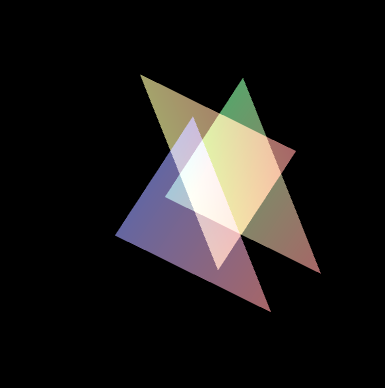
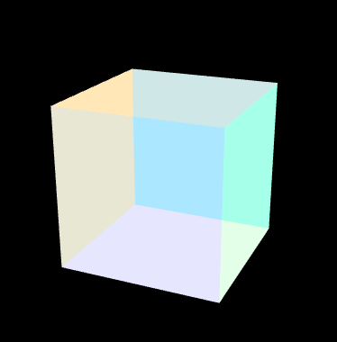

## 1.如何实现 $\alpha$ 融合
指通过颜色值中的 $\alpha$ 分量来控制颜色的透明度。如果物体是透明的，是可以看到物体背后的其他物体的。
+ 开启混合功能
```js
gl.enable(gl.BLEND);
```
+ 指定混合函数
```js
gl.blendFunc(gl.SRC_ALPHA,gl.ONE_MINUS_SRC_ALPHA)
```

我们通过设置顶点的透明度以及开启混合和设置混合函数，可以看到物体的颜色跟之前完全不一样了。<br>



[a混合demo](https://github.com/tangjie-93/WebGL/blob/main/%E8%B7%9F%E7%9D%80%E5%AE%98%E7%BD%91%E5%AD%A6WebGL%2BWebGL%E7%BC%96%E7%A8%8B%E6%8C%87%E5%8D%97/%E9%AB%98%E7%BA%A7%E6%8A%80%E6%9C%AF/a%E6%B7%B7%E5%90%88/demo/a%E6%B7%B7%E5%90%88.html)

## 2.混合函数
在进行 $\alpha$ 混合时，会用到了两个颜色，源颜色和目标颜色，前者是**待混合进去**的颜色，后者是**已经在帧缓冲区中的颜色**。通过设置混合模式，可以实现各种透明效果。

比如我们先绘制了一个三角形，然后在这个三角形之上又绘制了一个三角形，如果有重叠的我操作，就会设计混合操作。需要把后者的颜色混入到前者中，后者的颜色就是源颜色，前者的颜色就是目标颜色。
#### 2.1、基本用法
`gl.blendFunc(sfactor, dfactor)` 用于指定源因子和目标因子的混合方式。函数的两个参数分别表示源因子`（source factor）`和目标因子`（destination factor）`。
```js
gl.blendFunc(src_factor,dst_factor)
```
`gl.blendFunc` 函数用于指定混合因子,混合因子不一样，最终的效果也会不一样。

#### 2.2、**参数说明**
+ `src_factor`：源因子，指定源颜色应如何影响最终颜色。
+ `dst_factor`：目标因子，指定目标颜色应如何影响最终颜色。

常用的参数包括：

+ `gl.ZERO`：因子值为 `0`。
+ `gl.ONE`：因子值为 `1`。
+ `gl.SRC_COLOR`：使用源颜色。
+ `gl.ONE_MINUS_SRC_COLOR`：使用 `1` 减去源颜色。
+ `gl.DST_COLOR`：使用目标颜色。
+ `gl.ONE_MINUS_DST_COLOR`：使用 `1`减去目标颜色。
+ `gl.SRC_ALPHA`：使用源颜色的`alpha`值。
+ `gl.ONE_MINUS_SRC_ALPHA`：使用 `1` 减去源颜色的`alpha`值。
+ `gl.DST_ALPHA`：使用目标颜色的`alpha`值。
+ `gl.ONE_MINUS_DST_ALPHA`：使用`1` 减去目标颜色的`alpha`值。
####  2.3、**示例**
```JS
// 初始化WebGL上下文
var canvas = document.getElementById("canvas");
var gl = canvas.getContext("webgl");

// 启用混合
gl.enable(gl.BLEND);

// 设置混合函数
gl.blendFunc(gl.SRC_ALPHA, gl.ONE_MINUS_SRC_ALPHA);

// 清除颜色缓冲区
gl.clearColor(0.0, 0.0, 0.0, 1.0);
gl.clear(gl.COLOR_BUFFER_BIT);

// 设置绘制颜色（带透明度）
gl.color4f(1.0, 0.0, 0.0, 0.5);  // 半透明红色

// 绘制一个三角形
gl.begin(gl.TRIANGLES);
gl.vertex2f(-0.5, -0.5);
gl.vertex2f(0.5, -0.5);
gl.vertex2f(0.0, 0.5);
gl.end();
```
在这个示例中，我们启用了混合功能，并设置了源因子为 `gl.SRC_ALPHA（源颜色的alpha值）`，目标因子为 `gl.ONE_MINUS_SRC_ALPHA（1减去源颜色的alpha值）`。这意味着源颜色的 `alpha` 值决定了新颜色的影响程度，而`(1 - 源颜色的alpha值) `决定了现有颜色的影响程度。结果是常见的半透明效果。
最终的计算公式如下所示：
#### 2.4、混合公式
混合公式的基本形式为:
```js
混合后颜色 = 源颜色 * src_factor + 目标颜色*dts_factor
```
通过调整源因子和目标因子的值，可以实现不同的透明和混合效果。
#### 2.5、**混合模式**
+ `Alpha` 混合：
```JS
gl.blendFunc(gl.SRC_ALPHA, gl.ONE_MINUS_SRC_ALPHA);
```
  结果：实现透明度效果（常用）。
+ 加法混合
```JS
gl.blendFunc(gl.ONE, gl.ONE);
```
  结果：颜色值相加，适用于光效、火焰等效果
+ 乘法混合：
```JS
gl.blendFunc(gl.DST_COLOR, gl.ZERO);
```
  结果：颜色相乘，产生更暗的效果。

## 3.半透明物体的绘制

注意在绘制半透明物体的时候，需要将开启深度测试的代码关闭掉，这是因为 $\alpha$ 混合发生在绘制片元的过程中，当隐藏面消除功能开启时，被隐藏的片元不会被绘制，所以也不会发生混合过程，所以就不会出现半透明的效果。
```js
  // Set the clear color and enable the depth test
  gl.clearColor(0.0, 0.0, 0.0, 1.0);
//   gl.enable(gl.DEPTH_TEST);
  // Enable alpha blending
  gl.enable(gl.BLEND);
  // Set blending function
  gl.blendFunc(gl.SRC_ALPHA, gl.ONE_MINUS_SRC_ALPHA);
  // gl.blendFunc(gl.SRC_ALPHA, gl.ONE);
```
半透明的效果图如下所示



[半透明物体demo](https://github.com/tangjie-93/WebGL/blob/main/%E8%B7%9F%E7%9D%80%E5%AE%98%E7%BD%91%E5%AD%A6WebGL%2BWebGL%E7%BC%96%E7%A8%8B%E6%8C%87%E5%8D%97/%E9%AB%98%E7%BA%A7%E6%8A%80%E6%9C%AF/a%E6%B7%B7%E5%90%88/demo/%E5%8D%8A%E9%80%8F%E6%98%8E%E7%9A%84%E7%89%A9%E4%BD%93.html)

## 4.透明与不透明物体共存

关闭隐藏面消除功能是一个粗暴的解决方案，在绘制三维场景时，不透明和透明的物体都会有，所以肯定不能关闭隐藏面消除的功能，不然那些不透明物体前后关系会很混乱。不过我们可以通过下面的机制，来同时实现隐藏面消除和半透明效果。具体步骤如下所示：
+ 开启隐藏面消除功能
```js
gl.enable(gl.DEPTH_TEST)
```
+ 绘制所有不透明物体 ($\alpha$=1)
+ 锁定用于进行隐藏面消除的深度缓冲区的写入操作，使之只读。
```js
gl.depthMask(false)
```
+ 绘制所有半透明的物体 ($\alpha$!=1)，注意应当按照深度顺序排序，然后从后往前绘制。
+ 释放深度缓冲区，是指可读可写。
```js
gl.depthMask(true)
```
部分代码如下所示
```js
....
function draw(gl, n, u_ModelViewMatrix) {
      //设置底色
    gl.clearColor(0.0, 0.0, 0.0, 1.0);
    //1. 开启隐藏面功能
    gl.enable(gl.DEPTH_TEST);
    //开启混合功能
    gl.enable(gl.BLEND);
    //指定混合函数
    gl.blendFunc(gl.SRC_ALPHA, gl.ONE_MINUS_SRC_ALPHA);
    //设置视角矩阵的相关信息（视点，视线，上方向）
    var viewMatrix = new Matrix4();
    viewMatrix.setPerspective(10.0, canvas.width / canvas.height, 1.0, 100.0);
    viewMatrix.lookAt(0.0, g_eyeY, 10.0, 0, 0, 0, 0, 1, 0);
    //设置模型矩阵的相关信息
    var modelMatrix = new Matrix4();
    modelMatrix.setRotate(g_eyeX, 0, 1, 0);

    //计算出模型视图矩阵 viewMatrix.multiply(modelMatrix)相当于在着色器里面u_ViewMatrix * u_ModelMatrix
    var modeViewMatrix = viewMatrix.multiply(modelMatrix);

    //将试图矩阵传给u_ViewMatrix变量
    gl.uniformMatrix4fv(u_ModelViewMatrix, false, modeViewMatrix.elements);

    gl.clear(gl.COLOR_BUFFER_BIT | gl.DEPTH_BUFFER_BIT);
    // 2. 绘制不透明的物体
    //绘制所有不透明的物体
    gl.drawArrays(gl.TRIANGLES, 0, 3);
    // 3.锁定深度缓冲区
    //锁定用于进行隐藏面消除的深度缓冲区的写入操作，使之只读
    gl.depthMask(false);
    // 4. 绘制透明的物体
    //绘制透明的
    gl.drawArrays(gl.TRIANGLES, 3, 6);

    //5. 释放深度缓冲区，使之可读可写
    gl.depthMask(true);
}
```


[透明和不透明物体共存demo](https://github.com/tangjie-93/WebGL/blob/main/%E8%B7%9F%E7%9D%80%E5%AE%98%E7%BD%91%E5%AD%A6WebGL%2BWebGL%E7%BC%96%E7%A8%8B%E6%8C%87%E5%8D%97/%E9%AB%98%E7%BA%A7%E6%8A%80%E6%9C%AF/a%E6%B7%B7%E5%90%88/demo/%E9%80%8F%E6%98%8E%E4%B8%8E%E4%B8%8D%E9%80%8F%E6%98%8E%E7%9A%84%E7%89%A9%E4%BD%93%E5%85%B1%E5%AD%98.html)
<Valine></Valine>