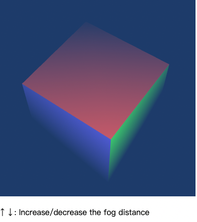

## 1.雾化
用来描述远处的物体看上去较为模糊的现象。
## 2.线性雾化
在线性雾化中，某一点的雾化程度取决于**它与视点之间的距离**，距离越远雾化程度越高。线性雾化可以使用下面的公式来进行计算。某一点的雾化程度可以定义成**雾化因子**。并且可以在线性雾化公式中被计算出来。起点表示开始雾化之处，终点表示完全雾化之处。比终点更远的点是完全雾化了的，即完全看不见了。
```js
雾化因子 = (终点 - 当前点与视点间的距离)/(终点-起点)
并且  起点<=当前点与视点间的距离<=终点
```
那么物体的颜色就可以用下面的公式来进行计算。
```js
片元颜色 = 物体表面颜色 * 雾化因子 + 雾的颜色*(1 - 雾化因子)
```
主要步骤如下：
+ 在顶点着色器中计算当前顶点与视点之间的距离，并传入片元着色器
+ 在片元着色器中根据片元与视点之间的距离，计算雾化因子，最终得出片元的颜色。

**注意：** 着色器中传入的是视点在世界坐标系下的坐标，所以雾化因子是在世界坐标系下计算的。
**顶点着色器中的代码如下所示**
```js
attribute vec4 a_Position;
attribute vec4 a_Color;
uniform mat4 u_MvpMatrix; //投影视图模型矩阵
uniform mat4 u_ModelMatrix;// 模型矩阵
uniform vec4 u_Eye;    // 视点在世界坐标系下的坐标
varying vec4 v_Color;
varying float v_Dist; // 顶点到视点之间的距离
void main() {
  gl_Position = u_MvpMatrix * a_Position;
  v_Color = a_Color;
     // 计算顶点到视点之间的距离
  v_Dist = distance(u_ModelMatrix * a_Position, u_Eye);
}
```
**片元着色器中的代码如下所示**
```js
#ifdef GL_ES
precision mediump float;
#endif
uniform vec3 u_FogColor; // 雾的颜色
uniform vec2 u_FogDist;  // Distance of Fog (starting point, end point)
varying vec4 v_Color;
varying float v_Dist;
void main() {
     // Calculation of fog factor (factor becomes smaller as it goes further away from eye point)
    // 根据雾化因子的计算公式计算雾化因子 值在0和1之间 在起点是1，在终点是0，
    float fogFactor = clamp((u_FogDist.y - v_Dist) / (u_FogDist.y - u_FogDist.x), 0.0, 1.0);
     // Stronger fog as it gets further: u_FogColor * (1 - fogFactor) + v_Color * fogFactor
     // 根据公式得到片元颜色
     //  u_FogColor * (1 - fogFactor) + v_Color * fogFactor 跟下面的方法等价
    vec3 color = mix(u_FogColor, vec3(v_Color), fogFactor);
    gl_FragColor = vec4(color, v_Color.a);
}
```
**`js`中的代码如下所示**
```js
// 雾的颜色
  const fogColor = new Float32Array([0.137, 0.231, 0.423]);
  // 雾的起点和终点与视点之间的距离
  const fogDist = new Float32Array([55, 80]);
  //  视点的位置，在世界坐标系下的位置
  const eye = new Float32Array([25, 65, 35, 1.0]);

  // Get the storage locations of uniform variables
  const u_MvpMatrix = gl.getUniformLocation(gl.program, 'u_MvpMatrix');
  const u_ModelMatrix = gl.getUniformLocation(gl.program, 'u_ModelMatrix');
  const u_Eye = gl.getUniformLocation(gl.program, 'u_Eye');
  const u_FogColor = gl.getUniformLocation(gl.program, 'u_FogColor');
  const u_FogDist = gl.getUniformLocation(gl.program, 'u_FogDist');
  if (!u_MvpMatrix || !u_ModelMatrix || !u_Eye || !u_FogColor || !u_FogDist) {
    console.log('Failed to get the storage location');
    return;
  }
	
  // Pass fog color, distances, and eye point to uniform variable
  gl.uniform3fv(u_FogColor, fogColor); // Colors
  gl.uniform2fv(u_FogDist, fogDist);   // Starting point and end point
  gl.uniform4fv(u_Eye, eye);           // Eye point

  // 设置背景色，并开启深度测试
  gl.clearColor(fogColor[0], fogColor[1], fogColor[2], 1.0); // Color of Fog
  gl.enable(gl.DEPTH_TEST);

```


下面是雾化效果的示意图



[demo地址](https://github.com/tangjie-93/WebGL/blob/main/%E8%B7%9F%E7%9D%80%E5%AE%98%E7%BD%91%E5%AD%A6WebGL%2BWebGL%E7%BC%96%E7%A8%8B%E6%8C%87%E5%8D%97/%E9%AB%98%E7%BA%A7%E6%8A%80%E6%9C%AF/%E9%9B%BE%E5%8C%96(%E5%A4%A7%E6%B0%94%E6%95%88%E6%9E%9C)/demo/fog.html)


## 3.使用w分量的线性雾
在顶点着色器中计算顶点与视点之间的距离，会造成较大的开销，可能还会影响性能。我们可以使用顶点经过模型视图投影变换后的的坐标`(gl_Position.w)`的`w`分量来近似估算出这个距离。

实际上，这个`w`分量的值就是顶点的视图坐标`z`分量乘以`-1`。在视图坐标系中，视点在原点，视线沿着`Z`轴负方向，观察者看到的其他物体其视图坐标系值`z`分量都是负的。而`gl_Position.w)`的 `w`分量值正好是`z`分量值乘以`-1`,所以可以直接使用该值来近视与视点的距离。
**在顶点着色器中的代码**
```js
attribute vec4 a_Position;
attribute vec4 a_Color;
uniform mat4 u_MvpMatrix; //投影视图模型矩阵
uniform mat4 u_ModelMatrix;// 模型矩阵
uniform vec4 u_Eye;    // 视点在世界坐标系下的坐标
varying vec4 v_Color;
varying float v_Dist; // 顶点到视点之间的距离
void main() {
  gl_Position = u_MvpMatrix * a_Position;
  v_Color = a_Color;
     // 使用视图坐标系下的负z值
  v_Dist = gl_Position.w;
}
```
**在片元着色器中的坐标**
```js
#ifdef GL_ES
precision mediump float;
#endif
uniform vec3 u_FogColor;// Color of Fog
uniform vec2 u_FogDist; // Distance of Fog (starting point, end point)
varying vec4 v_Color;
varying float v_Dist;
void main() {
    // Calculation of fog factor (factor becomes smaller as it goes further away from eye point)
    float fogFactor = (u_FogDist.y - v_Dist) / (u_FogDist.y - u_FogDist.x);
        // Stronger fog as it gets further: u_FogColor * (1 - fogFactor) + v_Color * fogFactor
    vec3 color = mix(u_FogColor, vec3(v_Color), clamp(fogFactor, 0.0, 1.0));
    gl_FragColor = vec4(color, v_Color.a);
}
```

**注意：** 使用深度很简单但是有一个问题。假设围绕相机有一圈物体。我们根据到相机 `z`平面的距离计算雾量。这意味着你转动相机，当它在视图空间中的 `z` 值趋近于 `0` ，物体会越来越不受雾的影响。

[demo地址](https://github.com/tangjie-93/WebGL/blob/main/%E8%B7%9F%E7%9D%80%E5%AE%98%E7%BD%91%E5%AD%A6WebGL%2BWebGL%E7%BC%96%E7%A8%8B%E6%8C%87%E5%8D%97/%E9%AB%98%E7%BA%A7%E6%8A%80%E6%9C%AF/%E9%9B%BE%E5%8C%96(%E5%A4%A7%E6%B0%94%E6%95%88%E6%9E%9C)/demo/fog-w.html)

## 4.指数雾
它根据距观察者距离的平方变厚。一个常见的 **指数雾公式** 是：
```js
fogAmount = 1. - exp2(-fogDensity * fogDensity * fogDistance * fogDistance * LOG2));
fogAmount = clamp(fogAmount, 0., 1.);
```
注意：基于密度的雾没有最近值和最远值设置。
点元着色器代码
```js
attribute vec4 a_position;
attribute vec2 a_texcoord;

uniform mat4 u_worldView;
uniform mat4 u_projection;

varying vec2 v_texcoord;
varying vec3 v_position;

void main() {
  // Multiply the position by the matrix.
  gl_Position = u_projection * u_worldView * a_position;

  // Pass the texcoord to the fragment shader.
  v_texcoord = a_texcoord;

  // Pass the view position to the fragment shader
  v_position = (u_worldView * a_position).xyz;
}
```
片元着色器代码
```js
precision mediump float;

// Passed in from the vertex shader.
varying vec2 v_texcoord;
varying vec3 v_position;

// The texture.
uniform sampler2D u_texture;
uniform vec4 u_fogColor;
uniform float u_fogDensity;

void main() {
  vec4 color = texture2D(u_texture, v_texcoord);

  #define LOG2 1.442695

  float fogDistance = length(v_position);
  float fogAmount = 1. - exp2(-u_fogDensity * u_fogDensity * fogDistance * fogDistance * LOG2);
  fogAmount = clamp(fogAmount, 0., 1.);

  gl_FragColor = mix(color, u_fogColor, fogAmount);
```
[demo地址](https://github.com/tangjie-93/WebGL/blob/main/%E8%B7%9F%E7%9D%80%E5%AE%98%E7%BD%91%E5%AD%A6WebGL%2BWebGL%E7%BC%96%E7%A8%8B%E6%8C%87%E5%8D%97/%E9%AB%98%E7%BA%A7%E6%8A%80%E6%9C%AF/%E9%9B%BE%E5%8C%96(%E5%A4%A7%E6%B0%94%E6%95%88%E6%9E%9C)/demo/fog-%E6%8C%87%E6%95%B0.html)

**参考文档**

[WebGL 雾](https://webglfundamentals.org/webgl/lessons/zh_cn/webgl-fog.html)

<Valine></Valine>