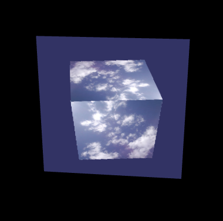

## 1.概念
指的是使用`WebGL`渲染三维图形，然后将渲染结果作为纹理贴到另一个三维物体上去。实际上就是将渲染结果作为纹理使用。
## 2.祯缓冲区对象和渲染缓冲区对象
默认情况下，`WebGL`在颜色缓冲区中进行绘图，在开启隐藏面消除功能时，还会使用到深度缓冲区。绘制的结果图像是存储在颜色缓冲区中的。

**祯缓冲对象**可以用来代替颜色缓冲区或者深度缓冲区。绘制在祯缓冲区的对象并不会直接显示在`canvas`上，我们可以先对祯缓冲区中的内容进行一些处理再显示，或者是直接使用其中的内容作为纹理图像。在祯缓冲区中进行绘制的过程称之为**离屏绘制**。

模型的绘制工作并不是直接发生在祯缓冲区中的，而是发生在祯缓冲区所关联的对象上。祯缓冲区中有三种关联对象：**颜色关联对象**，**深度关联对象**，**模版关联对象**，分别用来替代颜色缓冲区，深度缓冲区和模版缓冲区。

每个关联对象有可以是两种类型的；**纹理对象**和**渲染缓冲区对象**。纹理对象存储了纹理图像，一般是作为颜色关联对象关联到祯缓冲区对象，随后`WebGL`就可以在纹理对象中绘图了。渲染缓冲区对象表示一种更加通用的绘图区域，可以向其中写入多种类型的数据。

## 3.如何实现渲染到纹理

如果我们想把`WebGL`中渲染出的图像作为纹理使用，那么就需要将纹理对象作为颜色关联对象关联到祯缓冲区对象上，然后在祯缓冲区进行绘制，此时颜色关联对像就代替了颜色缓冲区。

如果我们需要进行隐藏面消除，我们就需要再创建一个渲染缓冲区对象来作为祯缓冲区的深度关联对象，来代替深度缓冲区。

需要实现上面的效果，需要执行下面的8个步骤。
#### 1.创建祯缓冲区对像
```js
// Create a frame buffer object (FBO)
framebuffer = gl.createFramebuffer();
if (!framebuffer) {
console.log('Failed to create frame buffer object');
return error();
}
```
#### 2.创建纹理对像并设置其尺寸和参数
```js
// Create a texture object and set its size and parameters
texture = gl.createTexture(); // Create a texture object
if (!texture) {
    console.log('Failed to create texture object');
    return error();
}
gl.bindTexture(gl.TEXTURE_2D, texture); // Bind the object to target
gl.texImage2D(gl.TEXTURE_2D, 0, gl.RGBA, OFFSCREEN_WIDTH, OFFSCREEN_HEIGHT, 0, gl.RGBA, gl.UNSIGNED_BYTE, null);
gl.texParameteri(gl.TEXTURE_2D, gl.TEXTURE_MIN_FILTER, gl.LINEAR);
framebuffer.texture = texture; // Store the texture object
```
#### 3.创建渲染缓冲区对像
```js
// Create a renderbuffer object and Set its size and parameters
depthBuffer = gl.createRenderbuffer(); // Create a renderbuffer object
if (!depthBuffer) {
    console.log('Failed to create renderbuffer object');
    return error();
}
```
#### 4.绑定渲染缓冲区对象并设置其尺寸
```js
gl.bindRenderbuffer(gl.RENDERBUFFER, depthBuffer); // Bind the object to target
gl.renderbufferStorage(gl.RENDERBUFFER, gl.DEPTH_COMPONENT16, OFFSCREEN_WIDTH, OFFSCREEN_HEIGHT);
```
#### 5.将祯缓冲区的颜色关联对象指定为一个纹理对象
```js
 // Attach the texture and the renderbuffer object to the FBO
  gl.bindFramebuffer(gl.FRAMEBUFFER, framebuffer);
  gl.framebufferTexture2D(gl.FRAMEBUFFER, gl.COLOR_ATTACHMENT0, gl.TEXTURE_2D, texture, 0);

```
#### 6.将祯缓冲区的深度关联对象指定为一个渲染缓冲区对象
```js
  gl.framebufferRenderbuffer(gl.FRAMEBUFFER, gl.DEPTH_ATTACHMENT, gl.RENDERBUFFER, depthBuffer);
```
#### 7.检查祯缓冲区是否正确配置
```js
 // Check if FBO is configured correctly
  var e = gl.checkFramebufferStatus(gl.FRAMEBUFFER);
  if (gl.FRAMEBUFFER_COMPLETE !== e) {
    console.log('Frame buffer object is incomplete: ' + e.toString());
    return error();
  }
  ...
  // Unbind the buffer object
  gl.bindFramebuffer(gl.FRAMEBUFFER, null);
  gl.bindTexture(gl.TEXTURE_2D, null);
  gl.bindRenderbuffer(gl.RENDERBUFFER, null);

```
#### 8.在祯缓冲区中进行绘制
```js
function draw(gl, canvas, fbo, plane, cube, angle, texture, viewProjMatrix, viewProjMatrixFBO) {
  gl.bindFramebuffer(gl.FRAMEBUFFER, fbo);              // Change the drawing destination to FBO
  gl.viewport(0, 0, OFFSCREEN_WIDTH, OFFSCREEN_HEIGHT); // Set a viewport for FBO

  gl.clearColor(0.2, 0.2, 0.4, 1.0); // Set clear color (the color is slightly changed)
  gl.clear(gl.COLOR_BUFFER_BIT | gl.DEPTH_BUFFER_BIT);  // Clear FBO

  drawTexturedCube(gl, gl.program, cube, angle, texture, viewProjMatrixFBO);   // Draw the cube
    // 切换绘制目标为颜色缓冲区
  gl.bindFramebuffer(gl.FRAMEBUFFER, null);        // Change the drawing destination to color buffer
  gl.viewport(0, 0, canvas.width, canvas.height);  // Set the size of viewport back to that of <canvas>

  gl.clearColor(0.0, 0.0, 0.0, 1.0);
  gl.clear(gl.COLOR_BUFFER_BIT | gl.DEPTH_BUFFER_BIT); // Clear the color buffer

  drawTexturedPlane(gl, gl.program, plane, angle, fbo.texture, viewProjMatrix);  // Draw the plane
}
```
[渲染到纹理](https://github.com/tangjie-93/WebGL/blob/main/%E8%B7%9F%E7%9D%80%E5%AE%98%E7%BD%91%E5%AD%A6WebGL%2BWebGL%E7%BC%96%E7%A8%8B%E6%8C%87%E5%8D%97/%E9%AB%98%E7%BA%A7%E6%8A%80%E6%9C%AF/%E6%B8%B2%E6%9F%93%E5%88%B0%E7%BA%B9%E7%90%86/index.html)

渲染效果如下所示



## 4.问题
#### 4.1 上面的代码为什么要执行两遍gl.bindTexture(gl.TEXTURE_2D, null)
在 `WebGL` 编程中，`gl.bindTexture(gl.TEXTURE_2D, null);` 的作用是解除当前绑定的2D纹理。这么做有几个原因：

+ **防止意外修改**： 在很多情况下，你可能会有多个纹理对象，并且不希望对一个纹理的操作影响到其他纹理。因此，在操作一个纹理之后，解除绑定可以确保后续操作不会意外地修改这个纹理。

+ **明确渲染状态**： 在渲染管线中，保持明确的状态管理是一个好习惯。解除绑定可以让代码更具可读性，明确指出此时不再需要这个纹理。

+ **调试便利**： 当你在调试 `WebGL` 程序时，明确解除绑定可以帮助你更容易地追踪问题所在。如果某个纹理绑定出现问题，明确的解除绑定能让问题更容易被发现和解决。

**第一次 `gl.bindTexture(gl.TEXTURE_2D, null);`出现在你设置纹理之后。**
```js
image.onload = function() {
  // Write image data to texture object
  gl.pixelStorei(gl.UNPACK_FLIP_Y_WEBGL, 1);  // Flip the image Y coordinate
  gl.bindTexture(gl.TEXTURE_2D, texture);
  gl.texParameteri(gl.TEXTURE_2D, gl.TEXTURE_MIN_FILTER, gl.LINEAR);
  gl.texImage2D(gl.TEXTURE_2D, 0, gl.RGBA, gl.RGBA, gl.UNSIGNED_BYTE, image);
  // Pass the texure unit 0 to u_Sampler
  gl.uniform1i(u_Sampler, 0);

  gl.bindTexture(gl.TEXTURE_2D, null); // Unbind the texture object
};
```
在这里解除绑定是为了确保在接下来的帧缓冲设置过程中，不会对这个纹理进行任何意外的修改。解除绑定后，可以放心地进行帧缓冲对象的其他设置。
**第二次 `gl.bindTexture(gl.TEXTURE_2D, null);`出现在你使用纹理之后。**
```js
// 使用帧缓冲纹理
gl.bindTexture(gl.TEXTURE_2D, texture);
...
// Check if FBO is configured correctly
var e = gl.checkFramebufferStatus(gl.FRAMEBUFFER);
if (gl.FRAMEBUFFER_COMPLETE !== e) {
  console.log('Frame buffer object is incomplete: ' + e.toString());
  return error();
}

// Unbind the buffer object
gl.bindFramebuffer(gl.FRAMEBUFFER, null);
gl.bindTexture(gl.TEXTURE_2D, null);
gl.bindRenderbuffer(gl.RENDERBUFFER, null);
```
在这里解除绑定是为了确保在后续的渲染过程中，不会对这个纹理进行任何意外的修改。此时，你已经完成了对这个纹理的所有必要操作，所以可以解除绑定，确保状态的清晰。
以下是简化的代码段，重点展示两次解除绑定的位置：
```js
// 创建并配置纹理
const texture = gl.createTexture();
gl.bindTexture(gl.TEXTURE_2D, texture);
gl.texImage2D(gl.TEXTURE_2D, 0, gl.RGBA, canvas.width, canvas.height, 0, gl.RGBA, gl.UNSIGNED_BYTE, null);
gl.texParameteri(gl.TEXTURE_2D, gl.TEXTURE_MIN_FILTER, gl.LINEAR);
gl.texParameteri(gl.TEXTURE_2D, gl.TEXTURE_MAG_FILTER, gl.LINEAR);
gl.bindTexture(gl.TEXTURE_2D, null); // 第一次解除绑定

// ... 其他帧缓冲对象配置 ...

// 使用帧缓冲纹理
gl.bindTexture(gl.TEXTURE_2D, texture);
...
// 这里使用纹理进行后续渲染操作
gl.bindTexture(gl.TEXTURE_2D, null); // 第二次解除绑定
...

```
#### 4.2 上面的代码为什么要执行两遍gl.bindFramebuffer(gl.FRAMEBUFFER, null)
在 `WebGL`编程中，`gl.bindFramebuffer(gl.FRAMEBUFFER, null)`;的作用是解除当前绑定的帧缓冲对象 `(Framebuffer Object, FBO)`，恢复默认的帧缓冲（即屏幕）。这样做有几个原因：

+ **防止意外修改**：当你绑定一个帧缓冲对象后，所有的绘制操作都会作用于该帧缓冲对象。解除绑定可以确保后续的绘制操作不会意外地影响到这个帧缓冲对象。

+ **明确渲染状态**：在渲染管线中，保持明确的状态管理是一个好习惯。解除绑定可以让代码更具可读性，明确指出此时不再需要这个帧缓冲对象。

+ **恢复默认帧缓冲**：在使用自定义帧缓冲对象进行渲染之后，通常需要将绘制目标切换回默认帧缓冲对象（即屏幕），以进行最终的绘制。
让我们具体看一下在代码中的两次`gl.bindFramebuffer(gl.FRAMEBUFFER, null)`;：

**第一次 gl.bindFramebuffer(gl.FRAMEBUFFER, null);**
这个解除绑定出现在你设置并检查帧缓冲对象之后：
```js
// 检查帧缓冲对象是否完整
if (gl.checkFramebufferStatus(gl.FRAMEBUFFER) !== gl.FRAMEBUFFER_COMPLETE) {
    console.error("Framebuffer is not complete");
}
gl.bindFramebuffer(gl.FRAMEBUFFER, null); // 第一次解除绑定
```
在这里解除绑定是为了确保在接下来的操作中，所有的绘制操作都不会作用于这个帧缓冲对象。你已经完成了帧缓冲对象的设置和检查，可以解除绑定，将绘制目标切换回默认帧缓冲。
**第二次 gl.bindFramebuffer(gl.FRAMEBUFFER, null);**
第二个解除绑定出现在你使用帧缓冲对象进行渲染之后：
```js
// 渲染到帧缓冲对象
gl.bindFramebuffer(gl.FRAMEBUFFER, framebuffer);
gl.viewport(0, 0, canvas.width, canvas.height);

// 这里执行实际的渲染操作
gl.bindFramebuffer(gl.FRAMEBUFFER, null); // 第二次解除绑定
```
在这里解除绑定是为了确保在完成对帧缓冲对象的渲染之后，绘制目标切换回默认帧缓冲（即屏幕）。这样可以进行后续的渲染操作，如将帧缓冲对象中的内容绘制到屏幕上。

以下是简化的代码段，重点展示两次解除绑定的位置：
```js
// 创建帧缓冲对象
const framebuffer = gl.createFramebuffer();
gl.bindFramebuffer(gl.FRAMEBUFFER, framebuffer);

// ... 帧缓冲对象配置 ...

// 检查帧缓冲对象是否完整
if (gl.checkFramebufferStatus(gl.FRAMEBUFFER) !== gl.FRAMEBUFFER_COMPLETE) {
    console.error("Framebuffer is not complete");
}
gl.bindFramebuffer(gl.FRAMEBUFFER, null); // 第一次解除绑定

// 渲染到帧缓冲对象
gl.bindFramebuffer(gl.FRAMEBUFFER, framebuffer);
gl.viewport(0, 0, canvas.width, canvas.height);

// 这里执行实际的渲染操作

gl.bindFramebuffer(gl.FRAMEBUFFER, null); // 第二次解除绑定

```

**参考文档**<br>
[WebGL 帧缓冲](https://webglfundamentals.org/webgl/lessons/zh_cn/webgl-framebuffers.html)
<Valine></Valine>