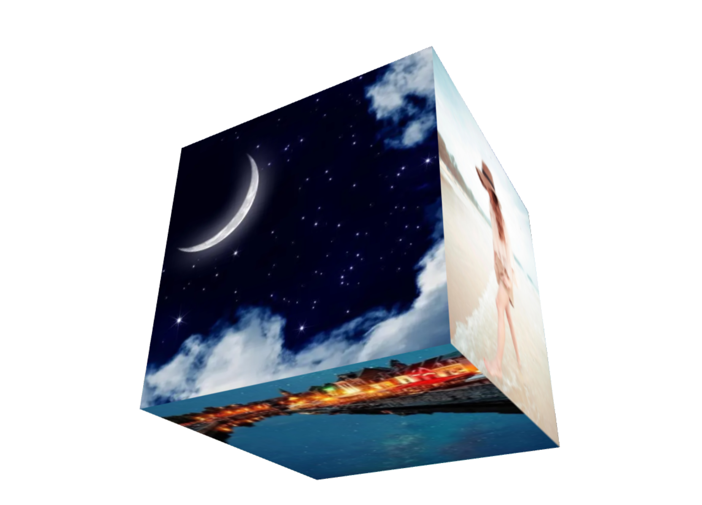
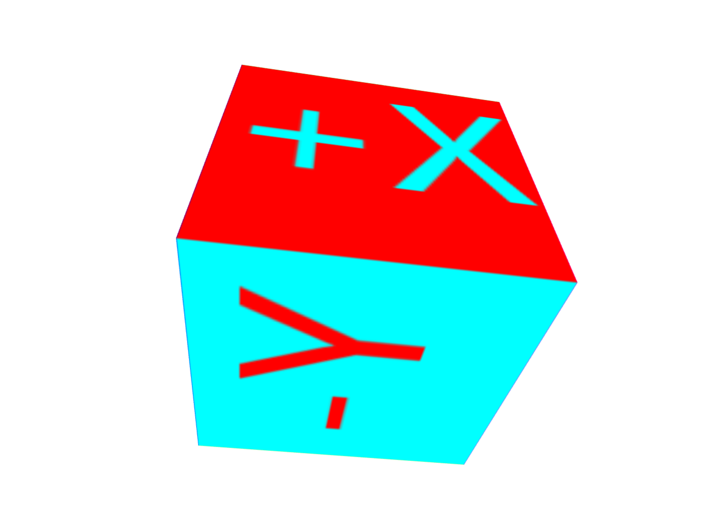
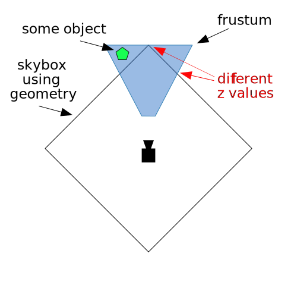
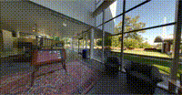
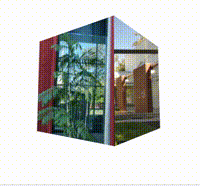

## 1.立方体贴图
在 `WebGL` 中实现立方体贴图`（Cube Mapping）`是一种用于环境贴图或反射效果的技术。以下是如何在 `WebGL` 中实现立方体贴图的步骤，包括创建一个立方体并应用贴图。立方体贴图由六个面组成，分别对应立方体的六个方向（正 `X`、负 `X`、正`Y`、负`Y`、正`Z`、负`Z`）。每个面都是一个独立的 `2D` 纹理。不像常规的纹理坐标有`2`个纬度，立方体纹理使用法向量， 根据法向量的朝向选取立方体`6`个面中的一个，这个面的像素用来采样生成颜色。
我们除了使用图片绘制纹理，我们还可以使用`canvas`来绘制纹理。

#### 1.1 使用图片绘制纹理
核心代码如下所示
+ 顶点着色器代码
```js
attribute vec4 a_position;
uniform mat4 u_matrix;
varying vec3 v_normal;
void main() {
  // Multiply the position by the matrix.
  gl_Position = u_matrix * a_position;
  // 传递法向量。因为位置是以几何中心为原点的
  // 我们可以直接传递位置
  // 直接使用顶点位置作为法向量可以简化计算。如果顶点是在单位球体上的点，顶点的归一化坐标即为法向量。
  v_normal = normalize(a_position.xyz);
}
```
+ 片段着色器代码
```js
precision mediump float;
// Passed in from the vertex shader.
varying vec3 v_normal;
// The texture.
uniform samplerCube u_texture;

void main() {
    gl_FragColor = textureCube(u_texture, normalize(v_normal));
}
```
+ 创建纹理对象
```js
function createTexture(gl) {
    // Create a texture.
    const texture = gl.createTexture();
    // 立方体纹理 gl.TEXTURE_CUBE_MAP
    // 二维纹理 gl.TEXTURE_2D
    gl.bindTexture(gl.TEXTURE_CUBE_MAP, texture);
    const faceInfos = [
        { target: gl.TEXTURE_CUBE_MAP_POSITIVE_X, url: '../../images/1.jpg' },
        { target: gl.TEXTURE_CUBE_MAP_NEGATIVE_X, url: '../../images/2.jpg' },
        { target: gl.TEXTURE_CUBE_MAP_POSITIVE_Y, url: '../../images/3.jpg' },
        { target: gl.TEXTURE_CUBE_MAP_NEGATIVE_Y, url: '../../images/4.jpg' },
        { target: gl.TEXTURE_CUBE_MAP_POSITIVE_Z, url: '../../images/5.jpg' },
        { target: gl.TEXTURE_CUBE_MAP_NEGATIVE_Z, url: '../../images/6.jpg' },
    ];
    Promise.allSettled(faceInfos.map(item=>loadImg(item.url))).then(res => {
        faceInfos.forEach(({ target }, index) => {
            // Upload the canvas to the cubemap face.
            const level = 0;
            const internalFormat = gl.RGBA;
            const format = gl.RGBA;
            const type = gl.UNSIGNED_BYTE;
            gl.texImage2D(target, level, internalFormat, format, type, res[index].value);
        });
        gl.generateMipmap(gl.TEXTURE_CUBE_MAP);
        gl.texParameteri(gl.TEXTURE_CUBE_MAP, gl.TEXTURE_MIN_FILTER, gl.LINEAR_MIPMAP_LINEAR);
    })
}
```
视觉效果如下所示



`demo`地址 [立方体贴图-使用图片绘制纹理](https://github.com/tangjie-93/WebGL/blob/main/fundmantalExamples/%E4%B8%89%E7%BB%B4%E7%BA%B9%E7%90%86/%E7%AB%8B%E6%96%B9%E4%BD%93%E8%B4%B4%E5%9B%BE-%E4%BD%BF%E7%94%A8%E5%9B%BE%E7%89%87%E7%BB%98%E5%88%B6%E7%BA%B9%E7%90%86.html)
#### 1.2 使用canvas绘制纹理
核心代码如下所示
```js
function createTexture() {
    // Create a texture.
    const texture = gl.createTexture();
    // 立方体纹理 gl.TEXTURE_CUBE_MAP
    // 二维纹理 gl.TEXTURE_2D
    gl.bindTexture(gl.TEXTURE_CUBE_MAP, texture);
    // Get A 2D context
    /** @type {Canvas2DRenderingContext} */
    const ctx = document.createElement("canvas").getContext("2d");
    // 立方体纹理需要正方形纹理
    ctx.canvas.width = 128;
    ctx.canvas.height = 128;

    const faceInfos = [
        { target: gl.TEXTURE_CUBE_MAP_POSITIVE_X, faceColor: '#F00', textColor: '#0FF', text: '+X', },
        { target: gl.TEXTURE_CUBE_MAP_NEGATIVE_X, faceColor: '#FF0', textColor: '#00F', text: '-X', },
        { target: gl.TEXTURE_CUBE_MAP_POSITIVE_Y, faceColor: '#0F0', textColor: '#F0F', text: '+Y', },
        { target: gl.TEXTURE_CUBE_MAP_NEGATIVE_Y, faceColor: '#0FF', textColor: '#F00', text: '-Y', },
        { target: gl.TEXTURE_CUBE_MAP_POSITIVE_Z, faceColor: '#00F', textColor: '#FF0', text: '+Z', },
        { target: gl.TEXTURE_CUBE_MAP_NEGATIVE_Z, faceColor: '#F0F', textColor: '#0F0', text: '-Z', },
    ];
    faceInfos.forEach((faceInfo, index) => {
        const { target, faceColor, textColor, text } = faceInfo;
        generateFace(ctx, faceColor, textColor, text);

        // Upload the canvas to the cubemap face.
        const level = 0;
        const internalFormat = gl.RGBA;
        const format = gl.RGBA;
        const type = gl.UNSIGNED_BYTE;
        gl.texImage2D(target, level, internalFormat, format, type, ctx.canvas);

    });
    gl.generateMipmap(gl.TEXTURE_CUBE_MAP);
    gl.texParameteri(gl.TEXTURE_CUBE_MAP, gl.TEXTURE_MIN_FILTER, gl.LINEAR_MIPMAP_LINEAR);
    // Now that the image has loaded make copy it to the texture.
    // Check if the image is a power of 2 in both dimensions.
    if (isPowerOf2(ctx.canvas.width) && isPowerOf2(ctx.canvas.height)) {
        // Yes, it's a power of 2. Generate mips.
        gl.generateMipmap(gl.TEXTURE_CUBE_MAP);
        gl.texParameteri(gl.TEXTURE_CUBE_MAP, gl.TEXTURE_MIN_FILTER, gl.LINEAR_MIPMAP_LINEAR);


    } else {
        // No, it's not a power of 2. Turn of mips and set wrapping to clamp to edge
        gl.texParameteri(gl.TEXTURE_CUBE_MAP, gl.TEXTURE_WRAP_S, gl.CLAMP_TO_EDGE);
        gl.texParameteri(gl.TEXTURE_CUBE_MAP, gl.TEXTURE_WRAP_T, gl.CLAMP_TO_EDGE);
        gl.texParameteri(gl.TEXTURE_CUBE_MAP, gl.TEXTURE_MIN_FILTER, gl.LINEAR);
    }
}
function generateFace(ctx, faceColor, textColor, text) {
    const { width, height } = ctx.canvas;
    ctx.fillStyle = faceColor;
    ctx.fillRect(0, 0, width, height);
    ctx.font = `${width * 0.7}px sans-serif`;
    ctx.textAlign = 'center';
    ctx.textBaseline = 'middle';
    ctx.fillStyle = textColor;
    ctx.fillText(text, width / 2, height / 2);
}
```
视觉效果如下所示



与使用图片绘制纹理的区别在于传递纹理时的参数不同
```js
 gl.texImage2D(target, 0, gl.RGBA, gl.RGBA, gl.UNSIGNED_BYTE, image);
 gl.texImage2D(target, 0, gl.RGBA, gl.RGBA, gl.UNSIGNED_BYTE, ctx.canvas);
```
`demo`地址 [立方体贴图-使用canvas绘制纹理](https://github.com/tangjie-93/WebGL/blob/main/fundmantalExamples/%E4%B8%89%E7%BB%B4%E7%BA%B9%E7%90%86/%E7%AB%8B%E6%96%B9%E4%BD%93%E8%B4%B4%E5%9B%BE-%E4%BD%BF%E7%94%A8canvas%E7%BB%98%E5%88%B6%E7%BA%B9%E7%90%86.html)
## 2.天空盒子
在 `WebGL` 中，天空盒子`（skybox）`是一种常见的技术，用于模拟远处的环境，使场景看起来像被包围在一个巨大的立方体或球体内。天空盒子通常使用立方体贴图`（cube map）`来创建。

如果绘制一个立方体，当相机朝不同的方向看时，盒子的角会比侧面更远，如下图所示：<br>
<br>
你可以看到上图，我们需要确保立方体最远点在视锥体内，但是由于这个原因，立方体的某些边缘可能最终覆盖了我们不想掩盖的物体。

典型的解决方案是关闭深度检测并首先绘制天空盒，但是我们也不能利用深度检测不会绘制场景中会被覆盖的物体的特性了。

另一个解决方案时不立方体，而是绘制一个覆盖整个画布的矩形，并使用立方体贴图。通常我们使用视图投影矩阵在三维空间中投影矩形。在这里，我们会做相反的事情。我们会反过来使用视图投影矩阵的逆来获取相机**看向矩形每一个像素的方向**。这会是看向立方体贴图的方向。

核心代码如下所示
+ 点元着色器代码
```js
attribute vec4 a_position;
varying vec4 v_position;
void main() {
    v_position = a_position;
    gl_Position = a_position;
    // 确保像素有最远的深度
    gl_Position.z = 1.0;
}
```
+ 片元着色器代码
```js
precision mediump float;
uniform samplerCube u_skybox;
uniform mat4 u_viewDirectionProjectionInverse;

varying vec4 v_position;
void main() {
    // 得到的是相机坐标系的坐标
    vec4 t = u_viewDirectionProjectionInverse * v_position;
    // 除以w转换4D到3D
    gl_FragColor = textureCube(u_skybox, normalize(t.xyz / t.w));
}
```
在片元着色器中直接使用投影视图矩阵的逆矩阵，然后跟坐标矩阵相乘得到的就是，坐标在相机坐标系中的位置。
+ 创建立方体贴图
```js
 // 计算投影矩阵
const aspect = gl.canvas.clientWidth / gl.canvas.clientHeight;
const projectionMatrix =
    m4.perspective(fieldOfViewRadians, aspect, 1, 2000);

// 相机在以原点为圆心直径2个单位的圆上看向原点
const cameraPosition = [Math.cos(time * .1)*3, 0, Math.sin(time * .1)*3];
const target = [0, 0, 0];
const up = [0, 1, 0];
// Compute the camera's matrix using look at.
const cameraMatrix = m4.lookAt(cameraPosition, target, up);

// Make a view matrix from the camera matrix.
const viewMatrix = m4.inverse(cameraMatrix);
// 我们只关心方向所以清除移动的部分
// viewMatrix[12] = 0;
// viewMatrix[13] = 0;
// viewMatrix[14] = 0;

const viewDirectionProjectionMatrix =
    m4.multiply(projectionMatrix, viewMatrix);
const viewDirectionProjectionInverseMatrix =
    m4.inverse(viewDirectionProjectionMatrix);

// Set the uniforms
gl.uniformMatrix4fv(
    viewDirectionProjectionInverseLocation, false,
    viewDirectionProjectionInverseMatrix);

// Tell the shader to use texture unit 0 for u_skybox
gl.uniform1i(skyboxLocation, 0);
```
+ 传参给着色器
```js
 function drawScene(time) {
    // convert to seconds
    time *= 0.001;
    // Subtract the previous time from the current time
    var deltaTime = time - then;
    // Remember the current time for the next frame.
    then = time;

    webglUtils.resizeCanvasToDisplaySize(gl.canvas);

    // Tell WebGL how to convert from clip space to pixels
    gl.viewport(0, 0, gl.canvas.width, gl.canvas.height);

    gl.enable(gl.CULL_FACE);
    gl.enable(gl.DEPTH_TEST);

    // Clear the canvas AND the depth buffer.
    gl.clear(gl.COLOR_BUFFER_BIT | gl.DEPTH_BUFFER_BIT);

    // Tell it to use our program (pair of shaders)
    gl.useProgram(program);

    // Turn on the position attribute
    gl.enableVertexAttribArray(positionLocation);

    // Bind the position buffer.
    gl.bindBuffer(gl.ARRAY_BUFFER, positionBuffer);

    // Tell the position attribute how to get data out of positionBuffer (ARRAY_BUFFER)
    var size = 2;          // 2 components per iteration
    var type = gl.FLOAT;   // the data is 32bit floats
    var normalize = false; // don't normalize the data
    var stride = 0;        // 0 = move forward size * sizeof(type) each iteration to get the next position
    var offset = 0;        // start at the beginning of the buffer
    gl.vertexAttribPointer(
        positionLocation, size, type, normalize, stride, offset);

    // 计算投影矩阵
    const aspect = gl.canvas.clientWidth / gl.canvas.clientHeight;
    const projectionMatrix =
        m4.perspective(fieldOfViewRadians, aspect, 1, 2000);

    // 相机在以原点为圆心直径2个单位的圆上看向原点
    const cameraPosition = [Math.cos(time * .1)*3, 0, Math.sin(time * .1)*3];
    const target = [0, 0, 0];
    const up = [0, 1, 0];
    // Compute the camera's matrix using look at.
    const cameraMatrix = m4.lookAt(cameraPosition, target, up);

    // Make a view matrix from the camera matrix.
    const viewMatrix = m4.inverse(cameraMatrix);
    // 我们只关心方向所以清除移动的部分
    // viewMatrix[12] = 0;
    // viewMatrix[13] = 0;
    // viewMatrix[14] = 0;

    const viewDirectionProjectionMatrix =
        m4.multiply(projectionMatrix, viewMatrix);
    const viewDirectionProjectionInverseMatrix =
        m4.inverse(viewDirectionProjectionMatrix);

    // Set the uniforms
    gl.uniformMatrix4fv(
        viewDirectionProjectionInverseLocation, false,
        viewDirectionProjectionInverseMatrix);

    // Tell the shader to use texture unit 0 for u_skybox
    gl.uniform1i(skyboxLocation, 0);

    // let our quad pass the depth test at 1.0
    // 如果传入的深度值小于或等于当前深度缓冲区值，则通过深度测试。
    gl.depthFunc(gl.LEQUAL);

    // Draw the geometry.
    gl.drawArrays(gl.TRIANGLES, 0, 1 * 6);

    requestAnimationFrame(drawScene);
}   
```
视觉效果如下所示



`demo`地址 [天空盒子](https://github.com/tangjie-93/WebGL/blob/main/fundmantalExamples/%E4%B8%89%E7%BB%B4%E7%BA%B9%E7%90%86/%E5%A4%A9%E7%A9%BA%E7%9B%92%E5%AD%90.html)

## 3.环境贴图
环境贴图表示你所绘制物体的环境。环境贴图用于模拟物体周围的环境光照和反射。常见的应用包括反射贴图和折射贴图。

环境贴图需要考虑光照，需要用到反射的概念。下面是反射公式：
```js
reflectionDir = eyeToSurfaceDir – 2 ∗ dot(surfaceNormal, eyeToSurfaceDir) ∗ surfaceNormal
```
`reflectionDir`是反射方向，`eyeToSurfaceDir`是眼睛到表面的向量，`surfaceNormal`是表面法线。

我们用反射方向选取立方体贴图的颜色来给物体表面着色。

+ 点元着色器
```js
attribute vec4 a_position;
attribute vec3 a_normal;

uniform mat4 u_projection;
uniform mat4 u_view;
uniform mat4 u_world;

varying vec3 v_worldPosition;
varying vec3 v_worldNormal;

void main() {
    // 将位置与矩阵相乘
    gl_Position = u_projection * u_view * u_world * a_position;

    // 传递世界位置给片段着色器
    v_worldPosition = (u_world * a_position).xyz;

    // 转换法线并传递给片段着色器
    v_worldNormal = mat3(u_world) * a_normal;
}
```
+ 片元着色器
```js
precision highp float;
//从顶点着色器传递过来的数据
varying vec3 v_worldPosition;
varying vec3 v_worldNormal;

// 立方体纹理
uniform samplerCube u_texture;

// 相机位置
uniform vec3 u_worldCameraPosition;

void main() {
    // 世界坐标系下的法线
    vec3 worldNormal = normalize(v_worldNormal);
    // 视点到平面的向量
    vec3 eyeToSurfaceDir = normalize(v_worldPosition - u_worldCameraPosition);
    // GLSL的内置函数reflect()返回一个向量，该向量是点P在表面法线N上的反射向量。
    // 反射向量指向立方体贴图的不同面从而影响物体表面的着色。
    vec3 direction = reflect(eyeToSurfaceDir,worldNormal);

    gl_FragColor = textureCube(u_texture, direction);
}
```
+ 给着色器传参
```js
function drawScene(time) {
    // convert to seconds
    time *= 0.001;
    // Subtract the previous time from the current time
    var deltaTime = time - then;
    // Remember the current time for the next frame.
    then = time;

    webglUtils.resizeCanvasToDisplaySize(gl.canvas);

    // Tell WebGL how to convert from clip space to pixels
    gl.viewport(0, 0, gl.canvas.width, gl.canvas.height);

    gl.enable(gl.CULL_FACE);
    gl.enable(gl.DEPTH_TEST);

    // Animate the rotation
    modelYRotationRadians += -0.7 * deltaTime;
    modelXRotationRadians += -0.4 * deltaTime;

    // Clear the canvas AND the depth buffer.
    gl.clear(gl.COLOR_BUFFER_BIT | gl.DEPTH_BUFFER_BIT);

    // Tell it to use our program (pair of shaders)
    gl.useProgram(program);

    // Turn on the position attribute
    gl.enableVertexAttribArray(positionLocation);

    // Bind the position buffer.
    gl.bindBuffer(gl.ARRAY_BUFFER, positionBuffer);

    // 告诉属性怎么从normalBuffer (ARRAY_BUFFER)中取出数据
    const size = 3;          // 每次迭代运行提取三个单位数据
    const type = gl.FLOAT;   // 数据类型是32位浮点型
    const normalize = false; // 不归一化数据
    const stride = 0;        // 0 = 移动单位数量 * 每个单位占用内存sizeof(type)
    const offset = 0;        // 从缓冲起始位置开始读取
    gl.vertexAttribPointer(
        positionLocation, size, type, normalize, stride, offset);

    // Turn on the normal attribute
    gl.enableVertexAttribArray(normalLocation);

    // Bind the normal buffer.
    gl.bindBuffer(gl.ARRAY_BUFFER, normalBuffer);

    gl.vertexAttribPointer(
        normalLocation, size, type, normalize, stride, offset);

    // 计算投影矩阵
    const aspect = gl.canvas.clientWidth / gl.canvas.clientHeight;
    const projectionMatrix =
        m4.perspective(fieldOfViewRadians, aspect, 1, 2000);
    gl.uniformMatrix4fv(projectionLocation, false, projectionMatrix);

    const cameraPosition = [0, 0, 2];
    const target = [0, 0, 0];
    const up = [0, 1, 0];
    // 用lookAt函数计算相机的世界矩阵
    const cameraMatrix = m4.lookAt(cameraPosition, target, up);

    // 通过相机的世界矩阵计算视图矩阵
    const viewMatrix = m4.inverse(cameraMatrix);

    let worldMatrix = m4.xRotation(modelXRotationRadians);
    worldMatrix = m4.yRotate(worldMatrix, modelYRotationRadians);

    // 设置全局变量
    gl.uniformMatrix4fv(projectionLocation, false, projectionMatrix);
    gl.uniformMatrix4fv(viewLocation, false, viewMatrix);
    gl.uniformMatrix4fv(worldLocation, false, worldMatrix);
    gl.uniform3fv(worldCameraPositionLocation, cameraPosition);

    // 告诉着色器对于u_texture使用纹理单元0
    gl.uniform1i(textureLocation, 0);

    // Draw the geometry.
    gl.drawArrays(gl.TRIANGLES, 0, 6 * 6);

    requestAnimationFrame(drawScene);
} 
```
具体效果如下所示



**参考文档**<br>
[WebGL 立方体贴图](https://webglfundamentals.org/webgl/lessons/zh_cn/webgl-cube-maps.html)<br>
[WebGL 环境贴图 (反射)](https://webglfundamentals.org/webgl/lessons/zh_cn/webgl-environment-maps.html)<br>
[WebGL 天空盒子](https://webglfundamentals.org/webgl/lessons/zh_cn/webgl-skybox.html)<br>