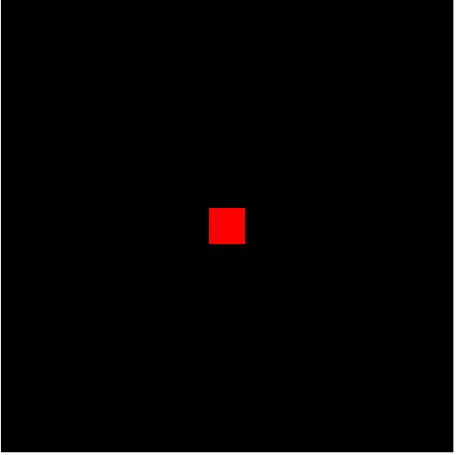

`WebGL`能够绘制三种基本的图形，**点、线、三角形**。其他图形都是由这三种基本图形组装成的。

以下例子主要用到以下`GLSL`知识。

**着色器代码**

- gl_Position： 内置变量，用来设置顶点坐标。
- gl_PointSize： 内置变量，用来设置顶点大小。
- gl_FragColor： 内置变量，用来设置像素颜色。
- gl_FragCoord： 内置变量，片元坐标，单位像素
- precision：精度设置限定符，使用此限定符设置完精度后，之后所有该数据类型都将沿用该精度，除非单独设置。
- vec2：2 维向量。
- vec4：4 维向量。
- 向量运算
  - vec _ 浮点数： vec2(x, y) _ 2.0 = vec(x _ 2.0, y _ 2.0)。
  - vec2 _ vec2：vec2(x1, y1) _ vec2(x2, y2) = vec2(x1 _ x2, y1 _ y2)。
- attribute：在**顶点着色器**中声明跟顶点相关的数据。
- uniform：在着色器中声明非顶点数据(如光源位置数据、方向数据、矩阵数据)。
- distance：计算顶点之间距离。
- discard:舍弃片元。

**js 程序中的 GLSL 语言——如何连接着色器程序**

- createShader：创建着色器对象
- shaderSource：提供着色器源码
- compileShader：编译着色器对象
- createProgram：创建着色器程序
- attachShader：绑定着色器对象
- linkProgram：链接着色器程序
- useProgram：启用着色器程序
下面是完整的例子
```JS
function initShader(gl) {
  1.获取着色器源码:
  //顶点着色器源码
  const vertexShaderSource = document.getElementById('vertexShader').innerText;
  //片元着色器源码
  const fragmentShaderSource = document.getElementById('fragmentShader').innerText;
  2.创建着色器对象
  const vertexShader = gl.createShader(gl.VERTEX_SHADER);
  const fragmentShader = gl.createShader(gl.FRAGMENT_SHADER);
  3.为着色器对象提供源码
  gl.shaderSource(vertexShader, vertexShaderSource);
  gl.shaderSource(fragmentShader, fragmentShaderSource);
  4.编译着色器 编译是将GLSL（OpenGL着色器语言）代码转换为GPU可执行代码的过程。
  gl.compileShader(vertexShader);
  gl.compileShader(fragmentShader);
  5.创建和连接着色器程序
  const program = gl.createProgram();
  //将编译后的顶点着色器和片元着色器附加到程序对象上。
  gl.attachShader(program, vertexShader);
  gl.attachShader(program, fragmentShader);
  // 链接着色器程序。链接是将多个着色器组合成一个完整的程序的过程，链接成功后，这个程序可以用于渲染。
  gl.linkProgram(program);
  // 将创建和链接好的着色器程序设置为当前使用的程序
  gl.useProgram(program);
  return program;
  }
```

**js 中如何往着色器中传递数据**

- getAttribLocation：找到着色器中的 `attribute` 变量地址。
- getUniformLocation：找到着色器中的 `uniform` 变量地址。
- vertexAttrib2f：给 `attribute` 变量传递两个浮点数。
- uniform4f：给`uniform`变量传递四个浮点数。

**图形绘制函数**

- drawArrays(type,start,count): 用指定的图元进行绘制。`type`主要有以下一些类型。`start` 指定从哪个点开始绘制。`count`指定绘制需要使用到多少个点。
  - gl.POINTS: 绘制一系列点。
  - gl.LINE_STRIP: 绘制一个线条。即，绘制一系列线段，上一点连接下一点。
  - gl.LINE_LOOP: 绘制一个线圈。即，绘制一系列线段，上一点连接下一点，并且最后一点与第一个点相连。
  - gl.LINES: 绘制一系列单独线段。每两个点作为端点，线段之间不连接。
  - gl.TRIANGLE_STRIP：绘制一个三角带。
  - gl.TRIANGLE_FAN：绘制一个三角扇。
  - gl.TRIANGLES: 绘制一系列三角形。每三个点作为顶点。

### 1、绘制正方形点图形

```html
<canvas id="canvas" width="500" height="500"></canvas>
```

下面是着色器语言。一般会写成一段单独的`js`代码。当然也可以在`js`代码中写成一段字符串的形式。
**注意：** `gl.POINTS` 模式点渲染的方形区域,方形中心是 `0.5,0.5` ,左上角是坐标原点,右下角是 `1.0,1.0`，

- 顶点着色器

```js

<script type="shader-source" id="vertexShader">
void main(){
    //顶点的位置
  	gl_Position = vec4(0.0, 0.0, 0.0, 1.0);
    //顶点的像素大小
  	gl_PointSize = 40.0;
}
</script>
```

- 片元着色器

```js
<script type="shader-source" id="fragmentShader">
// 数据类型为低精度浮点型
precision lowp float;
void main(){
    // 设置片元着色器的颜色
    gl_FragColor = vec4(1.0,0.0,0.0,1.0);
}
</script>
```

- `javascript`代码部分

```js
//获取canvas
let canvas = document.getElementById("canvas");
//获取绘图上下文
let gl = canvas.getContext("WebGL");
//创建着色器程序
initShader(gl);
//设置清屏颜色为黑色。
gl.clearColor(0, 0, 0, 1.0);
//清屏
gl.clear(gl.COLOR_BUFFER_BIT);
//绘制一个点。
gl.drawArrays(gl.POINTS, 0, 1);
//声明初始化着色器函数
function initShader(gl) {
  //创建定点着色器
  const vertexShaderSource = document.querySelector("#vertexShader").innerText;
  //创建片元着色器
  const fragmentShaderSource = document.querySelector("#fragmentShader")
    .innerText;
  //创建顶点着色器对象
  const vertexShader = gl.createShader(gl.VERTEX_SHADER);
  //创建片元着色器对象
  const fragmentShader = gl.createShader(gl.FRAGMENT_SHADER);
  //引入顶点、片元着色器源代码
  gl.shaderSource(vertexShader, vertexShaderSource);
  gl.shaderSource(fragmentShader, fragmentShaderSource);
  //编译顶点、片元着色器
  gl.compileShader(vertexShader);
  gl.compileShader(fragmentShader);

  //创建程序对象program
  const program = gl.createProgram();
  //附着顶点着色器和片元着色器到program
  gl.attachShader(program, vertexShader);
  gl.attachShader(program, fragmentShader);
  //链接program
  gl.linkProgram(program);
  //使用program
  gl.useProgram(program);
  //返回程序program对象
  return program;
}
```

### 2、绘制圆形点图形

圆点的绘制主要用到了两个内置函数`distance`和`discard`。`distance`用于计算两个顶点坐标之间的距离。`discard`函数用于舍弃一些不要的片元。

- 顶点着色器

```js

<script type="shader-source" id="vertexShader">
void main(){
    //顶点的位置
  	gl_Position = vec4(0.0, 0.0, 0.0, 1.0);
    //顶点的像素大小
  	gl_PointSize = 40.0;
}
</script>
```

- 片元着色器

```js
<script type="shader-source" id="fragmentShader">
// 数据类型为低精度浮点型
precision lowp float;
void main(){
    //gl_PointCoord是内置变量，表示顶点坐标 gl_PointCoord的最大值是(1.0,1.0)
    //gl_FragColor 也是内置变量，表示顶点坐标对应的像素的颜色值
    //计算顶点坐标到指定点(0.5,0.5)之间的距离,
    float r = distance(gl_PointCoord, vec2(0.5, 0.5));
    //根据距离设置片元
    if(r < 0.5){
        // 方形区域片元距离几何中心半径小于0.5，像素颜色设置红色
        gl_FragColor = vec4(1.0,0.0,0.0,1.0);
    }else {
        // 方形区域距离几何中心半径大于等于0.5的片元剪裁舍弃掉：
        discard;
    }
}
</script>
```

- `javascript`代码部分
  这部分代码跟绘制正方形点图形的代码是一样的。

下面是使用 `gl_pointCoord`裁剪成 **圆形** 的图片和没有被裁减的 **正方形** 的图片对比情况。

<div style='text-align:center'>

</div>

### 3、动态绘制点

通过用户的点击来实现动态添加点。

- 顶点着色器

```js

<script type="shader-source" id="vertexShader">
//浮点数设置为中等精度
precision mediump float;
//接收 JavaScript 传递过来的点的坐标（X, Y）
attribute vec2 a_Position;
// 接收canvas的尺寸。
attribute vec2 a_Screen_Size;
void main(){
    // 将 canvas 的坐标值 转换为 [-1.0, 1.0]的范围。
    vec2 position = (a_Position / a_Screen_Size) * 2.0 - 1.0;
    // canvas的 Y 轴坐标方向和 设备坐标系的相反。
    position = position * vec2(1.0, -1.0);
    // 最终的顶点坐标。
    gl_Position = vec4(position, 0.0, 1.0);
    // 点的大小。
    gl_PointSize = 10.0;
}
</script>
```

- 片元着色器

```js
<script type="shader-source" id="fragmentShader">
//浮点数设置为中等精度
precision mediump float;
//全局变量，用来接收 JavaScript传递过来的颜色。
uniform vec4 u_Color;
void main(){
    // 将颜色处理成 GLSL 允许的范围[0， 1]。
    vec4 color = u_Color / vec4(255, 255, 255, 1);
    gl_FragColor = color;
}
</script>
```

- `javascript`代码部分

```js
//获取canvas
let canvas = document.getElementById("canvas");
//获取绘图上下文
let gl = canvas.getContext("WebGL");
//创建着色器程序
let program = initShader(gl);
//获取顶点着色器中的变量a_Position的位置。
let a_Position = gl.getAttribLocation(program, "a_Position");
//获取顶点着色器中的变量a_Screen_Size的位置。
let a_Screen_Size = gl.getAttribLocation(program, "a_Screen_Size");
//获取片元着色器中的变量u_Color的位置。
let u_Color = gl.getUniformLocation(program, "u_Color");
//向顶点着色器的 a_Screen_Size 传递 canvas 尺寸信息。
gl.vertexAttrib2f(a_Screen_Size, canvas.width, canvas.height);
//声明初始化着色器函数
function initShader(gl) {
  //创建定点着色器
  const vertexShaderSource = document.querySelector("#vertexShader").innerText;
  //创建片元着色器
  const fragmentShaderSource = document.querySelector("#fragmentShader")
    .innerText;
  //创建顶点着色器对象
  const vertexShader = gl.createShader(gl.VERTEX_SHADER);
  //创建片元着色器对象
  const fragmentShader = gl.createShader(gl.FRAGMENT_SHADER);
  //引入顶点、片元着色器源代码
  gl.shaderSource(vertexShader, vertexShaderSource);
  gl.shaderSource(fragmentShader, fragmentShaderSource);
  //编译顶点、片元着色器
  gl.compileShader(vertexShader);
  gl.compileShader(fragmentShader);

  //创建程序对象program
  const program = gl.createProgram();
  //附着顶点着色器和片元着色器到program
  gl.attachShader(program, vertexShader);
  gl.attachShader(program, fragmentShader);
  //链接program
  gl.linkProgram(program);
  //使用program
  gl.useProgram(program);
  //返回程序program对象
  return program;
}

//存储区顶点信息的容器
const points = [];
const random = Math.random;
canvas.addEventListener("click", (e) => {
  const x = e.pageX;
  const y = e.pageY;
  const color = randomColor();
  //存储新的点的坐标和颜色。
  points.push({ x: x, y: y, color: color });
  render(gl);
});
//绘制函数
function render(gl) {
  //清除屏幕
  gl.clear(gl.COLOR_BUFFER_BIT);
  for (let i = 0; i < points.length; i++) {
    const color = points[i].color;
    //向片元着色器传递颜色信息
    gl.uniform4f(u_Color, color.r, color.g, color.b, color.a);
    //向顶点着色器传递坐标信息。
    gl.vertexAttrib2f(a_Position, points[i].x, points[i].y);
    //绘制点。
    gl.drawArrays(gl.POINTS, 0, 1);
  }
}
function randomColor() {
  return {
    r: random() * 255,
    g: random() * 255,
    b: random() * 255,
    a: random() * 1,
  };
}
//设置屏幕清除颜色为黑色。
gl.clearColor(0, 0, 0, 1.0);
//绘制
render(gl);
```

#### 4、渐变色

- 顶点着色器

```js
<script type="shader-source" id="vertexShader">
void main(){
    gl_Position = vec4(0.0, 0.0, 0.0, 1.0);
    gl_PointSize = 100.0;
}
</script>
```

- 片元着色器

```js
<script type="shader-source" id="fragmentShader">
void main(){
    // 根据片元的x坐标，来设置片元的像素值
    // 片元沿着x方向渐变
    gl_FragColor = vec4(gl_FragCoord.x/500.0*1.0,0.0,0.0,1.0);
}
</script>
```

- `javascript`代码部分
  这部分代码跟绘制正方形点图形的代码是一样的。

#### 5、颜色分区

- 顶点着色器

```js
<script type="shader-source" id="vertexShader">
void main(){
    gl_Position = vec4(0.0, 0.0, 0.0, 1.0);
    gl_PointSize = 200.0;
}
</script>
```

- 片元着色器

```js
<script type="shader-source" id="fragmentShader">
void main(){
    // 根据片元的x坐标，来设置片元的像素值
    if(gl_FragCoord.x < 200.0){
        //默认为 canvas原来的颜色
    }
    else if (gl_FragCoord.x < 250.0) {
        // canvas画布上[0,300)之间片元像素值设置
        gl_FragColor = vec4(1.0, 0.0, 0.0, 1.0);
    } else if (gl_FragCoord.x <= 300.0) {

        // canvas画布上(300,400]之间片元像素值设置 绿色
        gl_FragColor = vec4(0.0, 1.0, 0.0, 1.0);
    } else {
        // canvas画布上(400,500]之间片元像素值设置 蓝色
        gl_FragColor = vec4(0.0, 0.0, 1.0, 1.0);
    }
}
</script>
```

- `javascript`代码部分
  这部分代码跟绘制正方形点图形的代码是一样的。

**参考**

[WebGL零基础入门教程(郭隆邦)](http://www.yanhuangxueyuan.com/WebGL/)
[WebGL 入门与实践](https://juejin.cn/book/6844733755580481543/section/6844733755916025869)
[WebGL官方文档](https://developer.mozilla.org/zh-CN/docs/Web/API/WebGLRenderingContext/vertexAttribPointer)
