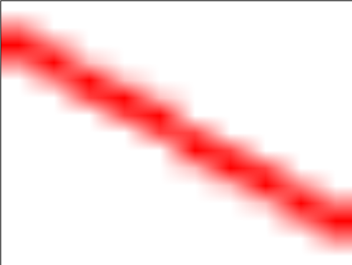
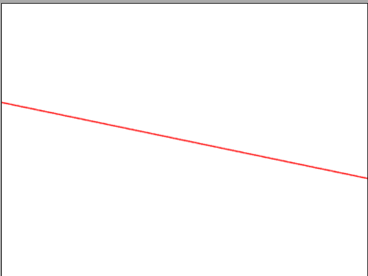
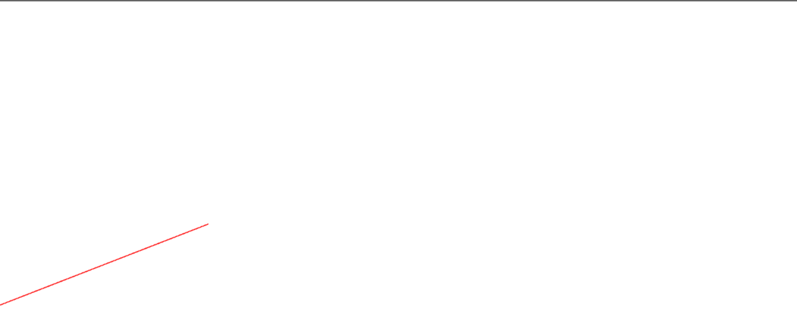

## WebGL 重置画布尺寸

每个画布都有两个尺寸，一个是 `drawingbuffer` 的尺寸， 这个表示画布中有多少个像素。另一是画布显示的尺寸， `CSS` 决定画布显示的尺寸。

当画布的 `drawingbuffer` 尺寸和 `CSS` 显示的尺寸不一致时，就会产生锯齿。

```js
<canvas id="c" width="10" height="15" style="width: 400px; height: 300px;"></canvas>
```
或者像下面这样
```js
<style>
#c {
  width: 400px;
  height: 300px;
}
</style>
<canvas id="c" width="10" height="15"></canvas>
```
如果我们在画布上绘制以一个单像素宽度的线，就会得到这样的结果



`demo`地址 [画布渲染尺寸跟显示尺寸不一样](https://github.com/tangjie-93/WebGL/blob/main/fundmantalExamples/%E9%94%AF%E9%BD%BF/%E7%94%BB%E5%B8%83%E6%B8%B2%E6%9F%93%E5%B0%BA%E5%AF%B8%E8%B7%9F%E6%98%BE%E7%A4%BA%E5%B0%BA%E5%AF%B8%E4%B8%8D%E4%B8%80%E6%A0%B7.html)

当我们将 画布的 `drawingbuffer` 尺寸和 `CSS` 显示的尺寸设置为一致时，就不会有锯齿了。
```js
<canvas id="c" width="10" height="15" style="width: 400px; height: 300px;"></canvas>
```


当我们不知道 画布的具体的 `css`尺寸时，我们如果想将 `drawingbuffer` 尺寸和 `CSS` 显示的尺寸设置为一致，可以调用下面的方法。
```js
function resizeCanvasToDisplaySize(canvas) {
   // 获取浏览器显示的画布的CSS像素值
  // 然后计算出设备像素设置drawingbuffer
  const displayWidth  = canvas.clientWidth * window.devicePixelRatio;
  const displayHeight = canvas.clientHeight * window.devicePixelRatio;
 
  // 检尺寸是否相同
  if (canvas.width  != displayWidth ||
      canvas.height != displayHeight) {
 
    // 设置为相同的尺寸
    canvas.width  = displayWidth;
    canvas.height = displayHeight;
  }
}
```
如果我们想让画布填充满窗口该怎么做？首先使用 `CSS` 让浏览器将画布铺满窗口，例如
```html
<html>
  <head>
    <style>
      /* 移除边界 */
      body {
        border: 0;
        background-color: white;
      }
      /* 设置欢度大小为视域大小 */
      canvas {
        width: 100vw;
        height: 100vh;
        display: block;
      }
    <style>
  </head>
  <body>
    <canvas id="c"></canvas>
  </body>
</html>
```
并且也将`drawingbuffer` 尺寸和 `CSS` 显示的尺寸设置为一致了，但是这个线没有覆盖整个区域。<br>


原因是当我们重置画布尺寸的时候还需要调用 `gl.viewport` 设置视域， `gl.viewport` 告诉 `WebGL` 如何将裁剪空间`（-1 到 +1）`中的点转换到像素空间， 也就是画布内。
```js
  function drawScene(now) {
    ....
    resizeCanvasToDisplaySize(gl.canvas);

    gl.viewport(0, 0, gl.canvas.width, gl.canvas.height);
    ...
  }
  // 监听窗口大小变化
  window.addEventListner('resize', drawScene);
```

`demo`地址 [抗锯齿](https://github.com/tangjie-93/WebGL/blob/main/fundmantalExamples/%E9%94%AF%E9%BD%BF/%E6%8A%97%E9%94%AF%E9%BD%BF.html)

**参考文档**

[WebGL 重置画布尺寸](https://webglfundamentals.org/webgl/lessons/zh_cn/webgl-resizing-the-canvas.html)

<Valine></Valine>