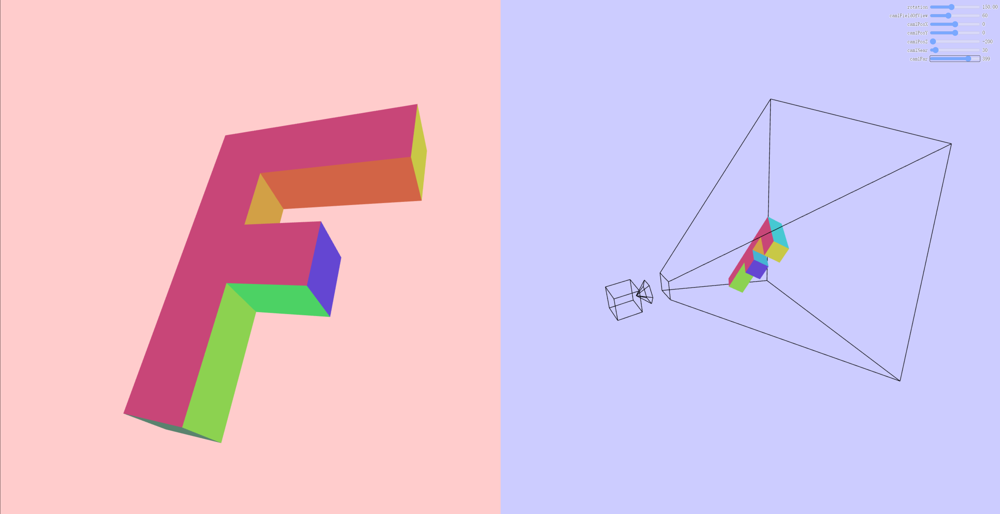

利用多个视角中的技术，我们可以拥有2个视角，对于每个视角，我们会使用不同的相机。然后让第2个视角看向第1个视角，从第2个视角中可以看到正在绘制的物体，而这个物体表示的是第1个视角中的相机。具体实现如下：

创建一个立方体，然后在立方体的末端添加一个圆锥,用于表示相机。我们会使用线段来绘制这个物体。我们会使用 `索引` 来连接顶点。
相机 看向的是 `-Z` 方向，所以，让我们把立方体和圆锥放到 `+Z` 这边，而圆锥的开口方向是 `-Z` 方向。
#### 1.1 创建立方体
绘制的是立方体线框。
```js
// 为一个相机创建几何
function createCameraBufferInfo(gl) {
  // 首先，让我们添加一个立方体。它的范围是 1 到 3，
  // 因为相机看向的是 -Z 方向，所以我们想要相机在 Z = 0 处开始
  const positions = [
    -1, -1,  1,  // 立方体的顶点
     1, -1,  1,
    -1,  1,  1,
     1,  1,  1,
    -1, -1,  3,
     1, -1,  3,
    -1,  1,  3,
     1,  1,  3,
  ];
  const indices = [
    0, 1, 1, 3, 3, 2, 2, 0, // 立方体的索引
    4, 5, 5, 7, 7, 6, 6, 4,
    0, 4, 1, 5, 3, 7, 2, 6,
  ];
  return webglUtils.createBufferInfoFromArrays(gl, {
    position: positions,
    indices,
  });
}
```

#### 1.2 创建圆锥
```js
// 为一个相机创建几何
function createCameraBufferInfo(gl) {
  // 首先，让我们添加一个立方体。它的范围是 1 到 3，
  // 因为相机看向的是 -Z 方向，所以我们想要相机在 Z = 0 处开始。
  // 我们会把一个圆锥放到该立方体的前面，
  // 且该圆锥的开口方向朝 -Z 方向。
  const positions = [
    -1, -1,  1,  // 立方体的顶点
     1, -1,  1,
    -1,  1,  1,
     1,  1,  1,
    -1, -1,  3,
     1, -1,  3,
    -1,  1,  3,
     1,  1,  3,
     0,  0,  1,  // 圆锥的尖头
  ];
  const indices = [
    0, 1, 1, 3, 3, 2, 2, 0, // 立方体的索引
    4, 5, 5, 7, 7, 6, 6, 4,
    0, 4, 1, 5, 3, 7, 2, 6,
  ];
  // 添加圆锥的片段
  const numSegments = 6;
  const coneBaseIndex = positions.length / 3; 
  const coneTipIndex =  coneBaseIndex - 1;
  for (let i = 0; i < numSegments; ++i) {
    const u = i / numSegments;
    const angle = u * Math.PI * 2;
    const x = Math.cos(angle);
    const y = Math.sin(angle);
    positions.push(x, y, 0);
    // 从圆锥尖头到圆锥边缘的线段
    indices.push(coneTipIndex, coneBaseIndex + i);
    // 从圆锥边缘一点到圆锥边缘下一点的线段
    indices.push(coneBaseIndex + i, coneBaseIndex + (i + 1) % numSegments);
  }
  return webglUtils.createBufferInfoFromArrays(gl, {
    position: positions,
    indices,
  });
}
```
#### 1.3 缩放立方体以适配物体
```js
function createCameraBufferInfo(gl, scale = 1) {
  // 首先，让我们添加一个立方体。它的范围是 1 到 3，
  // 因为相机看向的是 -Z 方向，所以我们想要相机在 Z = 0 处开始。
  // 我们会把一个圆锥放到该立方体的前面，
  // 且该圆锥的开口方向朝 -Z 方向。
  const positions = [
    -1, -1,  1,  // 立方体的顶点
     1, -1,  1,
    -1,  1,  1,
     1,  1,  1,
    -1, -1,  3,
     1, -1,  3,
    -1,  1,  3,
     1,  1,  3,
     0,  0,  1,  // 圆锥的尖头
  ];
  const indices = [
    0, 1, 1, 3, 3, 2, 2, 0, // 立方体的索引
    4, 5, 5, 7, 7, 6, 6, 4,
    0, 4, 1, 5, 3, 7, 2, 6,
  ];
  // 添加圆锥的片段
  const numSegments = 6;
  const coneBaseIndex = positions.length / 3; 
  const coneTipIndex =  coneBaseIndex - 1;
  for (let i = 0; i < numSegments; ++i) {
    const u = i / numSegments;
    const angle = u * Math.PI * 2;
    const x = Math.cos(angle);
    const y = Math.sin(angle);
    positions.push(x, y, 0);
    // 从圆锥尖头到圆锥边缘的线段
    indices.push(coneTipIndex, coneBaseIndex + i);
    // 从圆锥边缘一点到圆锥边缘下一点的线段
    indices.push(coneBaseIndex + i, coneBaseIndex + (i + 1) % numSegments);
  }
  positions.forEach((v, ndx) => {
    positions[ndx] *= scale;
  });
  return webglUtils.createBufferInfoFromArrays(gl, {
    position: positions,
    indices,
  });
}
```

#### 1.4 着色器
+ 绘制顶点颜色的着色器
```js
```
+ 纯色着色器
```js
<script id="solid-color-vertex-shader" type="x-shader/x-vertex">
attribute vec4 a_position;
 
uniform mat4 u_matrix;
 
void main() {
  // 将 position 乘以矩阵
  gl_Position = u_matrix * a_position;
}
</script>
<!-- fragment shader -->
<script id="solid-color-fragment-shader" type="x-shader/x-fragment">
precision mediump float;
 
uniform vec4 u_color;
 
void main() {
  gl_FragColor = u_color;
}
</script>
```
#### 1.5 绘制场景
+ 获取`WebGL`上下文
```js
const canvas = document.querySelector('#canvas');
const gl = canvas.getContext('webgl');
```
+ 创建着色器程序
```js
// 设置 GLSL 程序
// 编译着色器、链接程序、查找 locations
const vertexColorProgramInfo = webglUtils.createProgramInfo(gl, ['vertex-shader-3d', 'fragment-shader-3d']);
const solidColorProgramInfo = webglUtils.createProgramInfo(gl, ['solid-color-vertex-shader', 'solid-color-fragment-shader']);
```
+ 创建缓冲区并用数据填充
```js
// 为一个 3D 的 'F' 创建 buffers 并用数据来填充
const fBufferInfo = primitives.create3DFBufferInfo(gl);
const cameraScale = 20;
// 为一个相机 创建 buffers 并用数据来填充
const cameraBufferInfo = createCameraBufferInfo(gl, cameraScale);
// 为一个裁剪空间 创建 buffers 并用数据来填充
const clipspaceCubeBufferInfo = createClipspaceCubeBufferInfo(gl);
```
+ 绘制左边的 `F` 模型
```js
const settings = {
    rotation: 150,  // in degrees
    cam1FieldOfView: 60,  // in degrees
    cam1PosX: 0,
    cam1PosY: 0,
    cam1PosZ: -200,// 相机位置
    cam1Near: 30,
    cam1Far: 500,
};
function render() {
    webglUtils.resizeCanvasToDisplaySize(gl.canvas);

    gl.enable(gl.CULL_FACE);
    gl.enable(gl.DEPTH_TEST);
    gl.enable(gl.SCISSOR_TEST);

    // 模型变换矩阵
    let worldMatrix = m4.yRotation(degToRad(settings.rotation));
    worldMatrix = m4.xRotate(worldMatrix, degToRad(settings.rotation));
    // 使 F 围绕着它的原点
    worldMatrix = m4.translate(worldMatrix, -35, -75, -5);

    const { width, height } = gl.canvas;
    // 我们要把视角分成 2 个
    const effectiveWidth = width / 2;
    const aspect = effectiveWidth / height;
    const near = 1;
    const far = 2000;
    
    //--------绘制左边的F模型------
    // 创建透视投影矩阵
    const perspectiveProjectionMatrix =
        m4.perspective(degToRad(settings.cam1FieldOfView),
            aspect,
            settings.cam1Near,
            settings.cam1Far);

    // 使用 look at 计算相机的矩阵
    const cameraPosition = [settings.cam1PosX,settings.cam1PosY,settings.cam1PosZ,];
    const target = [0, 0, 0];
    const up = [0, 1, 0];
    const cameraMatrix = m4.lookAt(cameraPosition, target, up);

    const leftWidth = effectiveWidth;
    //  使用透视相机绘制在左边
    gl.viewport(0, 0, leftWidth, height);
    gl.scissor(0, 0, leftWidth, height);
    gl.clearColor(1, 0.8, 0.8, 1);

    drawScene(perspectiveProjectionMatrix, cameraMatrix, worldMatrix);
}
```

+ 绘制右边的 `F` 模型
```js
const settings = {
    rotation: 150,  // in degrees
    cam1FieldOfView: 60,  // in degrees
    cam1PosX: 0,
    cam1PosY: 0,
    cam1PosZ: -200,// 相机位置
    cam1Near: 30,
    cam1Far: 500,
};
function render() {
    webglUtils.resizeCanvasToDisplaySize(gl.canvas);

    gl.enable(gl.CULL_FACE);
    gl.enable(gl.DEPTH_TEST);
    gl.enable(gl.SCISSOR_TEST);

    // 模型变换矩阵
    let worldMatrix = m4.yRotation(degToRad(settings.rotation));
    worldMatrix = m4.xRotate(worldMatrix, degToRad(settings.rotation));
    // 使 F 围绕着它的原点
    worldMatrix = m4.translate(worldMatrix, -35, -75, -5);

    const { width, height } = gl.canvas;
    // 我们要把视角分成 2 个
    const effectiveWidth = width / 2;
    const aspect = effectiveWidth / height;
    const near = 1;
    const far = 2000;
    //--------绘制右边的F模型------
    const perspectiveProjectionMatrix2 =
    m4.perspective(degToRad(60), aspect, near, far);

    // 使用 look at 计算相机的矩阵
    const cameraPosition2 = [-600, 400, -400];
    const target2 = [0, 0, 0];
    const cameraMatrix2 = m4.lookAt(cameraPosition2, target2, up);

    // 使用透视相机绘制在右边
    const rightWidth = width - leftWidth;
    gl.viewport(leftWidth, 0, rightWidth, height);
    gl.scissor(leftWidth, 0, rightWidth, height);
    gl.clearColor(0.8, 0.8, 1, 1);

    drawScene(perspectiveProjectionMatrix2, cameraMatrix2, worldMatrix);
}
```
#### 1.6 绘制模拟相机的物体
**注意**：
+ 这里使用的视图矩阵是基于右侧场景的相机矩阵，而不是基于左侧场景的相机矩阵。
+ 这里使用的模型矩阵是左侧场景的相机矩阵。那么物体的世界坐标则是相对于左侧场景的相机坐标系而言的。

```js
// 从第 2 个相机矩阵(右侧场景中的相机)中创建一个视图矩阵
const viewMatrix = m4.inverse(cameraMatrix2);

let mat = m4.multiply(perspectiveProjectionMatrix2, viewMatrix);
// 使用第一个相机的矩阵作为表示相机的物体的世界矩阵
// 表示将立方体和锥体使用第一个相机的矩阵进行模型变换
mat = m4.multiply(mat, cameraMatrix);

gl.useProgram(solidColorProgramInfo.program);
// 绘制表示相机的立方体和锥体
drawObjects(gl, mat, solidColorProgramInfo, cameraBufferInfo);
....
// 
function drawObjects(gl, mat, solidColorProgramInfo, cameraBufferInfo) {
    // ------  绘制表示相机的物体 --------
    // 设置所有需要的 attributes
    webglUtils.setBuffersAndAttributes(gl, solidColorProgramInfo, cameraBufferInfo);

    // 设置 uniforms
    webglUtils.setUniforms(solidColorProgramInfo, {
        u_matrix: mat,
        u_color: [0, 0, 0, 1],
    });

    webglUtils.drawBufferInfo(gl, cameraBufferInfo, gl.LINES);
}
```
#### 1.6 绘制视锥体
因为视椎体表示的是将某一空间的坐标转换到裁剪空间的转换，这样我们就可以创建一个表示裁剪空间的立方体，然后使用投影矩阵的逆矩阵把该立方体放置到场景内。

**注意**： 因为本身我们定义的视锥体的坐标就是裁剪空间坐标了，所以需要使用投影矩阵的逆矩阵,投影矩阵的逆矩阵用于将裁剪空间中的点转换回相机空间。
```js
mat = m4.multiply(mat, m4.inverse(perspectiveProjectionMatrix));
```
```js
// 从第 2 个相机矩阵中创建一个视图矩阵
const viewMatrix = m4.inverse(cameraMatrix2);
let mat = m4.multiply(perspectiveProjectionMatrix2, viewMatrix);
// 使用第一个相机的矩阵作为表示相机的物体的世界矩阵
// 表示将立方体和锥体使用第一个相机的矩阵进行模型变换
mat = m4.multiply(mat, cameraMatrix);

gl.useProgram(solidColorProgramInfo.program);
// m4.inverse(perspectiveProjectionMatrix) 返回的是透视投影矩阵的逆矩阵,
// 投影矩阵的逆矩阵总是会把我们传入的 +1 到 -1 立方体进行适当的扭曲。
mat = m4.multiply(mat, m4.inverse(perspectiveProjectionMatrix));
// 绘制视锥体
drawObjects(gl, mat, solidColorProgramInfo, clipspaceCubeBufferInfo);
```
具体效果如下所示



> 上面代码为什么使用 `perspectiveProjectionMatrix` 而不使用 `perspectiveProjectionMatrix2`?

因为我们的目的是使用第二个相机来可视化第一个相机的视锥体，所以我们才需要将第一个相机的视锥体转换回相机空间。

而且在`NDC`(标准化设备坐标) 空间中,视锥体的顶点被定义为从[-1, -1, -1] 到 [1, 1, 1] 的立方体。


`demo`地址 [可视化相机](https://github.com/tangjie-93/WebGL/blob/main/fundmantalExamples/%E6%9D%82%E9%A1%B9/%E5%8F%AF%E8%A7%86%E5%8C%96%E7%9B%B8%E6%9C%BA.html)

**参考文档**

[WebGL 可视化相机](https://webglfundamentals.org/webgl/lessons/zh_cn/webgl-visualizing-the-camera.html)<br>

<Valine></Valine>