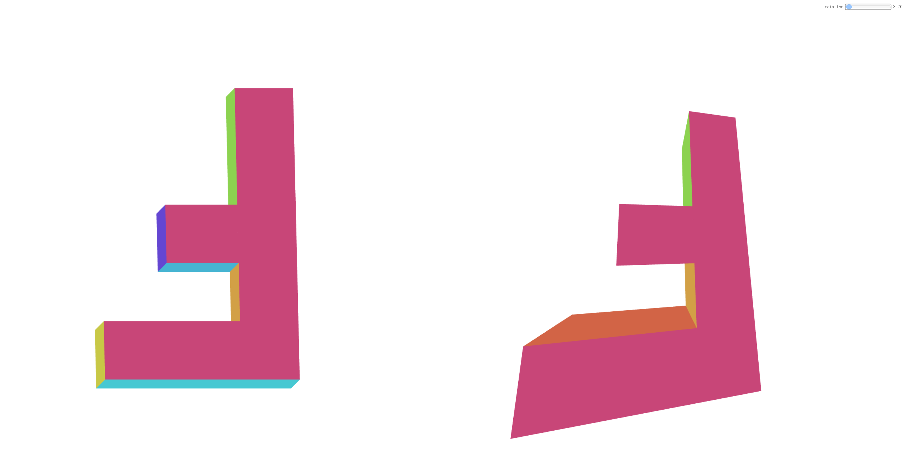
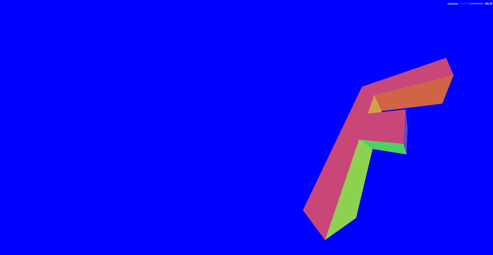
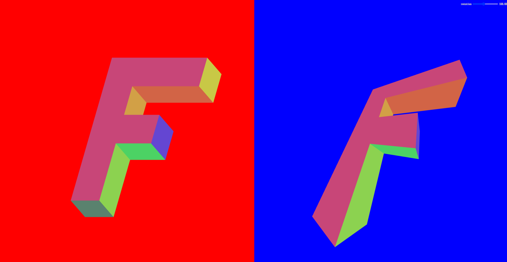
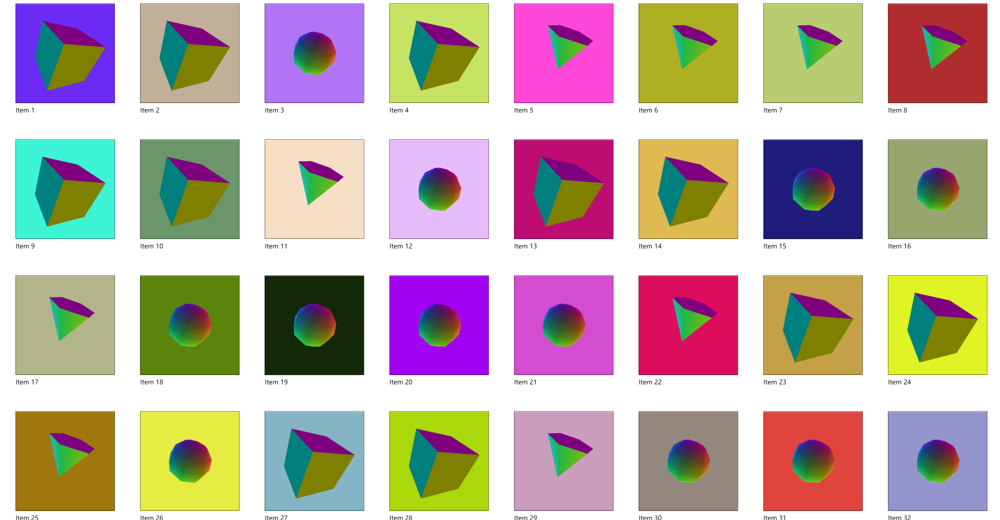
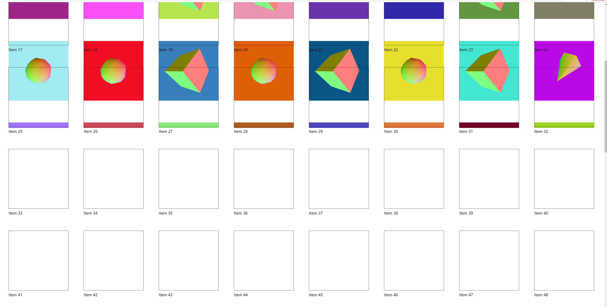

## 1. 多视图
如果我们想在同一场景中绘制多个视图，主要有两种方法:
+ 渲染纹理

    **缺点**: 它要求我们分配纹理，将内容渲染到它们，然后在画布上渲染这些纹理。这意味着我们实际上是双重渲染。可以用于绘制后视镜。
+ 设置视口并打开剪刀测试
#### 1.1 设置视口

我们通过调用`gl.viewport()`来设置视口。设置 `WebGL` 如何从裁剪空间转换为像素空间。
```js
gl.viewport(left, bottom, width, height);
```
最常见的就是分别设置为 `0、0、gl.canvas.width和gl.canvas.height`来覆盖整个画布。我们其实也可以通过设置`left, bottom, width, height`的值来绘制画布的一部分。
下面我们来你看一个在同一个视图中同时使用**正交投影**和**透视投影**的例子。
+ 顶点着色器代码
```js
// 顶点着色器
attribute vec4 a_position;
attribute vec4 a_color;
uniform mat4 u_matrix;
varying vec4 v_color;
void main() {
  // 将位置乘以矩阵。
  gl_Position = u_matrix * a_position;
 
  // 将顶点颜色传递给片段着色器。
  v_color = a_color;
}
```
+ 片元着色器代码
```js
// 片段着色器
precision mediump float;
// 从顶点着色器传入
varying vec4 v_color;
void main() {
  gl_FragColor = v_color;
}
```
+ 绘制模型
```js
function drawScene(projectionMatrix, cameraMatrix, worldMatrix) {
  // 从相机矩阵创建一个视图矩阵。
  const viewMatrix = m4.inverse(cameraMatrix);
 
  // 将它们相乘以形成 worldViewProjection 矩阵。
  let mat = m4.multiply(projectionMatrix, viewMatrix);
  mat = m4.multiply(mat, worldMatrix);
 
  gl.useProgram(programInfo.program);
 
  // ------ 绘制 F --------
 
  // 设置所有需要的属性。
  webglUtils.setBuffersAndAttributes(gl, programInfo, bufferInfo);
 
  // 设置矩阵
  webglUtils.setUniforms(programInfo, {
    u_matrix: mat,
  });
  // 调用 gl.drawArrays 或 gl.drawElements
  webglUtils.drawBufferInfo(gl, bufferInfo);
}
```
+ 渲染场景
我们通过`gl.viewport`将画布分成两个部分，然后分别使用不同的投影矩阵来绘制。
```js
function render() {
  webglUtils.resizeCanvasToDisplaySize(gl.canvas);
  gl.enable(gl.CULL_FACE);
  gl.enable(gl.DEPTH_TEST);
 
  // 我们将把视图分成 2 个
  const {clientWidth,clientHeight} = gl.canvas;
  const effectiveWidth = clientWidth / 2;
  const aspect = effectiveWidth / clientHeight;
  const near = 1;
  const far = 2000;
 
  // 计算透视投影矩阵
  const perspectiveProjectionMatrix =
      m4.perspective(fieldOfViewRadians, aspect, near, far);
 
  // 计算正交投影矩阵
  const halfHeightUnits = 120;
  const orthographicProjectionMatrix = m4.orthographic(
      -halfHeightUnits * aspect,  // 左边
       halfHeightUnits * aspect,  // 正确的
      -halfHeightUnits,           // 底部
       halfHeightUnits,           // 顶部
       -75,                       // 靠近
       2000);                     // 远的
 
  // 使用观察计算相机的矩阵。
  const cameraPosition = [0, 0, -75];
  const target = [0, 0, 0];
  const up = [0, 1, 0];
  const cameraMatrix = m4.lookAt(cameraPosition, target, up);
 
  let worldMatrix = m4.yRotation(degToRad(settings.rotation));
  worldMatrix = m4.xRotate(worldMatrix, degToRad(settings.rotation));
  // 将“F”置于其原点的中心
  worldMatrix = m4.translate(worldMatrix, -35, -75, -5);
 
  const leftWidth = effectiveWidth / 2 | 0;
  const height = clientHeight;
  // 使用正交相机在左侧绘制
  gl.viewport(0, 0, leftWidth, height);
 
  drawScene(orthographicProjectionMatrix, cameraMatrix, worldMatrix);
 
  // 使用透视相机在右侧绘制
  const rightWidth = clientWidth - leftWidth;
  gl.viewport(leftWidth, 0, rightWidth, height);
 
  drawScene(perspectiveProjectionMatrix, cameraMatrix, worldMatrix);
}
```
上面的效果如下：



但是如果当我们调用`gl.clear`时，它会清除画布的。
```js
function drawScene(projectionMatrix, cameraMatrix, worldMatrix) {
    // 清除画布和深度缓冲区。
    gl.clear(gl.COLOR_BUFFER_BIT | gl.DEPTH_BUFFER_BIT);
    ...
}
```
并且在我们调用`drawScene`之前，设置画布的颜色
```js
// 使用正交相机在左侧绘制
gl.viewport(0, 0, leftWidth, height);
gl.clearColor(1, 0, 0, 1);  // 红色的

drawScene(orthographicProjectionMatrix, cameraMatrix, worldMatrix);

// 使用正交相机在左侧绘制
const rightWidth = width - leftWidth;
gl.viewport(leftWidth, 0, rightWidth, height);
gl.clearColor(0, 0, 1, 1);  // 蓝色的
```
你会发现左边什么都没有了，因为`gl.clearColor`设置的是整个画布的颜色。

<br>

想要解决上面的问题，我们可以使用`gl.scissor`，来开启剪刀测试。
```js
gl.enable(gl.SCISSOR_TEST);
```
与视口类似，它默认为画布的初始大小，但我们可以通过调用 `gl.scissor`以下命令设置与视口相同的参数。
```js
gl.scissor(left, bottom, width, height);
```
我们可以在渲染场景函数`render`中设置`gl.scissor`。
```js
function render() {
  webglUtils.resizeCanvasToDisplaySize(gl.canvas);
 
  gl.enable(gl.CULL_FACE);
  gl.enable(gl.DEPTH_TEST);
  gl.enable(gl.SCISSOR_TEST);
 
  ...
 
  const {width, height} = gl.canvas;
  const leftWidth = width / 2 | 0;
 
  // 使用正交相机在左侧绘制
  gl.viewport(0, 0, leftWidth, height);
  gl.scissor(0, 0, leftWidth, height);
  gl.clearColor(1, 0, 0, 1);  // 红色的
 
  drawScene(orthographicProjectionMatrix, cameraMatrix, worldMatrix);
 
  // 使用正交相机在左侧绘制
  const rightWidth = width - leftWidth;
  gl.viewport(leftWidth, 0, rightWidth, height);
  gl.scissor(leftWidth, 0, rightWidth, height);
  gl.clearColor(0, 0, 1, 1);  // 蓝色的
 
  drawScene(perspectiveProjectionMatrix, cameraMatrix, worldMatrix);
}
```
最终的视觉效果如下所示：

<br>

`demo`地址 [多视图](https://github.com/tangjie-93/WebGL/blob/main/fundmantalExamples/%E6%9D%82%E9%A1%B9/%E5%A4%9A%E8%A7%86%E5%9B%BE%E5%A4%9A%E7%94%BB%E5%B8%83/%E5%A4%9A%E8%A7%86%E5%9B%BE.html)

## 2. 多画布

常规方法就是创建多个画布，然后使用`canvas.getContext('2d')`获取到`CanvasRenderingContext2D`对象。这个方案会有以下两个问题：
+ 每个画布都需要不同的 `WebGL` 上下文,并且 `WebGL` 上下文不能共享资源。另一个问题是大多数浏览器对它们支持的同步画布数量有限制。
+ 许多浏览器最多只能支持 `8` 个。这意味着，一旦你在第 9 个画布上创建了 `webgl` 上下文，第一个画布就会失去其上下文。

**解决方案**：可以通过制作一个覆盖整个窗口的大画布来解决这些问题。然后，通过创建 `<div>`在每个想要绘制项目的地方作为占位符放置。我们可以用 `element.getBoundingClientRect` 它来找出设置视口的位置，然后使用剪刀在该区域进行绘制。
核心代码如下：
+ 创建缓冲区并填充各种数据
```js
const bufferInfos = [
  primitives.createCubeBufferInfo(
      gl,
      1,  // 宽度
      1,  // 高度
      1,  // 深度
  ),
  primitives.createSphereBufferInfo(
      gl,
      0.5,  // 半径
      8,    // 周围的细分
      6,    // 向下细分
  ),
  primitives.createTruncatedConeBufferInfo(
      gl,
      0.5,  // 底部半径
      0,    // 顶部半径
      1,    // 高度
      6,    // 周围的细分
      1,    // 向下细分
  ),
];
```
+ 创建`div`容器

    里面将有一个视图和一个标签。
    该视图只是一个空的 `div`，我们想在其中绘制项目。
```js
function createElem(type, parent, className) {
  const elem = document.createElement(type);
  parent.appendChild(elem);
  if (className) {
    elem.className = className;
  }
  return elem;
}
 
function randArrayElement(array) {
  return array[Math.random() * array.length | 0];
}
 
function rand(min, max) {
  if (max === undefined) {
    max = min;
    min = 0;
  }
  return Math.random() * (max - min) + min;
}
 
const contentElem = document.querySelector('#content');
const items = [];
const numItems = 100;
for (let i = 0; i < numItems; ++i) {
  const outerElem = createElem('div', contentElem, 'item');
  const viewElem = createElem('div', outerElem, 'view');
  const labelElem = createElem('div', outerElem, 'label');
  labelElem.textContent = `Item ${i + 1}`;
  const bufferInfo = randArrayElement(bufferInfos);
  const color = [rand(1), rand(1), rand(1), 1];
  items.push({
    bufferInfo,
    color,
    element: viewElem,
  });
}
```
+ 容器样式
```css
.item {
  display: inline-block;
  margin: 1em;
  padding: 1em;
}
.label {
  margin-top: 0.5em;
}
.view {
  width: 250px;
  height: 250px;
  border: 1px solid black;
}
```
+ 渲染函数
`items` 数组中每个项目都有一个 `bufferInfo`、一个`color`和一个`element` 。我们一次循环遍历所有项目，然后调用 `element.getBoundingClientRect` 并使用返回的矩形来查看该元素是否与画布相交。如果相交，我们将视口和剪刀设置为匹配，然后绘制该对象。
```js
function render(time) {
  time *= 0.001;  // 转换为秒
 
  webglUtils.resizeCanvasToDisplaySize(gl.canvas);
 
  gl.enable(gl.CULL_FACE);
  gl.enable(gl.DEPTH_TEST);
  gl.enable(gl.SCISSOR_TEST);
 
  // 将画布移动到当前滚动位置的顶部
gl.canvas.style.transform = `translateX(${window.scrollX}px) translateY(${window.scrollY}px)`;
 
  for (const {bufferInfo, element, color} of items) {
    const rect = element.getBoundingClientRect();
    if (rect.bottom < 0 || rect.top  > gl.canvas.clientHeight ||
        rect.right  < 0 || rect.left > gl.canvas.clientWidth) {
      continue;  // 它不在屏幕上
    }
 
    const width  = rect.right - rect.left;
    const height = rect.bottom - rect.top;
    const left   = rect.left;
    const bottom = gl.canvas.clientHeight - rect.bottom;
 
    gl.viewport(left, bottom, width, height);
    gl.scissor(left, bottom, width, height);
    gl.clearColor(...color);
 
    const aspect = width / height;
    const near = 1;
    const far = 2000;
 
    // 计算透视投影矩阵
    const perspectiveProjectionMatrix =
        m4.perspective(fieldOfViewRadians, aspect, near, far);
 
    // 使用观察计算相机的矩阵。
    const cameraPosition = [0, 0, -2];
    const target = [0, 0, 0];
    const up = [0, 1, 0];
    const cameraMatrix = m4.lookAt(cameraPosition, target, up);
 
    // 旋转项目
    const rTime = time * 0.2;
    const worldMatrix = m4.xRotate(m4.yRotation(rTime), rTime);
 
    drawScene(perspectiveProjectionMatrix, cameraMatrix, worldMatrix, bufferInfo);
  }
  requestAnimationFrame(render);
}
requestAnimationFrame(render);
```

最终的视觉效果如下所示：



#### 我们为什么会用下面的这行代码移动画布？
```js
 gl.canvas.style.transform = `translateX(${window.scrollX}px) translateY(${window.scrollY}px)`;
 ```
 这是因为，如果我们在页面上滚动，希望画布跟随页面一起滚动,如果不添加上面的代码，则会出现如下所示的问题，画布将与 `HTML` 同步滚动，但我们想要绘制内容的新区域将是空白的。
 
 

`demo`地址 [多画布](https://github.com/tangjie-93/WebGL/blob/main/fundmantalExamples/%E6%9D%82%E9%A1%B9/%E5%A4%9A%E8%A7%86%E5%9B%BE%E5%A4%9A%E7%94%BB%E5%B8%83/%E5%A4%9A%E7%94%BB%E5%B8%83.html)

**参考文档**

[WebGL Multiple Views, Multiple Canvases](https://webglfundamentals.org/webgl/lessons/webgl-multiple-views.html)<br>

<Valine></Valine>