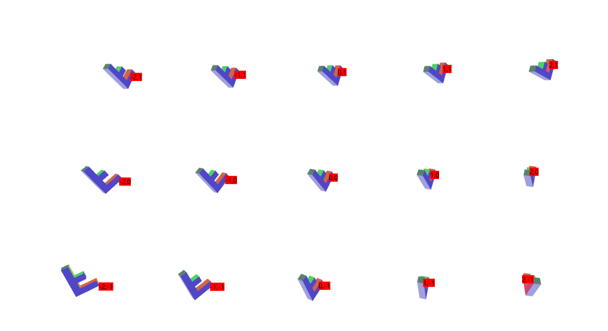
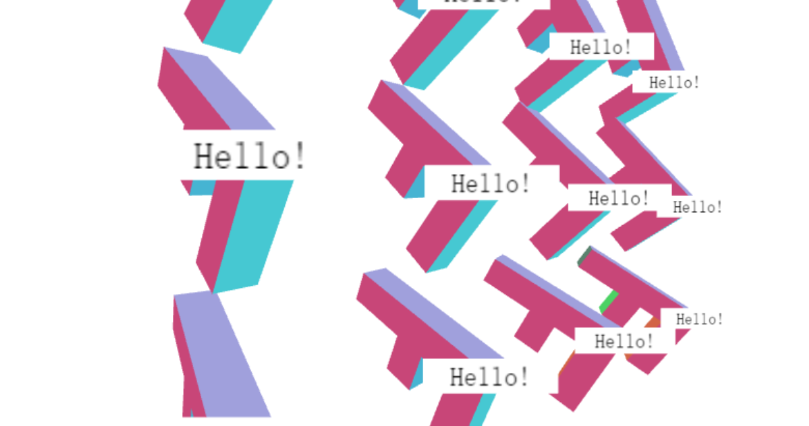

## 1. WebGL之文字-HTML

这里的核心就是如何将`html`的位置跟三维场景中的东西关联。

本质上还是裁剪空间坐标和像素空间坐标的变换。下面是裁剪空间到像素空间坐标的转换过程。
```js
// 从裁剪空间转换到像素值
const pixelX = (clipspaceX *  0.5 + 0.5) * gl.canvas.width;
const pixelY = (clipspaceP * -0.5 + 0.5) * gl.canvas.height;
```
核心代码
```js
...
gl.drawArrays(...);
// 我们刚计算出绘制三维 F 的矩阵
// 选择物体空间中 'F' 的一点
//             X  Y  Z  W
var point = [100, 0, 0, 1];  // 这是正面的右上角
 
// 使用矩阵计算出这一点的变换后的坐标
var clipspace = m4.transformVector(matrix, point);
 
// 将 X 和 Y 除以 W，和 GPU 一样
clipspace[0] /= clipspace[3];
clipspace[1] /= clipspace[3];
 
// 从裁剪空间转换到像素值
var pixelX = (clipspace[0] *  0.5 + 0.5) * gl.canvas.width;
var pixelY = (clipspace[1] * -0.5 + 0.5) * gl.canvas.height;
 
// 定位 div
div.style.left = Math.floor(pixelX) + "px";
div.style.top  = Math.floor(pixelY) + "px";
textNode.nodeValue = clock.toFixed(2);
```

视觉效果如下图所示：



`demo`地址 [WebGL之文字-HTML](https://github.com/tangjie-93/WebGL/blob/main/fundmantalExamples/%E6%96%87%E5%AD%97/html%E6%96%87%E5%AD%97.html)


## 2. WebGL之文字-二维Canvas

除了使用 `HTML`元素显示文字，还可以使用一个新画布，但是使用的是二维上下文。少一些灵活性， 比如不能使用好用的 `CSS` 样式了，但是也不需要创建并保持 `HTML`元素了。
核心代买如下所示
+ 创建一个新的`canvas`
```html
<style>
.container {
    position: relative;
}
 
#text {
    position: absolute;
    left: 0px;
    top: 0px;
    z-index: 10;
}  
</style>

<div class="container">
  <canvas id="canvas"></canvas>
  <canvas id="text"></canvas>
</div>
```
+ 创建`canvas`上下文
```js
// 找到画布
const textCanvas = document.querySelector("#text");
// 创建一个二维上下文
const ctx = textCanvas.getContext("2d");
```
+ 绘制文字
```js
function drawScene(clock) {
    ...
    // 清空二维画布
    ctx.clearRect(0, 0, ctx.canvas.width, ctx.canvas.height);
    ...
    // 计算透透视投影矩阵
    const aspect = gl.canvas.clientWidth / gl.canvas.clientHeight;
    const projectionMatrix =
        m4.perspective(fieldOfViewRadians, aspect, 1, 2000);

    const spread = 170;
    for (const yy = -1; yy <= 1; ++yy) {
      for (const xx = -2; xx <= 2; ++xx) {
        let matrix = m4.translate(projectionMatrix,
            translation[0] + xx * spread, translation[1] + yy * spread, translation[2]);
        matrix = m4.xRotate(matrix, rotation[0]);
        matrix = m4.yRotate(matrix, rotation[1] + yy * xx * 0.2);
        matrix = m4.zRotate(matrix, rotation[2] + (yy * 3 + xx) * 0.1);
        matrix = m4.translate(matrix, -50, -75, 0);

        // Set the matrix.
        gl.uniformMatrix4fv(matrixLocation, false, matrix);
        gl.drawArrays(gl.TRIANGLES, 0, 16 * 6);
        const clipspace = m4.transformVector(matrix, [100, 0, 0, 1]);

        // divide X and Y by W just like the GPU does.
        clipspace[0] /= clipspace[3];
        clipspace[1] /= clipspace[3];
        const pixelX = (clipspace[0] *  0.5 + 0.5) * gl.canvas.width;
        const pixelY = (clipspace[1] * -0.5 + 0.5) * gl.canvas.height;

        // 绘制箭头和文字

        //  保存画布设置
        ctx.save();

        // 将画布原点移动到 F 的正面右上角
        ctx.translate(pixelX, pixelY);

        // 开支绘制箭头
        ctx.beginPath();
        ctx.moveTo(10, 5);
        ctx.lineTo(0, 0);
        ctx.lineTo(5, 10);
        ctx.moveTo(0, 0);
        ctx.lineTo(15, 15);
        ctx.stroke();

        // 开始绘制文字
        ctx.fillText("" + xx + "," + yy, 20, 20);

        // 还原画布设置
        ctx.restore();
      }
    }
    requestAnimationFrame(drawScene);
}
```

`demo`地址 [WebGL之文字-二位canvas](https://github.com/tangjie-93/WebGL/blob/main/fundmantalExamples/%E6%96%87%E5%AD%97/%E4%BA%8C%E7%BB%B4Canvas.html)

## 3. WebGL之文字-使用纹理

这种方式我们需要使用`WebGL` 绘制两个不同的物体。物体和文字需要用到单独的着色器。
#### 1.物体的着色器
```js
// 顶点着色器
 <script id="vertex-shader-3d" type="x-shader/x-vertex">
    attribute vec4 a_position;
    attribute vec4 a_color;
    uniform mat4 u_matrix;
    varying vec4 v_color;
    void main() {
        gl_Position = u_matrix * a_position;
        v_color = a_color;
    }
</script>
// 片段着色器
<script id="fragment-shader-3d" type="x-shader/x-fragment">
    precision mediump float;
    varying vec4 v_color;
    void main() {
        gl_FragColor = v_color;
    }
</script>
```
#### 2.文字的着色器
```js
// 顶点着色器
<script id="text-vertex-shader" type="x-shader/x-vertex">
attribute vec4 a_position;
attribute vec2 a_texcoord;
uniform mat4 u_matrix;
varying vec2 v_texcoord;
void main() {
  gl_Position = u_matrix * a_position;
  v_texcoord = a_texcoord;
}
</script>
//片元着色器
<script id="text-fragment-shader" type="x-shader/x-fragment">
precision mediump float;
varying vec2 v_texcoord;
uniform sampler2D u_texture;
uniform vec4 u_color;
void main() {
   gl_FragColor = texture2D(u_texture, v_texcoord) * u_color;
}
</script>
```

#### 3.创建物体和单位矩形
```js
// 创建 'F' 的数据
const fBufferInfo = primitives.create3DFBufferInfo(gl);
// 创建一个单位矩形供文字使用
const textBufferInfo = primitives.createPlaneBufferInfo(gl, 1, 1, 1, 1, m4.xRotation(Math.PI / 2));
```
单位矩形是一个单位大小的矩形（正方形），这个矩形以原点为中心。`createPlaneBufferInfo` 创建一个在 `xz` 面的平面，我们将它绕`x`轴旋转了`90°`变成 `xy` 平面的单位矩形。
#### 4.创建着色器
```js
const fProgramInfo = createProgramInfo(gl, ["vertex-shader-3d", "fragment-shader-3d"]);
const textProgramInfo = createProgramInfo(gl, ["text-vertex-shader", "text-fragment-shader"]);
```
#### 5.创建文字纹理
```js
// 创建文字纹理
var textCanvas = makeTextCanvas("Hello!", 100, 26);
var textWidth  = textCanvas.width;
var textHeight = textCanvas.height;
var textTex = gl.createTexture();
gl.bindTexture(gl.TEXTURE_2D, textTex);
gl.texImage2D(gl.TEXTURE_2D, 0, gl.RGBA, gl.RGBA, gl.UNSIGNED_BYTE, textCanvas);
// 确保即使不是 2 的整数次幂也能渲染
gl.texParameteri(gl.TEXTURE_2D, gl.TEXTURE_MIN_FILTER, gl.LINEAR);
gl.texParameteri(gl.TEXTURE_2D, gl.TEXTURE_WRAP_S, gl.CLAMP_TO_EDGE);
gl.texParameteri(gl.TEXTURE_2D, gl.TEXTURE_WRAP_T, gl.CLAMP_TO_EDGE);
```

#### 6.绘制物体
```js
gl.useProgram(fProgramInfo.program);
webglUtils.setBuffersAndAttributes(gl, fProgramInfo, fBufferInfo);
fUniforms.u_matrix = m4.multiply(projectionMatrix, fViewMatrix);
webglUtils.setUniforms(fProgramInfo, fUniforms);
// 绘制几何体
gl.drawElements(gl.TRIANGLES, fBufferInfo.numElements, gl.UNSIGNED_SHORT, 0);
```
#### 7.绘制文字
```js
// 只使用 'F' 视图矩阵的位置
let textMatrix = m4.translate(projectionMatrix,
    fViewMatrix[12], fViewMatrix[13], fViewMatrix[14]);
// 缩放单位矩形到所需大小
textMatrix = m4.scale(textMatrix, textWidth, textHeight, 1);


// 绘制文字设置
gl.useProgram(textProgramInfo.program);
webglUtils.setBuffersAndAttributes(gl, textProgramInfo, textBufferInfo);
// 将textMatrix复制给textUniforms.u_matrix
m4.copy(textMatrix, textUniforms.u_matrix);
webglUtils.setUniforms(textProgramInfo, textUniforms);
// 绘制文字
gl.drawElements(gl.TRIANGLES, textBufferInfo.numElements, gl.UNSIGNED_SHORT, 0);
```
此时你会发现文字部分会覆盖 `F`物体，因为我们绘制了一个矩形，画布的默认颜色是黑色透明 `(0,0,0,0)`, 然后我们将它绘制到矩形上了。



为了解决这个问题，我们需要混合像素。
```JS
gl.enable(gl.BLEND);
gl.blendFunc(gl.SRC_ALPHA, gl.ONE_MINUS_SRC_ALPHA);
```
`gl.blendFunc` 指定了混合像素的方式。第一个参数是源像素，第二个参数是目标像素，根据上面的`blendFunc`函数，可以得到如下的计算公式。
```js
result = dest * (1 - src_alpha) + src * src_alpha
```
所以如果目标像素是绿色 `0,1,0,1`，源是红色 `1,0,0,1` 就得到
```js
src = [1, 0, 0, 1]
dst = [0, 1, 0, 1]
src_alpha = src[3]  // 这是 1
result = dst * (1 - src_alpha) + src * src_alpha
// 相当于
result = dst * 0 + src * 1
// 最后结果
result = src
```
对于黑色透明的部分的纹理 `0,0,0,0`
```js
src = [0, 0, 0, 0]
dst = [0, 1, 0, 1]
src_alpha = src[3]  // 这是 0
result = dst * (1 - src_alpha) + src * src_alpha
// 相当于
result = dst * 1 + src * 0
// 最后结果
result = dst
```
尽管使用了`混合像素`,但是上面的覆盖问题还是存在。因为我们现在是绘制一个 `F` 然后绘制文字，然后绘制下一个 `F` 和文字。

那是因为我们还用到了`深度缓冲`，所以当绘制一个 `F` 的文字时， 即使使用混合模式保留了背景色，但是深度缓冲还是会更新，当绘制下一个 `F` 时如果那个 `F` 的某些部分在之前文字像素的后面，那些部分就不会绘制。这个问题其实是 `GPU` 渲染三维时的最难解决的问题，**透明出现问题**。

对与透明渲染常用的解决方法是先渲染不透明的物体，然后按照 `z` 的顺寻绘制透明物体， 绘制时开启深度检测但是关闭深度缓冲更新。

先将绘制的不透明物体（`F`）和 透明物体区分开（文字），先定义一些东西保存文字的位置
```js
let fViewMatrix = m4.translate(viewMatrix,
    translation[0] + xx * spread, translation[1] + yy * spread, translation[2]);
fViewMatrix = m4.xRotate(fViewMatrix, rotation[0]);
fViewMatrix = m4.yRotate(fViewMatrix, rotation[1] + yy * xx * 0.2);
fViewMatrix = m4.zRotate(fViewMatrix, rotation[2] + now + (yy * 3 + xx) * 0.1);
fViewMatrix = m4.scale(fViewMatrix, scale[0], scale[1], scale[2]);
fViewMatrix = m4.translate(fViewMatrix, -50, -75, 0);
// 保存 文字 的视图位置
textPositions.push([fViewMatrix[12], fViewMatrix[13], fViewMatrix[14]]);
```
绘制 `F` 前关闭混合模式, 开启深度缓冲
```js
gl.disable(gl.BLEND);
gl.depthMask(true);
```
绘制文字开启混合,关闭深度缓冲写入
```js
gl.enable(gl.BLEND);
gl.blendFunc(gl.SRC_ALPHA, gl.ONE_MINUS_SRC_ALPHA);
gl.depthMask(false);
```
另一个问题是文字和对应的 `F` 相交了，这其实没有一个明确的解决办法。常规解决方案就是将文字沿着向量朝眼睛方向移动一定距离。
```js
// 由于 pos 在视图空间，表示它是一个从眼睛位置出发的一个向量
// 所以沿着向量朝眼睛方向移动一定距离
const fromEye = m4.normalize(pos);
const amountToMoveTowardEye = 150;  // 因为 F 是 150 个单位长
const viewX = pos[0] - fromEye[0] * amountToMoveTowardEye;
const viewY = pos[1] - fromEye[1] * amountToMoveTowardEye;
const viewZ = pos[2] - fromEye[2] * amountToMoveTowardEye;
const textMatrix = m4.translate(projectionMatrix, viewX, viewY, viewZ);
```
但是还是可能还会发现文字边缘的问题。
这个问题是 `Canvas 2D API` 只生成预乘阿尔法通道的值，当我们上传画布内容为`WebGL` 纹理时， `WebGL` 视图获取没有预乘阿尔法的值，但是由于预乘阿尔法的值缺失阿尔法，所以很难完美转换成非预乘值。

解决这个问题需要告诉WebGL不用做反预乘。
```js
gl.pixelStorei(gl.UNPACK_PREMULTIPLY_ALPHA_WEBGL, true);
```
这个告诉 `WebGL` 提供预乘值到`gl.texImage2D` 和 `gl.texSubImage2D`， 如果像 `Canvas 2D` 数据本身就是预乘的话，就直接传递到`WebGL`。

我们还需要修改混合方法
```js
gl.blendFunc(gl.ONE, gl.ONE_MINUS_SRC_ALPHA);
```
旧的方法将源和它的阿尔法通道相乘，就是 `SRC_ALPHA` 代表的意思。 但是现在我们的纹理数据已经乘了它的阿尔法值，就是预乘的意思。 所以就不需要让 `GPU` 再做乘法，设置为 `ONE` 表示乘以 `1`。


如果你想让文字保持固定大小怎么办? 如果你还记得透视投影 种讲到过透视矩阵就是将物体缩放 `1 / -Z`，以实现近大远小。所以，我们只需缩放 `-Z` 的期望倍数。

```js
...
// 由于 pos 在视图空间，表示它是一个从眼睛位置出发的一个向量
// 所以沿着向量朝眼睛方向移动一定距离
const fromEye = normalize(pos);
const amountToMoveTowardEye = 150;  // 因为 F 是 150 个单位长
const viewX = pos[0] - fromEye[0] * amountToMoveTowardEye;
const viewY = pos[1] - fromEye[1] * amountToMoveTowardEye;
const viewZ = pos[2] - fromEye[2] * amountToMoveTowardEye;
const desiredTextScale = -1 / gl.canvas.height;  // 1x1 像素大小
const scale = viewZ * desiredTextScale;
 
const textMatrix = m4.translate(projectionMatrix, viewX, viewY, viewZ);
// 将矩形缩放到需要的大小
textMatrix = m4.scale(textMatrix, textWidth * scale, textHeight * scale, 1);
...
```

**参考文档**

[WebGL文字 - HTML](https://webglfundamentals.org/webgl/lessons/zh_cn/webgl-text-html.html)<br>
[WebGL 文字 - 二维Canvas](https://webglfundamentals.org/webgl/lessons/zh_cn/webgl-text-canvas2d.html)<br>
[WebGL 文字 - 使用纹理](https://webglfundamentals.org/webgl/lessons/zh_cn/webgl-text-texture.html)<br>

<Valine></Valine>