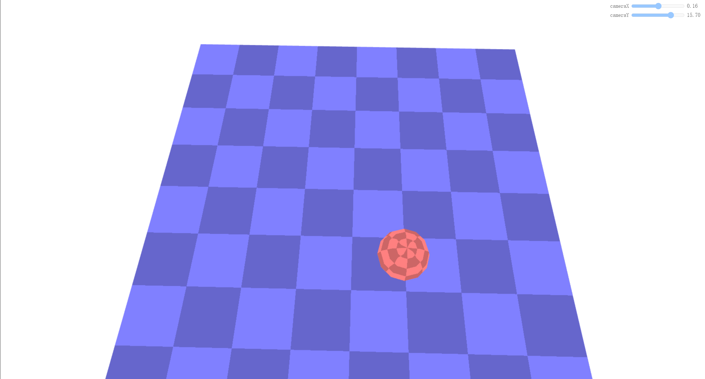

## 1.WebGL平面的和透视的投影映射

**投影映射** 是投影一张图像的过程，就像一个电影放映机对准一个屏幕，然后将电影投影到屏幕上。

#### 1.平面的投影映射

平面的投影映射采用的时正交投影矩阵。我们将创建一个场景，绘制一个平面和一个球体，并使用`8x8` 棋盘纹理对它们进行贴图。下面是实现平面的投影映射的步骤和代码实现。
+ 顶点着色器代码
```js
// 顶点着色器
attribute vec4 a_position;
attribute vec2 a_texcoord;
uniform mat4 u_projection;
uniform mat4 u_view;
uniform mat4 u_world;
 
varying vec2 v_texcoord;
 
void main() {
  gl_Position = u_projection * u_view * u_world * a_position;
 
  // 把纹理坐标传给片段着色器
  v_texcoord = a_texcoord;
}
```
+ 片元着色器代码
添加了一个 `u_colorMult uniform` 来乘以纹理颜色。这样我们就可以通过制作一个单色纹理（`monochrome texture`）来改变它的颜色。
```js
// 片段着色器
precision mediump float;
// 从顶点着色器传来的
varying vec2 v_texcoord;
uniform vec4 u_colorMult;
uniform sampler2D u_texture;
 
void main() {
  gl_FragColor = texture2D(u_texture, v_texcoord) * u_colorMult;
}
```
+ 设置程序、球体 `buffers` 和平面 `buffers`
```js
// 设置 GLSL 程序
// 编译着色器、链接程序、查找 locations
const textureProgramInfo = webglUtils.createProgramInfo(gl, ['vertex-shader-3d', 'fragment-shader-3d']);
 
const sphereBufferInfo = primitives.createSphereBufferInfo(
    gl,
    1,  // 半径
    12, // 横轴细分数
    6,  // 纵轴细分数
);
const planeBufferInfo = primitives.createPlaneBufferInfo(
    gl,
    20,  // 宽
    20,  // 高
    1,   // 横轴细分数
    1,   // 纵轴细分数
)
```
+ 创建纹理
创建一个 `8x8` 棋盘纹理
```js
const checkerboardTexture = gl.createTexture();
gl.bindTexture(gl.TEXTURE_2D, checkerboardTexture);
gl.texImage2D(
    gl.TEXTURE_2D,
    0,                // mip level
    gl.LUMINANCE,     // internal format
    8,                // width
    8,                // height
    0,                // border
    gl.LUMINANCE,     // format
    gl.UNSIGNED_BYTE, // type
    new Uint8Array([  // data
      0xFF, 0xCC, 0xFF, 0xCC, 0xFF, 0xCC, 0xFF, 0xCC,
      0xCC, 0xFF, 0xCC, 0xFF, 0xCC, 0xFF, 0xCC, 0xFF,
      0xFF, 0xCC, 0xFF, 0xCC, 0xFF, 0xCC, 0xFF, 0xCC,
      0xCC, 0xFF, 0xCC, 0xFF, 0xCC, 0xFF, 0xCC, 0xFF,
      0xFF, 0xCC, 0xFF, 0xCC, 0xFF, 0xCC, 0xFF, 0xCC,
      0xCC, 0xFF, 0xCC, 0xFF, 0xCC, 0xFF, 0xCC, 0xFF,
      0xFF, 0xCC, 0xFF, 0xCC, 0xFF, 0xCC, 0xFF, 0xCC,
      0xCC, 0xFF, 0xCC, 0xFF, 0xCC, 0xFF, 0xCC, 0xFF,
    ]));
gl.generateMipmap(gl.TEXTURE_2D);
gl.texParameteri(gl.TEXTURE_2D, gl.TEXTURE_MAG_FILTER, gl.NEAREST);
```
+ 创建绘制函数

    函数需要一个投影矩阵和一个相机矩阵作为参数，以便从相机矩阵中计算出视图矩阵，然后绘制球体和立方体
```js
// 每个物体的 uniforms
const planeUniforms = {
  u_colorMult: [0.5, 0.5, 1, 1],  // 浅蓝色
  u_texture: checkerboardTexture,
  u_world: m4.translation(0, 0, 0),
};
const sphereUniforms = {
  u_colorMult: [1, 0.5, 0.5, 1],  // 粉红色
  u_texture: checkerboardTexture,
  u_world: m4.translation(2, 3, 4),
};
 
function drawScene(projectionMatrix, cameraMatrix) {
  // 从相机矩阵中计算出视图矩阵
  const viewMatrix = m4.inverse(cameraMatrix);
 
  gl.useProgram(textureProgramInfo.program);
 
  // 设置球体和平面共享的 uniforms
  webglUtils.setUniforms(textureProgramInfo, {
    u_view: viewMatrix,
    u_projection: projectionMatrix,
  });

  // ------ 绘制球体 --------
 
  // 设置所有需要的 attributes
  webglUtils.setBuffersAndAttributes(gl, textureProgramInfo, sphereBufferInfo);
 
  // 设置球体特有的 uniforms
  webglUtils.setUniforms(textureProgramInfo, sphereUniforms);
 
  // 调用 gl.drawArrays 或 gl.drawElements
  webglUtils.drawBufferInfo(gl, sphereBufferInfo);
  // ------ 绘制平面 --------
 
  // 设置所有需要的 attributes
  webglUtils.setBuffersAndAttributes(gl, textureProgramInfo, planeBufferInfo);
 
  // 设置平面特有的 uniforms
  webglUtils.setUniforms(textureProgramInfo, planeUniforms);
 
  // 调用 gl.drawArrays 或 gl.drawElements
  webglUtils.drawBufferInfo(gl, planeBufferInfo);
}
```
+ 渲染场景
```js
const settings = {
  cameraX: 2.75,
  cameraY: 5,
};
const fieldOfViewRadians = degToRad(60);
 
function render() {
  webglUtils.resizeCanvasToDisplaySize(gl.canvas);
 
  // 告诉 WebGL 如何从裁剪空间转换为像素
  gl.viewport(0, 0, gl.canvas.width, gl.canvas.height);
 
  gl.enable(gl.CULL_FACE);
  gl.enable(gl.DEPTH_TEST);
 
  // 清除 canvas 和深度缓冲区
  gl.clear(gl.COLOR_BUFFER_BIT | gl.DEPTH_BUFFER_BIT);
 
  // 计算投影矩阵
  const aspect = gl.canvas.clientWidth / gl.canvas.clientHeight;
  const projectionMatrix =
      m4.perspective(fieldOfViewRadians, aspect, 1, 2000);
 
  // 使用 look at 计算相机的矩阵
  const cameraPosition = [settings.cameraX, settings.cameraY, 7];
  const target = [0, 0, 0];
  const up = [0, 1, 0];
  const cameraMatrix = m4.lookAt(cameraPosition, target, up);
 
  drawScene(projectionMatrix, cameraMatrix);
}
render();
```
视觉效果如下所示

<br>

`demo`地址[WebGL平面的和透视的投影映射]()

接下来我们将使用平面投影的方式将一个纹理投影到该球体和平面上。
+ 加载纹理
```js
function loadImageTexture(url) {
  // 创建一个纹理
  const texture = gl.createTexture();
  gl.bindTexture(gl.TEXTURE_2D, texture);
  // 用一个 1x1 蓝色像素填充该纹理
  gl.texImage2D(gl.TEXTURE_2D, 0, gl.RGBA, 1, 1, 0, gl.RGBA, gl.UNSIGNED_BYTE,
                new Uint8Array([0, 0, 255, 255]));
  // 异步加载一张图片
  const image = new Image();
  image.src = url;
  image.addEventListener('load', function() {
    // 现在图片加载完了，把它拷贝到纹理中
    gl.bindTexture(gl.TEXTURE_2D, texture);
    gl.texImage2D(gl.TEXTURE_2D, 0, gl.RGBA, gl.RGBA,gl.UNSIGNED_BYTE, image);
    // 假设该纹理的宽高是 2 的整次幂
    gl.generateMipmap(gl.TEXTURE_2D);
    render();
  });
  return texture;
}
 
const imageTexture = loadImageTexture('resources/f-texture.png');
```

#### 2.透视的投影映射

## 2.阴影

**参考文档**

[WebGL 平面的和透视的投影映射](https://webglfundamentals.org/webgl/lessons/zh_cn/webgl-planar-projection-mapping.html#toc)<br>
[WebGL 阴影](https://webglfundamentals.org/webgl/lessons/zh_cn/webgl-shadows.html)<br>

<Valine></Valine>